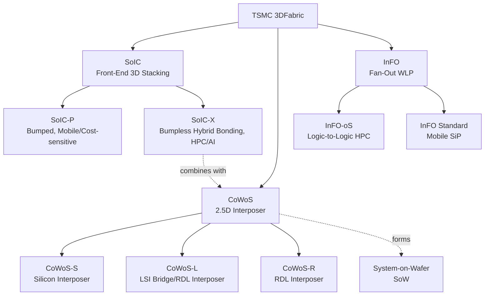
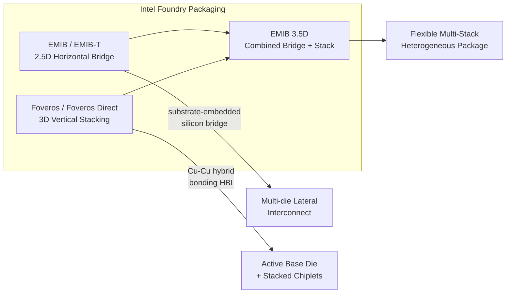

## Foundry Advanced Packaging Platform Comparison

### Overview

The major logic foundries — TSMC, Intel Foundry, and Samsung Foundry — each offer proprietary advanced packaging platform families that bundle 2.5D interposer integration, 3D die stacking, and fan-out wafer-level packaging under branded umbrellas. These platforms compete primarily on interconnect density (bump/bond pitch), interposer/bridge reticle scaling for HBM-heavy AI accelerators, and integration flexibility across process nodes. Understanding platform naming and technical positioning is essential for design teams selecting a foundry partner for heterogeneous integration projects.

### TSMC 3DFabric Platform Family

**Key Points**

- TSMC organizes advanced packaging under the **3DFabric** umbrella, comprising three main platform families: SoIC, CoWoS, and InFO, encompassing both 2D and 3D front-end and back-end interconnect technologies [trendforce](https://www.trendforce.com/news/?p=9959)
- SoIC offers two stacking solutions: SoIC-P (Bumped) and SoIC-X (Bumpless). SoIC-P is a micro-bump stacking solution suitable for cost-effective applications such as mobile devices, while SoIC-X adopts Hybrid Bonding, ideal for HPC and AI demands, reducing contact pitch to a few micrometers [About TrendForce News +3](https://www.trendforce.com/news/?p=9959)
- TSMC-SoIC supports both chip-on-wafer (CoW) and wafer-on-wafer (WoW) schemes, providing design flexibility in mixing and matching different chip functions, sizes, and technology nodes, and is fully compatible with CoWoS and InFO, offering a "3Dx3D" system-level solution [tsmc](https://www.tsmc.com/chinese/dedicatedFoundry/technology/SoIC_inDepth)[tsmc](https://www.tsmc.com/chinese/dedicatedFoundry/technology/SoIC_inDepth)
- CoWoS is TSMC's proprietary chip-last-on-interposer process for both heterogeneous and homogeneous integration, ideal for HPC applications, with the family including three technologies: CoWoS-S, CoWoS-L, and CoWoS-R [tsmc](https://www.tsmc.com/english/dedicatedFoundry/technology/platform_HPC_tech_WLSI)
- InFO-oS, a derivative technology, offers logic-to-logic integration tailored for HPC-specific applications [tsmc](https://www.tsmc.com/english/dedicatedFoundry/technology/platform_HPC_tech_WLSI)

**Example**

AMD's MI300 series uses TSMC's SoIC hybrid bonding to stack compute and cache dies, illustrating a production HPC/AI accelerator built on the SoIC-X bumpless bonding path rather than the bumped SoIC-P variant used in cost-sensitive mobile products. [trendforce](https://www.trendforce.com/news/?p=9959)

### TSMC Reticle Scaling and Roadmap

**Key Points**

- TSMC's 5.5-reticle-size CoWoS is in volume production as of mid-2026, with yields consistently topping 98% across multiple AI customer products and reaching as high as 99% in some cases [trendforce](https://www.trendforce.com/news/?p=62447)
- TSMC expects CoWoS to scale beyond 14× reticle size by 2029, with a 14-reticle-size CoWoS package capable of integrating around 10 large compute dies and 20 HBM stacks slated for production in 2028 [trendforce](https://www.trendforce.com/news/?p=62447)[trendforce](https://www.trendforce.com/news/?p=62447)
- TSMC's SoIC hybrid bonding enables more than 50× higher interconnect density and 5× greater energy efficiency compared to prior bump-based approaches, and is speeding toward a 4.5µm pitch [trendforce](https://www.trendforce.com/news/?p=62447)[trendforce](https://www.trendforce.com/news/?p=62447)
- [Inference] Earlier roadmap disclosures indicated a path toward sub-5µm SoIC pitch by 2027 (from ~9µm), consistent with the 4.5µm figure reported for 2026 — this trajectory should be confirmed against TSMC's most current technology symposium disclosures, as roadmap dates are frequently revised
- TSMC's monthly CoWoS output stood at roughly 75,000 to 80,000 wafers at the end of 2025, with a target of 130,000 wafers per month by late 2026, and the company now operates 10 advanced packaging facilities [tvbs](https://news.tvbs.com.tw/english/3123474)[tvbs](https://news.tvbs.com.tw/english/3123474)

### Intel Foundry Packaging Platform

**Key Points**

- Intel's advanced packaging portfolio centers on two complementary technologies: **Foveros** (vertical 3D die stacking) and **EMIB** (Embedded Multi-die Interconnect Bridge, horizontal 2.5D integration)
- EMIB is a small silicon chip embedded in the underlying package substrate, incorporating ultra-high-density interconnect between the dies attached to it, first launched in August 2014 [semiconductor-digest](https://www.semiconductor-digest.com/?p=4757)[semiconductor-digest](https://www.semiconductor-digest.com/?p=4757)
- Unlike TSMC's CoWoS, which relies on a full-area silicon interposer, Intel's EMIB approach embeds a small, high-speed silicon bridge only in the substrate area that requires die-to-die connection rather than using a costly full silicon interposer as other foundries do, reducing manufacturing cost while converting multiple side-by-side dies into a powerful compute engine suited to data-center-class multi-die products [technews](https://finance.technews.tw/2026/08/13/intels-foveros-3d-and-emib-t-technologies-were-unveiled/)
- In 2026, Intel introduced **EMIB-T**, an upgraded version that adds dedicated channels within the silicon bridge to deliver power directly into the die rather than routing around it, improving overall power efficiency and optimizing signal routing for the latest HBM requirements while also increasing design freedom, not just speed [technews](https://finance.technews.tw/2026/08/13/intels-foveros-3d-and-emib-t-technologies-were-unveiled/)
- Intel notes that EMIB-T enables systems with total area exceeding 6× reticle size today, scaling greater than 8× reticle size within the year, and more than 12× by 2028 — a direct roadmap comparison point against TSMC's CoWoS reticle scaling [trendforce](https://www.trendforce.com/news/?p=62447)
- Foveros has multiple generations: Foveros Direct 3D stacks chiplets onto an active base die using Cu-to-Cu hybrid bonding interfaces (HBI) for ultra-high bandwidth and low-power interconnect, with high density and low-resistance die-to-die interconnect, applicable to client and data center applications, and Foveros Direct stacks are supported within EMIB 3.5D solutions, combining multi-die interconnect bridge and Foveros technology in one package to enable flexible heterogeneous systems using varied dies, suited to applications requiring multiple 3D stacks combined into a single package [intel](https://intel.co.kr/content/www/kr/ko/foundry/packaging.html)[intel](https://intel.co.kr/content/www/kr/ko/foundry/packaging.html)

### Samsung Advanced Packaging Platform

**Key Points**

- Samsung Foundry's advanced packaging platform is organized under naming including **I-Cube** (2.5D interposer-based integration, positioned similarly to CoWoS-S) and **X-Cube** (3D through-silicon-via stacking, positioned similarly to SoIC/Foveros)
- Samsung's packaging strategy leans on its combined memory, foundry, and OSAT (via Samsung's own back-end assembly) vertical integration, differentiating it from TSMC and Intel, which rely more heavily on external OSAT partners (Amkor, ASE) for final assembly steps
- [Unverified] Current-generation Samsung platform naming, pitch specifications, and 2026-specific roadmap milestones were not verified against live sources in this session; given the fast pace of platform naming/version changes across all three foundries, readers should confirm Samsung's latest I-Cube/X-Cube generation specifications against Samsung Foundry's current technology day disclosures before using in design decisions

### Comparative Technology Positioning

| Dimension | TSMC (3DFabric) | Intel Foundry | Samsung Foundry |
| --- | --- | --- | --- |
| 2.5D Interposer/Bridge | CoWoS-S/L/R | EMIB / EMIB-T | I-Cube |
| 3D Die Stacking | SoIC-P (bumped) / SoIC-X (hybrid bonding) | Foveros / Foveros Direct | X-Cube |
| Combined 2.5D+3D | CoWoS + SoIC ("3Dx3D") | EMIB 3.5D | [Unverified — not confirmed this session] |
| Reticle/Area Scaling (2026) | 5.5× reticle in volume production | >6× reticle today, targeting >8× within the year | [Unverified] |
| Bonding Pitch Trajectory | Approaching 4.5µm (SoIC-X) | Cu-Cu HBI in Foveros Direct (exact pitch not verified) | [Unverified] |
| Primary Target Market | AI/HPC accelerators, mobile SiP | Data center, client, foundry customers (including external chiplet mixing) | Memory-integrated AI/HPC, mobile |
| Assembly Model | Foundry + external OSAT partners (e.g., Amkor for U.S. expansion) | Foundry-owned assembly (Fab 9, New Mexico) + partners | Vertically integrated (foundry + memory + assembly) |

[Inference] Direct pitch-for-pitch and reticle-for-reticle comparison across foundries should be treated cautiously, since each vendor measures and discloses these metrics using somewhat different methodologies and marketing conventions (e.g., "reticle size" multiples are not always defined identically), making apples-to-apples comparison imprecise without consulting each vendor's detailed technical disclosures.

### Regional Expansion and Supply Chain Localization

**Key Points**

- TSMC is building a complete local supply chain from front-end chip manufacturing to back-end packaging in the U.S. (Arizona), where NVIDIA, Apple, and AMD — CoWoS's largest customers — are concentrated [brunch](https://brunch.co.kr/@grandmer/1163)
- TSMC has allocated substantial capital to build an Advanced Packaging Facility within its Arizona campus, with equipment installation underway as of 2026 and full operation targeted for around 2027-2028 [brunch](https://brunch.co.kr/@grandmer/1163)
- TSMC has partnered strategically with Amkor to provide CoWoS and InFO (fan-out) services in Arizona, reflecting a hybrid in-house/OSAT-partner model for U.S. localization [brunch](https://brunch.co.kr/@grandmer/1163)
- Intel's Fab 9 in Rio Rancho, New Mexico, opened as the only U.S. factory producing the world's most advanced packaging solutions at scale at the time of its opening, underscoring Intel's domestic packaging capacity as a competitive and supply-chain-resilience differentiator against TSMC's more geographically distributed (Taiwan-plus-Arizona) model [convergedigest](https://dev.convergedigest.com/intel-opens-fab-9-for-advanced-packaging-of-chiplets)

### Conclusion

The three major foundries have converged on a broadly similar two-axis platform structure — a 2.5D interposer/bridge technology paired with a 3D die-stacking technology — while differentiating sharply on the underlying mechanism (TSMC's full silicon interposer vs. Intel's localized embedded bridge), bonding pitch trajectory, and reticle-scaling roadmap. TSMC currently leads in disclosed production volume and reticle-size scaling for AI/HPC packages, while Intel differentiates on EMIB-T's power-delivery integration and aggressive area-scaling roadmap, and Samsung leverages vertical integration across memory, foundry, and assembly. For any specific design-in decision, current-generation pitch, yield, and capacity figures should be verified directly against each foundry's most recent technology symposium disclosures given the rapid annual cadence of updates in this space.

**Related Topics**

- Hybrid bonding process technology and pitch scaling limits
- HBM integration requirements and interposer bandwidth density
- OSAT vs. foundry-owned advanced packaging assembly models
- System-on-Wafer (SoW) integration technology
- SEMI equipment and materials standards for advanced packaging (companion compliance layer)
- UCIe Consortium governance and its relationship to foundry-specific packaging platforms
- Reticle-size scaling economics and yield management in large-area interposers