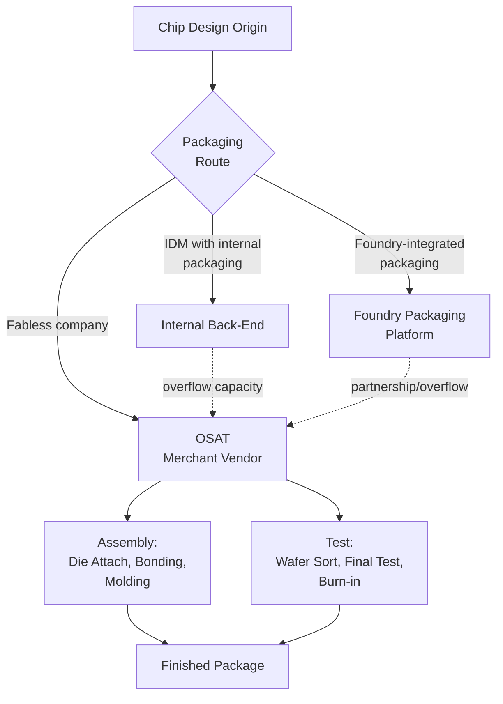
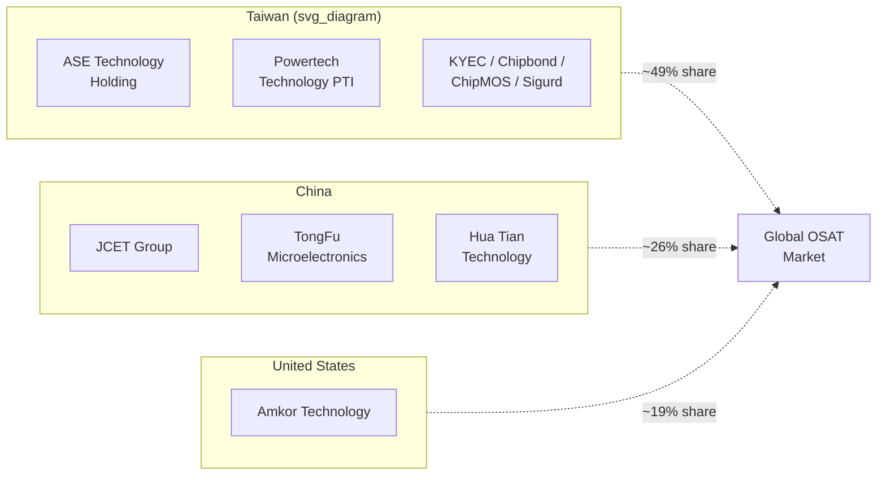

## OSAT Landscape and Outsourced Assembly and Test Providers

### Overview

Outsourced Semiconductor Assembly and Test (OSAT) providers are merchant vendors that perform third-party IC packaging and test services on behalf of fabless design houses, IDMs, and foundries. OSATs occupy the back-end of the semiconductor value chain — die attach, wire bonding, flip-chip bumping, molding, and final test — and have become increasingly central to the industry as advanced packaging (2.5D, 3D-IC, chiplets, fan-out wafer-level packaging) shifts value from front-end scaling toward package-level integration. Both IDMs/foundries with internal packaging operations and fabless companies outsource a portion of their packaging production to OSATs, making the OSAT layer a critical and often capacity-constrained node in the global chip supply chain.

### Market Structure and Role

**Key Points**

- OSATs are merchant vendors providing third-party IC-packaging and test services; IDMs and foundries with internal packaging capability also outsource a portion of production to OSATs, and fabless companies route packaging work through OSATs and/or foundries directly
- The global OSAT market was projected to grow from approximately US$63.14 billion in 2024 to US$85.59 billion by 2030, at a compound annual growth rate (CAGR) of 5.2%
- The global top four OSAT manufacturers hold a combined market share exceeding 30%
- Advanced packaging technologies — 2.5D, 3D-IC, chiplets, and Fan-Out Wafer-Level Packaging (FOWLP) — are identified as the primary drivers of the next wave of OSAT industry growth, alongside demand for AI processors, high-bandwidth memory (HBM), advanced smartphones, automotive electronics, and high-performance computing

### Top OSAT Providers by Revenue

**Key Points**

Based on 2026 packaging-and-testing business revenue estimates, the top-ranked OSAT providers are:

1. **ASE Technology Holding** (Taiwan) — approximately US$19.5+ billion, the industry's leading OSAT by a wide margin
2. **Amkor Technology, Inc.** (United States) — approximately US$7.5+ billion
3. **JCET Group** (China) — approximately US$5.3+ billion
4. **TongFu Microelectronics Co., Ltd.** (China) — approximately US$3.6+ billion
5. **Powertech Technology (PTI)** (Taiwan, with Suzhou operations) — approximately US$2.8+ billion
6. **HUATIAN Technology Co., Ltd.** (China) — figure not fully captured in this session's sources; [Unverified] should be confirmed against current market data

[Inference] The remainder of the top-10 list (ranks 7-10) likely includes additional Taiwan-based players (such as KYEC, Chipbond, ChipMOS) and possibly a Korean or Southeast Asian entrant, consistent with historical top-10 OSAT rankings, but this session's sources did not confirm the complete current list beyond rank 6 — verify against the latest published ranking before citing specific figures.

**Example**

ASE's revenue lead of roughly 2.6× over second-place Amkor illustrates a long-standing pattern in the OSAT market: since ASE's 2018 acquisition of SPIL, the combined ASE Technology Holding entity has maintained a revenue scale nearly three times that of its closest competitor, a gap driven substantially by legacy business scale and consolidation via M&A rather than purely organic growth.

### Regional Distribution

**Key Points**

- Historically, among the worldwide top 10 OSAT vendors, six have been based in Taiwan, three in China, and one in the United States, together representing over 80% of total market share
- Taiwan-based vendors have included ASE, PTI, KYEC, Chipbond, ChipMOS, and Sigurd
- China-based vendors have included JCET, TongFu Microelectronics (TFME), and Hua Tian
- The sole major U.S.-based top-10 OSAT has been Amkor Technology, which has also been noted as the world's largest vendor for automotive OSAT services
- Regional market share has fluctuated with macro conditions: Taiwan's combined share declined amid weakness in driver IC, memory, and mid-range mobile chip packaging demand, while China's share rose in line with government semiconductor domestication policy and increased orders from IC design companies coordinating with local OSATs

### Leading Providers: Technical and Strategic Profiles

**ASE Technology Holding**

**Key Points**

- Positioned as a leading-edge advanced packaging and testing partner, with leading-edge advanced packaging (including testing) contributing roughly 12% of ASE's ATM (assembly, test, materials) business, or about 8% of total revenue as of 2025
- Advanced packaging operations reportedly carry higher gross margins (mid-30% range) than ASE's corporate average, reflecting the premium nature of leading-edge packaging work relative to legacy assembly/test
- Rumored to be handling packaging for NVIDIA's Vera CPU and AMD's Venice EPYC server products, alongside continued investment in testing capacity to complement packaging
- Has historically served as TSMC's key advanced-packaging partner in Taiwan

**Amkor Technology**

**Key Points**

- Making a major capital investment (~US$7 billion) in an Arizona, U.S. facility positioned alongside TSMC's Arizona fabs, aimed at localizing advanced packaging in the U.S. supply chain
- Will reportedly package NVIDIA GPUs as well as Apple M-series chips initially at the Arizona facility, in a strategic shift that may come partly at the expense of ASE's traditional role as TSMC's primary Taiwan packaging partner
- Phase 1 of the Arizona investment (~US$2 billion) is expected to complete mid-2027, with production commencing early 2028; Phase 2 is subject to customer demand
- Currently derives a single-digit percentage of revenue from AI-related packaging, indicating substantial room for AI-driven revenue growth as the Arizona facility ramps
- Rumored to be handling packaging for Broadcom's Tomahawk 6 switches and NVIDIA's GB10 chip used in DGX Spark systems

**JCET Group and Chinese OSATs**

**Key Points**

- JCET Group is China's largest OSAT and the third-largest globally by packaging/test revenue, reflecting sustained growth aligned with China's semiconductor domestication policy
- Chinese OSAT capacity expansion has been closely tied to rising sales from China-based IC design companies (fabless firms) routing production through domestic OSAT partners, reducing reliance on Taiwan- and U.S.-based back-end providers for China-market chips

### System-in-Package (SiP) as an OSAT Growth Vector

**Key Points**

- The global SiP market was valued at approximately US$13.8 billion in 2020, with projected growth to roughly US$19 billion by 2026
- OSAT companies have historically accounted for approximately 60% of SiP sales, with integrated device makers (IDMs) accounting for about 25% and foundries approximately 14%
- The top three OSATs — ASE (Taiwan), Amkor Technology (U.S.), and JCET (China) — have driven substantial capacity investment specifically in SiP and wafer-level packaging, with ASE alone announcing a US$2 billion commitment to wafer-level packaging and SiP expansion

$$\text{OSAT Share of Advanced Packaging Revenue} \approx \frac{\text{ATM Advanced Packaging Revenue}}{\text{Total ATM Revenue}}$$

This ratio — illustrated by ASE's ~12% advanced-packaging share of ATM revenue — is a useful benchmark metric analysts use to track how quickly individual OSATs are pivoting from legacy assembly/test toward higher-margin advanced packaging work.

### OSAT vs. Foundry-Integrated Packaging: Competitive Dynamics

**Key Points**

- Foundries (notably TSMC, per its "Foundry 2.0" strategy) have been gaining share in advanced packaging historically performed by OSATs, creating both competitive tension and partnership opportunities (e.g., TSMC's Amkor partnership for CoWoS/InFO services in Arizona)
- This dynamic reflects a broader industry trend: as advanced packaging becomes more tightly coupled to front-end process technology (e.g., hybrid bonding pitch scaling requiring front-end-grade cleanliness and alignment precision), foundries increasingly perform some advanced packaging steps in-house, while OSATs retain dominance in high-volume, cost-sensitive back-end assembly, test, and materials-intensive packaging (SiP, fan-out, wire bonding)
- The Amkor-TSMC Arizona partnership exemplifies a hybrid model where foundries selectively partner with OSATs to scale advanced packaging capacity for U.S.-based, security- and supply-chain-sensitive customers (NVIDIA, Apple) rather than building 100% in-house capacity

### Conclusion

The OSAT landscape remains concentrated among a small set of Taiwan-, China-, and U.S.-based providers — led decisively by ASE Technology Holding, followed by Amkor Technology and JCET Group — with the top four players controlling over 30% of a market projected to grow from roughly US$63 billion to US$86 billion by 2030. The center of gravity is shifting toward advanced packaging (SiP, fan-out, 2.5D/3D integration) as AI, HPC, and HBM-driven demand reshapes revenue mix, margin profile, and geographic investment priorities, with Amkor's Arizona expansion and ASE's continued Taiwan leadership in leading-edge packaging representing the most consequential near-term capacity shifts to track in this chapter's broader standards and ecosystem context.

**Related Topics**

- Foundry advanced packaging platform comparison (companion foundry-side view)
- System-in-Package (SiP) design and packaging economics
- SEMI equipment and materials standards for advanced packaging
- Regional supply chain localization and CHIPS Act-driven packaging investment
- Known-good-die (KGD) test strategies in the OSAT test flow
- Fan-Out Wafer-Level Packaging (FOWLP) process architecture
- OSAT capacity constraints and their impact on AI accelerator supply chains