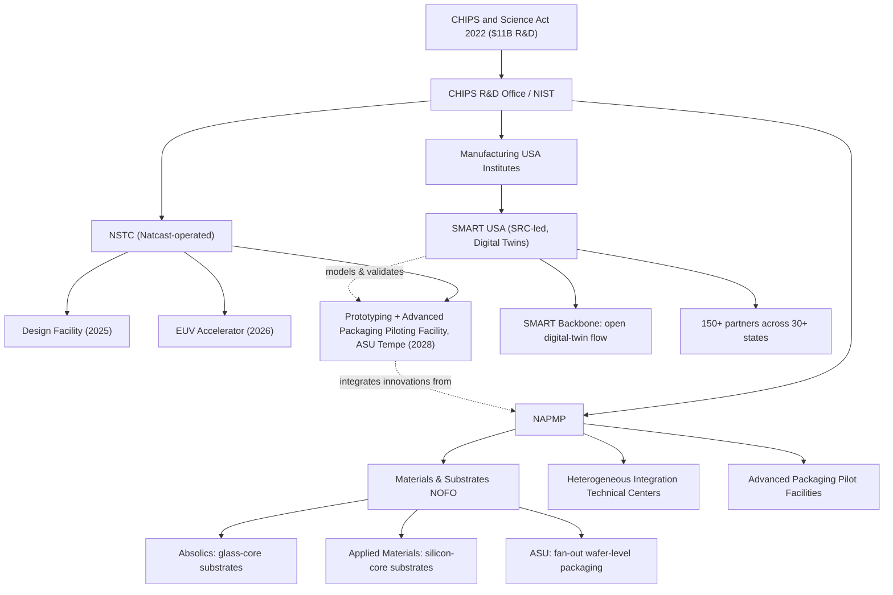

## Academic and Government Research Initiatives in Heterogeneous Integration

### Overview and Rationale

Heterogeneous integration (HI) has shifted from a company-internal R&D activity into a globally coordinated public-private endeavor. As Moore's Law scaling slows and system performance increasingly depends on package-level integration of chiplets, photonics, advanced substrates, and 3D stacking, national governments and academic consortia have stood up dedicated funding programs, pilot lines, and shared user facilities. These initiatives exist because advanced packaging capital equipment (hybrid bonders, TSV etch/fill tools, panel-level lithography, EUV) is prohibitively expensive for any single university, and because supply-chain resilience for packaging — historically concentrated in East Asia (OSATs like ASE, Amkor, JCET) — is now treated as a national security and economic priority by the U.S., EU, Japan, South Korea, and Taiwan.

The three broad categories of initiative are: (1) **national funding programs and pilot facilities** (government-funded, industry/academia-executed), (2) **university research centers and consortia** (academia-led, often multi-institution and industry-affiliated), and (3) **Manufacturing USA-style applied institutes** that bridge lab-scale research to fab-ready processes.

---

### United States: CHIPS Act R&D Programs

#### National Advanced Packaging Manufacturing Program (NAPMP)

The NAPMP is the flagship U.S. government program dedicated specifically to advanced packaging. It was authorized under the CHIPS and Science Act of 2022 and administered by the CHIPS Research and Development Office within NIST (part of the U.S. Department of Commerce), drawing from the $11 billion in funding appropriated for CHIPS R&D activities including the NSTC, the NAPMP, and semiconductor-focused Manufacturing USA Institutes. [Congress.gov](https://www.congress.gov/crs-product/R47523)

**Mission and scope:** NAPMP prioritizes funding for advanced packaging pilot facilities — modern, low-volume facilities focused on packaging — and heterogeneous integration technical centers, which are research institutions focused on integrating a wide variety of devices and materials spanning photonics to advanced-node logic. Stakeholder consultations identified core competency areas the program should address: heterogeneous integration (combining semiconductor components from different manufacturers such as sensors, power electronics, and 5G communications into one packaged system), chiplets (dividing functions previously performed by a single chip into discrete building blocks that are fabricated separately and connected together), and photonics (chips using or generating light signals instead of electricity). [Pillsbury Winthrop Shaw Pittman](https://www.pillsburylaw.com/en/news-and-insights/chips-act-research-semiconductor-technology.html)[Congress.gov](https://www.congress.gov/crs-product/R47523)

**Program drivers:** NAPMP's technical direction is guided by five program drivers aligned with industry roadmaps (notably the Heterogeneous Integration Roadmap) and codified in the Vision for the National Advanced Packaging Manufacturing Program, which frames advanced packaging as a means to increase system performance by linking multi-component assemblies with large numbers of interconnects, effectively blurring the line between chip and package. [Federal Register](https://www.federalregister.gov/documents/2024/07/09/2024-14980/chips-national-advanced-packaging-manufacturing-program-napmp-advanced-packaging-research-and)

**Funded award tracks (2024–2025):**

- **Materials and Substrates R&D NOFO** — an open competition to establish and accelerate domestic capacity for advanced packaging substrates and substrate materials, motivated by the recognition that AI, advanced telecom, biomedical devices, and autonomous vehicles require leap-ahead advances in microelectronics that depend on heterogeneous integration. This track resulted in $300 million in awards to Absolics Inc., Applied Materials Inc., and Arizona State University. [Federal Register](https://www.federalregister.gov/documents/2024/02/01/2024-02026/chips-national-advanced-packaging-manufacturing-program-napmp-materials-and-substrates-research-and)[NIST](https://www.nist.gov/news-events/news/2025/01/us-department-commerce-announces-14-billion-final-awards-support-next)
  - **Absolics Inc.**: glass-core substrate technology intended to increase the performance of leading-edge chips for AI, high-performance compute, and data centers by reducing power consumption and system complexity. [NIST](https://www.nist.gov/news-events/news/2025/01/us-department-commerce-announces-14-billion-final-awards-support-next)
  - **Applied Materials**: $100 million in direct funding to develop and scale a disruptive silicon-core substrate technology for next-generation advanced packaging and 3D heterogeneous integration, with a team of 10 collaborators. [NIST](https://www.nist.gov/news-events/news/2025/01/us-department-commerce-announces-14-billion-final-awards-support-next)[NIST](https://www.nist.gov/news-events/news/2024/11/chips-america-announces-300-million-funding-boost-us-semiconductor)
  - **Arizona State University**: support for developing next-generation microelectronics packaging through fan-out wafer-level processing (FOWLP), originally intended to be colocated with the NSTC prototyping facility, with award funds also usable for postgraduate training programs and continuing education for veterans. [Gao](https://files.gao.gov/reports/GAO-26-109121/index.html)
- **Advanced Packaging Piloting Facility (PPF)** — $1.1 billion awarded to Natcast to operate the advanced packaging capabilities of the CHIPS for America NSTC Prototyping and NAPMP Advanced Packaging Piloting Facility. In total, NAPMP finalized $1.4 billion in award funding to bolster U.S. leadership in advanced packaging and enable new technologies to be validated and transitioned at scale to U.S. manufacturing, with the stated decade-scale goal of establishing a vibrant, self-sustaining, high-volume, domestic advanced packaging industry where advanced-node chips manufactured in the United States are also packaged in the United States. [U.S. Department of Commerce Announces $1.4 Billion in Final Awards to Support the Next Generation of U.S. Semiconductor Advanced Packaging | NIST +2](https://www.nist.gov/news-events/news/2025/01/us-department-commerce-announces-14-billion-final-awards-support-next)

**[Unverified]** As of mid-2025, the CHIPS program's implementation was in flux: in May 2025, Commerce began considering changes to how NAPMP awards are carried out to align them with the current administration's priorities. Readers should verify current award status directly via NIST's CHIPS for America site, since award structures and facility timelines are subject to policy revision. [Gao](https://files.gao.gov/reports/GAO-26-109121/index.html)

#### NSTC Flagship R&D Facilities

The National Semiconductor Technology Center (NSTC), operated by Natcast, hosts three flagship facilities under the CHIPS R&D facilities model:

| Facility | Focus | Target Operational Date |
| --- | --- | --- |
| NSTC Administrative and Design Facility | Design enablement, EDA access | 2025 |
| NSTC EUV Accelerator (EUV Center) | Lithography R&D | 2026 |
| NSTC Prototyping and NAPMP Advanced Packaging Piloting Facility (Tempe, AZ) | Heterogeneous integration prototyping | 2028 |

The Arizona facility is explicitly designed for heterogeneous integration work: it will feature an initial baseline flow oriented to high-performance compute on silicon substrates — representing the current majority of industry demand-driven advanced packaging needs — and will exercise heterogeneous integration by decreasing the pitch of attached chiplets, using 300mm semiconductor manufacturing tools supplemented with equipment for die singulation, chip and wafer bonding, and pick-and-place of chips and components. Critically, the facility is designed to integrate innovations realized through NAPMP investments across materials and substrates, chiplets, thermal and power management, equipment/tools/processes, photonics and connectors, and EDA — making it the intended convergence point for the broader NAPMP research portfolio. It will bridge the gap between laboratory research and full-scale semiconductor production, enabling researchers and industry leaders to develop and test new materials, devices, and advanced packaging solutions in a state-of-the-art R&D environment, with the site selected at the Arizona State University (ASU) Research Park in Tempe, Arizona, announced January 6, 2025. [R&D Facilities Model July 2024 CHIPS for America | Natcast 1 +3](https://www.nist.gov/system/files/documents/2024/07/11/7.11.2024-Model-Fact-Sheet-508C.pdf)

#### SMART USA — CHIPS Manufacturing USA Institute for Digital Twins

SMART USA is a distinct, complementary CHIPS-funded institute focused on digital-twin modeling for the entire semiconductor value chain, including advanced packaging.

- **Structure and funding:** The Department of Commerce and the Semiconductor Research Corporation Manufacturing Consortium Corporation (SRC) negotiated $285 million in federal funding, combined with industry cost-share for a total of $1 billion, to establish SMART USA (Semiconductor Manufacturing and Advanced Research with Twins USA), headquartered in Durham, North Carolina. SMART USA joins an existing network of seventeen Manufacturing USA institutes designed to increase U.S. manufacturing competitiveness. [U.S. Department of Commerce](https://www.commerce.gov/news/press-releases/2024/11/chips-america-announces-new-proposed-285-million-award-chips)[U.S. Department of Commerce](https://www.commerce.gov/news/press-releases/2024/11/chips-america-announces-new-proposed-285-million-award-chips)
- **Mission:** develop, validate, and use digital twins to improve domestic semiconductor design, manufacturing, advanced packaging, assembly, and test processes. A core deliverable is a national open-source "SMART Backbone" digital-twin process flow for semiconductor manufacturing, intended to reduce the time and cost of chip design and improve domestic production efficacy. [U.S. Department of Commerce](https://www.commerce.gov/news/press-releases/2024/11/chips-america-announces-new-proposed-285-million-award-chips)[Business Wire](https://www.businesswire.com/news/home/20241119835258/en/Semiconductor-Research-Corporations-SMART-USA-Institute-Selected-by-CHIPS-for-America-as-the-CHIPS-Manufacturing-USA-Institute-for-Digital-Twins)
- **Targets:** a 30% reduction in development cycle times for semiconductor manufacturing, packaging, assembly, and test; a 25% reduction in greenhouse-gas emissions associated with semiconductor manufacturing; and training more than 100,000 workers and students on digital-twin technology. [U.S. Department of Commerce](https://www.commerce.gov/news/press-releases/2024/11/chips-america-announces-new-proposed-285-million-award-chips)
- **Scale of collaboration:** SMART USA's planned members span more than 30 states, with more than 150 expected partner entities across industry, academia, and the full semiconductor supply chain — including involvement from U.S. national laboratories. The digital-twin backbone is designed so that combined digital twins from different partners can interoperate using two-way communication protocols. [Department of Energy](https://www.energy.gov/articles/us-department-energy-announces-involvement-285-million-award-new-chips-america)[Department of Energy](https://www.energy.gov/articles/us-department-energy-announces-involvement-285-million-award-new-chips-america)
- **Relevance to HI:** because heterogeneous integration multiplies the number of process steps, materials interfaces, and thermo-mechanical interactions that must be co-optimized (die-to-wafer bonding, TSV fill, warpage control across mismatched CTE materials), digital-twin modeling is viewed as essential for reducing costly trial-and-error in HI process development — a virtual complement to the physical pilot lines funded by NAPMP.

---

### University Research Centers and Academic Consortia (U.S.)

#### Georgia Tech — 3D Systems Packaging Research Center (PRC)

**[Inference/general knowledge — not directly re-verified in this search]** Georgia Tech's PRC (formerly the NSF-funded "Packaging Research Center," now operating under the broader 3DSPRC umbrella) has historically been one of the most cited academic centers in HI research, focusing on panel-level packaging, glass and organic interposers, RF/mmWave module integration, and system-level co-design. It maintains a large industry consortium membership model funding pre-competitive research shared across semiconductor, OSAT, and substrate companies.

#### Purdue University, RCPACK / Birck Nanotechnology Center

Purdue hosts significant heterogeneous-integration-adjacent research (chiplet interconnects, thermal management for 3D stacks) and is a partner institution in several CHIPS-related workforce and prototyping activities. **[Unverified]** Specific current program names and funding levels should be confirmed against Purdue's current research office listings, as university center branding and funding change frequently.

#### Arizona State University — MacroTechnology Works / SHIELD & NAPMP Substrate Award

As documented above, ASU received a NAPMP Materials and Substrates award to support next-generation microelectronics packaging through fan-out wafer-level processing, and hosts the NSTC's flagship Advanced Packaging Piloting Facility. ASU's MacroTechnology Works facility provides a large-scale, university-operated cleanroom explicitly positioned to support this pilot-to-production transition — an unusual model in which a university operates infrastructure at near-production scale rather than purely lab scale. [Gao](https://files.gao.gov/reports/GAO-26-109121/index.html)

#### NSF Engineering Research Centers and Industry-University Cooperative Research Centers (I/UCRC)

The U.S. National Science Foundation funds multiple I/UCRC programs relevant to HI, typically structured as multi-university consortia with industry membership fees funding pre-competitive research (e.g., interconnect reliability, thermal characterization, novel substrate materials). **[Inference]** These centers typically operate on 5-year renewable cycles and publish IP broadly to member companies, contrasting with the more mission-directed, deliverable-driven CHIPS Act awards.

---

### Europe

#### IMEC (Belgium)

IMEC operates as a hybrid research institute — technically independent/nonprofit but deeply integrated with Flemish government funding and pan-European academic partnerships — and is widely regarded as the world's leading pre-competitive R&D hub for advanced packaging and heterogeneous integration. **[General knowledge]** IMEC's core HI program areas include hybrid bonding (Cu-Cu direct bonding at sub-2µm pitch), 3D system scaling, chiplet interconnect standardization research, and co-development with equipment makers (ASML, Applied Materials, Besi) on next-generation bonding and metrology tools. IMEC's industrial affiliation program (IIAP) allows global semiconductor and OSAT companies to co-fund and access shared pilot lines.

#### European Chips Act and Key Digital Technologies (KDT) / Chips Joint Undertaking

The EU Chips Act (2023) established the Chips Joint Undertaking (Chips JU, successor to the KDT Joint Undertaking), which funds pan-European heterogeneous integration research through calls covering chiplet architectures, advanced packaging pilot lines, and "Chips for Europe" pilot facilities. **[Unverified — recommend direct verification]** Specific pilot-line sites (e.g., in Germany, France, and the Netherlands) and current call-for-proposals status change on a rolling annual basis and should be checked against the Chips JU's current work programme.

#### Fraunhofer Institutes (Germany)

Fraunhofer IZM (Institute for Reliability and Microintegration, Berlin) is a leading applied-research institute specifically focused on heterogeneous system integration, panel-level packaging, and embedded-die technologies, functioning analogously to a bridge between academic research and industrial pilot production, similar in role to NAPMP's technical centers in the U.S. model.

---

### Asia

#### Taiwan — ITRI and Academia-Industry Consortia

The Industrial Technology Research Institute (ITRI) conducts government-directed applied research supporting Taiwan's advanced packaging ecosystem (TSMC's CoWoS, InFO, and SoIC technologies emerged from close collaboration between industry and Taiwan's national research apparatus). **[General knowledge, not independently re-verified in this search]** ITRI's packaging research spans panel-level fan-out, heterogeneous chiplet integration, and advanced substrate materials, closely coordinated with National Taiwan University and National Yang Ming Chiao Tung University research groups.

#### Japan — LSTC and Rapidus-Adjacent Research

Japan's Leading-edge Semiconductor Technology Center (LSTC), established under Japan's economic security legislation, coordinates university and national-lab research (including RIKEN and AIST) in support of Rapidus's 2nm logic and associated advanced packaging ambitions. **[Unverified]** Program structure and specific HI-focused funding tracks should be verified against LSTC's current published roadmap, as this is a fast-evolving, recently established (2022–2023) initiative.

#### South Korea — KAIST and National R&D Programs

South Korea's Ministry of Trade, Industry and Energy (MOTIE) funds advanced packaging R&D through KAIST and partnerships with Samsung/SK hynix, particularly around HBM (high-bandwidth memory) stacking and 2.5D/3D integration relevant to AI accelerators — an area where Korea holds substantial global market share in the underlying memory-stacking technology.

---

### Program Comparison Summary

| Initiative | Country/Region | Lead Body | Primary HI Focus | Model |
| --- | --- | --- | --- | --- |
| NAPMP | USA | NIST/CHIPS R&D Office | Substrates, chiplets, photonics, pilot packaging line | Government grants to industry + academia |
| NSTC Flagship Facilities | USA | Natcast | Shared prototyping/piloting infrastructure | Government-funded, operator-run user facility |
| SMART USA | USA | SRC (Manufacturing USA) | Digital twins for design/packaging/test | Public-private Manufacturing USA institute |
| IMEC | Belgium/EU | IMEC (independent nonprofit) | Hybrid bonding, 3D scaling, chiplet standards | Industrial affiliation + government co-funding |
| Chips JU | EU | European Commission | Pan-EU pilot lines, chiplet architectures | Joint public-private funding programme |
| Fraunhofer IZM | Germany | Fraunhofer Society | Panel-level, embedded-die HI | Applied research institute |
| ITRI | Taiwan | Government-funded institute | Advanced substrate, chiplet packaging | Government applied research |
| LSTC | Japan | Government consortium | 2nm-adjacent packaging, national lab coordination | Government-industry-academia consortium |

---

### Illustrative Diagram: U.S. CHIPS R&D Ecosystem for Heterogeneous Integration (svg_diagram)

---

### Key Points

- **NAPMP** is the dedicated U.S. government funding vehicle for advanced packaging and heterogeneous integration, distinct from but coordinated with the NSTC's physical prototyping infrastructure.
- Award structures explicitly target the **substrate materials bottleneck** (glass-core, silicon-core substrates) as a gating technology for next-generation 2.5D/3D heterogeneous integration.
- **SMART USA** represents a parallel, software/modeling-focused track (digital twins) rather than physical pilot capacity — the two are designed to be complementary.
- Government policy direction for these programs is **actively evolving** (administration changes affecting award structuring as of 2025), so current status should always be verified against primary sources (nist.gov/chips, natcast.org) before being treated as final.
- Outside the U.S., **IMEC** remains the most influential single institution globally for pre-competitive HI research, while the **EU Chips Act**, **Taiwan's ITRI**, **Japan's LSTC**, and **Korea's MOTIE-funded programs** represent the major non-U.S. government-academic HI research ecosystems.

**Next Steps / Related Topics:**

- IMEC's hybrid bonding and 3D scaling roadmap in depth
- Heterogeneous Integration Roadmap (HIR) — chapter-by-chapter technical scope
- Fan-out wafer-level packaging (FOWLP) and panel-level packaging (PLP) fundamentals
- Chiplet interconnect standards (UCIe) and their relationship to academic/government pilot lines
- Glass-core vs. silicon-core substrate technology trade-offs
- Digital twin methodologies for semiconductor process modeling
- Taiwan's TSMC CoWoS/SoIC and the ITRI-academia pipeline
- EU Chips Joint Undertaking pilot line sites and call structures
- Workforce development programs tied to CHIPS R&D (veteran training, postgraduate programs)
- HBM stacking research in South Korea (KAIST, Samsung, SK hynix)