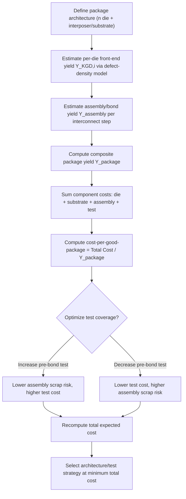

## Advanced Packaging Cost Modeling and Yield Economics

### Overview

Advanced packaging economics differs fundamentally from front-end wafer fabrication economics because cost accrues across multiple heterogeneous unit operations (die singulation, bonding, redistribution layers, molding, testing) rather than a single repeated lithography/etch/deposition cycle. Cost modeling for 2.5D/3D heterogeneous integration must account for **known-good-die (KGD) economics**, **compounding yield loss across multiple bonding and test steps**, and **non-recurring engineering (NRE) costs for interposers, substrates, and package-level design**. Because a single advanced package assembly may combine die from multiple process nodes and multiple foundries, the cost and yield model must be probabilistic and multiplicative rather than additive.

---

### Core Cost Components

Advanced packaging total cost is generally decomposed into:

1. **Die cost** — the cost of each known-good die (KGD), itself a function of wafer cost, die area, and front-end yield.
2. **Interposer/substrate cost** — silicon interposer, organic substrate, glass-core substrate, or RDL (redistribution layer) fan-out structure cost.
3. **Assembly cost** — bonding (thermocompression, hybrid bonding, mass reflow), underfill, molding, and singulation.
4. **Test cost** — die-level test (pre-bond), interconnect test (mid-bond), and final package test (post-bond), each adding cost but also removing risk.
5. **Yield loss cost** — the economic cost of scrapping partially-assembled packages when a defect is discovered after value has already been added (the central economic tension in HI).
6. **NRE and design cost** — interposer/substrate design, package-level DFT (design-for-test), thermal/mechanical co-design, and qualification.

---

### The Multi-Die Yield Problem

The foundational yield economics challenge in heterogeneous integration is that **assembled package yield is the product of the yields of every individual die plus every assembly/bonding step**, not the yield of a single monolithic die.

For $n$ known-good die integrated into one package, with each die's known-good-die yield $Y_{KGD,i}$ and an assembly/interconnect yield $Y_{assembly}$ per bonding operation, the composite package yield is approximated as:

$$Y_{package} = Y_{assembly}^{k} \times \prod_{i=1}^{n} Y_{KGD,i}$$

where $k$ is the number of independent bonding/interconnect operations (die-to-wafer bonds, TSV connections, micro-bump joints, etc.).

**Key implication:** even if each individual die and each individual bond step has a high yield (e.g., 99%), the compounded effect across many die and many interconnects can produce a materially lower package-level yield. This is the core reason chiplet architectures emphasize **pre-bond testing** — catching defects before they are combined into an expensive multi-die assembly.

**Example:** Consider a 2.5D package with 4 compute chiplets ($Y_{KGD} = 0.95$ each) and 1 silicon interposer ($Y_{KGD} = 0.90$), joined via 5 bonding operations at $Y_{assembly} = 0.995$ each:

$$Y_{package} = (0.995)^5 \times (0.95)^4 \times (0.90) \approx 0.975 \times 0.8145 \times 0.90 \approx 0.715$$

Roughly 71.5% of assembled packages survive as good units — meaning nearly 29% of the cumulative cost invested (die + interposer + assembly) is lost to scrap, unless partial rework or salvage is possible.

---

### Known-Good-Die (KGD) Economics

The KGD requirement is the single largest lever in HI cost modeling, because it determines how much of the yield loss burden is shifted **upstream** (cheap, pre-assembly) versus **downstream** (expensive, post-assembly).

- **Monolithic SoC economics**: a single large die has yield determined purely by front-end defect density and die area (per the Poisson or negative-binomial yield models); there is no assembly-stage compounding.
- **Chiplet/HI economics**: splitting a large SoC into smaller chiplets *increases* per-die yield significantly (smaller die area means fewer defects captured per die, per standard yield-versus-area scaling), but *reintroduces* risk at the assembly stage. The net economic benefit of chiplet disaggregation depends on whether the yield gain from smaller die outweighs the added assembly cost and assembly yield loss.
- **Test economics trade-off**: more rigorous (and expensive) pre-bond KGD testing reduces the probability of bonding a defective die into an expensive assembly, but adds direct test cost and test time to every die. The optimal test strategy minimizes:

$$C_{total} = C_{test} + (1 - P_{detect}) \times C_{assembly\,scrap}$$

where $P_{detect}$ is the probability the test screens out a bad die before assembly, and $C_{assembly\,scrap}$ is the fully-loaded cost of scrapping an assembly containing an undetected bad die. As $P_{detect} \to 1$, test cost rises but scrap risk falls — the economically optimal test coverage sits where marginal test cost equals marginal expected scrap-cost avoided.

---

### Die-Area and Reticle-Limited Cost Scaling

Standard front-end die cost scaling still underlies HI economics for each individual chiplet:

$$C_{die} = \frac{C_{wafer}}{D_{net} \times Y_{die}}$$

where $C_{wafer}$ is the processed wafer cost, $D_{net}$ is the net number of die per wafer (a function of die area and wafer diameter, accounting for edge exclusion), and $Y_{die}$ is front-end die yield, itself typically modeled with a negative binomial or Poisson yield model as a function of defect density $D_0$ and die area $A$:

$$Y_{die} \approx \left(1 + \frac{D_0 \times A}{\alpha}\right)^{-\alpha}$$

where $\alpha$ is a clustering parameter (lower $\alpha$ = more defect clustering). Because $Y_{die}$ falls as die area $A$ grows, disaggregating a large monolithic SoC into several smaller chiplets can substantially raise the *aggregate* front-end yield, which is the primary economic driver behind chiplet-based architectures at advanced nodes (AMD's MI-series and EPYC architectures, and reticle-limited AI accelerators, are commonly cited industry examples of this economic logic).

---

### Substrate and Interposer Cost Drivers

- **Silicon interposers**: highest cost per unit area (uses front-end-like processing: TSV etch, fill, RDL), best electrical performance and finest pitch, but least cost-scalable to large panel formats.
- **Organic (laminate) substrates**: lower cost per unit area, mature high-volume supply chain, but coarser achievable pitch and greater warpage risk at large package sizes — an increasingly binding constraint for large AI accelerator packages.
- **Glass-core substrates**: emerging technology (e.g., Absolics' NAPMP-funded work) targeting a middle ground — better dimensional stability and lower dielectric loss than organic substrates, with a cost structure that is potentially more scalable than silicon interposers, though **[Unverified]** actual high-volume manufacturing cost parity with organic substrates has not yet been publicly demonstrated at scale as of the current information available.
- **RDL/fan-out (InFO, FOWLP)**: substrate-less approach using redistribution layers directly on molded wafer/panel; historically lower-cost per unit area than silicon interposers at moderate I/O density, but reticle-stitching and warpage limit maximum package size.

Panel-level packaging (PLP) is increasingly pursued specifically as a **yield economics lever**: larger panel formats (e.g., 515mm x 510mm rectangular panels versus 300mm round wafers) increase the usable area fraction and amortize fixed process costs across more units, directly lowering cost-per-package — though this requires new capital equipment (panel-format lithography, plating, and inspection tools) that itself carries substantial NRE.

---

### Cost of Test in Heterogeneous Integration

Test economics in HI packages typically has three distinct insertion points, each with different cost-per-defect-caught economics:

| Test Insertion | Timing | Relative Cost per Test | Value of Catching a Defect |
| --- | --- | --- | --- |
| Wafer sort / pre-bond KGD test | Before any assembly value added | Lowest | Highest (avoids all downstream cost) |
| Mid-bond / interconnect test | After partial stacking | Moderate | Moderate (avoids remaining assembly steps) |
| Final package test | After full assembly and packaging | Highest (includes full assembly cost already sunk) | Lowest (only avoids shipping cost / field failure) |

This structure is the economic rationale behind the industry's push toward higher-coverage, higher-cost KGD test (including burn-in and enhanced parametric test for die destined for expensive multi-die assemblies) — the "rule of ten" heuristic from traditional electronics manufacturing (cost of catching a defect multiplies roughly 10x at each subsequent stage of assembly) applies with particular force in 2.5D/3D packages given the high cost of silicon interposers and hybrid bonding equipment time.

---

### Yield-Cost Trade-off Illustration (svg_diagram)

<svg xmlns="http://www.w3.org/2000/svg" viewBox="0 0 760 460" font-family="Arial, Helvetica, sans-serif">
<title>Yield Loss Cost vs Test Investment (svg_diagram)</title>
<rect x="0" y="0" width="760" height="460" fill="#ffffff" />
<text x="380" y="28" text-anchor="middle" font-size="18" font-weight="bold" fill="#1a1a1a">Test Investment vs. Assembly Scrap Cost (svg_diagram)</text>

<line x1="90" y1="400" x2="700" y2="400" stroke="#333" stroke-width="2" />
<line x1="90" y1="400" x2="90" y2="60" stroke="#333" stroke-width="2" />
<text x="395" y="435" text-anchor="middle" font-size="13" fill="#333">Test Coverage / Investment ( increasing → )</text>
<text x="35" y="230" text-anchor="middle" font-size="13" fill="#333" transform="rotate(-90 35 230)">Cost ($)</text>

<path d="M 100 380 C 250 360, 450 250, 690 90" stroke="#2563eb" stroke-width="3" fill="none" />
<text x="620" y="80" font-size="12" fill="#2563eb" font-weight="bold">Test Cost</text>

<path d="M 100 90 C 250 150, 450 320, 690 385" stroke="#dc2626" stroke-width="3" fill="none" />
<text x="560" y="345" font-size="12" fill="#dc2626" font-weight="bold">Expected Assembly Scrap Cost</text>

<path d="M 100 250 C 220 180, 320 140, 400 150 C 480 165, 580 230, 690 330" stroke="#059669" stroke-width="3" stroke-dasharray="6,4" fill="none" />
<text x="410" y="130" font-size="12" fill="#059669" font-weight="bold">Total Expected Cost</text>

<circle cx="400" cy="150" r="6" fill="#059669" />
<line x1="400" y1="150" x2="400" y2="400" stroke="#059669" stroke-width="1" stroke-dasharray="3,3" />
<text x="400" y="415" text-anchor="middle" font-size="12" fill="#059669" font-weight="bold">Economic Optimum</text>

<rect x="100" y="60" width="600" height="1" fill="none" />
<text x="100" y="55" font-size="11" fill="#555">Optimum minimizes: Test Cost + (1 − P_detect) × Scrap Cost</text>
</svg>

---

### Facility and Equipment Cost Considerations

Beyond per-unit die and assembly cost, HI economics is shaped by **capital intensity and equipment amortization**:

- **Hybrid bonders and thermocompression bonders** carry high per-tool capital cost and comparatively low throughput (units per hour) relative to front-end lithography tools, so fixed-cost amortization per package is a significant and sometimes underappreciated component of total cost, particularly at low-to-moderate production volumes.
- **Overall Equipment Effectiveness (OEE)** — availability × performance × quality — governs the effective capacity of packaging lines; because HI assembly involves many distinct process steps (each with its own tool, changeover time, and defect mode), aggregate line OEE tends to be harder to sustain than in front-end fabs with more standardized, repeated unit processes.
- **Learning curve effects**: as with front-end fabs, packaging yield and cost improve with cumulative production volume (yield learning curves), but HI's more heterogeneous process mix (combining silicon-like processes such as TSV etch with more traditional assembly processes such as molding) means learning curves can be steeper and less predictable than in mature front-end nodes. **[Inference]** This is a commonly cited industry rationale for why early advanced-packaging capacity announcements (e.g., under NAPMP) budget substantial time and funding for yield ramp and workforce training rather than treating capacity as immediately productive at nameplate volume.

---

### Total Package Cost Model — Consolidated Formula

Bringing the components together, a simplified total expected cost per good package can be expressed as:

$$C_{good\,package} = \frac{\sum_{i=1}^{n} C_{die,i} + C_{substrate} + C_{assembly} + C_{test}}{Y_{package}}$$

where $Y_{package}$ is the composite yield defined earlier. This formulation makes explicit the central economic insight of HI cost modeling: **the denominator (yield) can dominate the economics as much as the numerator (raw component cost)** — a package with modestly higher component costs but substantially higher composite yield can be the lower-total-cost option, which is why yield-improvement investment (better KGD test, tighter process control, hybrid bonding pitch/alignment accuracy) is frequently the highest-leverage cost lever available to a packaging operation, often more impactful than negotiating lower per-die or per-substrate unit prices.

---

### Business Strategy Implications

- **Chiplet disaggregation** is fundamentally a yield-economics decision, not purely an architectural one: it only pays off when front-end yield gains from smaller die exceed the added assembly cost and assembly-yield risk — meaning the optimal degree of disaggregation is workload- and node-dependent, not universal.
- **Vertical integration vs. outsourcing (OSAT model)**: companies must weigh the capital intensity of owning hybrid bonding and advanced packaging capacity against the flexibility and lower fixed-cost exposure of outsourcing to OSATs (e.g., ASE, Amkor, JCET) — a decision increasingly shaped by supply-chain resilience policy (CHIPS Act, EU Chips Act) alongside pure unit economics.
- **Substrate supply constraints** (notably ABF substrate shortages in 2021–2022, and ongoing glass-core substrate scale-up) have historically been binding constraints on advanced package output independent of die or assembly capacity, illustrating that HI cost/yield modeling must be treated as a multi-tier supply chain problem, not a single-factory optimization.
- **Behavior may vary** by specific process node, packaging technology generation, and vendor — the formulas above represent standard, widely-used modeling frameworks; actual cost and yield figures for any specific product require vendor- or fab-specific data that is typically confidential.

---

### Cost/Yield Modeling Workflow (svg_diagram)

---

### Key Points

- Package yield is **multiplicative across all die and all bonding steps**, not additive — this is the single most important departure from front-end cost modeling.
- **KGD testing economics** follow a "rule of ten"-style logic: catching defects earlier is dramatically cheaper than catching them after assembly value has accrued.
- **Chiplet disaggregation** is an economic optimization between front-end yield gains (smaller die) and assembly-stage yield/cost penalties, not a free architectural choice.
- **Substrate technology choice** (silicon interposer vs. organic laminate vs. glass-core vs. RDL fan-out) is simultaneously a technical and a cost-structure decision, with panel-level formats increasingly pursued specifically to improve cost-per-package economics.
- Capital intensity and equipment throughput (hybrid bonders in particular) mean **fixed-cost amortization and learning-curve effects** are significant, often underweighted components of realistic HI cost models.

**Next Steps / Related Topics:**

- Negative binomial and Poisson die-yield models in depth
- Known-good-die (KGD) test methodologies and burn-in economics
- Hybrid bonding process economics and throughput limitations
- Panel-level packaging (PLP) equipment and cost-scaling analysis
- OSAT vs. IDM vertical integration strategy in advanced packaging
- Substrate supply chain economics (ABF shortage case study, glass-core scale-up)
- UCIe chiplet interconnect standard and its cost/interoperability implications
- Learning curve and yield ramp modeling for new packaging process nodes
- Total cost of ownership (TCO) modeling for packaging capital equipment
- Supply chain risk modeling for multi-node, multi-foundry chiplet sourcing