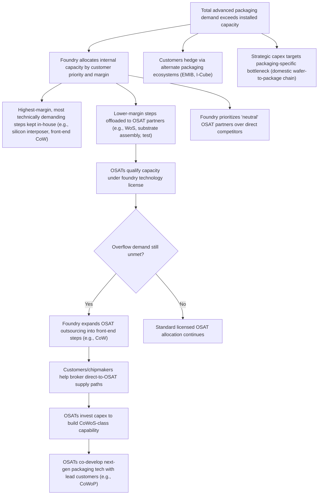

## Foundry and OSAT Capacity Allocation Dynamics

### Overview

Capacity allocation in advanced packaging determines who actually receives finished silicon in a world where **packaging capacity, not wafer starts, is frequently the binding constraint** on shipped semiconductor volume. This is a distinct discipline from wafer fabrication capacity planning because advanced packaging (2.5D/3D integration, CoWoS-class interposer packaging, panel-level packaging) has historically had far less installed base, longer qualification cycles, and fewer credible suppliers than front-end logic fabrication — creating allocation dynamics closer to a rationed market than a conventional supply-demand equilibrium. As of 2026, this dynamic is most visible in TSMC's CoWoS (Chip-on-Wafer-on-Substrate) ecosystem serving AI accelerator demand, but the underlying allocation mechanics generalize across foundries, OSATs, and packaging technologies.

---

### Why Packaging Capacity Becomes the Binding Constraint

In a conventional semiconductor supply chain, wafer fabrication (lithography-limited, EUV-tool-limited) is typically the scarcest resource. In the AI-accelerator era, that has inverted for leading customers: advanced-packaging allocation, not wafer starts, has been described as the binding constraint on AI hardware in 2026, with TSMC's CoWoS lines fully booked against total 2026 demand estimated near 1.0 million wafers, up from roughly 370,000 in 2024. A design can be finished and yielding well and still face a shipping delay set by a packaging-line queue rather than anything wrong with the chip itself — the packaging allocation process is, in effect, the real rationing mechanism for the AI accelerator market.

This inversion occurs because:

- Advanced packaging tools (hybrid bonders, TSV etch/fill, panel-level lithography) have far smaller installed capacity bases than mature front-end lithography tools.
- Qualification cycles for new OSAT packaging lines are long, and lead times for overflow capacity can run substantially longer than core capacity — one industry estimate cites Samsung's I-Cube/X-Cube lines and TSMC's OSAT partners offering overflow capacity but with 26–39 week lead times, insufficient to relieve the core constraint.
- Demand growth has been extremely steep and concentrated: HBM stack heights rising and die/interposer sizes growing simultaneously increase per-unit packaging capacity consumption even before considering unit volume growth.

---

### Allocation Concentration Among Customers

Packaging capacity allocation in the current AI cycle is highly concentrated among a small number of hyperscale and AI-accelerator customers, illustrating how foundries prioritize capacity among competing customers under scarcity:

NVIDIA alone is estimated to hold roughly 60% of TSMC's 2026 CoWoS demand (~595,000 wafers) and has reportedly booked more than half of TSMC's 2026–2027 CoWoS expansion, with the top three customers together accounting for an estimated more than 85% of capacity. A separate industry estimate breaks this down further: of NVIDIA's total projected 2026 CoWoS demand, about 510,000 wafers would be undertaken by TSMC directly (mainly for Rubin-architecture chips), while OSAT manufacturers such as Amkor and ASE/SPIL would share about 80,000 wafers of CoWoS capacity for NVIDIA, primarily for its Vera CPU and automotive chips. Beyond NVIDIA, Broadcom's expected demand of roughly 150,000 wafers (about 15% of total demand) is driven mainly by custom ASIC production for major customers, including reserved capacity for Google's TPU, Meta, and OpenAI. [36Kr](https://eu.36kr.com/en/p/3580962946874242)[36Kr](https://eu.36kr.com/en/p/3580962946874242)

This concentration means capacity allocation decisions function similarly to a priority queue governed by long-term supply agreements and prepayment/capex commitments rather than spot-market pricing — customers with the largest, earliest, and most strategically important commitments receive priority scheduling.

---

### Foundry Capacity Expansion and Internal Prioritization

Foundries facing this bottleneck pursue simultaneous strategies: raw capacity expansion, internal process prioritization, and selective outsourcing.

**Capacity expansion:** TSMC's monthly CoWoS capacity has been reported to increase from approximately 70,000 wafers in 2025 to a projected 130,000–140,000 wafers by the end of 2026, with a separate industry estimate placing the end-2026 target range at 115,000 to 140,000 wafers per month. Physical expansion is concentrated at specific fab sites: TSMC's AP8 facility in the Southern Taiwan Science Park and AP7 in Chiayi have begun equipment move-in, with expansion efforts centered on CoWoS-L while CoWoS-S capacity is being boosted through equipment reallocation to relieve bottlenecks. [[News] TSMC Reportedly Expands Outsourcing of Key CoWoS Front-End Step to OSATs Amid Rising NVIDIA, ASIC Demand +2](https://www.trendforce.com/news/2026/08/05/news-tsmc-reportedly-expands-outsourcing-of-key-cowos-front-end-step-to-osats-amid-rising-nvidia-asic-demand/)

**Internal margin-based prioritization:** Foundries allocate their own highest-margin, most technically demanding process steps internally while pushing lower-margin steps to partners. TSMC has been reported to prioritize high-margin processes like silicon interposer fabrication and front-end CoW (Chip-on-Wafer) bonding internally — work requiring at least 50% gross margins to justify in-house capacity — while outsourcing lower-margin substrate assembly and testing steps. This reflects a broader allocation principle: foundries preferentially retain the technically differentiated, high-value-add process steps and offload commoditized or lower-margin steps to partners even under conditions of overall capacity scarcity. [Substack](https://globalsemiresearch.substack.com/p/tsmcs-cowos-capacity-scaling-up-outsourcing)

---

### The Shift to OSAT Outsourcing

A defining 2025–2026 dynamic is the expansion of OSAT (Outsourced Semiconductor Assembly and Test) involvement into process steps that were previously kept in-house by the foundry.

**Historical division of labor:** Chip-on-Wafer (CoW) refers to attaching the chip to the interposer, while Wafer-on-Substrate (WoS) involves bonding the interposer to the main substrate; OSAT companies including ASE, Amkor, and SPIL have long manufactured WoS packages under technology licenses from the foundry, while CoW — the more technically demanding front-end step — remained predominantly in-house. [TrendForce](https://www.trendforce.com/news/2026/08/05/news-tsmc-reportedly-expands-outsourcing-of-key-cowos-front-end-step-to-osats-amid-rising-nvidia-asic-demand/)

**2026 shift:** TSMC has reportedly expanded outsourcing of the CoW step itself to OSATs amid rising NVIDIA and custom-ASIC demand, a move viewed as an effort to ease persistent bottlenecks in AI chip production as both AI chip developers and data center operators increasingly develop their own custom silicon. Notably, this initiative has reportedly not been led by the foundry itself but instead reflects an approach proposed by major chipmaker customers to address capacity constraints, under which chipmakers continue outsourcing wafer fabrication to the foundry before shipping completed wafers directly to OSAT partners for end-to-end packaging — a notable inversion of the traditional foundry-controlled allocation model, where large customers effectively broker their own alternate supply paths. [TrendForce](https://www.trendforce.com/news/2026/08/05/news-tsmc-reportedly-expands-outsourcing-of-key-cowos-front-end-step-to-osats-amid-rising-nvidia-asic-demand/)

**Scale of outsourced volume:** TSMC has been projected to outsource a portion of its CoWoS workload in 2026, with estimates of 240,000 to 270,000 wafers annually handed off to OSAT partners — primarily Amkor (180,000–190,000 wafers) and SPIL (60,000–80,000 wafers). [Substack](https://globalsemiresearch.substack.com/p/tsmcs-cowos-capacity-scaling-up-outsourcing)

**Strategic rationale for outsourcing partner selection:** as its most advanced packaging lines operate at full capacity, the foundry has been reported to transfer part of its advanced packaging orders to OSAT giants ASE and Amkor rather than allowing customer orders to flow to its largest competitor (Samsung), instead prioritizing subcontract capacity to relatively neutral OSAT players and planning to further incorporate them into its own ecosystem. This illustrates a critical allocation dynamic: capacity-sharing decisions are shaped not only by cost and qualification readiness, but by competitive strategy — a foundry will route overflow demand to partners that do not threaten its market position, even if a technically capable competitor exists. [DIGITIMES](https://www.digitimes.com/news/a20260105PD209/tsmc-cowos-packaging-capacity-nvidia-samsung.html)

---

### OSAT Capability Build-Out in Response

OSATs are not passive recipients of overflow demand; they are actively building qualified capacity and even developing adjacent process technologies to capture a larger share of the value chain.

- According to industry reporting, with strategic backing from customers such as AMD, ASE and SPIL allocated a portion of their 2026 advanced-packaging capital expenditures to build CoWoS-capable capacity ahead of formal outsourcing agreements.
- OSAT vendors have moved into the more technically demanding front-end CoW process, and NVIDIA has reportedly been developing a new packaging technology, CoWoP (Chip-on-Wafer-on-PCB), intended to eventually eliminate the substrate layer — a project reportedly led by SPIL (part of ASE Technology Holding) in coordination with PCB manufacturers, indicating OSATs are being drawn into next-generation process co-development, not merely overflow manufacturing.
- ASE, Samsung, and Amkor have collectively announced over $15 billion in advanced packaging investment, and separately ASE Technology has been reported to hold roughly 44.6% share of the top-10 advanced-packaging market, with Amkor also expanding capability, though neither yet offers CoWoS-class integration at the leading foundry's scale. [AtlasPCB](https://www.atlaspcb.com/news/news-tsmc-copos-cowos-advanced-packaging-capacity-2026/)
- New foundry partnerships are also emerging outside the dominant CoWoS ecosystem: Amkor announced a strategic partnership to adopt EMIB packaging technology at its K5 factory in Songdo, Incheon, South Korea, establishing an alternative packaging source and diversifying the OSAT's technology portfolio beyond a single foundry's process.

---

### Cross-Ecosystem Capacity Dynamics

Capacity allocation dynamics also play out across competing packaging ecosystems, not just within a single foundry's supply base:

| Provider | Packaging Technology | 2026 Position |
| --- | --- | --- |
| TSMC | CoWoS-S / CoWoS-L, developing CoPoS | Dominant share; capacity fully booked; expanding to 115K–140K wafers/month by end-2026 |
| Intel | EMIB, Foveros | Expanding advanced packaging capacity in New Mexico and Malaysia, though significantly behind the leading foundry in production volume |
| Samsung | I-Cube, X-Cube | Ramping for HBM integration, primarily serving its own foundry customers; announced plans to double advanced packaging capacity by 2027 |
| ASE / SPIL | CoWoS-like, FOPLP, CoWoP (co-developed) | Long-standing WoS license holder; expanding into front-end CoW; targeting FOPLP mass production by end-2026 with multiple expansion projects |
| Amkor | CoWoS-licensed WoS, EMIB (new) | Major OSAT overflow recipient; diversifying with an EMIB partnership as an alternate technology source |

This table reflects a broader allocation principle: even where a single foundry dominates the most advanced packaging technology, customers and OSATs actively hedge by qualifying alternate suppliers and alternate packaging architectures (EMIB versus CoWoS-style interposers) to reduce single-source allocation risk — a strategic response to allocation scarcity rather than a pure cost optimization.

---

### Strategic Responses: Vertical Integration and Reshoring

Capacity allocation scarcity has driven investment decisions aimed at securing dedicated domestic capacity rather than competing for shared allocation pools:

The leading foundry's response — a $265 billion Arizona commitment, including packaging capacity intended to eventually offer a complete domestic wafer-to-package chain — has been characterized as a direct answer to the packaging capacity constraint specifically, rather than a general capacity expansion. This reflects a strategic principle: because packaging allocation (not wafer capacity) is the binding constraint, capacity investments increasingly target packaging-specific bottlenecks (interposer fabrication, hybrid bonding throughput, substrate supply) rather than upstream wafer capacity alone. [Absolutedigitalpublishers](https://absolutedigitalpublishers.com/articles/tsmc-cowos-the-real-2026-bottleneck)

**[Unverified]** Specific figures for total industry-wide packaging capacity, precise customer allocation splits, and forward capacity targets are drawn from industry trade press and analyst estimates that are frequently revised and sometimes contested across sources — specific Broadcom or AMD wafer allocation numbers in particular have been described as contested across sources and should be treated as unreliable. These figures should be treated as directional/order-of-magnitude estimates rather than confirmed production data, and verified against primary-source foundry disclosures (quarterly earnings calls, official capacity roadmap announcements) where precision is required.

---

### Allocation Dynamics Flow (svg_diagram)

---

### Key Points

- **Packaging capacity, not wafer starts, is the primary supply constraint** for leading AI accelerator products in 2026 — a structural inversion from historical semiconductor supply chain bottlenecks.
- Capacity allocation is **highly concentrated** among a small number of hyperscale/AI customers, with the top three customers reported to control the large majority of a leading foundry's advanced packaging capacity.
- Foundries **retain high-margin, technically differentiated steps internally** while outsourcing lower-margin steps, only expanding OSAT outsourcing into front-end steps under severe capacity pressure.
- **OSATs are becoming active technology co-developers**, not just overflow manufacturers, investing their own capex to qualify CoWoS-class capacity and partnering directly with chip designers on next-generation packaging architectures.
- Competitive dynamics shape allocation decisions as much as pure economics: **foundries preferentially route overflow work to non-competing OSATs** rather than to rival foundries with equivalent technical capability.
- Given the fast-moving, trade-press-driven nature of this domain, **all specific volume and capacity figures should be treated as estimates** subject to revision and cross-source disagreement.

**Next Steps / Related Topics:**

- CoWoS-S vs. CoWoS-L vs. CoPoS technical architecture differences
- EMIB and Foveros as competing 2.5D/3D packaging approaches
- Panel-level packaging (FOPLP) economics and capacity scaling
- HBM supply chain and its interaction with packaging capacity allocation
- Long-term supply agreements (LTSAs) and capacity prepayment structures in foundry contracts
- Domestic/reshored advanced packaging capacity (U.S., EU, Japan) as a hedge against allocation scarcity
- Technology licensing dynamics between foundries and OSAT partners
- Vertical integration vs. outsourcing strategy for fabless AI chip designers
- Supply chain risk diversification strategies for hyperscaler custom silicon programs