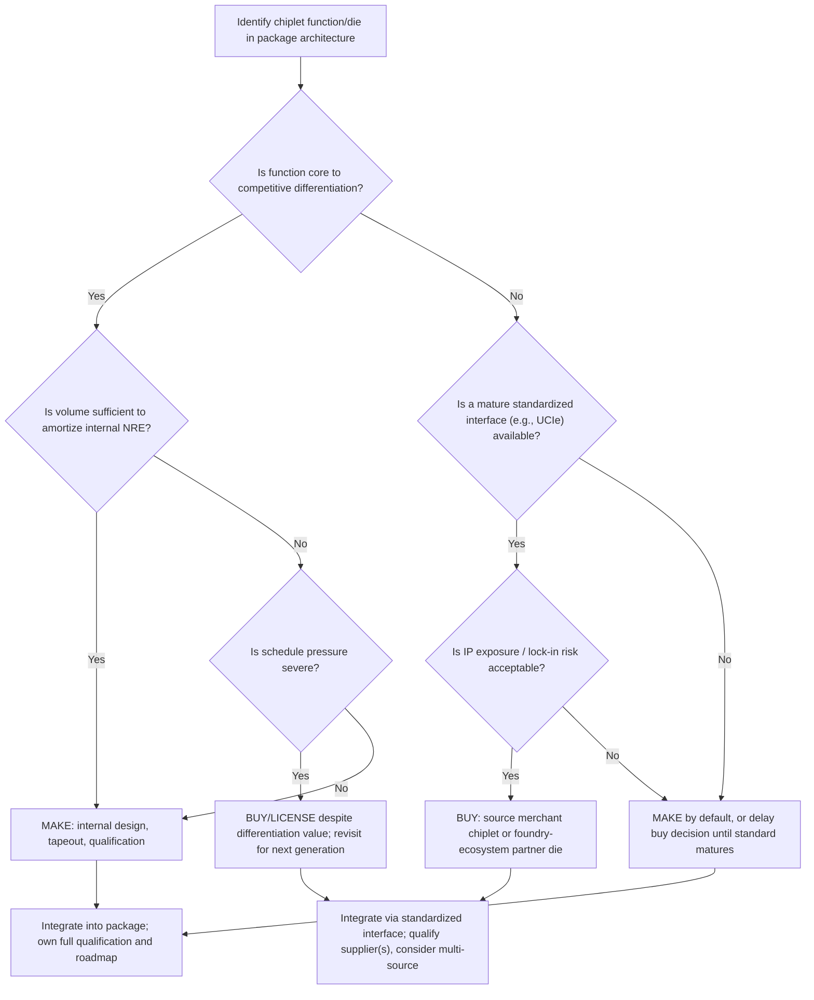

## Make-Versus-Buy Decisions in Chiplet Sourcing

### Overview

The make-versus-buy decision in chiplet sourcing determines whether a systems company designs and fabricates a given die internally ("make") or procures it — as a pre-validated chiplet, IP block, or fully outsourced design — from an external chiplet vendor or foundry ecosystem partner ("buy"). This decision is more granular and more frequently revisited than the classical semiconductor make-versus-buy question (in-house fab versus foundry), because a single heterogeneously integrated package may contain a dozen or more discrete die, each independently sourceable from a different internal team, IP vendor, or merchant chiplet supplier. The decision must jointly weigh **differentiation value, cost structure, schedule risk, IP/interface standardization (notably UCIe), supply chain control, and long-term architectural flexibility**.

---

### The Core Framework: What Drives "Make"

A company generally chooses to design and produce a chiplet internally when:

1. **The function is core to competitive differentiation.** Compute cores, custom accelerators, and proprietary interconnect fabrics that directly determine product performance and are difficult for competitors to replicate are the strongest "make" candidates — the whole rationale for absorbing NRE and schedule risk is that the resulting IP is not available, or not available at competitive quality, from any external source.
2. **Volume is high enough to amortize NRE.** Mask sets, verification, and packaging co-design NRE for an advanced-node die are substantial fixed costs; internal development is only economically rational when unit volume is large enough to drive per-unit NRE amortization below the premium a merchant supplier would charge.
3. **Tight co-design coupling with other proprietary die is required.** When a chiplet's interfaces, power delivery, or thermal profile must be co-optimized in lockstep with other custom silicon in the same package, keeping design internal reduces coordination overhead and IP-sharing friction between organizations.
4. **Supply chain control and roadmap independence matter strategically.** Owning the design removes dependence on a third party's release cadence, pricing power, and prioritization decisions — particularly important when packaging or wafer capacity itself is scarce (see capacity allocation dynamics) and a company wants control over its own critical-path components.

---

### The Core Framework: What Drives "Buy"

Conversely, a "buy" (or "license") decision is favored when:

1. **The function is well-standardized and non-differentiating.** I/O PHYs, memory controllers, common protocol bridges (PCIe, CXL), and other functions where the market has converged on mature, interoperable implementations offer little competitive upside from custom design — a merchant chiplet or licensed IP block performing the same function at lower NRE and schedule risk is typically the more economically rational choice.
2. **Volume is too low to amortize NRE.** For low-to-moderate volume products, the fixed cost of an internal design (mask sets, verification, characterization, packaging qualification) may never be recovered; a merchant chiplet's cost is instead spread across that supplier's aggregate volume from multiple customers.
3. **Time-to-market pressure exceeds internal design capacity.** Licensing or purchasing a pre-validated, already-qualified chiplet can compress schedule dramatically compared to a from-scratch internal design-verify-tapeout-bring-up cycle, which is particularly relevant in fast-moving markets such as AI accelerators where competitive windows are measured in product generations of 12–18 months.
4. **Interface standardization has matured enough to de-risk integration.** The emergence of open chiplet interconnect standards (most notably UCIe — Universal Chiplet Interconnect Express) reduces the technical risk of mixing internally designed and externally sourced die in the same package, because die-to-die electrical and protocol interfaces are standardized rather than proprietary, lowering the integration risk premium historically associated with third-party silicon in a tightly coupled package.
5. **Process node diversity is required.** A package may benefit from combining die fabricated at different process nodes optimized for different functions (leading-edge logic, mature-node I/O, specialized RF or analog); no single internal team can efficiently span every relevant node and process family, making external sourcing of node-optimized chiplets often more efficient than forcing all functions onto a single internal process choice.

---

### Decision Framework Matrix

| Factor | Favors "Make" | Favors "Buy" |
| --- | --- | --- |
| Competitive differentiation | High — core to product value proposition | Low — commodity/standardized function |
| Production volume | High enough to amortize NRE | Low-to-moderate |
| Schedule pressure | Lower — time available for full design cycle | High — need fast time-to-market |
| Co-design coupling | Tight coupling with other proprietary die | Loosely coupled, standard interface (e.g., UCIe) |
| Process node fit | Matches existing internal process expertise | Requires node/process not core to internal capability |
| Supply chain control priority | High — want roadmap independence | Lower — acceptable to depend on supplier roadmap |
| IP/design team capacity | Available and not bottlenecked elsewhere | Constrained; team capacity better used on differentiating blocks |
| Packaging/interconnect risk tolerance | Willing to bear integration risk for control | Prefers pre-validated, qualified interface |

---

### Total Cost of Ownership (TCO) Comparison

A rigorous make-versus-buy analysis compares total lifecycle cost, not just unit price:

**Make (internal) total cost** typically includes: design and verification engineering cost, mask set and tapeout NRE, packaging co-design and qualification NRE, internal test development cost, and the opportunity cost of engineering capacity that could otherwise be applied to more differentiating work.

**Buy (external) total cost** typically includes: per-unit chiplet purchase price (which embeds the supplier's own amortized NRE plus margin), integration and qualification engineering cost (verifying the chiplet's interface, electrical, and thermal behavior in the target package), any licensing fees for associated IP, and a **risk premium** for schedule or quality dependency on a third party.

A simplified break-even framing:

$$C_{make} = NRE_{internal} + n \times C_{unit,internal}$$

$$C_{buy} = NRE_{integration} + n \times C_{unit,external}$$

Setting $C_{make} = C_{buy}$ and solving for volume $n$ gives the break-even unit volume $n^*$ above which internal development becomes the lower-total-cost option — a standard make-versus-buy calculation familiar from broader manufacturing economics, but with the added complexity in chiplet sourcing that $C_{unit,external}$ is not fixed: it depends on the supplier's own volume aggregation across multiple customers, meaning a merchant chiplet supplier can often achieve lower $C_{unit}$ than any single customer's internal volume would justify, shifting $n^*$ higher than a naive single-customer NRE amortization would suggest.

---

### The Role of UCIe and Interface Standardization

The Universal Chiplet Interconnect Express (UCIe) standard, and comparable die-to-die interconnect standardization efforts, materially change the make-versus-buy calculus by reducing the technical and schedule risk historically associated with mixing internally designed and externally sourced die in one package.

Prior to mature open standards, integrating a third-party chiplet into a proprietary package typically required custom interface negotiation, proprietary PHY design, and bespoke qualification for each buy decision — effectively imposing a large fixed integration cost on every external sourcing relationship, which pushed the economic balance toward "make" even for non-differentiating functions. Standardized die-to-die interfaces lower this fixed integration cost, enabling more of the theoretically "buy"-favorable functions (per the framework above) to actually be sourced externally, because the integration risk premium that previously offset the NRE/schedule benefits of buying is reduced. This is the core economic argument industry consortia make for chiplet interconnect standardization: it is not merely a technical convenience but a mechanism to unlock make-versus-buy flexibility at the package level, analogous to how standardized bus interfaces (PCIe, USB) unlocked component-level make-versus-buy flexibility at the board level in earlier computing eras.

**[Inference]** The maturity of this standardization is still evolving as of the current information available; the practical extent to which UCIe-based sourcing has displaced proprietary interconnect approaches in shipping high-volume products should be verified against current UCIe consortium adoption data and specific vendor roadmaps, since standards adoption timelines in this domain have historically lagged initial announcements.

---

### Strategic Risk Considerations Beyond Pure Cost

Make-versus-buy decisions in chiplet sourcing carry risk dimensions that a pure TCO calculation can understate:

- **Packaging and foundry capacity dependency**: sourcing a chiplet externally does not eliminate exposure to advanced packaging capacity constraints — it may in fact compound them, since the buyer now depends on both their own packaging allocation *and* the external chiplet supplier's own capacity and yield performance, effectively adding a second point of supply chain fragility.
- **IP protection and reverse engineering risk**: sharing detailed interface, thermal, and power specifications with an external chiplet supplier for integration purposes creates some exposure of proprietary system architecture information, a consideration that can tilt tightly coupled, highly differentiated functions toward "make" even when a technically capable external supplier exists.
- **Single-source versus multi-source risk**: a "buy" decision concentrated on a single merchant chiplet supplier recreates single-source dependency risk analogous to sole-sourcing any critical component — companies pursuing external chiplet sourcing at scale typically seek to qualify multiple interoperable suppliers where the market supports it, partly enabled by interface standardization.
- **Long-term architectural lock-in**: a "buy" decision embeds the external supplier's roadmap and interface choices into the buyer's own product architecture; if the supplier's technology roadmap diverges from the buyer's future needs, switching costs can be substantial, particularly if proprietary (non-UCIe-class) interfaces were used.
- **Talent and capability retention**: an organization that consistently chooses "buy" for entire categories of chiplet functionality risks atrophying internal design expertise in that domain, which can become a strategic liability if market conditions later favor bringing that function back in-house.

---

### Industry Patterns

**[General knowledge, broadly applicable]** Industry practice generally reflects the framework above: leading AI accelerator and CPU vendors typically design their core compute die internally (the primary differentiator) while sourcing I/O dies, HBM memory stacks, and certain interconnect/bridge chiplets from specialized external suppliers or foundry-ecosystem partners — HBM in particular is near-universally "bought" (sourced from memory manufacturers such as SK hynix, Samsung, or Micron) rather than "made," since HBM manufacturing requires an entirely distinct process technology and manufacturing base from logic design, making internal HBM production economically and technically impractical for a logic-focused company regardless of volume.

Foundry-provided chiplet ecosystems (offering pre-qualified, foundry-validated chiplet building blocks alongside custom die fabrication) are increasingly positioned as a middle path between pure "make" and pure "buy" — allowing a customer to combine a custom, internally designed differentiating die with foundry-ecosystem-sourced standard building blocks, all fabricated and packaged within the same foundry's qualified process flow, which can reduce integration risk relative to sourcing from an entirely independent third-party chiplet vendor.

---

### Make-Versus-Buy Decision Flow (svg_diagram)

---

### Key Points

- Make-versus-buy in chiplet sourcing is decided **per die, not per product** — a single package routinely combines internally made and externally bought die.
- **Differentiation value and production volume** are the two dominant factors, but must be weighed jointly with schedule pressure, node/process fit, and integration risk.
- **UCIe and similar interconnect standards** are strategically important because they lower the fixed integration cost of "buy" decisions, shifting the make-versus-buy break-even point toward more external sourcing than proprietary interfaces would allow.
- **HBM is the clearest universal "buy"** case in the industry, since it requires an entirely separate manufacturing base from logic design regardless of the buyer's scale.
- Pure cost modeling understates real decision risk: **supply chain dependency, IP exposure, single-source risk, and long-term architectural lock-in** are qualitative factors that frequently override a narrow TCO calculation.
- Foundry-provided chiplet ecosystems represent a **hybrid middle path**, combining custom internal die with foundry-qualified standard building blocks in one integrated flow.

**Next Steps / Related Topics:**

- UCIe protocol stack and physical layer specification deep dive
- HBM supply chain structure and memory-vendor relationships
- Foundry chiplet ecosystem programs (e.g., 3D Fabric-style ecosystem ambitions) in depth
- NRE amortization modeling for advanced-node tapeouts
- Multi-sourcing strategies for standardized chiplet interfaces
- IP protection mechanisms in multi-party chiplet integration (secure enclaves, encrypted interfaces)
- Cost break-even analysis techniques for hardware make-versus-buy decisions
- Chiplet marketplace and merchant silicon business models
- Package-level co-design workflows spanning internal and external design teams
- Thermal and power co-design challenges when integrating heterogeneous-sourced die