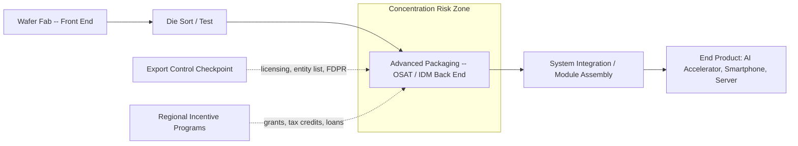
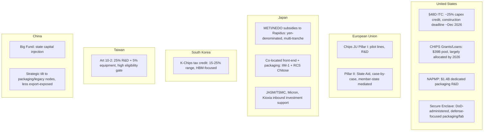

## Geopolitics of Semiconductor Packaging and Regional Incentive Programs

### Why Packaging Became a Geopolitical Chokepoint

For decades, national semiconductor strategy focused almost entirely on front-end fabrication — lithography nodes, wafer fabs, EUV access. Advanced packaging was treated as a low-margin, labor-intensive "back end" step, and consequently offshored to East Asia with little strategic scrutiny. Three developments inverted that assumption:

- **Moore's Law slowdown**: As transistor scaling costs rise and yields plateau below 3nm, performance gains increasingly come from *system-level integration* — chiplets, 2.5D/3D stacking, and heterogeneous integration — rather than from a single monolithic die. Packaging is no longer a commodity finishing step; it is where a growing share of a chip's final performance, power, and cost is determined.
- **AI accelerator demand**: High-bandwidth memory (HBM) stacking via through-silicon vias (TSVs), and large interposer-based packages (e.g., CoWoS-class architectures) are now the binding constraint on AI GPU/accelerator output, not wafer starts. Whoever controls advanced packaging capacity effectively controls a meaningful share of global AI compute supply.
- **Export-control loopholes**: Regulators discovered that front-end fabrication controls could be circumvented at the back end — chiplets fabricated abroad could still be integrated, tested, and shipped from jurisdictions outside the control regime. Packaging became a control point in its own right.

**Key Points**

- Advanced packaging concentration is geographically more extreme than front-end fabrication concentration.
- [Inference] As of the early-to-mid 2020s data, roughly 80% of global outsourced semiconductor assembly and test (OSAT) capacity sits in East Asia, with a large plurality inside China — a concentration cited by policy analysts as a structural vulnerability for Western supply chains. As of 2021, 81 percent of global OSAT capacity was located in East Asia, including 38 percent in China. [Center for Strategic and International Studies](https://www.csis.org/analysis/innovation-lightbulb-tracking-chips-act-incentives)
- This asymmetry means front-end reshoring (new fabs in Arizona, Ohio, Dresden) does not by itself reduce supply-chain risk if the wafers must still travel to Asia for packaging and test before reaching end products.

### The Structural Logic of Packaging as a Chokepoint

Packaging sits at a structural pinch point: it is downstream of fabrication (so front-end reshoring alone doesn't fix exposure), and upstream of system integration (so it is the last domestic-controllable step before a chip becomes part of an end product). This dual position is why both incentive programs and export-control regimes have converged on it simultaneously.

### US Policy: CHIPS and Science Act and Section 48D

The United States pursued a two-track approach: direct grants/loans for capacity, and an investment tax credit for capital expenditure.

- **CHIPS for America Fund**: Of the $50 billion provided to the Department by the CHIPS Act, $39 billion is dedicated to incentivizing investment in facilities and equipment for the fabrication, assembly, testing, advanced packaging, or research and development of domestic semiconductors, materials used to manufacture semiconductors, or semiconductor manufacturing equipment. By early-to-mid 2026, this fund had been largely allocated across major recipients, with the program office reporting the bulk of its $39 billion committed across roughly two dozen awardees, including packaging-specific awards. [Doc](https://www.oig.doc.gov/wp-content/OIGPublications/OIG-25-021-I.pdf)
- **National Advanced Packaging Manufacturing Program (NAPMP)**: A dedicated packaging R&D and ecosystem-building program under the CHIPS Act. Additionally, $1.4 billion has been awarded through the CHIPS National Advanced Packaging Manufacturing Program (NAPMP), aimed at developing new technologies and creating an end-to-end ecosystem where advanced chips are both made and packaged in the U.S. This is explicitly framed as closing the "make it here, ship it there, ship it back" loop. [Center for Strategic and International Studies](https://www.csis.org/analysis/innovation-lightbulb-tracking-chips-act-incentives)
- **Packaging-specific fab awards**: By mid-2026, some of the largest remaining CHIPS grant tranches targeted packaging directly — for example, an award to SK Hynix for an HBM advanced-packaging facility in Indiana, part of the final allocation round of the original manufacturing incentives fund.
- **Section 48D Investment Tax Credit**: A 25% (some analyses cite proposals toward higher effective rates via subsequent legislation) credit against qualified capital expenditure for semiconductor manufacturing (including packaging equipment) property. Critically, this credit carries a hard construction deadline.

**Example**

[Unverified — subject to program guidance and possible extension] The Section 48D credit requires that qualifying construction begin before a fixed statutory cutoff; multiple industry trackers describe the deadline as December 31, 2026, after which projects forfeit the 35%-class credit tier and must rely on grants or state-level incentives instead. Because "begun construction" has a formal Treasury safe-harbor definition (5% of total project cost incurred, or physical work of a significant nature), companies have been front-loading procurement and site prep specifically to lock in eligibility before the deadline.

- **Secure Enclave**: A DoD-administered carve-out of CHIPS funds (up to $3.5 billion) targeting leading-edge domestic packaging/fabrication capacity for defense and national-security applications, separate from the commercial incentive track. On September 16, 2024, Intel Corporation was awarded up to $3 billion in direct funding for the Secure Enclave. The award will be executed by the Department of Defense per an agreement with the Department of Commerce. [Doc](https://www.oig.doc.gov/wp-content/OIGPublications/OIG-25-021-I.pdf)
- **NSTC governance shift**: [Unverified] Reporting indicates the National Semiconductor Technology Center's original nonprofit operator (Natcast) lost its funding role in 2025, with NIST subsequently assuming direct operational control — a governance change relevant to how CHIPS-funded R&D and packaging pilot lines are administered going forward.

### EU Chips Act

The European approach relies on State Aid approval rather than a single centralized grant pool, channeled through Pillar I (the Chips Joint Undertaking, focused on pilot lines and R&D) and Pillar II (capacity-building, approved case-by-case under EU competition law).

- Pillar I, implemented through the Chips Joint Undertaking (Chips JU), has progressed steadily, though with some delays. The Chips JU launched the first four calls for advanced pilot lines in December 2023, and negotiations with winning consortia began in April 2024. A fifth pilot line, specifically targeting advanced photonics (which shares many heterogeneous-integration and packaging techniques with electronic chiplets), followed in mid-2024. [Wikipedia](https://en.wikipedia.org/wiki/European_Chips_Act)
- Scale gap versus the US: Bruegel noted that only €13.75 billion in State aid had been approved under the Act by early 2026, compared with $33.7 billion in grants and $5.5 billion in loans awarded under the US CHIPS and Science Act by January 2025. This differential has driven European policy debate about whether the EU Chips Act's fragmented, member-state-mediated aid model can compete with the US and Asian single-purse programs. [Wikipedia](https://en.wikipedia.org/wiki/European_Chips_Act)
- Germany, as the EU's largest semiconductor investment recipient, has separately negotiated large bilateral aid packages (e.g., for Intel and TSMC-affiliated joint ventures), though project cancellations and delays (including a widely reported Intel Magdeburg-related pullback) have been a recurring feature of the European track. [Unverified — project status changes frequently and should be checked against current Commission and company disclosures.]

### Japan: Rapidus, JASM, and METI

Japan's strategy combines (a) a moonshot bet on a new leading-edge national champion (Rapidus) explicitly targeting 2nm logic *and* advanced packaging/chiplet integration in one vertically coordinated program, and (b) attraction of foreign anchor investment (TSMC's JASM subsidiary, Micron, Kioxia/Sandisk).

- **Rapidus funding trajectory**: An additional 631.5 billion yen was approved, raising total funding to 2.354 trillion yen, with the target remaining 2-nm mass production in fiscal year 2027. [igorslab](https://www.igorslab.de/en/japans-semiconductor-push-is-getting-more-expensive-rapidus-receives-an-additional-6-315-trillion-yen-for-its-2-nm-roadmap/)
- **Explicit packaging build-out**: Rapidus's NEDO-approved FY2026 plan covers front-end and chiplet/packaging projects under the 2-nm roadmap, and the company's Analysis Center and Rapidus Chiplet Solutions facility opened in April 2026, with RCS transitioning to full operation. Company statements indicate the expanded RCS back-end and packaging facility sits directly adjacent to the IIM-1 front-end fab in Chitose. This co-location of front-end and packaging capacity is a deliberate design choice — Japan is trying to avoid the "fab here, package there" fragmentation that the US and EU are now retroactively trying to solve. [igorslab](https://www.igorslab.de/en/japans-semiconductor-push-is-getting-more-expensive-rapidus-receives-an-additional-6-315-trillion-yen-for-its-2-nm-roadmap/)[igorslab](https://www.igorslab.de/en/japans-semiconductor-push-is-getting-more-expensive-rapidus-receives-an-additional-6-315-trillion-yen-for-its-2-nm-roadmap/)
- [Inference] Reuters reporting also indicates NEDO support extends to chiplet/design-adjacent projects with Fujitsu and IBM Japan, suggesting Japan is funding the *design-to-package* pathway, not just physical capacity — a broader ecosystem framing than a single-fab subsidy.
- **METI subsidy scale**: Japan's semiconductor subsidy envelope for FY2026 has been estimated around ¥1.23 trillion, spread across Rapidus, JASM/TSMC Kumamoto, Micron's Hiroshima expansion, and Kioxia/SanDisk memory packaging lines.
- **Caution on cross-border credit stacking**: Analysts note that US and Japanese incentive programs are largely non-stackable for a single project — the US Section 48D credit applies only to US-sited capital expenditure, and Japan's METI subsidies apply only domestically, so multinational firms pursuing incentives in both jurisdictions must operate genuinely separate qualifying facilities rather than attempting to double-count one investment.

### South Korea: K-Chips Act and HBM Leadership

South Korea's incentive framework (colloquially the "K-Chips Act," formally amendments to the Restriction of Special Taxation Act) leans on tax-credit mechanisms rather than direct cash grants, reflecting Samsung's and SK Hynix's existing capital depth. Korea's strategic packaging focus is overwhelmingly HBM, given SK Hynix's and Samsung's dominant roles supplying HBM stacks to AI accelerator makers.

- Korea has repeatedly raised its facility-investment tax credit rate (into the 15–25% range for large firms depending on category) in response to competitive pressure from the US CHIPS Act and Taiwan's incentive statute.
- [Inference] Because HBM packaging (TSV-based DRAM die stacking) is currently one of the tightest-supplied components in the AI hardware stack, Korean policy is less focused on attracting *new* foreign packaging investment and more focused on preserving domestic capacity expansion incentives and skilled-labor pipelines for SK Hynix and Samsung's existing HBM roadmaps.
- Export-control exposure: Korean OSAT and memory operations *inside China* (e.g., Samsung's and SK Hynix's China-based fabs) have been specifically named in US Entity List and Validated End-User (VEU) program changes — BIS removed Samsung's and SK hynix's China fabs, along with Intel's former Dalian plant, from the validated end-user (VEU) programme, effective 31 December 2025, meaning these facilities require case-by-case licenses for US toolset servicing from January 2026 onward. This directly links Korean corporate packaging/memory strategy to US export-control geopolitics. [Referently](https://referently.com/us-chip-export-controls-timeline-every-major-bis-rule-on-china-since-2022/)

### Taiwan: Statute for Industrial Innovation Article 10-2

Taiwan's incentive is a high-threshold tax-credit regime, deliberately structured to reward only the largest, most R&D-intensive players — effectively TSMC and UMC — rather than broadly subsidizing new entrants.

- Structure: 25% R&D tax credit plus a 5% advanced-equipment credit, in force from January 2023 through December 2029.
- Eligibility gate: [Unverified — figures reported by industry trackers, verify against current Taiwanese statute text] Reported thresholds require R&D spend above roughly NT$6 billion, an R&D-to-sales ratio of at least 6%, an effective tax rate floor of 15%, and capital expenditure above roughly NT$10 billion — a combination that as a practical matter excludes all but Taiwan's largest incumbents and effectively locks out most foreign or mid-cap entrants from claiming the credit domestically.
- **Strategic function**: Because TSMC's CoWoS (Chip-on-Wafer-on-Substrate) and SoIC (System on Integrated Chips) advanced-packaging lines are the effective bottleneck for high-end AI accelerator supply globally, Taiwan's incentive design functions less as an attraction tool and more as a *retention* tool — ensuring the most advanced packaging capacity expansion happens on Taiwanese soil even as TSMC simultaneously builds subsidized capacity abroad (Arizona, Kumamoto, Dresden) under pressure from allied governments.

### China: Indigenous Substitution and the "Big Fund"

China's strategy differs qualitatively from the US/EU/Japan/Korea/Taiwan model: rather than competing for foreign anchor investment via tax credits, Beijing has pursued state-directed capital injection (the National IC Industry Investment Fund, or "Big Fund," across multiple phases) combined with a deliberate strategic pivot toward packaging and legacy-node manufacturing precisely *because* those segments face fewer sanctions and can absorb import-substituted equipment more easily than leading-edge lithography.

- [Inference] Packaging and OSAT is a segment where China already holds substantial global capacity share (the 38% East Asia/China figure cited above), giving Beijing a genuine structural advantage independent of export controls, since packaging equipment (die bonders, wire bonders, molding, TSV etch/fill tools) is generally less export-controlled than EUV/DUV lithography — though this has been narrowing, as discussed below.
- Huawei's chiplet integration strategy has been cited by analysts as a case study in how packaging-stage integration can partially work around front-end fabrication restrictions: Huawei reportedly used shell companies to trick the Taiwanese chip foundry TSMC into manufacturing an astonishing total of 2 million computer chiplets for its flagship Ascend 910 AI processors, and Huawei will reportedly package two of these chiplets together to build its next generation Ascend 910C processors. [Unverified — allegation from reporting, not an adjudicated finding] This illustrates why regulators extended controls to the packaging/integration stage rather than leaving them confined to wafer fabrication. [Center for Strategic and International Studies](https://www.csis.org/analysis/limits-chip-export-controls-meeting-china-challenge)

### US Export Controls Reaching Into the Packaging Stage

A defining feature of the 2022–2026 period is that export-control architecture expanded from "control the tool/chip" to "control the integration step," directly implicating OSAT and packaging companies.

- New advanced packaging controls targeted outsourced assembly, test, and packaging operations that could be used to integrate U.S.-origin chiplets into systems assembled in China. [Consumerelectronicsdaily](https://consumerelectronicsdaily.com/chip-supply/us-semiconductor-export-controls/)
- Some HBM with lower parameters are eligible for a new License Exception HBM limited to packaging sites that are owned and operated by US or allied headquartered companies and under various conditions, including reporting, to prevent diversion, illustrating that even *within* the control regime, packaging-site ownership and location have become explicit gating criteria — not just the chip's technical specification. [Baker McKenzie](https://sanctionsnews.bakermckenzie.com/us-department-of-commerce-significantly-expands-controls-targeting-indigenous-production-of-advanced-semiconductors-in-china/)
- BIS added China wide-controls for advanced packaging SME, high-bandwidth memory (HBM), and dynamic random-access memory (DRAM), which, with the expansion of the Foreign Direct Product Rule, extended controls to South Korean firms operating in China. This is the clearest evidence that packaging-adjacent equipment (not just lithography) is now a first-class control category. [Congress.gov](https://www.congress.gov/crs-product/R48642)
- **Foundry due-diligence requirement**: Rules impose a broader license requirement for foundries and packaging companies seeking to export certain advanced chips, unless one of three conditions is met, pushing compliance burden directly onto OSAT operators, who must now perform end-customer diligence historically expected only of fabs. [Bureau of Industry and Security](https://www.bis.gov/press-release/commerce-strengthens-restrictions-advanced-computing-semiconductors-enhance-foundry-due-diligence-prevent)
- **2026 developments**: [Unverified — evolving policy area, verify against current Federal Register notices] Reporting describes continued volatility: a suspension of the "Affiliates Rule" (which had automatically extended Entity List restrictions to majority-owned subsidiaries) following a Trump–Xi meeting, alongside a novel revenue-sharing licensing mechanism for certain AI chip exports to China that is reportedly facing litigation in the US Court of International Trade. BIS has indicated it is drafting a replacement framework for the rescinded AI Diffusion Rule, expected in late 2026, and the direction of that framework will determine whether the multilateral control architecture built between 2022 and 2025 endures or is superseded by bilateral arrangements. [Consumerelectronicsdaily](https://consumerelectronicsdaily.com/chip-supply/us-semiconductor-export-controls/)

### Comparative Incentive Landscape (Illustrative Structure)

### Why Packaging-Specific Incentives Differ From Front-End Incentives

**Key Points**

- **Lower capex, higher headcount intensity**: Advanced packaging lines are typically far cheaper to build than a leading-edge lithography fab (hundreds of millions to low billions vs. $15–20B+ for a leading-edge fab), but are comparatively labor- and yield-engineering intensive, so incentive programs targeting packaging often emphasize workforce development credits alongside capex grants.
- **Faster payback, faster politics**: Because packaging facilities can be built and qualified faster than a new fab (often 18–30 months vs. 3–5 years), packaging investments are politically attractive as a way to show near-term "jobs and ribbon-cutting" results within an election or budget cycle — a factor visibly present in both US CHIPS Program Office messaging and Japan's METI announcements.
- **Ecosystem lock-in risk**: A packaging facility without a co-located or tightly coupled front-end supply (wafers, KGD — known-good-die — testing) can become stranded capacity if upstream wafer supply is disrupted, which is why Japan's Rapidus model (co-locating IIM-1 and RCS) and the US NAPMP's "end-to-end ecosystem" framing both explicitly target vertical integration rather than isolated packaging capacity.

### Substrate and Materials Supply Chain as a Second-Order Chokepoint

Advanced packaging incentive programs increasingly extend beyond the packaging line itself to the materials feeding it — ABF (Ajinomoto Build-up Film) substrates, glass-core substrates, mold compounds, and TSV-related specialty chemicals.

- The CHIPS Program Office explicitly prioritizes building "dozens of suppliers" around each anchor cluster to close gaps in the U.S. supplier ecosystem, with the remaining roughly $8 billion of allocated CHIPS Manufacturing Incentive grants spanning 40+ smaller awards to semiconductor materials suppliers, equipment manufacturers, advanced packaging facilities, specialty fabs, and consortium projects, including companies producing wafer-handling containers, lithography materials, photoresist chemistry, advanced substrates, and specialty silicon wafers. [iFactory](https://ifactoryapp.com/greenfield-consulting/chips-act-incentives-2026)[iFactory](https://ifactoryapp.com/greenfield-consulting/chips-act-incentives-2026)
- [Inference] This tail of smaller, materials-focused awards is arguably more structurally important to long-run packaging resilience than headline fab announcements, because a single-source substrate or specialty-chemical bottleneck (much of which remains concentrated in Japan and Taiwan) can throttle packaging output even when packaging line capacity itself is abundant.

### Practical Framework for Assessing a Country's Packaging Incentive Program

**Example**

When evaluating any national or regional packaging incentive program, a useful analytical checklist:

1. **Activity layer covered** — Does the incentive apply to front-end fab, back-end packaging/test, materials/substrates, or R&D/pilot lines specifically? Many headline programs (e.g., early EU Chips Act framing) were front-end-biased and only later added explicit packaging carve-outs.
2. **Instrument type** — Direct grant, tax credit (and is it refundable/transferable), low-interest loan, or loan guarantee? Tax credits favor firms already profitable enough to have tax liability; grants and refundable credits matter more for pre-revenue or capital-constrained entrants.
3. **Eligibility gate height** — Broad-based (any qualifying capex) versus narrow (Taiwan's Article 10-2 R&D-intensity and revenue thresholds), which determines whether the program functions as broad industrial policy or as targeted retention of a handful of national champions.
4. **Construction/timing deadlines** — Hard statutory cutoffs (like the US Section 48D begun-construction deadline) create front-loaded investment waves and cliff-edge risk for projects that slip.
5. **Export-control entanglement** — Whether recipients face reciprocal restrictions (e.g., US CHIPS recipients face "guardrails" restricting expansion of leading-edge capacity in China for 10 years post-award) that constrain where else the firm can simultaneously invest.
6. **FEOC (Foreign Entity of Concern) restrictions** — Whether the incentive statute excludes firms with specified ownership or control ties to designated foreign adversary governments, a feature common to the US program and increasingly mirrored elsewhere.

### Simplified Illustration: Packaging Chokepoint Geography (svg_diagram)

<svg xmlns="http://www.w3.org/2000/svg" viewBox="0 0 760 360">
<title>Global Advanced Packaging Capacity Concentration (svg_diagram)</title>
<rect x="0" y="0" width="760" height="360" fill="#0f1420" />
<text x="380" y="30" fill="#e8ecf4" font-size="18" font-family="sans-serif" text-anchor="middle" font-weight="bold">Global Advanced Packaging Capacity Concentration (svg_diagram)</text>

<rect x="80" y="70" width="560" height="40" fill="#2b3350" stroke="#4a5580" />
<rect x="80" y="70" width="454" height="40" fill="#3f7fd6" />
<text x="90" y="95" fill="#ffffff" font-size="14" font-family="sans-serif">East Asia: ~81% of global OSAT capacity</text>

<rect x="80" y="130" width="560" height="40" fill="#2b3350" stroke="#4a5580" />
<rect x="80" y="130" width="213" height="40" fill="#d67f3f" />
<text x="90" y="155" fill="#ffffff" font-size="14" font-family="sans-serif">of which China: ~38% of global OSAT capacity</text>

<rect x="80" y="190" width="560" height="40" fill="#2b3350" stroke="#4a5580" />
<rect x="80" y="190" width="106" height="40" fill="#4fae5f" />
<text x="90" y="215" fill="#ffffff" font-size="14" font-family="sans-serif">Rest of World: ~19% of global OSAT capacity</text>

<text x="80" y="260" fill="`#aeb6cc`" font-size="12" font-family="sans-serif">Note: figures reflect a 2021 baseline snapshot cited in policy analysis (CSIS); regional</text>

<text x="80" y="278" fill="`#aeb6cc`" font-size="12" font-family="sans-serif">shares shift as CHIPS/EU/Japan/Korea packaging incentive programs mature.</text>

<rect x="80" y="300" width="16" height="16" fill="#3f7fd6" />
<text x="104" y="312" fill="#e8ecf4" font-size="12" font-family="sans-serif">East Asia (total)</text>
<rect x="240" y="300" width="16" height="16" fill="#d67f3f" />
<text x="264" y="312" fill="#e8ecf4" font-size="12" font-family="sans-serif">China (subset of East Asia)</text>
<rect x="480" y="300" width="16" height="16" fill="#4fae5f" />
<text x="504" y="312" fill="#e8ecf4" font-size="12" font-family="sans-serif">Rest of World</text>
</svg>

### Risks and Open Tensions

- **Subsidy race dynamics**: [Inference] With five major jurisdictions (US, EU, Japan, Korea, Taiwan) simultaneously offering incentives for overlapping activity layers on the same class of projects, there is a plausible risk of global overcapacity in mid-tier packaging, even as truly leading-edge CoWoS/HBM-class capacity remains supply-constrained — a bifurcation that incentive designers do not always distinguish between when setting eligibility criteria.
- **Guardrail conflicts**: US CHIPS recipients accepting domestic packaging awards typically agree to 10-year restrictions on expanding leading-edge capacity in "countries of concern," which can conflict with a multinational's existing or planned China operations, forcing corporate restructuring or divestment decisions as a condition of accepting the subsidy.
- **Deadline cliff risk**: The Section 48D construction deadline creates a scenario where projects that miss the statutory window lose a major federal incentive tier overnight, which [Speculation] could produce visible mid-2027 divergence between "deadline-beating" projects that broke ground under safe-harbor provisions and later-stage projects that must rely solely on grants or state incentives.
- **Legal and political durability**: Novel mechanisms like revenue-sharing export licensing arrangements face active litigation, and broader entity-list/affiliates-rule policy has shown year-to-year volatility tied to bilateral diplomacy (e.g., reported suspension of the Affiliates Rule following high-level talks), meaning companies must plan packaging investment location decisions around a control regime that is still actively being litigated and renegotiated rather than settled law.

**Conclusion**

Advanced packaging has moved from an overlooked back-end commodity process to one of the most contested chokepoints in semiconductor geopolitics, because it is simultaneously (a) where a growing share of AI-era chip performance is actually created, (b) extremely concentrated geographically, and (c) the last domestically controllable step before a chip becomes part of a finished system. Major economies have responded with a patchwork of instruments — US tax credits and grants with hard deadlines and China guardrails, EU State-aid-mediated pilot lines, Japan's vertically co-located Rapidus model, Korea's HBM-centric tax credits, Taiwan's high-threshold retention incentives, and China's state-directed pivot toward less export-exposed packaging and legacy segments — each reflecting a different theory of how to win or defend a position in the same underlying value-chain layer. Simultaneously, export-control regimes have extended their reach from the fab into the OSAT and integration stage, making packaging companies themselves first-class subjects of licensing and diligence obligations. The result is a genuinely five-jurisdiction, real-time competitive and regulatory environment around a single physical process step — a configuration with no direct historical precedent in prior semiconductor policy cycles.

**Related Topics**

- Chiplet standards and interoperability (UCIe) as a geopolitical and commercial battleground
- CoWoS, InFO, and TSMC's advanced packaging roadmap as a global AI-supply bottleneck
- High-bandwidth memory (HBM) supply chain concentration and Korea's strategic position
- OSAT industry structure: ASE, Amkor, JCET, and the East Asia concentration problem
- Foreign Direct Product Rule (FDPR) mechanics and how they extend US jurisdiction into packaging
- Substrate materials chokepoints: ABF substrates, glass-core substrates, and Japanese/Taiwanese supplier concentration
- CHIPS Act guardrails and their effect on recipient firms' China investment decisions
- Comparative effective-incentive-rate analysis across §48D, EU State Aid, K-Chips, and Taiwan Article 10-2
- Rapidus's 2nm/chiplet integration strategy as a case study in co-located front-end/back-end industrial policy
- Legal challenges to novel export-licensing mechanisms (e.g., revenue-sharing chip export arrangements)