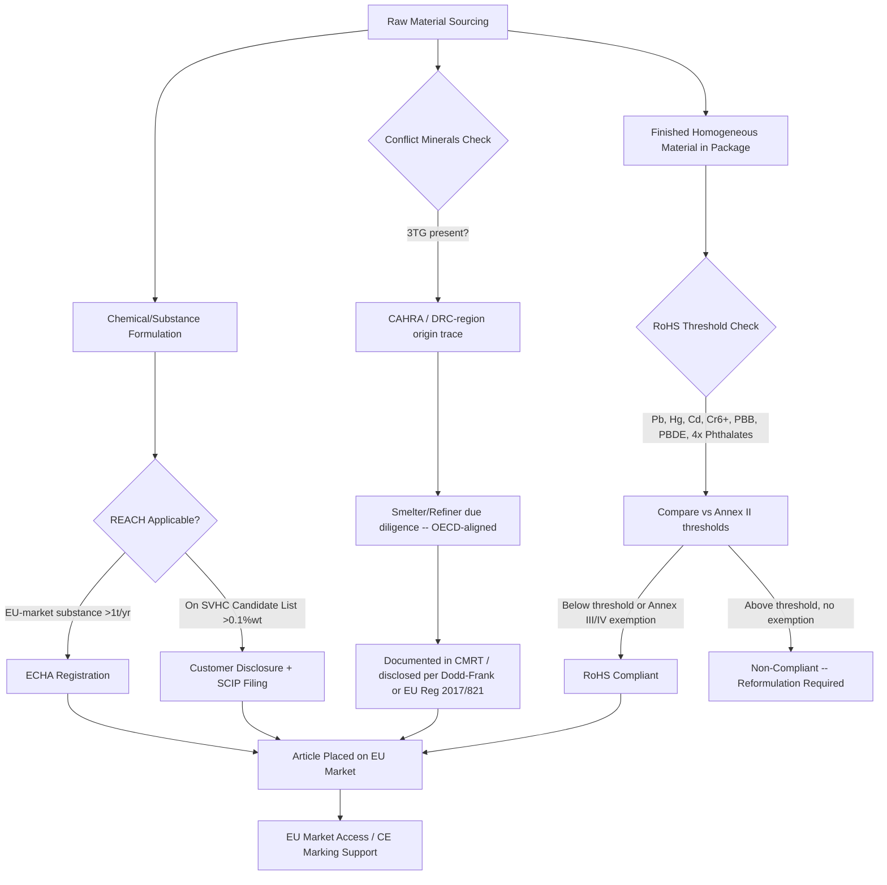

## Environmental Regulations and Compliance: RoHS, REACH, and Conflict Minerals

### Purpose and Scope in the Advanced Packaging Context

Advanced packaging and heterogeneous integration introduce materials that do not exist in conventional single-die packages — TSV (through-silicon via) fill metals, novel underfills, glass-core and organic interposers, sintered die-attach materials, and multi-metal RDL (redistribution layer) stacks. Each of these materials must independently clear the same three regulatory regimes that govern all electronic products: substance restriction (RoHS-type rules), chemical registration/authorization (REACH-type rules), and mineral-origin due diligence (conflict-minerals rules). This section treats each regime technically, then addresses packaging-specific compliance complexity.

**Key Points**

- RoHS restricts *what substances* may be present in a finished electronic product above defined concentration thresholds.
- REACH governs *how chemicals* are registered, evaluated, and authorized for use/import within the EU, independent of the final product's substance concentration.
- Conflict-minerals regulation governs *where the raw metal originated* and whether its extraction/trade financed armed conflict or human-rights abuses, independent of the metal's final chemical form.
- These three regimes are legally distinct, administered by different authorities, and require separate (though overlapping) documentation trails — a common compliance error is treating them as a single "environmental compliance" checkbox.

### RoHS: Restriction of Hazardous Substances

**Legal basis and structure**

The EU RoHS Directive (originally 2002/95/EC, recast as Directive 2011/65/EU "RoHS 2," subsequently amended by RoHS 3 delegated acts) restricts the concentration of specific hazardous substances in electrical and electronic equipment (EEE) placed on the EU market.

**Restricted substances and thresholds** (by weight, in any homogeneous material):

| Substance | Threshold |
| --- | --- |
| Lead (Pb) | 0.1% |
| Mercury (Hg) | 0.1% |
| Cadmium (Cd) | 0.01% |
| Hexavalent chromium (Cr(VI)) | 0.1% |
| Polybrominated biphenyls (PBB) | 0.1% |
| Polybrominated diphenyl ethers (PBDE) | 0.1% |
| Bis(2-ethylhexyl) phthalate (DEHP) | 0.1% |
| Butyl benzyl phthalate (BBP) | 0.1% |
| Dibutyl phthalate (DBP) | 0.1% |
| Diisobutyl phthalate (DIBP) | 0.1% |

The four phthalates were added in RoHS 3 (Delegated Directive 2015/863) with full enforceability from July 2019, alongside category expansion covering essentially all EEE (Category 11 catch-all).

**Semiconductor-specific relevance**: The restriction is measured at the level of a *homogeneous material* — meaning each distinct layer or material within a package (solder, mold compound, lead-frame plating, die-attach adhesive, underfill) must independently meet each threshold, not the package as a bulk average. This is the source of most RoHS compliance complexity in advanced packaging: a 2.5D interposer package might contain 15–20 distinct homogeneous materials (TSV copper fill, barrier/seed metals, RDL copper, solder bumps, mold compound, underfill, substrate laminate, surface finish), each requiring independent substance verification.

**Exemptions relevant to packaging and semiconductors**: RoHS maintains a rolling exemption annex (Annex III/IV) for applications where substitution is technically infeasible. Historically significant exemptions include lead in high-melting-point solders used for die-attach and flip-chip applications, lead as an alloying element in certain semiconductor and ceramic capacitor applications, and cadmium in specific optoelectronic/quantum-dot applications.

- Regulatory attention has shifted toward narrowing existing EU RoHS exemptions, particularly for lead use in electrical and electronic equipment, with cadmium concentration limited to 0.1% by weight and lead concentration limited to 1.5% by weight under revised delegated provisions.
- Directive (EU) 2024/1416 updated exemptions specifically for cadmium-based semiconductor nanocrystal quantum dots used in display technologies: the expiry date for the entry covering quantum dots in general display applications was set to November 21, 2025, while a separate, newer exemption entry for cadmium quantum dots directly deposited on LED semiconductor chips extends to December 31, 2027. [Unverified — exemption annex entries and expiry dates are frequently amended; verify current Annex III/IV entry numbers against the latest Official Journal delegated directive before relying on a specific exemption.]
- **Practical implication**: Packaging engineers introducing a new die-attach solder, quantum-dot color-conversion layer, or barrier metal must check the *current* exemption annex before assuming an established material remains compliant — exemptions expire on fixed dates and are not automatically renewed.

**China RoHS (distinct regime, same acronym)**: China operates a separate, non-harmonized RoHS-type regime under MIIT (Ministry of Industry and Information Technology).

- China's 2026 update — Announcement No. 11 of 2026, effective May 28, 2026 — consolidated the original 12 product types into 10 categories and added 23 new categories, for a total of 33 categories now in scope, replacing the prior 2018-era catalog and exemption list.
- The restricted substance list under GB 26572-2025 covers ten substances: lead, mercury, cadmium, hexavalent chromium, polybrominated biphenyls, polybrominated diphenyl ethers, and four phthalates (DBP, DIBP, BBP, DEHP) — notably mirroring the EU RoHS 3 phthalate additions, though under an independently administered Chinese standard with its own conformity-assessment and labeling requirements.
- The updated exemption list removes six prior exemptions, updates one, refines ten, and introduces six new ones, meaning a product exempt under the 2018 catalog cannot be assumed exempt under the 2026 catalog without re-verification.
- **Compliance implication**: A packaging or component supplier selling into both the EU and China market must maintain *two separate* substance-compliance dossiers, since exemption scope, expiry dates, and even which product categories are in scope differ between the two regimes despite near-identical substance lists.

### REACH: Registration, Evaluation, Authorisation and Restriction of Chemicals

**Legal basis and structure**

REACH (EC Regulation 1907/2006) is a fundamentally different regulatory instrument from RoHS. Rather than restricting substances in finished articles by concentration threshold, REACH requires any entity manufacturing or importing a chemical substance into the EU above 1 tonne/year to register that substance with the European Chemicals Agency (ECHA), and imposes escalating obligations as a substance's hazard profile rises.

**Core REACH mechanisms**:

1. **Registration**: Manufacturers/importers submit a technical dossier characterizing the substance's properties, uses, and safe-handling data. No registration, no market access ("no data, no market").
2. **Substances of Very High Concern (SVHC) — Candidate List**: ECHA maintains a continuously updated list of substances identified as carcinogenic, mutagenic, reprotoxic (CMR), persistent/bioaccumulative/toxic (PBT), or of equivalent concern. Placement on this list is the trigger for downstream disclosure obligations.
3. **Authorisation (Annex XIV)**: A subset of SVHCs is moved to Annex XIV, after which use requires a specific, time-limited authorization from the European Commission — a much higher bar than mere disclosure.
4. **Restriction (Annex XVII)**: Direct bans or concentration limits on specific substance uses, functioning similarly to RoHS but administered under REACH rather than the RoHS Directive.

**SVHC disclosure obligation — the key operational burden for electronics/packaging suppliers**: Any article containing an SVHC above 0.1% by weight must be disclosed to professional customers (and, on request, to consumers) within 45 days, *regardless of whether the substance serves any function in the article*. This differs fundamentally from RoHS: REACH SVHC obligations trigger on *presence*, not on *intentional use* or specification.

- [Inference] Because the SVHC Candidate List has historically grown by roughly 1–4 substances per ECHA review cycle and now numbers well over 200 entries, packaging material suppliers (mold compound formulators, flux and underfill chemists, plating-bath chemical suppliers) face a moving compliance target: a material compliant at qualification may become newly non-compliant or newly disclosure-triggering after a subsequent SVHC Candidate List update, with no grace period tied to the supplier's own product release cycle.
- **SCIP database**: Since 2021, any EU-market article containing an SVHC above 0.1% must additionally be reported to ECHA's SCIP (Substances of Concern In articles, as such or in complex objects) database — a separate filing obligation from customer disclosure, aimed at supporting waste-stream and recycling operators' access to hazard information.

**Why REACH matters more than RoHS for novel packaging materials**: RoHS's ten-substance list is fixed by comparison to REACH's open-ended, continuously updated SVHC list. A genuinely novel packaging chemistry — a new low-temperature sintering paste, a new halogen-free flame retardant for mold compound, a new photoresist or dielectric precursor for RDL processing — is far more likely to intersect with an *emerging* REACH SVHC designation than with the static RoHS ten-substance list. This makes REACH the higher-risk regime for teams introducing new materials into 2.5D/3D packaging flows.

**Example**

A packaging engineer qualifying a new epoxy mold compound (EMC) formulation must verify: (1) RoHS — does any homogeneous layer in the finished EMC exceed threshold for the ten restricted substances (commonly a concern for halogenated flame retardants that historically relied on brominated compounds now RoHS-restricted as PBB/PBDE); (2) REACH SVHC — does the EMC's curing agent, filler surface-treatment chemical, or flame retardant appear on the current Candidate List, triggering a 0.1%-by-weight disclosure obligation even if RoHS-compliant; (3) REACH registration — has the raw chemical supplier registered the relevant substance under REACH for the tonnage band being imported/used, since an unregistered substance cannot legally be placed on the EU market regardless of its hazard profile.

### Conflict Minerals: 3TG Due Diligence

**Legal basis — two independently administered regimes**:

1. **US — Dodd-Frank Act Section 1502** (2010): Requires SEC-registered public companies to disclose whether their products contain tin, tantalum, tungsten, or gold (3TG) that may have originated from the Democratic Republic of the Congo (DRC) or the nine adjoining countries, and to conduct supply-chain due diligence (typically aligned to the OECD Due Diligence Guidance) if so. This U.S. requirement impacts organizations that are publicly traded across the states, and unlike the EU regulation, focuses only on the Democratic Republic of Congo and its nine neighboring countries.
2. **EU — Regulation (EU) 2017/821** ("EU Conflict Minerals Regulation"), in force since January 1, 2021: The EU regulation targets companies that import 3TG minerals and metals into the EU — tin, tungsten, tantalum, and gold — regardless of where these originate from, applying to conflict-affected and high-risk areas (CAHRAs) globally rather than only the DRC region, a materially broader geographic scope than Dodd-Frank.

**Structural mechanics of the EU regime**:

- Mandatory due-diligence obligations fall on **upstream smelters and refiners (SORs)** as well as **downstream EU importers** of 3TG ores, concentrates, and processed metals — the regulation was designed to cover an estimated 95% of relevant EU imports.
- The EU publishes and regularly updates an indicative, non-exhaustive list of conflict- and high-risk areas, alongside a "White List" (now evolving into a formally recognized scheme structure) identifying globally responsible smelters and refiners that source minerals in an ethical and responsible manner — companies sourcing exclusively from White-List-recognized SORs carry substantially reduced due-diligence documentation burden.
- **2026 developments**: The European Commission has recognized a new due-diligence scheme and launched the Responsible Minerals Information System (ReMIS), a voluntary platform where companies can register their due-diligence policies and broader responsible-sourcing efforts, alongside an active review of the regulation itself — meaning the compliance mechanics (which schemes are recognized-equivalent, what documentation ReMIS registration substitutes for) are actively in flux as of mid-2026. [Unverified — the underlying regulation review outcome was not finalized at time of writing; verify against current European Commission conflict-minerals guidance before treating any specific scheme-recognition detail as settled.]

**Semiconductor and packaging relevance of each 3TG metal**:

| Metal | Primary packaging/semiconductor use |
| --- | --- |
| Tin (Sn) | Solder alloys (SAC — tin-silver-copper — solder bumps, C4 bumps, ball-grid-array balls) |
| Tantalum (Ta) | Tantalum capacitors; tantalum nitride/tantalum barrier layers in interconnect and TSV metallization |
| Tungsten (W) | TSV fill/liner in some 3D-integration schemes; contact plugs in front-end interconnect |
| Gold (Au) | Wire bonding; connector and lead-frame plating; some RDL and bump-under-metal stacks |

- [Inference] Tantalum in particular carries elevated conflict-minerals compliance salience because a substantial share of global tantalum ore historically originated from the DRC region and adjoining countries — the specific geography that both Dodd-Frank Section 1502 and the EU regulation were designed to address — making tantalum-containing packaging materials (barrier metals, capacitors) a recurring focus of supply-chain due-diligence questionnaires (e.g., the Responsible Minerals Initiative's Conflict Minerals Reporting Template, CMRT).
- Tin and gold, while also 3TG-scoped, source from a more geographically diverse and generally lower-conflict-intensity base, though specific mining regions (e.g., artisanal tin mining in parts of Indonesia and the DRC region) remain under active due-diligence scrutiny.

### Regulatory Interaction Model

### Compliance Architecture for Advanced Packaging Bill-of-Materials

**Example — layered compliance audit for a 2.5D interposer package**:

1. **Decompose the package into homogeneous materials**: silicon interposer substrate, TSV liner/barrier (typically Ti or TiN), TSV seed/fill (Cu), RDL dielectric (polyimide or PBO), RDL metal (Cu), under-bump metallization (Ni/Au or Ni/Pd/Au stack), solder bumps (SAC alloy), underfill (epoxy + silica filler), mold compound (epoxy + filler + flame retardant), substrate laminate (typically BT resin or similar), surface finish (ENIG — electroless nickel immersion gold, or OSP — organic solderability preservative).
2. **RoHS pass**: For each homogeneous material, obtain supplier material-declaration data (typically IEC 62474-format declarations) confirming concentrations of the ten restricted substances are below threshold, or identify and document the applicable Annex III/IV exemption with its current expiry date.
3. **REACH pass**: Cross-reference every chemical constituent (not just the ten RoHS substances) against the current ECHA SVHC Candidate List; for any hit above 0.1% by weight, prepare the customer-disclosure statement and SCIP database entry; separately confirm the chemical manufacturer holds valid REACH registration for the relevant substance and tonnage band.
4. **Conflict minerals pass**: For gold (surface finish, wire bond), tantalum (any capacitor or barrier-layer content), tin (solder), and tungsten (if used in TSV fill for certain 3D schemes), trace smelter/refiner origin through the supply chain, typically via CMRT questionnaires cascaded to each material supplier, and confirm sourcing from recognized-responsible smelters/refiners.
5. **Aggregate and retain**: Maintain a consolidated compliance dossier per part number/revision, since a bill-of-materials change (new solder alloy, new mold compound supplier, new plating chemistry) requires re-running all three checks — compliance status does not transfer automatically across BOM revisions.

### Common Compliance Failure Modes in Packaging Supply Chains

**Key Points**

- **Homogeneous-material misclassification**: Treating a multi-layer stack (e.g., barrier + seed + bulk fill metal) as a single "metal layer" for RoHS purposes, when regulators require assessment at the true homogeneous-material level, risking an undetected threshold breach in a thin barrier layer that would be diluted-out under an aggregate assessment.
- **Exemption expiry blindness**: Continuing to rely on a RoHS Annex III/IV exemption or a China RoHS exemption-list entry after its stated expiry date — both regimes now feature fixed-date exemption sunsets rather than indefinite grandfathering.
- **SVHC list drift**: Assuming a chemical qualified as REACH-compliant at initial qualification remains compliant indefinitely; the SVHC Candidate List is updated on a rolling basis and a previously unlisted substance can become disclosure-triggering without any change to the material itself.
- **Regime conflation**: Assuming RoHS compliance implies REACH compliance, or that a Dodd-Frank conflict-minerals disclosure satisfies EU Regulation 2017/821 obligations — the geographic scope (DRC-region-only vs. global CAHRA), administering authority, and underlying legal test differ materially between the two conflict-minerals regimes despite covering the same four metals.
- **Sub-tier supplier opacity**: In deep packaging supply chains (raw metal → smelter → alloy/paste supplier → OSAT → OEM), each tier typically only has visibility into its immediate supplier, making full origin-tracing to the mine or CAHRA level dependent on voluntary, good-faith cascading of CMRT-style questionnaires through multiple independent corporate boundaries — a structural limitation acknowledged even by regulators, since tin, tantalum, tungsten, and gold move through long, multifaceted supply chains before reaching a finished product, making it genuinely challenging for manufacturers to pinpoint where minerals originated.

### Standard Documentation and Declaration Formats

- **IEC 62474**: The internationally standardized format for material declarations covering RoHS-restricted substances and related declarable substances, widely used as the data-exchange format between component/material suppliers and OEMs.
- **CMRT (Conflict Minerals Reporting Template)**: The Responsible Minerals Initiative's standardized questionnaire format for cascading 3TG smelter-origin disclosure through multi-tier supply chains; increasingly supplemented by an Extended Minerals Reporting Template (EMRT) covering additional minerals (e.g., cobalt, mica) beyond the original 3TG scope.
- **SCIP database submission**: ECHA's structured XML-based submission format for SVHC-in-article disclosure, mandatory for any article placed on the EU market containing an SVHC above 0.1% weight.
- **Safety Data Sheets (SDS)**: Required under REACH/CLP for hazardous chemical substances and mixtures, distinct from (but often cross-referenced alongside) RoHS material declarations.

**Conclusion**

RoHS, REACH, and conflict-minerals regulation address three structurally different regulatory questions — substance concentration, chemical registration/hazard management, and raw-material geographic origin, respectively — and advanced packaging's material complexity (many discrete homogeneous layers, novel chemistries, multiple 3TG-relevant metals) makes it a higher-compliance-burden domain than simpler, single-material electronic components. Effective compliance requires treating each regime as an independent audit track with its own update cadence — RoHS's periodic exemption-annex revisions and parallel China RoHS catalog, REACH's continuously growing SVHC Candidate List, and conflict-minerals' evolving due-diligence-scheme recognition and platform infrastructure (ReMIS) — rather than a single static checklist, and re-running all three tracks on every material-level bill-of-materials change.

**Related Topics**

- IEC 62474 material declaration standard and supply-chain data exchange practices
- ECHA SVHC Candidate List monitoring and REACH Authorisation (Annex XIV) process mechanics
- Halogen-free mold compound and flame-retardant chemistry transitions driven by RoHS/REACH pressure
- Lead-free solder alloy transition (SAC alloys) and remaining RoHS lead exemptions in high-temperature applications
- OECD Due Diligence Guidance for Responsible Supply Chains of Minerals from Conflict-Affected and High-Risk Areas
- Extended Minerals Reporting Template (EMRT) and expansion of due diligence beyond 3TG (cobalt, mica)
- WEEE Directive and end-of-life recycling implications for multi-material advanced packages
- China RoHS vs. EU RoHS divergence management for dual-market component qualification
- Corporate ESG reporting frameworks (CSRD, EUDR) and their intersection with conflict-minerals disclosure
- Supply-chain traceability technology (blockchain-based smelter certification, digital product passports) for 3TG origin verification