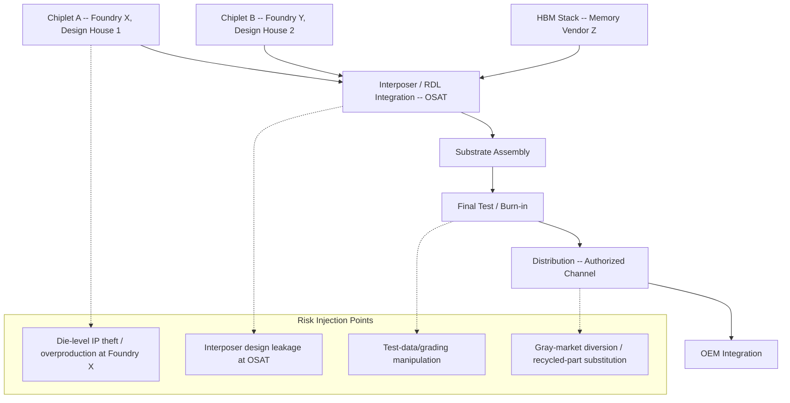

## Package-Level IP Protection, Provenance, and Counterfeit Mitigation

### Why Packaging Introduces New IP and Counterfeit Risk Surfaces

Traditional counterfeit-mitigation and IP-protection practice was built around monolithic dies: a single die in a single package, with a relatively simple chain of custody from fab to test to distribution. Heterogeneous integration breaks that model. A single 2.5D/3D package may now contain chiplets sourced from multiple foundries, multiple design houses, and multiple countries, assembled by a third-party OSAT, integrated on an interposer designed by yet another party — creating a multi-party IP surface and a multi-hop provenance chain that did not exist in single-die packaging. This section covers the technical mechanisms for protecting IP at the package level, establishing provenance, and detecting/mitigating counterfeit or recycled/relabeled parts.

**Key Points**

- IP protection at the package level must address at least three distinct threats: reverse engineering (extracting design IP from a physical part), overproduction/IP theft (unauthorized fabrication using legitimate design files), and counterfeiting (misrepresenting a part's origin, grade, or authenticity).
- Provenance and counterfeit mitigation are related but distinct: provenance answers "where did this physically come from and what happened to it," while counterfeit mitigation answers "is this claimed identity actually true."
- Chiplet-based heterogeneous integration multiplies the number of independent IP boundaries and physical interfaces per package, each of which is a potential attack or leakage point.

### The Expanded Threat Surface in Multi-Die Heterogeneous Packages

Each arrow in a heterogeneous package's assembly flow represents a physical and informational handoff between independent corporate entities, and each handoff is a point where IP can leak, provenance can be broken, or a counterfeit substitution can occur.

### Package-Level IP Protection Mechanisms

**1. Physical obfuscation and de-layering resistance**

- **Die thinning and stacking as inherent obfuscation**: In 3D-stacked packages (e.g., HBM-style TSV stacks, hybrid-bonded logic-on-logic stacks), individual die are thinned to tens of microns and bonded face-to-face or face-to-back, making mechanical de-layering for reverse engineering significantly more destructive and technically demanding than for a planar single-die package — a probe or delayer attempting to access an internal die in a stack risks destroying the electrical continuity needed to observe functional behavior.
- **Redistribution layer (RDL) routing obscuration**: Fine-pitch RDL traces in fan-out and 2.5D packages can be routed with deliberately non-obvious topology (dummy traces, routing through multiple metal layers) to increase the effort required to reverse-engineer interconnect-level IP such as proprietary chiplet-to-chiplet signaling schemes.
- **Potting, encapsulation, and tamper-evident molding**: Mold compounds and underfills can be formulated with fillers or additives that fluoresce, discolor, or crack in a detectable way under mechanical intrusion (e.g., acid decapsulation, mechanical grinding), providing a tamper-evidence layer independent of the die's own security features.

**2. Split manufacturing and 2.5D/3D partitioning as an IP-protection strategy**

Split manufacturing — partitioning a design so that no single fabrication or assembly party has the complete design in one location — becomes a first-class packaging security strategy rather than purely a front-end-of-line technique once chiplets are involved.

- **Chiplet-level design partitioning**: A design house can deliberately split a monolithic design's function across two or more chiplets manufactured at different foundries (or different process nodes), such that no single foundry possesses the complete functional design, and the two chiplets only become a complete, functional system once integrated at the (trusted) packaging/assembly stage.
- **Obfuscated interconnect protocols**: Proprietary or lightly-modified die-to-die interconnect protocols (rather than fully open standards) at the physical and link layer can raise the barrier to a competitor reverse-engineering a multi-chiplet system by observing only the interposer-level signaling, though [Inference] this approach trades off against the interoperability benefits that open chiplet standards (e.g., UCIe) are specifically designed to provide — a design house choosing proprietary signaling for IP protection accepts reduced ecosystem interoperability as a cost.

**3. Hardware root-of-trust and cryptographic identity embedded at the package level**

- **Physical Unclonable Functions (PUFs)**: Silicon PUFs exploit manufacturing-process variation (threshold voltage mismatch, SRAM startup states, ring-oscillator frequency variation) to generate a device-unique cryptographic identity that cannot be extracted, cloned, or predicted even by the original manufacturer, because the identity arises from uncontrolled physical randomness rather than a stored, extractable key. In multi-die packages, a PUF can be instantiated on each chiplet independently, or on a dedicated security/root-of-trust die integrated specifically to anchor identity for the whole package.
- **Package-level unique identifiers**: Beyond die-level PUFs, the package itself (interposer, substrate) can carry a cryptographically signed identifier — programmed during assembly and tied to a specific assembly lot, date, and facility — enabling downstream verification that a given physical package matches its claimed manufacturing record.
- **Secure boot and attestation chains**: A root-of-trust chiplet or die within a heterogeneous package can cryptographically attest to the identity and integrity of the other chiplets it is integrated with at power-up, detecting substitution of a counterfeit or recycled chiplet within an otherwise-legitimate package assembly.
- **Anti-fuse and one-time-programmable (OTP) locking**: Device-unique keys or configuration data burned into anti-fuse arrays after test provide a tamper-resistant, non-volatile identity that survives typical de-processing attempts better than flash-based storage.

**Example**

A heterogeneous AI accelerator package integrating a compute chiplet, an I/O chiplet, and an HBM stack can embed a PUF on the compute chiplet, generate a device-unique key at first power-on, and use that key to cryptographically attest — during a secure boot sequence executed before the accelerator is exposed to untrusted host software — that the I/O chiplet and HBM stack physically present match the signed manufacturing record for that specific package serial number. If a counterfeiter substitutes a lower-binned or recycled HBM stack during unauthorized rework, the attestation signature mismatch is detectable at first boot, before the counterfeit part enters production use.

### Provenance Establishment Mechanisms

**1. Traceability marking**

- **Direct Part Marking (DPM)**: Laser-etched or ink-marked identifiers (often 2D Data Matrix codes per IPC-1782 or similar standards) applied directly to the package exterior, encoding lot code, date code, assembly facility, and often a unique serial number.
- **Electronic Chip ID (ECID)**: A factory-programmed, typically laser-fuse or e-fuse-based unique identifier embedded in the die itself (distinct from the PUF-based cryptographic identity, though the two are often combined), readable via a standard test interface and cross-referenceable against the manufacturer's production database.
- **Traceability data granularity in heterogeneous packages**: Because a single finished package may contain die from multiple independent lots (a logic chiplet from one wafer lot, an HBM stack assembled from a different memory fab's lots), full provenance requires the OSAT to maintain and expose a *composite* traceability record — a genealogy tree linking the final package serial number back to every constituent die's individual lot and wafer-level records, not just a single top-level lot code as in monolithic single-die packaging.

**2. Blockchain and distributed-ledger provenance systems**

[Inference] Distributed-ledger-based traceability has been proposed and piloted across the semiconductor supply chain as a mechanism to create a tamper-evident, multi-party-verifiable chain-of-custody record, addressing the specific problem that traditional paper/database-based traceability records can be altered or fabricated by any single party in the chain without other parties' knowledge.

- **Architecture pattern**: Each handoff in the supply chain (wafer fab → OSAT → test house → distributor → OEM) is recorded as a signed transaction on a shared ledger, typically permissioned/private rather than public, given the commercial sensitivity of production volumes and yield data.
- **Integration with physical identifiers**: The ledger entry for a given package is cryptographically bound to that package's physical identifier (ECID, laser-marked serial number, or PUF-derived identity), such that a physical part can be scanned and its complete custody chain queried and verified against the ledger, with any break in the expected chain (unexpected gap, unauthorized intermediary, mismatched quantities) flagged automatically.
- [Speculation] Industry-wide adoption of a shared distributed-ledger provenance standard for semiconductor packaging remains limited as of the current period; most deployed systems are proprietary, single-company or single-consortium implementations rather than an interoperable cross-industry standard, meaning a part's provenance is typically verifiable only within the ecosystem of participants who adopted the same specific system.

**3. Physical/chemical provenance signatures**

- **Isotopic and trace-element "fingerprinting"**: Because raw materials (silicon, packaging metals, mold compound fillers) carry subtle trace-element and isotopic signatures tied to their geographic mining/refining origin, forensic analysis of these signatures can, in principle, corroborate or contradict a package's claimed country/facility of origin independent of any printed marking — a technique more commonly associated with conflict-minerals forensic verification than routine production QA, but relevant when investigating suspected origin-fraud.
- **Package-level covert taggants**: Manufacturers can embed covert markers (specific fluorescent compounds, DNA-based taggants, or nanoparticle signatures) into mold compound or substrate materials at controlled, low concentrations, detectable only with proprietary reader equipment, providing an anti-counterfeit signature independent of and more resistant to replication than a printed or laser-marked identifier.

### Counterfeit Mitigation: Detection Techniques

**Key Points**

- Counterfeit parts in the packaging context generally fall into four categories: (1) recycled parts (harvested from scrapped/e-waste boards, relabeled as new), (2) remarked/uprated parts (a lower-spec or lower-grade part relabeled as a higher-spec part), (3) cloned/overproduced parts (illegitimately fabricated using stolen or leaked design IP), and (4) test-reject or "out-of-flow" parts diverted from legitimate scrap streams and sold as passing product.
- Heterogeneous packages add a fifth category specific to multi-die assembly: **partial substitution**, where one or more constituent die in an otherwise-legitimate multi-die package is replaced with a counterfeit, recycled, or lower-grade die during unauthorized rework — a risk that does not exist in single-die packages.

**1. Physical inspection techniques**

- **External visual/dimensional inspection**: Package marking font consistency, laser-mark depth and texture, package body dimensions and coplanarity, and lead/ball finish are compared against manufacturer-published specifications; recycled and remarked parts frequently show marking inconsistencies, sanding/resurfacing marks, or dimensional deviations from datasheet tolerances.
- **X-ray inspection**: Used to verify internal die count, die placement, wire-bond or bump pattern, and — critically for multi-die heterogeneous packages — that the internal die configuration matches the expected configuration for the claimed part number (e.g., verifying an HBM stack contains the claimed number of DRAM die layers rather than a lower-layer-count stack relabeled as a higher-capacity part).
- **Decapsulation and die-level inspection**: Destructive removal of the mold compound to expose the die for direct optical or SEM (scanning electron microscope) inspection of die markings, metal-layer topology, and process node characteristics, used when non-destructive methods are inconclusive; this is inherently sample-destructive and typically reserved for suspect-lot forensic investigation rather than incoming-inspection screening.
- **Acoustic microscopy**: Detects internal delamination, voiding, and cracking that are common indicators of recycled parts subjected to a prior desoldering/reflow cycle (thermal stress from an original board removal process leaves characteristic internal damage signatures not present in genuinely new parts).

**2. Electrical and functional test-based detection**

- **Parametric testing against datasheet limits**: Recycled and remarked parts frequently fail or show marginal performance against full datasheet parametric limits (leakage current, threshold voltages, timing margins) even when they pass basic functional go/no-go testing, because the counterfeiter typically has access only to functional test capability, not full parametric characterization equipment.
- **Burn-in and stress screening**: Elevated-temperature, elevated-voltage operational stress screening for a defined duration disproportionately fails recycled/aged parts, since these parts have already consumed a portion of their useful-life margin through prior field use.
- **Cryptographic attestation verification (as described above)**: For packages incorporating a hardware root-of-trust, functional test can include a challenge-response cryptographic verification step, which a cloned or substituted part — lacking the original device-unique PUF-derived key — cannot pass regardless of how convincingly its external marking and functional behavior are replicated.

**3. Supply-chain and documentation-based detection**

- **Certificate of Conformance (CoC) and traceability-record cross-verification**: Cross-referencing a lot's CoC and traceability documentation against the original manufacturer's database (where the manufacturer offers such a verification service) to confirm the claimed lot code, date code, and quantity are consistent with genuine production records.
- **Authorized-channel sourcing controls**: The most effective structural counterfeit mitigation remains procurement-policy-level: sourcing exclusively through manufacturer-authorized distribution channels, since counterfeit parts overwhelmingly enter supply chains through independent/gray-market distributors and brokers rather than authorized channels. [Inference] This is a procurement and business-process control rather than a packaging-technology control, but it is consistently identified in industry counterfeit-mitigation guidance (e.g., AS6081/AS5553 aerospace-standard frameworks, adapted across broader electronics) as the highest-leverage single mitigation.

### Comparative Detection Technique Summary

| Technique | Detects | Destructive? | Effective Against |
| --- | --- | --- | --- |
| External visual/dimensional | Remarking, resurfacing | No | Remarked, recycled |
| X-ray internal inspection | Die-count/configuration mismatch | No | Cloned, partial substitution, uprated |
| Decapsulation + SEM | Die-level process/marking authenticity | Yes | Cloned, remarked |
| Acoustic microscopy | Prior thermal-stress damage | No | Recycled |
| Full parametric test | Performance-margin degradation | No (typically) | Recycled, uprated |
| Burn-in/stress screening | Latent defects, aged-part fragility | No (but consumes life margin) | Recycled |
| Cryptographic attestation | Identity/authenticity of embedded root-of-trust | No | Cloned, partial substitution |
| CoC/traceability cross-check | Documentation-supply-chain consistency | No | All categories (supplementary) |

### Design-for-Anti-Counterfeit (DfAC) Principles at the Package Level

**Example**

A design team introducing a new chiplet-based product line can apply the following package-level anti-counterfeit design decisions during architecture definition, rather than retrofitting detection after the fact:

- Instantiate a PUF-based root-of-trust on at least one die in every multi-die package, with attestation logic that verifies the presence and identity of every other die in the package at boot.
- Specify laser-mark and DPM content and placement in the mechanical package outline document, so downstream test/inspection houses have an unambiguous ground-truth reference for what "genuine" marking looks like.
- Require the OSAT to maintain composite genealogy traceability (linking the final package serial number to each constituent die's originating wafer lot) as a contractual test/assembly deliverable, not an optional service.
- Where die-count or stack-height is a key differentiator between product grades (e.g., HBM capacity tiers), ensure the internal physical configuration is verifiable via non-destructive X-ray inspection without requiring proprietary manufacturer tooling, so that downstream customers and test houses can independently confirm grade authenticity.

### Standards and Frameworks Relevant to Package-Level Counterfeit Mitigation

- **AS5553 / AS6081**: SAE aerospace-standard frameworks for counterfeit electronic-parts avoidance and detection, widely referenced (including outside aerospace) as a structured due-diligence and test-methodology baseline.
- **IDEA-STD-1010**: Independent Distributors of Electronics Association standard for inspection and test methods for detecting suspect/counterfeit parts, commonly used by independent distributors and test labs.
- **JEDEC JEP243 / related JEDEC guidance**: Industry guidance on counterfeit mitigation from the semiconductor manufacturer/JEDEC standards perspective, including marking permanency and traceability recommendations.
- **IPC-1782**: Standard for traceability of electronic products, defining data elements and exchange formats for supply-chain traceability records — directly relevant to establishing the composite, multi-die genealogy records that heterogeneous packaging requires.

### Risks and Open Tensions

**Key Points**

- **Cost-security tradeoff**: Embedding PUFs, dedicated root-of-trust die, and covert taggants adds die area, package cost, and test-time overhead; [Inference] cost-sensitive consumer packaging segments consequently tend to rely more heavily on procurement-channel controls and inspection-based detection than on embedded cryptographic anti-counterfeit hardware, while defense, automotive-safety, and high-value AI-accelerator packaging segments more often justify the added hardware cost.
- **Split-manufacturing/interoperability tension**: Design partitioning across foundries for IP protection works against the industry's broader push toward open chiplet interoperability standards; a design ecosystem that becomes highly proprietary at the die-to-die interface for IP-protection reasons correspondingly narrows its addressable base of compatible third-party chiplets.
- **Provenance-system fragmentation**: With no single dominant industry-wide distributed-ledger or traceability standard, a package's full, verifiable provenance is often only as strong as the weakest or least-transparent link in a multi-party chain — a component sourced through a participant outside a given traceability consortium's system re-introduces a documentation gap regardless of how robust the rest of the chain's recordkeeping is.
- **Detection lag versus counterfeiter adaptation**: [Speculation] As X-ray and acoustic-microscopy detection techniques become standard incoming-inspection practice, it is plausible that counterfeiters adapt by improving cosmetic/thermal-stress concealment (e.g., more sophisticated resurfacing, artificial aging masking) — an arms-race dynamic common to counterfeit detection generally, though the specific pace of adaptation in the heterogeneous-packaging segment is not well documented in public sources.

**Conclusion**

Heterogeneous integration converts IP protection, provenance, and counterfeit mitigation from a largely single-party, single-die concern into a multi-party, multi-hop problem: a single package's trustworthiness now depends on the integrity of every foundry, OSAT, and test house that touched any constituent chiplet, and on whether that chain of custody is verifiably recorded rather than merely claimed. Effective mitigation combines physical-design choices (split manufacturing, de-layering-resistant 3D stacking, tamper-evident materials), embedded cryptographic identity (PUFs, attestation-capable root-of-trust die), rigorous multi-die traceability recordkeeping, and inspection/test-based detection (X-ray configuration verification, parametric and burn-in screening) — with procurement-channel discipline remaining the highest-leverage structural control regardless of how sophisticated the technical countermeasures become.

**Related Topics**

- UCIe (Universal Chiplet Interconnect Express) and the interoperability-versus-IP-protection tradeoff in open chiplet ecosystems
- Physical Unclonable Function (PUF) design architectures: SRAM-based, ring-oscillator-based, and delay-based implementations
- Split manufacturing and 2.5D/3D partitioning as a hardware-security design methodology
- Hardware attestation and secure-boot chains for multi-die heterogeneous systems
- JEDEC and IPC traceability/marking standards for advanced-packaged components
- AS5553/AS6081 counterfeit-avoidance program implementation for semiconductor procurement organizations
- Non-destructive inspection techniques (X-ray, acoustic microscopy) for internal package verification
- Distributed-ledger/blockchain traceability pilots in semiconductor supply chains
- Conflict-minerals forensic provenance techniques (isotopic/trace-element fingerprinting) as applied to counterfeit investigation
- Test-time and die-area cost tradeoffs of embedded hardware root-of-trust in cost-sensitive packaging segments