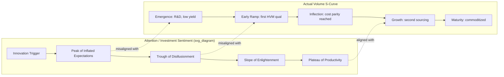
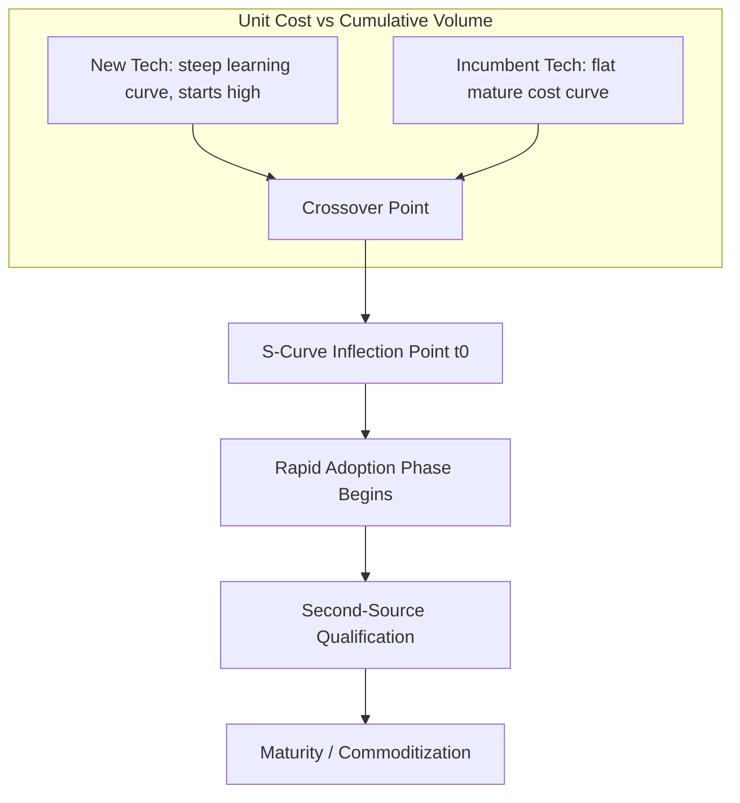

## Technology Adoption Curves and Roadmap Forecasting Methodology

### Overview

Technology adoption curve analysis and roadmap forecasting methodology form the analytical backbone for capital allocation, capacity planning, and strategic positioning decisions in semiconductor advanced packaging. Unlike planar CMOS scaling, where the roadmap has historically been driven by a single dominant cadence (Moore's Law node transitions), advanced packaging technology adoption follows multiple, loosely-coupled S-curves—2.5D interposers, hybrid bonding, fan-out wafer-level packaging (FOWLP), glass core substrates, co-packaged optics—each with distinct maturity timelines, capital intensity profiles, and adoption triggers. Forecasting methodology in this domain must reconcile bottom-up engineering readiness (process capability, yield learning curves) with top-down market pull (AI/HPC demand, hyperscaler capex cycles) and ecosystem constraints (equipment lead times, substrate supply, standards convergence).

### Core Conceptual Frameworks

#### The Technology S-Curve

**Key Points**

- Adoption of a packaging technology follows a logistic (S-shaped) curve when plotted as cumulative adoption (unit volume, revenue share, or fab capacity) against time.
- The curve has three canonical phases: emergence (slow uptake, high per-unit cost, low yield), rapid growth (inflection point, cost curve breaks, second-source qualification), and maturity/saturation (commoditization, incremental cost-down only).
- The inflection point typically coincides with achievement of a yield/cost threshold that makes the technology cost-competitive against the incumbent alternative for a specific application segment, not for all segments simultaneously.

The general logistic adoption function is expressed as:

$$A(t) = \frac{K}{1 + e^{-r(t - t_0)}}$$

where $A(t)$ is cumulative adoption at time $t$, $K$ is the market saturation ceiling, $r$ is the growth rate constant, and $t_0$ is the inflection midpoint. In packaging roadmap work, $K$ is rarely a fixed, knowable ceiling — it shifts as new applications (e.g., an unanticipated AI accelerator generation) expand the addressable market. This is a structural limitation of naively applying single logistic fits to packaging technologies, distinguishing it from more stable end markets. [Inference]

#### Multi-Generation Diffusion Models

Because advanced packaging technologies rarely replace their predecessor outright (2.5D CoWoS did not eliminate wire-bond packaging; it captured a new high-value tier), analysts commonly extend the single-technology Bass diffusion model into a **multi-generation substitution framework**, borrowing from Norton-Bass model conventions used in semiconductor equipment forecasting.

The single-generation Bass model:

$$f(t) = \frac{(p+q)^2}{p} \cdot \frac{e^{-(p+q)t}}{\left(1 + \frac{q}{p}e^{-(p+q)t}\right)^2}$$

where $p$ is the coefficient of innovation (external influence — marketing, standards bodies, lighthouse customers) and $q$ is the coefficient of imitation (internal influence — competitive pressure, ecosystem network effects, peer qualification).

**Key Points on parameter interpretation for packaging:**

- High $p$, low $q$: adoption driven by a small number of anchor customers with unique technical requirements (e.g., early CoWoS adoption driven almost entirely by a single GPU vendor's HBM bandwidth requirements) — [Inference: exact historical $p$/$q$ values are proprietary and not independently verifiable, but the qualitative pattern of concentrated early demand is well documented in industry reporting].
- High $q$, low $p$: adoption driven by imitation/competitive necessity once a standard is validated (e.g., broad foundry adoption of hybrid bonding once the first production yield data became public).
- In a multi-generation model, generation $n+1$ (e.g., hybrid bonding) draws adopters both from new market entrants and from early adopters of generation $n$ (e.g., micro-bump 2.5D) who switch, requiring a substitution matrix rather than an independent curve per technology.

#### Gartner Hype Cycle vs. S-Curve: Reconciliation

**Key Points**

- The Gartner Hype Cycle (Innovation Trigger → Peak of Inflated Expectations → Trough of Disillusionment → Slope of Enlightenment → Plateau of Productivity) describes *sentiment and investment attention*, not shipped-unit adoption.
- The technology S-curve describes *actual deployed volume*.
- These two curves are often out of phase: a packaging technology (e.g., glass-core substrates, co-packaged optics) can be at "Peak of Inflated Expectations" in press coverage and analyst attention while still in the earliest, flattest part of its real adoption S-curve.
- A common forecasting error is conflating hype-cycle position with S-curve position, leading to premature capex commitments during the trough phase when the underlying technology has not yet solved its yield or cost-parity problem. [Inference — this is a general pattern observed across multiple technology cycles, not a specific quantified claim about any single current technology]

### Diagram: Hype Cycle vs. Adoption S-Curve Phase Misalignment

### Roadmap Forecasting Methodologies

#### 1. Bottom-Up Technology Readiness Assessment

This approach anchors the forecast in engineering maturity rather than market sentiment, typically structured around Technology Readiness Level (TRL) equivalents adapted for packaging:

| Readiness Stage | Packaging-Specific Criteria | Typical Roadmap Signal |
| --- | --- | --- |
| Concept/Feasibility | Test vehicle demonstrates electrical/thermal function | Conference paper (ECTC, IEDM, IMAPS) |
| Process Development | Pilot line process window characterized | Equipment supplier co-development announcement |
| Yield Learning | Defect density trending toward HVM target | Foundry/OSAT capacity announcement |
| Qualification | JEDEC/AEC-Q reliability qualification passed | First customer design-win disclosed |
| High-Volume Manufacturing | Multiple fabs, second-sourced materials | Commodity pricing behavior emerges |

**Example:** For hybrid bonding (Cu-Cu direct bond interconnect), the roadmap forecast tracks bond pitch scaling (currently sub-10 µm pitch in HVM for some 3D SRAM/logic stacks, with sub-1 µm pitch demonstrated at research stage) as the primary readiness proxy, since pitch scaling directly determines interconnect density and thus which product segments (HBM stacking vs. logic-on-logic 3D stacking) become addressable at each roadmap milestone.

#### 2. Top-Down Market-Pull Forecasting

This approach starts from end-application demand signals and derives implied packaging technology adoption rates:

**Key Points**

- Primary driver categories: AI/HPC accelerator unit forecasts, hyperscaler capex guidance, smartphone/mobile SoC refresh cycles, automotive electrification content growth.
- Demand is translated into packaging technology requirements via a "bill of packaging" analogous to bill of materials — e.g., a given AI accelerator SKU requires a specific interposer area, number of HBM stacks, and substrate layer count, which aggregates across unit forecasts into implied wafer-equivalent interposer demand or implied CoWoS/SoIC capacity requirements.
- This method is highly sensitive to end-demand forecast error; because packaging capacity has long lead times (12–24 months for advanced substrate and interposer capacity), errors compound into either shortage (observed industry-wide in CoWoS-style advanced packaging capacity during 2023–2024 AI accelerator demand surges) or overcapacity risk in the following cycle. [Inference: directional pattern; exact capacity/demand figures fluctuate and are not independently verifiable at time of writing]

#### 3. Scenario-Based Roadmap Forecasting

Given high uncertainty in both technology readiness timing and demand magnitude, mature roadmap methodology avoids single-point forecasts in favor of scenario trees:

**Key Points**

- **Base case**: Extrapolates current yield-learning curve and known customer qualification pipeline.
- **Accelerated case**: Assumes a lighthouse customer or standards-body decision (e.g., a JEDEC standard finalization, or a major fabless company's next-generation product committing to a new packaging architecture) pulls the inflection point forward.
- **Delayed case**: Assumes a technical blocker (thermal management limit, warpage control, known-good-die yield in 3D stacks) is not resolved on the vendor-published timeline, common given the history of optimistic public roadmaps in the semiconductor industry.
- Scenario probability weighting is typically informed by supply-chain due diligence (equipment order backlogs, material supplier capacity investments) rather than by demand-side sentiment alone, since capex commitments by equipment and material suppliers are a more binding, harder-to-fake signal of genuine industry conviction than press releases.

#### 4. Learning Curve / Experience Curve Cost Modeling

Adoption inflection is frequently cost-gated rather than performance-gated: a packaging technology may be functionally ready long before it is cost-competitive. The experience curve models unit cost decline as a function of cumulative volume:

$$C(N) = C_1 \cdot N^{-b}$$

where $C(N)$ is the cost of the $N$-th unit, $C_1$ is the cost of the first unit, and $b$ is the learning-curve exponent (related to the learning rate $LR$ by $LR = 1 - 2^{-b}$). A "80% learning curve" ($LR = 0.20$) means unit cost falls 20% with each doubling of cumulative volume.

**Key Points**

- Advanced packaging processes with high capital intensity and complex multi-step integration (e.g., TSV formation, hybrid bonding) tend to sit on steeper (lower $LR$, meaning larger cost reductions per doubling) learning curves in the early phase because initial yield losses are large and yield improvement dominates early cost reduction, then flatten once yield approaches ceiling and cost reduction depends only on capital efficiency and material cost-down. [Inference: general pattern from semiconductor manufacturing learning curve literature; specific $LR$ values for named current-generation technologies are proprietary/not independently verifiable]
- Roadmap forecasts commonly overlay the experience curve against the *incumbent* technology's cost curve (which is usually much flatter, being mature) to estimate the crossover volume at which the new technology becomes cost-preferred — this crossover point is the primary driver of the S-curve inflection timing described earlier, structurally linking the cost model to the diffusion model.

### Diagram: Cost Crossover Driving Adoption Inflection

### Key Input Data Sources for Roadmap Construction

**Key Points**

- **Standards bodies**: JEDEC (memory interface and stacking standards), Heterogeneous Integration Roadmap (HIR, published by IEEE Electronics Packaging Society) — the HIR explicitly documents multi-year technology insertion timelines across chapters (interconnects, substrates, thermal, co-design) and is a primary open-source reference for cross-referencing vendor roadmap claims.
- **Conference technical disclosures**: ECTC (Electronic Components and Technology Conference), IEDM, VLSI Symposium, IMAPS — provide the earliest public bottom-up readiness signals, typically 2–4 years ahead of HVM.
- **Equipment supplier order backlogs and capex guidance**: leading indicator of genuine industry capacity commitment, since equipment lead times force customers to commit capital ahead of confirmed demand.
- **Patent filing trends**: leading indicator (typically 3–7 years) of technology direction, useful for identifying which packaging architectures are receiving sustained R&D investment versus one-off publications.
- **OSAT and foundry capacity disclosures**: direct, near-term signal of committed HVM ramp timing.

### Common Methodological Pitfalls

**Key Points**

- **Anchoring on vendor roadmap dates**: publicly disclosed vendor roadmaps are marketing artifacts as much as technical forecasts and have a documented industry-wide tendency toward optimistic timing; forecasting methodology should treat vendor-disclosed dates as an upper bound on pace, not a point estimate.
- **Ignoring ecosystem bottlenecks outside the primary technology**: a packaging technology's adoption curve can be gated by a co-dependent technology's readiness (e.g., interposer/substrate adoption gated by advanced substrate material and ABF (Ajinomoto Build-up Film) supply capacity, or hybrid bonding adoption gated by CMP (chemical-mechanical planarization) uniformity control equipment availability) rather than by the primary technology's own maturity.
- **Single-point extrapolation from early adopter data**: early-adopter economics (concentrated demand, premium pricing tolerance, dedicated engineering support) are not representative of mainstream-market economics; extrapolating early $p$/$q$ Bass-model parameters directly into the growth phase systematically overstates near-term volume.
- **Treating $K$ (market ceiling) as static**: in AI/HPC-driven packaging demand, the addressable ceiling has repeatedly expanded due to unanticipated new product categories, meaning historical logistic fits understate subsequent actual adoption. [Inference]

### Worked Example: Constructing a Simplified Adoption Forecast

**Example**

Step 1 — Define the readiness baseline: A packaging technology has passed qualification (JEDEC-equivalent reliability testing complete) and has one committed anchor customer design-win.

Step 2 — Estimate Bass parameters from analogous prior technology: Using a comparable prior packaging transition (e.g., wire-bond to flip-chip transition data, or 2D to 2.5D transition data) as a proxy, assign illustrative parameters $p = 0.02$, $q = 0.4$ (imitation-dominated, consistent with a technology that requires ecosystem-wide qualification before broad adoption).

Step 3 — Estimate $K$ from top-down demand: Aggregate forecasted unit demand for the addressable end-application segment over the forecast horizon (e.g., AI accelerator unit forecast × attach rate for the packaging technology) to set $K$.

Step 4 — Compute the diffusion curve and identify $t$ at which $f(t)$ peaks (the point of maximum adoption *rate*, occurring before cumulative adoption $F(t)$ reaches 50% of $K$ when $q > p$).

Step 5 — Stress-test against scenario cases: re-run Steps 2–4 under "delayed" ($q$ reduced to reflect a slower-than-typical qualification cycle) and "accelerated" ($p$ increased to reflect a second anchor customer commitment) assumptions to produce a forecast range rather than a single curve.

**Output**

The result is not a single adoption date but a probability-weighted range of inflection windows, typically expressed as a fan chart (cumulative adoption curves for base/accelerated/delayed cases plotted together), which is the standard output format used in semiconductor industry roadmap reports (e.g., those published by SEMI, TechInsights, or Yole Group) rather than a single deterministic curve. [Inference: describing standard industry reporting convention, not a specific published figure]

### Conclusion

Robust roadmap forecasting for advanced packaging technology adoption requires triangulating three structurally different data types: bottom-up engineering readiness (yield learning, TRL progression), top-down demand pull (end-application unit forecasts translated through a bill-of-packaging model), and cost-curve crossover analysis against the incumbent technology. No single curve-fitting exercise is reliable in isolation because packaging technology ceilings ($K$) are demand-elastic (expanding with new application categories) in a way that mature, saturated markets are not, and because ecosystem co-dependencies (materials, equipment, standards) frequently gate the primary technology's pace independent of its own intrinsic readiness. Effective methodology therefore treats the S-curve and Bass diffusion outputs as scenario-conditioned ranges validated against hard capital-commitment signals (equipment backlogs, disclosed fab capacity) rather than as single-point predictions derived from vendor roadmap disclosures or market sentiment alone.

**Related Topics**

- Bass diffusion model parameter estimation techniques (analogy-based vs. regression-based)
- Heterogeneous Integration Roadmap (HIR) chapter structure and update cadence
- CoWoS/InFO capacity planning and hyperscaler AI accelerator demand modeling
- Learning curve theory applied to TSV and hybrid bonding yield ramps
- Equipment capex lead-time analysis as a leading indicator methodology
- Scenario planning and Monte Carlo methods for semiconductor capacity investment
- Cost-of-ownership (CoO) modeling for advanced packaging process selection
- Standards-body influence on technology adoption timing (JEDEC, IEEE HIR)