## Glass Substrate Commercialization Pathway and Remaining Bottlenecks

### Overview

Glass substrate technology replaces the organic core (or silicon interposer) in advanced packages with engineered glass, aiming to solve the warpage, dimensional-stability, and interconnect-density limits that organic build-up substrates hit as AI accelerator packages exceed 100mm × 100mm. As of September 2026, this technology sits at the pivot point between R&D and true high-volume manufacturing (HVM): multiple players have working samples and pilot lines, but 2026 is the first year glass substrates cross from R&D into pilot/qualification phase, with volume ramp following in 2027 to 2030. [photoncap](https://photoncap.net/p/investment-map-15-companies-in-the)

This item documents (1) why the industry is moving to glass, (2) the two competing architectural approaches, (3) the commercialization pathway and timeline by player, and (4) the technical, supply-chain, and economic bottlenecks that remain before glass reaches broad HVM adoption.

---

### Why Organic Substrates Are Running Out of Road

#### **Key Points**

- **Package size growth**: AI accelerator packages now exceed 100mm x 100mm, and organic substrates cannot handle the warpage at these sizes. [photoncap](https://photoncap.net/p/investment-map-15-companies-in-the)
- **CTE mismatch**: CTE (coefficient of thermal expansion) mismatch with silicon causes cracking under thermal cycling in organic (ABF-based) substrates. [photoncap](https://photoncap.net/p/investment-map-15-companies-in-the)
- **Reticle-driven scaling**: For 30 years the substrate stack under CPUs, GPUs, and server accelerators has been built mostly on organic build-up substrates, particularly ABF, but multi-die "super-packages" now regularly exceed the single-reticle limit, forcing larger, flatter carriers. [photoncap](https://photoncap.net/p/investment-map-15-companies-in-the)
- **Warpage as the proximate driver**: Under high temperatures during assembly, warpage reduces yield and becomes increasingly difficult to manage as package sizes grow. [Trendforce](https://insights.trendforce.com/p/glass-substrate-development)

#### Why Glass

Glass can be CTE-matched to silicon, has an order of magnitude lower dielectric loss, and can be processed in large panels. Industry-cited performance gains include improved power efficiency and reduced package thickness: experts say glass substrates could improve power efficiency by over 40% and reduce chip thickness by more than 25%. [Inference — these figures are vendor/analyst-cited projections rather than independently benchmarked, device-level measurements, and actual gains will vary by design and workload.] [photoncap](https://photoncap.net/p/investment-map-15-companies-in-the)[TrendForce](https://www.trendforce.com/news/2026/03/03/news-skc-reportedly-channels-over-half-of-%E2%82%A91t-capital-increase-into-absolics-to-fast-track-glass-substrates/)

A further strategic driver is optical I/O compatibility: glass substrates' key advantage extends beyond current electrical applications to compatibility with the emerging photonics era, where data is transmitted using light rather than electrical signals. [TrendForce](https://www.trendforce.com/news/2026/04/15/news-korea-challenges-intel-on-glass-substrate-standards-as-absolics-samsung-accelerate-commercialization/)

---

### Two Architectural Approaches

#### **Glass Core Substrate**

Replaces the core (center) layer of a conventional build-up substrate with a glass panel, while build-up (RDL) layers and solder-bump interconnects on top/bottom remain broadly similar to organic flows. This is the path Intel, Absolics/SKC, and Samsung Electro-Mechanics (SEMCO) are pursuing for CPU/GPU package substrates.

#### **Glass Interposer**

Replaces the silicon interposer (used in 2.5D packaging, e.g., CoWoS-style architectures) with a glass interposer carrying through-glass vias (TGV) for die-to-die routing. This path is being pursued by TSMC (via its Glass-based FOPLP program), Samsung (SEMCO), and Rapidus for higher-density, finer-pitch die interconnect applications.

Glass-based solutions fall into two categories: one replaces the core layer of the substrate with glass, known as a glass core substrate; the other replaces the silicon interposer with glass, known as a glass interposer. [Trendforce](https://insights.trendforce.com/p/glass-substrate-development)

```mermaid
flowchart TB
    subgraph ORG["Conventional Organic Package"]
        O1["Die(s)"]
        O2["Organic Build-up Substrate (ABF core)"]
        O3["PCB / Motherboard"]
        O1 --> O2 --> O3
    end
    subgraph GCS["Glass Core Substrate Path"]
        G1["Die(s)"]
        G2["Build-up RDL layers"]
        G3["Glass Core (TGV interconnect)"]
        G4["Build-up RDL layers"]
        G5["PCB / Motherboard"]
        G1 --> G2 --> G3 --> G4 --> G5
    end
    subgraph GIP["Glass Interposer Path (2.5D)"]
        I1["Logic Die + HBM Stack"]
        I2["Glass Interposer (fine-pitch RDL + TGV)"]
        I3["Package Substrate"]
        I1 --> I2 --> I3
    end
```

---

### Commercialization Pathway: Player-by-Player Status (as of Q3 2026)

| Company | Approach | Facility / Program | Target Milestone | Status |
| --- | --- | --- | --- | --- |
| **Absolics (SKC subsidiary)** | Glass core | Covington, Georgia (US) | Late 2026 mass production | Samples in package-level reliability (PLR) qualification in Taiwan |
| **Intel** | Glass core (EMIB combo) | Chandler, AZ R&D; India JV plant (3DGS) | ~2030 large-scale deployment | Demonstrated "No SeWaRe" (no micro-cracks) sample; licensing patents |
| **Samsung Electro-Mechanics (GLASEM JV)** | Glass core | Pyeongtaek, Korea (JV w/ Dongwoo Fine-Chem) | 2H 2027 first production | JV formalized; pilot line sampling since late 2024 |
| **LG Innotek** | Glass core | Gumi, Korea | 2027–2028 | R&D / sample validation stage |
| **TSMC** | Glass interposer / CoPoS (FOPLP) | Taiwan | Pilot 2027; HVM 2H 2028 (interposer); core substrate after 2030 | Standardized 310×310mm panel format; validation phase |
| **Unimicron** | Glass core | Taiwan | 2027–2028 (optimistic) | Sample validation / line-build |
| **Innolux** | Glass FOPLP (TGV) | Taiwan | Customer certification in 2026 | Technology development/validation, not yet mass-production orders |
| **Amkor** | Packaging partner (with Intel, optics) | — | "Within three years" (from April 2026) | Industry-event commitment |

Sources for the above: SK Group's Absolics has already sent glass substrate samples to Taiwan for package-level reliability (PLR) certification; if approval comes by year-end, the company plans to begin mass production by late 2026, potentially becoming the world's first commercial supplier. Samsung Electro-Mechanics' joint venture with Dongwoo Fine-Chem, GLASEM, targets mass production in the second half of 2027, while LG Innotek is aiming for 2027–2028. Intel, despite pioneering the concept and investing over $1 billion, is not expected to achieve large-scale commercial deployment until around 2030. TSMC is currently focusing on its Chip-on-Panel-on-Substrate (CoPoS) packaging architecture and has standardized on a 310 × 310 mm panel format. The year 2026 is expected to serve as a critical validation period, with pilot production targeted for 2027 and mass production slated for the second half of 2028, and TSMC's next major focus, glass core substrates, is expected to see commercial-scale production likely after 2030. [Glass substrate mass production race heats up: Samsung Electro-Mechanics debuts at SEMICON Taiwan as South Korean supply chain targets first deliveries in 2026 — BigGo Finance +4](https://finance.biggo.com/news/317836a1-dcfa-4868-b6e1-2d9916bc90d2)

**Important caveat** [Unverified / pattern-based]: Absolics originally planned mass production for the first half of 2024, and reported claims that AMD would adopt glass substrates for CPUs between 2025 and 2026 have come and gone unfulfilled. Every timeline in the segment has slipped historically, so all dates above should be read as current guidance, not settled fact. [Tom's Hardware](https://www.tomshardware.com/tech-industry/manufacturing/glass-substrate-roadmap-examined)[Tom's Hardware](https://www.tomshardware.com/tech-industry/manufacturing/glass-substrate-roadmap-examined)

---

### Technical Milestones Achieved To Date

- **Intel's "No SeWaRe" demo (January 2026)**: Intel showcased a sample at NEPCON Japan combining EMIB packaging with a glass substrate, capable of supporting a chip twice the reticle size, with bump pitch shrunk to 45µm, and claimed to have achieved No SeWaRe (no micro-cracks) during testing — a key reliability signal since micro-cracking at the glass-organic interface has historically been a primary failure mode. [trendforce](https://www.trendforce.com/research/download/RP260224KD)
- **Absolics facility completion**: Absolics has completed the world's first dedicated glass substrate manufacturing facility in Georgia, U.S., and is aiming to secure orders from major fabless players such as NVIDIA. [TrendForce](https://www.trendforce.com/news/2026/03/03/news-skc-reportedly-channels-over-half-of-%E2%82%A91t-capital-increase-into-absolics-to-fast-track-glass-substrates/)
- **Capital commitment**: Absolics completed a capital increase of ₩404.3 billion (approximately $295.1 million) specifically earmarked for glass substrate testing and customer certification. [BigGo Finance](https://finance.biggo.com/news/317836a1-dcfa-4868-b6e1-2d9916bc90d2)
- **Regional expansion**: Intel and 3DGS plan to invest about US$3.3 billion to build a substrate manufacturing plant in Odisha, eastern India, over five to six years, focused on advanced packaging glass core substrates, high-density interconnect substrates, and related technologies, expected to produce about 70,000 glass substrates annually. [TrendForce](https://www.trendforce.com/news/2026/06/01/news-intel-advances-glass-substrate-push-with-3dgs-us3-3-billion-india-plant-set-for-five-to-six-year-buildout/)

---

### Remaining Bottlenecks

#### **1. Through-Glass Via (TGV) Process Maturity**

TGV is the glass-substrate equivalent of through-silicon via (TSV) formation — drilling and metallizing thousands of microscopic vertical interconnects through the glass core/interposer. This remains a primary yield-limiting step.

- The decisive hurdles remain including yield, TGV reliability, and PLP cost at production scale. [onartificialintelligence](https://www.onartificialintelligence.com/articles/33856/glass-interposers-and-substrates-in-advanced-packaging)
- Near-term insertion will depend on sustained process windows across drilling, metallization, and planarization, as well as validated RDL performance on large panels that meet system-level power-delivery and high-speed signaling targets at acceptable total cost of ownership. [onartificialintelligence](https://www.onartificialintelligence.com/articles/33856/glass-interposers-and-substrates-in-advanced-packaging)
- Laser-drilling equipment for TGV (e.g., LPKF's LIDE process, Wuhan Dr. Laser, Hgtech) is still maturing at scale: upstream equipment players have made breakthroughs in TGV laser drilling equipment, but the industry still faces challenges such as import dependence on high-end raw glass, the need to improve the localization rate of core equipment, and controlling yield and costs for large-scale mass production. [itiger](https://www.itiger.com/news/1115277447)

#### **2. Micro-Cracking and Mechanical Fragility**

Glass is inherently more brittle than organic laminate. Handling glass panels through hundreds of process steps (plating baths, thermal cycling, dicing, singulation) without inducing edge chips or subsurface cracks is a persistent engineering challenge — this is precisely what Intel's "No SeWaRe" (no micro-cracks) milestone was designed to address, and it required years of process refinement to reach even the demo stage.

#### **3. Warpage — A Different Failure Mode, Not a Solved Problem**

Glass does not eliminate warpage; it changes its character. Glass improves the warpage and dimensional stability problems of organic substrates but introduces a different class of failure modes that require materials solutions, not process adjustments. Panel-level packaging is arriving not because the engineering is ready, but because wafer-level economics are breaking down — implying the industry is pushing PLP forward under cost pressure even as some materials-level warpage and reliability questions remain open. [Inference: this suggests near-term HVM ramps may proceed with narrower process windows than fully mature technology would normally require.] [semiengineering](https://semiengineering.com/tag/warpage/)[semiengineering](https://semiengineering.com/tag/warpage/)

#### **4. Full Supply-Chain Retooling**

Because glass has different mechanical, thermal, and chemical properties than organic laminate, nearly every downstream process step must be redesigned, not merely re-tuned:

When one layer of the substrate stack changes, every process above and below it changes too. Desmear equipment built for organic, laser drilling built for organic, plating built for organic, inspection built for organic. All of it has to be rebuilt for glass. [photoncap](https://photoncap.net/p/investment-map-15-companies-in-the)

This affects:

- **Desmear/cleaning chemistry** (organic-tuned wet processes don't transfer directly to glass surface chemistry)
- **Laser drilling systems** (different ablation physics for glass vs. organic dielectric)
- **Electroless/electrolytic plating** (adhesion to glass via seed layers differs from adhesion to organic resin)
- **Inspection and metrology** (optical inspection systems calibrated for organic panel reflectivity/opacity need reconfiguration for glass's different optical properties)
- **Dicing/singulation**: Multiple glass substrate cutting/dicing technologies are being evaluated (e.g., from DISCO), each with different trade-offs versus organic substrate dicing. [trendforce](https://www.trendforce.com/research/download/RP260224KD)

#### **5. Raw Material and Equipment Localization**

The industry as a whole still faces challenges such as import dependence on high-end raw glass, the need to improve the localization rate of core equipment, and controlling yield and costs for large-scale mass production. High-purity, low-CTE, large-panel glass suitable for semiconductor-grade processing is a specialized material supply chain distinct from display-glass manufacturing, even though panel-glass expertise (e.g., from OLED production) is being repurposed. [itiger](https://www.itiger.com/news/1115277447)

#### **6. Standards Fragmentation**

No unified industry standard yet exists for panel sizes, TGV pitch/diameter specifications, or qualification protocols:

Industry standards are not yet unified, and a complete industrial ecosystem is still forming. [itiger](https://www.itiger.com/news/1115277447)

This has geopolitical/competitive stakes: if Intel succeeds in establishing glass substrate design standards, fabless companies worldwide could be compelled to follow its specifications — potentially posing a significant threat to Korea's semiconductor ecosystem, which is part of why Korean firms are ramping up commercialization efforts to prevent Intel from gaining the upper hand in setting industry standards, operating on the principle that the first to scale production often sets the standard. [[News] Korea Challenges Intel on Glass Substrate Standards as Absolics, Samsung Accelerate Commercialization +2](https://www.trendforce.com/news/2026/04/15/news-korea-challenges-intel-on-glass-substrate-standards-as-absolics-samsung-accelerate-commercialization/)

#### **7. Cost and Total Cost of Ownership (TCO) at Scale**

Panel-level processing promises lower cost-per-die at volume (larger panel area than round wafers, less edge waste), but the qualification and yield-ramp costs are substantial, and equipment amortization only pays off once volumes are high — creating a chicken-and-egg dynamic between customer demand commitments and capacity investment. [Inference: this is a standard semiconductor capacity-economics pattern, not a claim specific to any single company's financials.]

#### **8. Qualification and Reliability Timelines**

Package-level reliability (PLR) testing — thermal cycling, humidity, mechanical stress, and long-term interconnect reliability — takes months to years to complete with confidence, and results gate customer sign-off:

SKC said embedded glass substrate samples from its Absolics plant are undergoing package-level reliability evaluation in Taiwan, with results possible before year-end (2026) — illustrating that even the most advanced player's mass-production timing is contingent on qualification results not yet finalized as of this writing. [Tom's Hardware](https://www.tomshardware.com/tech-industry/manufacturing/glass-substrate-roadmap-examined)

---

### Illustrative Timeline (svg_diagram)

<svg xmlns="http://www.w3.org/2000/svg" viewBox="0 0 900 380">
<text x="450" y="30" text-anchor="middle" font-size="18" font-weight="bold" fill="#1a1a1a">Glass Substrate Commercialization Timeline (svg_diagram)</text>
<line x1="80" y1="60" x2="850" y2="60" stroke="#333" stroke-width="2" />
<text x="80" y="55" font-size="12" fill="#333">2023</text>
<text x="230" y="55" font-size="12" fill="#333">2025</text>
<text x="380" y="55" font-size="12" fill="#333">2026</text>
<text x="530" y="55" font-size="12" fill="#333">2027</text>
<text x="680" y="55" font-size="12" fill="#333">2028</text>
<text x="820" y="55" font-size="12" fill="#333">2030</text>
<circle cx="80" cy="60" r="4" fill="#333" />
<circle cx="230" cy="60" r="4" fill="#333" />
<circle cx="380" cy="60" r="4" fill="#333" />
<circle cx="530" cy="60" r="4" fill="#333" />
<circle cx="680" cy="60" r="4" fill="#333" />
<circle cx="820" cy="60" r="4" fill="#333" />

<rect x="80" y="90" width="100" height="26" fill="#0071c5" rx="3" />
<text x="130" y="107" text-anchor="middle" font-size="11" fill="white">Roadmap commit</text>
<rect x="380" y="90" width="90" height="26" fill="#0071c5" rx="3" />
<text x="425" y="107" text-anchor="middle" font-size="11" fill="white">No SeWaRe demo</text>
<rect x="800" y="90" width="60" height="26" fill="#0071c5" rx="3" />
<text x="830" y="107" text-anchor="middle" font-size="11" fill="white">HVM target</text>
<text x="20" y="107" font-size="12" font-weight="bold" fill="#0071c5">Intel</text>

<rect x="380" y="140" width="130" height="26" fill="#d9534f" rx="3" />
<text x="445" y="157" text-anchor="middle" font-size="11" fill="white">PLR qualification</text>
<rect x="500" y="140" width="90" height="26" fill="#d9534f" rx="3" />
<text x="545" y="157" text-anchor="middle" font-size="10" fill="white">Mass prod. (target)</text>
<text x="10" y="157" font-size="12" font-weight="bold" fill="#d9534f">Absolics</text>

<rect x="380" y="190" width="100" height="26" fill="#5cb85c" rx="3" />
<text x="430" y="207" text-anchor="middle" font-size="11" fill="white">Pilot sampling</text>
<rect x="530" y="190" width="110" height="26" fill="#5cb85c" rx="3" />
<text x="585" y="207" text-anchor="middle" font-size="10" fill="white">GLASEM JV prod.</text>
<text x="0" y="207" font-size="12" font-weight="bold" fill="#5cb85c">Samsung</text>

<rect x="380" y="240" width="90" height="26" fill="#f0ad4e" rx="3" />
<text x="425" y="257" text-anchor="middle" font-size="11" fill="white">CoPoS validation</text>
<rect x="530" y="240" width="80" height="26" fill="#f0ad4e" rx="3" />
<text x="570" y="257" text-anchor="middle" font-size="10" fill="white">Pilot</text>
<rect x="680" y="240" width="110" height="26" fill="#f0ad4e" rx="3" />
<text x="735" y="257" text-anchor="middle" font-size="10" fill="white">HVM (interposer)</text>
<text x="20" y="257" font-size="12" font-weight="bold" fill="#f0ad4e">TSMC</text>

<rect x="530" y="290" width="150" height="26" fill="#9370db" rx="3" />
<text x="605" y="307" text-anchor="middle" font-size="10" fill="white">Mass production window</text>
<text x="0" y="307" font-size="12" font-weight="bold" fill="#9370db">LG Innotek</text>

<text x="450" y="350" text-anchor="middle" font-size="11" fill="#555" font-style="italic">Note: dates reflect publicly stated targets as of Sep 2026; historical pattern shows repeated slippage</text>

</svg>

---

### Practical Example: Reading a Commercialization Announcement Critically

**Scenario**: A press release states "Company X achieves mass production of glass core substrates."

**Diligence checklist**:

1. **Volume**: Is this "mass production" in the sense of qualified HVM (millions of units/year) or "first commercial shipment" of a small qualification lot? Absolics, for instance, is framed as targeting to become "the world's first company to achieve commercial supply of glass core substrates" — note "commercial supply" is distinct from steady-state HVM yield and volume. [BigGo Finance](https://finance.biggo.com/news/317836a1-dcfa-4868-b6e1-2d9916bc90d2)
2. **Customer sign-off**: Has PLR (package-level reliability) certification actually completed, or is it still pending, as in Absolics' Taiwan-based reliability evaluation with results only possible "before year-end"? [Tom's Hardware](https://www.tomshardware.com/tech-industry/manufacturing/glass-substrate-roadmap-examined)
3. **Application**: Is the substrate going into a flagship AI accelerator (highest reliability bar) or a lower-stakes application first (optical modules, RF, sensors) to de-risk the ramp?
4. **Historical base rate**: Given that every prior glass substrate timeline in this segment has slipped, treat announced dates as directional, not committed. [Tom's Hardware](https://www.tomshardware.com/tech-industry/manufacturing/glass-substrate-roadmap-examined)

---

### Market and Strategic Context

- **Customer pull**: As stacking technologies near their limits, substrate-level innovation may deliver severalfold gains in AI accelerator performance, prompting firms such as Google and Microsoft to factor glass adoption into hardware design from the outset. [TrendForce](https://www.trendforce.com/news/2026/03/03/news-skc-reportedly-channels-over-half-of-%E2%82%A91t-capital-increase-into-absolics-to-fast-track-glass-substrates/)
- **Reshoring dimension**: The establishment of glass substrate facilities in the United States, such as the Absolics plant in Georgia, represents a significant step in "re-shoring" advanced packaging capability outside East Asia. [Wedbush](https://investor.wedbush.com/wedbush/article/tokenring-2026-1-28-the-glass-revolution-intel-and-samsung-pivot-to-glass-substrates-for-the-next-era-of-ai-super-packages)
- **Vertical integration play (Samsung)**: Samsung has leveraged its internal "Triple Alliance" — the combined expertise of Samsung Electro-Mechanics, Samsung Electronics, and Samsung Display — repurposing high-precision glass-handling technology from its Gen-8.6 OLED production lines to fast-track pilot lines in Sejong, South Korea. [Wedbush](https://investor.wedbush.com/wedbush/article/tokenring-2026-1-28-the-glass-revolution-intel-and-samsung-pivot-to-glass-substrates-for-the-next-era-of-ai-super-packages)
- **China's parallel track**: Chinese players including Triassic Technology (leading a TGV alliance), BOE, and TCL CSOT are entering the field leveraging large-panel process experience, with Wuhan Dr Laser and Hgtech advancing TGV laser drilling equipment domestically — indicating a geographically distributed, competitive supply base is forming rather than a single dominant source. [itiger](https://www.itiger.com/news/1115277447)

---

### Summary Assessment

Glass substrate technology has moved decisively from pure R&D into pilot qualification during 2026, with Absolics positioned as the likely first mover to commercial supply (contingent on PLR results), Samsung/SEMCO and LG Innotek following in 2027–2028, and TSMC/Intel pursuing more conservative timelines extending toward 2028–2030. The core value proposition — CTE-matched flatness, low dielectric loss, and panel-scale economics — is well established. **The remaining bottlenecks are not primarily conceptual but industrial**: achieving repeatable TGV yield at volume, managing a new class of glass-specific warpage and micro-crack failure modes, rebuilding an entire process/equipment ecosystem previously optimized for organic materials, and converging on shared standards before customer qualification cycles complete. [Inference: given the consistent historical pattern of schedule slippage across this segment, near-term (2026–2027) volumes are likely to remain limited/qualification-scale even if headline "mass production" milestones are announced, with meaningful volume ramp more plausible in the 2027–2029 window across multiple suppliers.]

---

**Related Topics / Next Steps**

- Through-glass via (TGV) formation: laser-induced deep etching (LIDE) vs. laser-assisted etching process comparison
- Fan-Out Panel-Level Packaging (FOPLP) and TSMC's CoPoS architecture
- Package-level reliability (PLR) testing protocols for next-generation substrates
- Organic (ABF) substrate scaling limits and comparison to glass core/interposer approaches
- Glass substrate supply chain: raw glass suppliers, TGV equipment vendors, and panel makers entering semiconductor packaging
- Co-packaged optics (CPO) and glass substrates' role in enabling optical I/O
- Warpage management techniques in panel-level packaging
- EMIB (Embedded Multi-die Interconnect Bridge) and its integration with glass core substrates
- Standards development for glass substrate panel sizes and TGV specifications