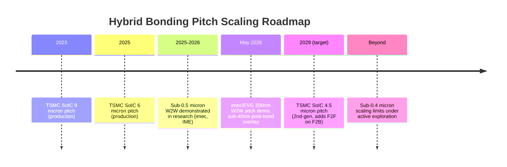
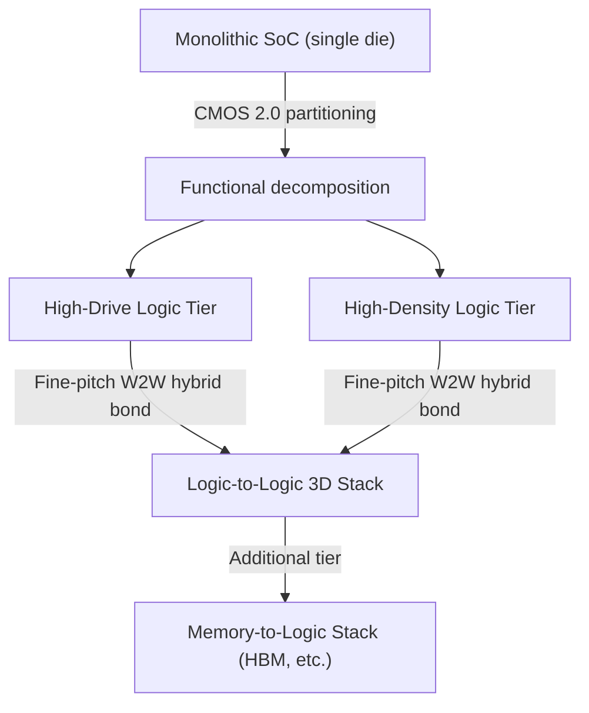
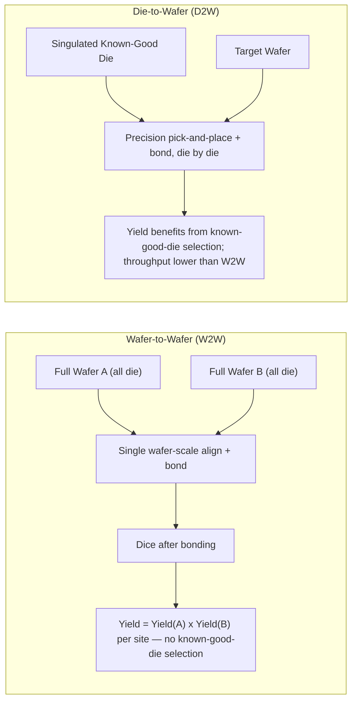

## Sub-micron and Sub-200-nanometer Hybrid Bonding Pitch Scaling Frontiers

### Overview

Hybrid bonding is the copper-to-copper (Cu-Cu) direct bonding technique — with a dielectric-to-dielectric bond surrounding each pad — that replaces solder microbumps in 3D chip stacking. Hybrid bonding, the copper-to-copper joining technique that replaces solder microbumps in 3D chip stacks, is in high-volume production on logic and freshly postponed on memory as of 2026. This item covers the current pitch-scaling frontier — from today's production nodes (single-digit micron) down to the sub-micron and now sub-200-nanometer research frontier — the process physics that gate further scaling, and the bonding-scheme trade-offs (wafer-to-wafer vs. die-to-wafer) that determine which applications can adopt each pitch tier.

---

### Why Pitch Matters

Interconnect pitch is the center-to-center spacing between adjacent Cu bond pads on the bonding surface. Smaller pitch → higher interconnect density → more signal/power routes per unit area between stacked die or wafers, which directly determines achievable bandwidth density and 3D logic partitioning granularity.

#### **Key Points**

- Stacking without solder bumps provides opportunity for smaller pad pitch and therefore higher density, lower parasitics, and a higher data rate, with reported figures of a 40% reduction in laser power consumption compared to µbump solutions and a 25% power delivery bandwidth improvement in specific co-packaged-optics contexts. [Inference: these percentages are application-specific (CPO/laser-driven) figures from a single source context, not universal hybrid-bonding constants.]
- Hybrid bonding is the technology for interchip ultra-high density interconnect at pitch smaller than 10µm, distinguishing it from microbump-based 3D stacking which typically operates at coarser pitches.

---

### Current Production State vs. Research Frontier

At its 2026 North American Technology Symposium, TSMC laid out a pitch roadmap moving from 9 microns in 2023 to 6 microns in 2025 and 4.5 microns by 2029, with second-generation SoIC adding face-to-face bonding on top of face-to-back stacking. This is the current commercial/HVM baseline.

By contrast, the **research frontier** is roughly an order of magnitude finer than production:

- The feasibility at wafer-to-wafer level bonding with bond pad pitch of sub-0.5µm has been demonstrated, with scaling limitations under exploration beyond sub-0.4µm.
- Most recently, at the 2026 IEEE Electronic Components and Technology Conference (ECTC), imec and EV Group (EVG) presented a robust and highly yielding wafer-to-wafer hybrid bonding technology at 200nm Cu interconnect pad pitch, demonstrated on a test vehicle with routable interconnects, achieving a record high Cu pad alignment accuracy.

**Gap interpretation** [Inference]: The roughly 20–30x gap between TSMC's HVM roadmap (micron-scale) and imec/EVG's sub-200nm research demonstration reflects the normal lag between research pathfinding (test vehicles, single-lab process integration) and qualified, defect-density-controlled mass production — this gap is typical for interconnect scaling generally and is not unique to hybrid bonding.

---

### The Driving Architecture: imec's CMOS 2.0

The primary architectural motivation for pushing pitch below 500nm is imec's CMOS 2.0 scaling paradigm, which partitions a system-on-chip into separate functional tiers reconnected with 3D interconnect rather than being built monolithically on one die.

With CMOS 2.0, a system-on-chip (SoC) is partitioned into heterogeneous, functional tiers that are reconnected using 3D interconnect technologies. Depending on the application, CMOS 2.0 envisions splitting the logic part of the SoC into a high-drive logic layer and a high-density logic layer. This logic-to-logic tier stacking requires extremely high interconnect densities, which can only be offered by the most advanced wafer-to-wafer hybrid bonding. Future compute system architectures designed around imec's CMOS 2.0 scaling paradigm are driving the wafer-to-wafer hybrid bonding roadmap toward 200nm interconnect pitch, in support of logic-to-logic and memory-to-logic tier stacking use cases.

---

### The 2026 imec/EVG 200nm Milestone — Technical Detail

#### **Key Points**

- Demonstrated on a test vehicle with four layers of routable interconnects pre-processed on each of the wafers prior to bonding — i.e., not a bare pad-only test structure, but wafers carrying functional back-end-of-line-like routing.
- Test structure used a 200nm hexagonal pad grid with equal hybrid pad size and 25% designed Cu density (per the associated TEM/daisy-chain characterization).
- A dedicated dielectric CMP process was optimized for high across-wafer uniformity to produce extremely flat dielectric surfaces while achieving a controlled few nanometers of recess for the Cu pads — this recess control is essential because at 200nm pitch, even a few nanometers of dishing/erosion variation represents a much larger fraction of the pad geometry than at micron-scale pitches.
- Bond alignment improvement was demonstrated on electrical device wafers with and without applying hybrid pad lithography pre-bonding corrections, indicating that lithography-side overlay compensation (not just bonder-side alignment) is now part of the process-control toolkit at this pitch.
- Independent reporting states the demo achieved post-bond overlay below 40 nanometers — a critical figure since overlay budget must be a small fraction of pitch to maintain adequate bond-pad contact area.

---

### Core Physical and Process Bottlenecks

#### **1. Overlay / Alignment Accuracy**

As pitch shrinks, the allowable misalignment (overlay budget) shrinks proportionally, since overlay error consumes a larger fraction of the already-small pad area.

With pitch scaling, bonding accuracy becomes one of the most important factors. Improvements in post-bond accuracy measurement metrology are needed to more accurately correct bonding offsets. Recent studies highlighted a solid path to submicron hybrid bonding pitch and demonstrated 50nm overlay accuracy for W2W bonding, empowering the need for advanced overlay metrology for bonding applications.

Overlay metrology itself must resolve well below the target overlay tolerance. To address the sub-50nm overlay challenge in sub-micron pitch, wafer-to-wafer bonding applications, metrology tools have been demonstrated achieving Total Measurement Uncertainty (TMU) of 1nm on production wafers, with Tool-Induced Shift (TIS) values comparable to best-in-class single-wafer overlay measurement tools, at throughput suitable for high-volume manufacturing.

**Distinct error contributors** at fine pitch, per die-to-wafer (D2W) overlay analysis: next to translation and rotation placement error, apparent scaling error also emerges as a distinct contributor requiring separate correction — meaning fine-pitch bonding overlay budgets must account for more than simple X/Y/rotation misalignment.

#### **2. Copper Dishing and CMP Control**

The Cu pads must sit at a precisely controlled recess relative to the surrounding dielectric after chemical mechanical planarization (CMP) — too much recess (dishing) prevents proper metal-metal contact during anneal; too little risks dielectric-bonding failure.

The key challenges to realizing high-quality hybrid bonding lie in achieving sub-nanometer surface roughness and precisely controlling copper dishing at the bonding surface. A well-controlled CMP process is required to enable shallow and uniform copper dishing. Dishing depth less than 5nm is required to achieve bonding yields greater than 70% at a bonding temperature of 350°C, and the dishing dependence on the copper pad pattern was validated as well — meaning dishing control must be co-optimized with pad layout/density, not treated as a pattern-independent CMP spec.

Samsung addressed Cu dishing challenges (in the context of a 16-high HBM hybrid-bonded stack) by controlling CMP and measuring using atomic force microscopy (AFM) after CMP; controlling and preventing degradation in bonding quality is key.

#### **3. Dielectric Interface Bond Strength**

The room-temperature dielectric-to-dielectric pre-bond, which precedes the thermal anneal that forms the Cu-Cu metallic bond, becomes more critical as pitch (and therefore per-pad dielectric contact area) shrinks.

The initial bonding of dielectrics across the bonding interface at room temperature is a critical step in ensuring the integrity of bonded wafers, especially at high densities and ultrafine pitches. Conventional dielectric materials often lack sufficient interface bond strength without annealing at elevated temperatures, necessitating further research into new materials to enhance interfacial bonding strength during initial wafer bonding at room temperature. As pitch size decreases, the bonding overlay becomes crucial in guaranteeing sufficient dielectric contact area, and designing appropriate pads becomes essential for ultrafine pitches, with CMP playing a significant role in achieving that.

#### **4. Die-to-Wafer (D2W) vs. Wafer-to-Wafer (W2W) Trade-off**

This is the central architectural fork in fine-pitch hybrid bonding roadmaps, since the two schemes have fundamentally different yield, throughput, and pitch-scaling economics.

Wafer-to-wafer bonding joins two full patterned wafers face-to-face and dices them afterward, which allows the tightest pitch and fastest production because alignment happens once at the wafer scale. The constraint here is that both wafers must carry identically sized dies, and every die gets bonded, including defective ones, so a single bad die on either wafer ruins the pair — i.e., W2W has no "known-good-die" selection, so yield is the product of both wafers' yields.

Die-to-wafer (D2W) hybrid bonding has become a key contender in addressing chiplet-era demand for higher connection density and bandwidth, lower latency, and modular die sizes in a single package by directly bonding logic/memory die onto a target wafer — allowing known-good-die selection and mixed die sizes, but this technology presents new challenges in precision placement and interface material interaction.

D2W-specific process challenges:

- Hybrid Cu/dielectric bonding is well-established for W2W bonding, but challenging to apply to D2W bonding. Very small particles on the die or wafer can lead to voids/non-bonded regions. Processes to clean and activate wafers for hybrid W2W are quite mature, but it is very challenging to apply these to thinned and singulated dies for D2W bonding.
- One proposed mitigation: singulating, cleaning, and activating dies on a glass carrier wafer, allowing partial reuse of existing wafer-level cleaning, metrology, and activation processes and equipment for D2W flows.

#### **5. Cleanliness and Particle Control**

Cleanliness is required, as particles cause voids, necessitating use of plasma clean and cleanroom assembly (at least class 100 is required) — this requirement becomes proportionally stricter as pad pitch and dielectric contact area shrink, since a particle of a given size occupies a larger fraction of the available bonding footprint at finer pitch.

#### **6. Warpage and Thermomechanical Stress**

Warpage of the die due to the stress level of each metal stack may introduce inconsistent local distortion at the bonding step, and flatness/tolerance to process temperatures (wafer warpage) is a general concern across the process flow — this compounds the overlay-budget problem described above, since warpage-induced local distortion is harder to correct with simple global translation/rotation compensation.

#### **7. Dicing-Induced Defects**

Special dicing techniques are required to reduce chipping and defects on the edge of the die, particularly relevant for D2W flows where individual die edges are exposed to handling and bonding stresses that W2W (diced only after bonding) avoids.

---

### Electrical Performance Considerations at Fine Pitch

Electrical modeling of hybrid-bonding interconnects using 3D full-wave electromagnetic simulation is used to study insertion loss and impedance discontinuities, and the impact of misalignment and bump-area reduction (arising from the CMP process) has also been analyzed via channel simulation to understand how process-induced variations affect interconnect bandwidth performance. [Inference: this indicates that overlay and dishing variation are not purely yield/reliability concerns but also directly affect signal integrity, which is a distinct reason fine-pitch process control matters beyond simple pass/fail bonding.] Electromigration reliability modeling is likewise part of the qualification stack for these fine-pitch Cu-Cu joints, given the very high current densities possible at reduced pad cross-sections.

---

### Practical Example: Interpreting a Pitch-Scaling Claim

**Scenario**: A conference paper or press release states "sub-0.5 µm pitch Cu/dielectric hybrid bonding demonstrated at the wafer level."

**What to check**:

1. **W2W or D2W?** W2W sub-micron results (like imec's) are further along than D2W sub-micron results, because D2W introduces particle/cleanliness and singulated-die-handling challenges that W2W does not face.
2. **Test vehicle complexity**: Was this a simple daisy-chain/pad-only structure, or — as in imec/EVG's 200nm demo — a test vehicle with four layers of routable interconnects pre-processed on each wafer? The latter is a stronger signal of process readiness.
3. **Overlay figure reported**: Is post-bond overlay reported in absolute terms (e.g., below 40nm) and how does that compare to the pitch (as a rule of thumb, overlay budget should be a small fraction, often cited around 20–25%, of pitch to preserve adequate contact area)? [Inference: general overlay-budget-to-pitch ratio guidance drawn from standard lithography/bonding overlay practice, not a stated universal hybrid-bonding spec.]
4. **Yield data included?** A pitch demonstration without accompanying bonding yield (e.g., percentage of daisy-chain continuity, void density via scanning acoustic microscopy) is a process capability claim, not yet an HVM-readiness claim.

---

### Summary Assessment

The hybrid bonding field currently operates on two parallel tracks: an **HVM production track** (TSMC SoIC and equivalents) scaling from roughly 9 microns down toward 4.5 microns through the end of the decade, largely for logic-to-logic and logic-to-HBM chiplet stacking; and a **research/pathfinding track** (imec, EVG, and academic/industrial partners) that has pushed W2W pitch down to 200nm with routable interconnects and sub-40nm post-bond overlay as of mid-2026, directly motivated by imec's CMOS 2.0 tier-partitioned SoC architecture. The central bottlenecks gating translation from research to HVM at sub-micron and sub-200nm pitches are overlay/alignment metrology precision, copper dishing control via CMP, dielectric interface bond-strength engineering, and — for the D2W variant needed for chiplet-style known-good-die integration — particle/cleanliness control on singulated, thinned die that is substantially harder to achieve than on full wafers. [Inference: given that W2W has already reached 200nm in a routable-interconnect demonstration while D2W literature still frames sub-micron D2W as an active research challenge, it is reasonable to expect W2W to remain the pitch-scaling leader for the next several years, with D2W adoption concentrated at coarser pitches (single-digit micron) where known-good-die selection outweighs the pitch penalty.]

---

**Related Topics / Next Steps**

- TSMC SoIC and second-generation face-to-face/face-to-back stacking architecture
- imec CMOS 2.0 scaling paradigm and logic tier-partitioning strategies
- Overlay metrology techniques for wafer-to-wafer bonding (KLA Archer-class tools, TMU/TIS metrics)
- Chemical mechanical planarization (CMP) process control for Cu dishing/recess at fine pitch
- Die-to-wafer bonder architectures (e.g., BESI ChameoUltraPlus) and placement accuracy
- Hybrid bonding for HBM stacking (Samsung 16-high stack case study)
- Universal Chiplet Interconnect Express (UCIe) and its relationship to hybrid-bonded chiplet integration
- Co-packaged optics (CPO) applications of chip-to-wafer hybrid bonding (Intel EIC-PIC integration)
- Known-good-die (KGD) testing strategies for D2W hybrid bonding yield optimization