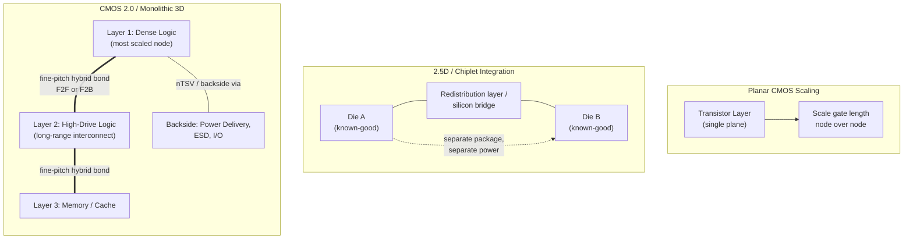
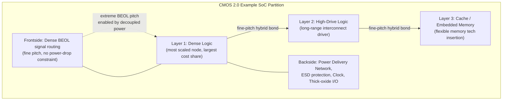

## Monolithic 3D Integration and CMOS 2.0 Convergence Concepts

### Overview

Monolithic 3D (M3D) integration and imec's CMOS 2.0 paradigm represent the frontier response to the slowing of traditional planar CMOS transistor scaling. Rather than continuing to shrink transistors on a single 2D plane, these approaches partition a system-on-chip (SoC) into multiple thin, functionally specialized layers stacked vertically and interconnected at very fine pitch — approaching the interconnect density of native on-chip wiring rather than package-level interconnect. This item covers the conceptual foundation, the enabling process technologies (3D wafer bonding, backside processing, sequential integration), the architectural partitioning strategies CMOS 2.0 enables, and how this differs from conventional chiplet/2.5D approaches.

---

### Historical Context: Why Move Beyond Planar CMOS Scaling

For several decades, the advancement of monolithic systems-on-chip (SoCs) for high-performance computing (HPC) — such as CPUs and GPUs — hinged on the success of CMOS scaling. CMOS offered SoC developers a technology platform that allowed them to integrate more and more functions on one and the same substrate. Even with the evolution toward multi-core architectures, it turned out more efficient to integrate every function on a common substrate than to move data around between different chips, and the SoC's power, performance, area, and cost (PPAC) could be improved just by scaling the transistors and interconnects from one node to another.

As traditional 2D scaling faces diminishing returns, imec proposes a new trajectory: profound evolutions in 3D interconnect technology can now provide layer-to-layer connectivity with the same bandwidth as in traditional monolithic planar SoC configurations, using hybrid wafer-to-wafer bonding and related techniques.

---

### Defining CMOS 2.0

CMOS 2.0 refers to a new paradigm, introduced by imec, that expands the chipmaking toolbox beyond traditional transistor scaling and its associated scaling challenges. CMOS 2.0 allows for more design flexibility by exploiting fine-grain wafer stacking technology to improve on-chip connectivity and offer higher technology heterogeneity to the system. It will result in tailored chips comprising multiple 3D-stacked layers that fulfil smartly partitioned functions, providing advanced, versatile 3D stacked platforms that push the boundaries of compute performance.

#### **Key Points**

- CMOS 2.0 will have the same "look and feel" as classical CMOS platforms, while offering more versatility for system optimization.
- It will leverage existing and new advanced 2.5D and 3D interconnect technologies like dense-pitch Cu hybrid bonding, dielectric bonding, chiplet integration, wafer backside processing, as well as sequential 3D integration that involves heterogeneous layer transfer.
- It will allow high interconnect granularity of the SoC and the high technology heterogeneity offered by system-in-a-package, essentially unlocking the constraints of conventional CMOS.
- It will enable the use of low-capacitance, low-drive transistors to drive short-range interconnects while utilizing high-drive transistors in a separate layer to drive long-range interconnects; new embedded memories could be introduced as a separate layer in the cache hierarchy.

---

### How CMOS 2.0 Differs from Chiplets and 2.5D Integration

This distinction is the conceptual core of the topic and is frequently a point of confusion.

In 2.5D packaging, known-good dies are placed side by side and connected through redistribution layers or silicon bridges. This approach improves I/O density and enables heterogeneous integration, but each die remains a discrete entity, often with its own package and separate power distribution.

CMOS 2.0, by contrast, aims for true wafer-scale stacking, where tiers are bonded face-to-face (or face-to-back) in a monolithic structure and interconnected at a much finer pitch. The result is effectively one large die assembled vertically rather than horizontally. As imec's CEO has put it: "It is no longer enough to scale the transistor. We need to scale the system in all dimensions... By integrating different functions vertically, we can keep improving density and power without only relying on gate-length reductions."

CMOS 2.0 also goes further than conventional chiplet partitioning conceptually. When we are doing CMOS 2.0, it's of course about disaggregating the system, but not necessarily in the traditional way. Traditional chiplet partitioning might take a well-defined block, such as cache, and separate it from the main die — a legitimate use of 3D technology, but CMOS 2.0 goes further: it seeks to disaggregate at the lowest level, where circuits themselves may no longer be complete on a single layer. This requires re-architecting from the ground up, a distinction that also separates CMOS 2.0 from imec's broader framework of heterogeneous large-scale integration (HLSI), which encompasses coarser-grained (chiplet-level) heterogeneous integration.

---

### Core Enabling Technologies

CMOS 2.0 is not a single technology but a convergence of several process innovations that must mature together.

#### **1. Fine-Pitch Hybrid Wafer Bonding**

Dense pitch Cu hybrid bonding (see related topic on sub-micron/sub-200nm pitch scaling) provides the layer-to-layer electrical connectivity dense enough to approximate native on-chip interconnect bandwidth. Published research has demonstrated scaling Cu/SiCN wafer-to-wafer hybrid bonding down to 400nm interconnect pitch, with subsequent work (imec/EVG, 2026) reaching 200nm pitch — this pitch scaling is the direct enabler of fine-grain functional partitioning, since coarser pitch would limit how finely a design could be split across layers without an unacceptable interconnect bottleneck.

#### **2. Backside Power Delivery Network (BSPDN)**

A key architectural feature: part of the active devices is powered from the wafer's backside rather than through conventional frontside power delivery schemes. As such, extreme back-end-of-line (BEOL) pitch patterning will be possible in the tier's frontside without the constraint of voltage drop on the power supplies.

Process mechanics: the device wafer is modified into a very thin front-end-of-line (FEOL) active device layer, with the original "frontside" carrying a dense BEOL signal routing layer stack, and the original "backside" (now the new effective frontside for power/IO) carrying the power supply and external I/O connections. It is also possible to stack multiple such thin device layers with dense interconnects on each side.

Backside power delivery decouples the power delivery network from the signaling metallization scheme in logic ICs, alleviating routing congestion in the BEOL and delivering a power-performance benefit, addressing the rise in power density and aggressive supply-voltage (IR) drop that increasingly constrains system performance.

Demonstrated process flow (imec, via nano-through-silicon-vias/nTSVs landing on buried power rails/BPRs):

1. Epitaxial growth of a Si/SiGe layer stack on a bulk Si substrate, with the SiGe layer serving as an etch-stop for later wafer thinning.
2. Frontside FinFET (or subsequent-node) device fabrication and Cu metal-1 metallization on top of the Si capping layer.
3. Wafer flip and low-temperature wafer-to-wafer bonding of the active frontside to a carrier wafer.
4. Backside thinning down to the SiGe etch-stop layer, followed by SiGe removal.
5. n-TSV patterning and tungsten fill, then backside metallization, connecting backside metal-1 to frontside metal-1 (or to buried power rails).

Electrical validation: wafer thinning and n-TSV processing in the backside did not show any negative impact on the performance of the FinFETs, except for a slight degradation of the pMOS drive current; for nMOS, an even higher mobility and drivability (up to 15 percent) were found after backside processing, and no bias-temperature instability (BTI) degradation was observed, in wafers thinned to final Si thicknesses ranging between 20 and 370nm. [Note: this reflects a specific demonstrated process generation/device node; results may vary across subsequent process iterations and device architectures.]

A further-advanced demonstration connects scaled FinFET devices to both backside and frontside through buried power rails simultaneously — described as a world's first at the time — with n-TSVs implemented at a tight pitch of 200nm without consuming any area of the standard cell, which the associated researchers state ensures further scalability of the technology toward 2nm and beyond. [Unverified: this is a specific technology-scalability claim by the demonstrating team, dependent on subsequent process integration success at those nodes.]

**Performance impact**: combining backside processing with a 2.5D (pillar-like) metal-insulator-metal capacitor (MIMCAP) as a decoupling capacitor boosts capacitance density by a factor of 4 to 5x, allowing further improvement of IR drop — reported at 32.1%/23.5% improvement over no-MIMCAP/2D-MIMCAP counterparts respectively, derived from an IR-drop modeling framework calibrated with experimental data.

#### **3. Sequential 3D Integration**

Distinguished from bonding two independently fabricated device wafers, sequential 3D integration involves building one device layer, then fabricating or transferring a second device layer directly on top (or below) within the same integrated flow — enabling compute-in-memory elements to be added both above and below the transistor layer, and supporting stacking of nMOS on top of pMOS devices (relevant to complementary FET/CFET architectures) using either monolithic or sequential flows, each with distinct process trade-offs.

#### **4. CFETs (Complementary FETs) as a Convergence Point**

CFET device architecture — stacking n-type and p-type transistors vertically within a single cell — represents a device-level analog of the same 3D-stacking philosophy that CMOS 2.0 applies at the system level, and is frequently discussed alongside CMOS 2.0 as a related but distinct scaling vector (transistor-level 3D vs. system-level 3D). [Inference: while both use vertical stacking, CFET is generally treated in the literature as an incremental evolution of the transistor architecture within a single logic layer, whereas CMOS 2.0 is the layer-level system partitioning strategy — the two are complementary rather than identical concepts.]

---

### Example SoC Partitioning Under CMOS 2.0

A representative (illustrative, not universal) partitioning scheme discussed by imec:

- **Dense logic layer**: fabricated using the most advanced/most scaled transistor architecture available; will represent most of the system cost and will still require conventional node-over-node transistor scaling.
- **High-drive logic layer**: optimized for bandwidth and performance, handling longer-range interconnect where low-resistance, high-drive-current transistors are advantageous.
- **Cache/memory layer(s)**: leaving the option to flexibly introduce alternative embedded memory technologies in the longer term as a separate layer in the cache hierarchy.
- **Functional backside**: power delivery, ESD (electrostatic discharge) protection devices, and clock signal distribution — devices that do not scale well, such as thick-oxide I/O, can also be integrated in a separate layer here, physically removed from the most-scaled frontside logic.

On a longer time horizon, one layer could be used to introduce new materials such as 2D materials and new beyond-CMOS logic device concepts more smoothly, since other design constraints have been physically removed to other layers of the SoC. [Inference: this represents imec's stated longer-term research direction rather than a near-term commercial roadmap item.]

---

### Design and EDA Implications

CMOS 2.0 imposes substantial requirements on the design toolchain, since existing commercial 2D design flows are not natively built for true 3D-partitioned systems.

Prior research has attempted to estimate the impact of fine-pitch 3D integration at the block level for different schemes such as middle-of-line (MOL) and local-interconnect-of-line (LOL) approaches under various 3D stacking assumptions — including face-to-face (F2F)/face-to-back (F2B), wafer-to-wafer (W2W), die-to-wafer (D2W) hybrid bonding, or monolithic integration. In these prior approaches, commercial 2D engines are tricked with modified technology files to represent the 3D arrangement of the design; while such approaches can elegantly evaluate some scenarios under certain conditions, they do not represent an expandable foundation for a holistic exploration platform as required for CMOS 2.0 — implying that genuinely native 3D-aware EDA tooling is still an open development area rather than a solved problem. Two implementation-toolchain requirement categories are typically distinguished when targeting CMOS 2.0 technology stacks: modeling/estimation at the block level, and full physical implementation across tiers. [Unverified: specific tool architectures for fully native CMOS 2.0 EDA flows are still emerging in the literature as of this writing and are not yet standardized commercial offerings.]

---

### Ecosystem and Research Coordination

Because CMOS 2.0 requires coordinated advances across materials, process integration, device physics, packaging, and EDA, imec has organized dedicated cross-institutional efforts:

The attraction for the concept of CMOS 2.0 is clear, but the obstacles are equally substantial. Leveraging the benefits in both connectivity and heterogeneous integration enabled by 3D wafer stacking will reshape every stage of design and chip architecture, requiring convergence of expertise, close collaboration, and coordination.

In March 2026, imec launched a first-of-its-kind consortium with 26 European university groups to jointly work on CMOS 2.0, aiming to infuse CMOS 2.0 technology across the entire design stack, from electronic design automation (EDA) all the way to system architecture. The consortium leverages imec's NanoIC pilot line in Leuven, giving PhD students early exposure to next-generation semiconductor logic, memory, and 3D technologies through process design kits (PDKs) — intended to develop system-level thinking typically only encountered later in a research or industrial career, and to bridge academia-to-industry technology transfer.

CMOS 2.0 is described as a key differentiator for realizing next-generation energy-efficient compute systems, expected to impact a wide variety of applications, from general-purpose processors to high-performance AI computing systems and further to embedded AI. [Inference: this breadth-of-applicability claim reflects imec's stated positioning of the paradigm rather than an independently verified market outcome, since CMOS 2.0 remains at the research/pilot-line stage rather than qualified high-volume production as of 2026.]

---

### Related Adjacent Work: Heterogeneous Integration Beyond Digital Logic

While CMOS 2.0 is primarily framed around digital logic/memory SoC partitioning, imec's broader 3D system integration program extends similar bonding and backside-processing techniques to RF and photonic heterogeneous integration — illustrating that the underlying process toolkit (fine-pitch bonding, backside processing, laser-assisted bonding) is being applied across multiple system domains, not solely digital compute:

Imec is evolving its 300mm RF silicon interposer into a system-level platform for heterogeneous integration of III-V chiplets on Si-CMOS, combining high-density embedded capacitors, a scalable modeling framework for passive components (validated up to the sub-THz regime, ~300GHz), and laser-assisted bonding for III-V chiplet assembly — enabling chiplet assembly on a complex, passives-rich stack without compromising thermal budgets or damaging temperature-sensitive components.

---

### Practical Example: Evaluating a "CMOS 2.0" Claim

**Scenario**: A vendor or research paper describes a chip as using "CMOS 2.0" or "monolithic 3D integration."

**Diligence checklist**:

1. **True functional-layer split, or just memory-on-logic?** Genuine CMOS 2.0 in imec's sense involves splitting logic itself (e.g., high-drive vs. high-density logic) across tiers, not merely stacking a memory die on a logic die (which is a more conventional 3D memory-on-logic application already in production, e.g., HBM-on-logic).
2. **Bonding pitch reported?** Since interconnect density is the core enabler, a credible CMOS 2.0-aligned demonstration should report Cu hybrid-bonding pitch (sub-micron territory is generally the relevant regime for fine-grain partitioning) rather than coarser through-silicon-via or microbump pitches typical of conventional 2.5D/3D packaging.
3. **Is backside processing involved?** Backside power delivery and backside I/O are a defining architectural feature of the imec CMOS 2.0 vision; its absence suggests the design is closer to conventional 3D stacking than the full CMOS 2.0 concept.
4. **Production stage**: As of 2026, CMOS 2.0 building blocks (backside power delivery, sub-200nm hybrid bonding, sequential 3D integration) are individually demonstrated at imec and partner labs, but a fully integrated, qualified CMOS 2.0 commercial product has not been reported — claims of "CMOS 2.0 products" should be checked against whether they represent research demonstrations, pilot-line results, or genuine HVM-qualified parts. [Inference based on current publicly available research-stage evidence.]

---

### Summary Assessment

CMOS 2.0 and monolithic 3D integration represent a conceptual shift from scaling the transistor to scaling the system in all dimensions: rather than treating 3D stacking as a way to combine pre-existing, independently designed chiplets (2.5D integration), CMOS 2.0 proposes designing a single logical system from the outset as a set of thin, functionally specialized, densely interconnected layers — enabled by the simultaneous maturation of sub-micron/sub-200nm hybrid bonding pitch, backside power delivery networks, and sequential 3D integration process flows. The approach directly targets known 2D scaling bottlenecks — BEOL routing congestion, IR drop, and the inefficiency of forcing all device types (logic, memory, I/O, ESD) onto a single general-purpose process — by relocating each function to the layer best suited for it. As of 2026, the individual enabling technologies (backside power delivery with nTSVs at 200nm pitch, sub-200nm hybrid bonding, sequential 3D flows) have been separately demonstrated at the research/pilot-line level, and imec has begun building the broader ecosystem (university consortium, PDK access) needed to mature design tools and materials science in parallel; however, [Inference] fully integrated, commercially qualified CMOS 2.0 products remain a multi-year-out objective given the substantial co-design and EDA-tooling obstacles that imec itself identifies as equally significant as the technology's attractions.

---

**Related Topics / Next Steps**

- Sub-micron and sub-200nm hybrid bonding pitch scaling (companion topic — the interconnect enabler)
- Backside power delivery network (BSPDN) process flows and buried power rail (BPR) architectures
- Complementary FET (CFET) device architecture: monolithic vs. sequential integration approaches
- Wafer thinning and nano-TSV (nTSV) fabrication for backside connectivity
- Heterogeneous large-scale integration (HLSI) vs. CMOS 2.0 — imec's broader integration framework
- 3D-aware EDA toolchains and physical design methodologies for multi-tier stacking
- MIM capacitor (MIMCAP) architectures for power delivery decoupling in 3D stacks
- Sequential 3D integration for compute-in-memory architectures
- RF/photonic heterogeneous integration on silicon interposers (III-V chiplet assembly)