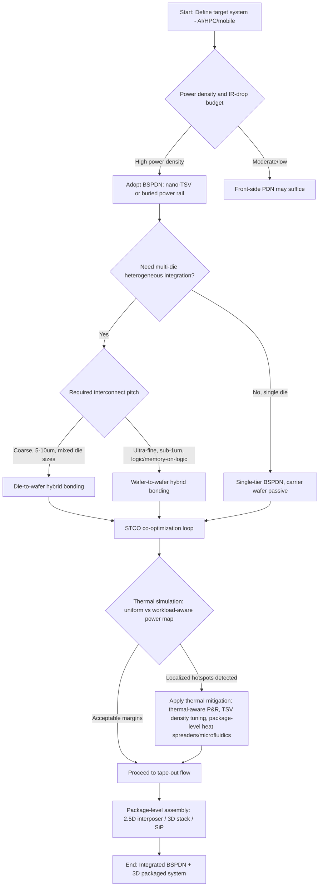

## Convergence of Backside Power Delivery with 3D Packaging Architectures

### Definition and Scope

Backside power delivery network (BSPDN) technology and 3D packaging/heterogeneous integration are two independently developed advanced-node technologies that are now merging into a single co-designed system. BSPDN relocates the power delivery network (PDN) from the traditional front-side back-end-of-line (BEOL) stack to the wafer's backside, connecting to the transistor layer through nano-through-silicon-vias (nano-TSVs) or buried power rails (BPR). 3D packaging (die-to-wafer or wafer-to-wafer hybrid bonding, TSV-based stacking, Foveros-, SoIC-, and CoWoS-class architectures) stacks multiple dies or tiers vertically to increase interconnect density and enable heterogeneous integration.

Historically these were treated as separate roadmap items: BSPDN as a front-end/transistor-level scaling booster, and 3D stacking as a packaging-level integration scheme. Their convergence means that power delivery architecture decisions and 3D stacking topology decisions are no longer independent — the backside of a die is now simultaneously the site of power delivery, the thermal exhaust path, and (in stacked configurations) a bonding interface to another tier. In backside power delivery network processing, the front side of the first wafer is bonded to a carrier wafer, then the backside of that wafer is thinned down and completed with nano-TSV patterning, metal fill, and backside metallization. [Imec](https://www.imec-int.com/en/articles/wafer-wafer-hybrid-bonding-pushing-boundaries-400nm-interconnect-pitch)

### Why the Two Technologies Are Converging

**Physical rationale for BSPDN**

Backside power delivery relocates power to the back of the wafer, leaving only signals to be transmitted through frontside interconnects, so that power is delivered directly and in close proximity to the transistors rather than routed down through 15 layers of BEOL in a resistive, high-impedance waterfall fashion. This directly addresses IR drop and voltage droop: by moving the PDN to the backside, larger and less resistive power interconnects can be used, providing a more stable supply and reducing voltage droop, which allows transistors to run at higher frequencies with less risk of performance degradation. [Semiconductor Engineering](https://semiengineering.com/backside-power-delivery-nears-production/)[Wikipedia](https://en.wikipedia.org/wiki/Backside_power_delivery)

**Physical rationale for 3D stacking**

3D stacking is being introduced at different levels of the electronic system hierarchy, from the package level down to the transistor level, and is a crucial technology to realize multi-chip heterogeneous integration solutions in response to the industry's demand for higher power, performance, area, and cost gains at the system level. [Imec](https://www.imec-int.com/en/articles/wafer-wafer-hybrid-bonding-pushing-boundaries-400nm-interconnect-pitch)

**Where the two intersect physically**

The convergence is not incidental — it is enabled by the same underlying process module: wafer thinning and bonding. Wafer-to-wafer bonding allows for extreme thinning of silicon substrates and the realization of connections through the silicon in the 100nm range; these nano-vias allow direct power delivery to the logic devices from the wafer's backside, freeing up space for wiring on the front side. The same thin-and-bond process flow used to build a BSPDN is structurally identical to the front tier of a face-to-face 3D stack, which is why chipmakers are now designing both simultaneously rather than sequentially. [Imec](https://www.imec-int.com/en/expertise/cmos-advanced/connect/3d-integration)

### Core Enabling Process Flow

The canonical process integration sequence, as demonstrated by imec, is:

1. Grow an epitaxial Si/SiGe stack on a bulk silicon substrate, where the SiGe layer later serves as an etch-stop layer for ending the wafer thinning step. [Imec](https://www.imec-int.com/en/articles/imec-demonstrates-critical-building-blocks-backside-power-delivery-network)
2. Build the front-side active devices (e.g., FinFET or nanosheet transistors) on top of the Si capping layer, completed with Cu metal-1 metallization.
3. Flip the wafer and bond the active front side to a second carrier silicon wafer using a low-temperature wafer-to-wafer bonding technique. [Imec](https://www.imec-int.com/en/articles/imec-demonstrates-critical-building-blocks-backside-power-delivery-network)
4. Thin the backside of the original wafer down to the SiGe etch-stop layer. [Imec](https://www.imec-int.com/en/articles/imec-demonstrates-critical-building-blocks-backside-power-delivery-network)
5. Pattern nano-TSVs (via-last), fill with metal, and build backside metallization layers to form the power distribution network.
6. If further 3D stacking is desired, this backside becomes the new bonding interface for tier-to-tier interconnects, or the carrier wafer itself is replaced with an active device tier (face-to-back or face-to-face stacking).

This is summarized as: part of the BEOL processing — specifically integrating the "fattest" interconnect lines that serve the power delivery — is carried out after the wafer-to-wafer bonding step, on the exposed backside. [Imec](https://www.imec-int.com/en/articles/wafer-wafer-hybrid-bonding-pushing-boundaries-400nm-interconnect-pitch)

### Diagram: BSPDN + 3D Stack Cross-Section (svg_diagram)

<svg xmlns="http://www.w3.org/2000/svg" viewBox="0 0 900 560" font-family="Arial, Helvetica, sans-serif">
<text x="450" y="30" font-size="20" font-weight="bold" text-anchor="middle" fill="#1a1a1a">BSPDN Integrated with 3D Die Stack (svg_diagram)</text>

<rect x="220" y="60" width="460" height="90" fill="#c9e3f7" stroke="#2c6e9e" stroke-width="2" />
<text x="450" y="95" font-size="15" text-anchor="middle" fill="#1a1a1a">Tier 2 Die (e.g., Memory / Chiplet)</text>
<text x="450" y="118" font-size="12" text-anchor="middle" fill="#333">Front-side signal BEOL</text>

<rect x="220" y="150" width="460" height="14" fill="#e0a63c" stroke="#8a5a10" stroke-width="1.5" />
<text x="450" y="178" font-size="12" text-anchor="middle" fill="#5a3d00">Cu/SiCN Hybrid Bond Interface (die-to-wafer or wafer-to-wafer, sub-1µm pitch)</text>

<rect x="220" y="192" width="460" height="50" fill="#f4b6b6" stroke="#a33" stroke-width="2" />
<text x="450" y="222" font-size="13" text-anchor="middle" fill="#5a0000">Backside Power Delivery Network (thick low-R metal)</text>

<rect x="290" y="242" width="14" height="70" fill="#888" stroke="#333" />
<rect x="440" y="242" width="14" height="70" fill="#888" stroke="#333" />
<rect x="590" y="242" width="14" height="70" fill="#888" stroke="#333" />
<text x="450" y="330" font-size="12" text-anchor="middle" fill="#333">nano-TSVs (via-last, ~100nm class)</text>

<rect x="220" y="312" width="460" height="60" fill="#c9e7c9" stroke="#2e7d32" stroke-width="2" />
<text x="450" y="335" font-size="14" text-anchor="middle" fill="#1a1a1a">Tier 1 Die: Transistor Layer (Logic)</text>
<text x="450" y="355" font-size="11" text-anchor="middle" fill="#333">Nanosheet/FinFET, minimal front-side power routing</text>

<rect x="220" y="372" width="460" height="40" fill="#e8e8c0" stroke="#8a8a30" stroke-width="1.5" />
<text x="450" y="397" font-size="12" text-anchor="middle" fill="#333">Front-side signal-only BEOL (freed from power routing)</text>

<rect x="220" y="412" width="460" height="34" fill="#d9d9d9" stroke="#666" stroke-width="1.5" />
<text x="450" y="434" font-size="12" text-anchor="middle" fill="#333">Carrier Wafer / Substrate Interconnect (μbump or hybrid bond to package)</text>

<line x1="120" y1="330" x2="120" y2="90" stroke="#c0392b" stroke-width="3" marker-end="url(#arrow)" />
<text x="60" y="220" font-size="12" fill="#c0392b" transform="rotate(-90 60 220)">Heat flow (constrained)</text>

<line x1="800" y1="450" x2="800" y2="220" stroke="#1565c0" stroke-width="3" marker-end="url(#arrow2)" />
<text x="855" y="330" font-size="12" fill="#1565c0" transform="rotate(-90 855 330)">Power delivery path</text>
</svg>

### Interconnect Pitch Scaling Roadmap

3D bonding pitch scaling directly determines how tightly BSPDN and multi-tier stacking can be co-integrated:

- **Solder-based die-to-wafer bonding**: likely to stagnate at 10 to 5µm bump pitch. [Imec](https://www.imec-int.com/en/press/imec-demonstrates-die-wafer-hybrid-bonding-cu-interconnect-pad-pitch-2mm)
- **Die-to-wafer (D2W) hybrid bonding**: a Cu-to-Cu and SiCN-to-SiCN process achieving a Cu bond pad pitch of 2µm at under 350nm die-to-wafer overlay error, with good electrical yield; future process improvements are expected to push this toward 1µm. The advantage of D2W over W2W: D2W allows stacking only known-good dies, resulting in higher compound yields, and permits bonding dies of unequal size. [Imec](https://www.imec-int.com/en/press/imec-demonstrates-die-wafer-hybrid-bonding-cu-interconnect-pad-pitch-2mm)[Imec](https://www.imec-int.com/en/press/imec-demonstrates-die-wafer-hybrid-bonding-cu-interconnect-pad-pitch-2mm)
- **Wafer-to-wafer (W2W) hybrid bonding**: enables 3D interconnect pitches far below 1µm; recent innovations achieved hybrid Cu & SiCN-to-Cu & SiCN bonding at an unprecedented 400nm pitch. This has since been pushed further: imec and EV Group demonstrated wafer-to-wafer hybrid bonding at 200nm interconnect pitch with record-high overlay accuracy, targeting advanced logic-to-logic and memory-to-logic tier stacking. [Imec](https://www.imec-int.com/en/articles/wafer-wafer-hybrid-bonding-pushing-boundaries-400nm-interconnect-pitch)[Imec](https://www.imec-int.com/en/press/imec-and-ev-group-demonstrate-wafer-wafer-hybrid-bonding-200nm-interconnect-pitch-and-record)
- **Nano-TSVs for BSPDN itself**: Intel's PowerVia implementation uses "Nano-TSVs," which are roughly five-hundred times smaller than typical TSVs, delivering power straight to the M0 layer where processing occurs, rather than routing power through M0, which frees that layer from extra power-routing congestion. [hothardware](https://hothardware.com/news/intel-shows-off-powervia-tech)

$$\text{Pitch scaling order: } P_{solder} \gg P_{D2W} > P_{W2W} > P_{nanoTSV}$$

where $P_{solder} \approx 5$–$10\,\mu m$, $P_{D2W} \approx 1$–$2\,\mu m$, $P_{W2W} \approx 0.2$–$0.4\,\mu m$, and nano-TSV diameters are sub-100nm class.

### Architectural Configurations for BSPDN + 3D Integration

**1. Single-tier BSPDN (baseline, non-3D)**

Standard planar logic die with power moved to backside via nano-TSVs; carrier wafer is passive (removed or retained as mechanical support). This is the configuration TSMC and Intel are bringing to high-volume manufacturing first.

**2. BSPDN as the bonding interface tier (face-to-back 3D)**

The backside of the bottom logic tier (already carrying the PDN) becomes the mechanical/electrical interface to a package substrate or interposer, while a second compute or memory tier is bonded face-to-face on the front side. This lets the BSPDN of the bottom die also serve system-level power delivery into the stack.

**3. BSPDN with true multi-tier stacking (logic-on-logic / memory-on-logic)**

Wafer-to-wafer hybrid bonding is best suited to provide the interconnect pitches and densities required for memory/logic-on-logic tier stacking in a "CMOS 2.0" context, since bonded Cu pads offer short, direct, low-resistive connections from one tier to the other, deliver high bandwidth density, and reduce energy per bit during signal transmission. In this configuration each tier can, in principle, have its own BSPDN, requiring careful co-design of via alignment across bonded interfaces. [Imec](https://www.imec-int.com/en/articles/path-high-density-front-and-backside-wafer-connectivity)

**4. Package/system-level extension (2.5D + BSPDN chiplets)**

BSPDN-equipped chiplets are assembled onto interposers or bridges in 2.5D configurations, combining backside power efficiency at the die level with heterogeneous chiplet integration at the package level — the domain where system-technology co-optimization (STCO) becomes decision-critical (see below).

### System-Technology Co-Optimization (STCO) as the Design Framework

The convergence has elevated STCO from a nice-to-have to a structural requirement. Advanced packages already exceed tens of millions of pins with trajectories pointing toward hundreds of millions, a scale at which no design team can fully comprehend the system through traditional spreadsheets or point tools; design complexity has fundamentally shifted to system-level orchestration. STCO addresses this by incorporating packaging architectures, die-to-die interconnects, power delivery networks, thermal paths, and mechanical reliability into a single unified optimization loop, which is expected to become a foundational requirement for achieving performance, yield, and reliability targets in next-generation AI and HPC systems as chiplet-based architectures scale. [EDN](https://www.edn.com/six-critical-trends-reshaping-3d-ic-design-in-2026/)[EDN](https://www.edn.com/six-critical-trends-reshaping-3d-ic-design-in-2026/)

Concretely, this means BSPDN via placement, tier bonding topology, and thermal via/heat-spreader placement can no longer be optimized in separate tool flows — a change in one directly perturbs IR drop, thermal resistance, and mechanical stress budgets in the others.

### Thermal Management: The Central Trade-off

This is the most significant *negative* consequence of the convergence and the subject of intense recent research.

**Mechanism of the problem**

Backside power delivery does not solve thermal problems and may exacerbate them; thermal management is already a difficult problem and is likely to become even more challenging as backside power changes the whole thermal picture. Heat can more easily escape from the bottom of the chip rather than the top under BSPDN, meaning chips with backside power effectively need to be flipped for mounting, and backside power delivery also enables tighter packaging, which compounds density-driven heat concerns. [semiengineering](https://semiengineering.com/backside-power-delivery-adds-new-thermal-concerns)[semiengineering](https://semiengineering.com/backside-power-delivery-adds-new-thermal-concerns)

Detailed simulation work has quantified the bottleneck: thermal conduction bottlenecks are inherent to BSPDN systems, spanning from the chip level to the package level, and include thermal bottlenecks in the BEOL, reduced heat-spreading efficiency after wafer thinning, and vertical thermal resistance introduced by buried power rails and nano-TSVs. [Substack](https://tspasemiconductor.substack.com/p/the-thermal-frontier-of-bspdn-iitc)

**Non-uniform workload effects in 3D stacks**

A key 2025 finding directly relevant to the convergence: using high-resolution thermal simulations with non-uniform power maps at resolutions down to 5µm, uniform power assumptions substantially underestimate peak temperatures and fail to reveal critical thermal differences between BSPDN and frontside PDN (FSPDN) configurations in 3D scenarios; BSPDN configurations in 3D, although beneficial under simplified uniform assumptions, exhibit pronounced thermal penalties under realistic, localized workloads due to limited lateral heat spreading. [arxiv](https://arxiv.org/pdf/2508.02284v1)

**Design mitigations under active development**

- Thermal-aware place-and-route: designers must make place-and-route more thermal-aware and manage heat dissipation given less shielding and thinner substrates in BSPDN designs. [semiengineering](https://semiengineering.com/backside-power-delivery-adds-new-thermal-concerns)
- Package-level thermal solutions: TSMC has unveiled advanced thermal management solutions specifically to address the challenges posed by high-power-density chips using BSPDN. [Substack](https://tspasemiconductor.substack.com/p/the-thermal-frontier-of-bspdn-iitc)
- Emerging material/structural approaches (industry-wide, not BSPDN-specific but converging with it): high-thermal-conductivity via fills, optimized TSV density, and multi-layer thermal redistribution layers, alongside microfluidic cooling integrated directly into the 3D stack.

[Inference] Because BSPDN removes the option of using the frontside BEOL stack as a lateral heat-spreading path (it now carries only signal wiring with much thinner cross-section), and because thinned wafers reduce bulk-silicon heat capacity, the combination of BSPDN with dense 3D die stacking likely compounds — rather than merely adds — thermal risk in workload hotspot regions. This inference follows from the cited mechanisms but the precise magnitude is workload- and stack-dependent and not fixed by any single publication.

### Power Integrity and Electrical Considerations in Stacked BSPDN

TSVs act as vertical power conduits in 3D ICs but can introduce voltage drops, electromigration, and power noise; layout optimization — particularly uniform TSV distribution and integration of backside power delivery networks — helps reduce power delivery path length and mitigate voltage loss. [jeit](https://jeit.ac.cn/en/article/doi/10.11999/JEIT250377)

Design-methodology work specific to BSPDN also now must account for clock distribution sharing the backside routing resource, as reflected in dedicated research on back-side design methodology for power delivery network and clock routing. [arxiv](https://arxiv.org/pdf/2411.00309)

### Standard Cell and Shielding Impact

Moving power to the backside changes what used to be a straightforward shielding assumption:

Since the backside becomes the new "frontside," signals now run internally in the chip, further from this new frontside, so shielding effectiveness is not necessarily reduced — frontside metal lines can still exist for reference voltage and shielding purposes, but they no longer carry the bulk power delivered to devices. Some design concepts go further: each standard cell can be connected to the backside power grid via TSVs directly, a configuration under active exploration at Fraunhofer IIS. [semiengineering](https://semiengineering.com/backside-power-delivery-adds-new-thermal-concerns)[semiengineering](https://semiengineering.com/backside-power-delivery-adds-new-thermal-concerns)

### Industry Roadmap and Production Timing

| Company | Technology Name | Node | Status/Timing |
| --- | --- | --- | --- |
| Intel | PowerVia | 18A | Currently ramping yield at 18A with PowerVia. |
| TSMC | Super Power Rail | N16 (HPC) | Expected to implement Super Power Rail for HPC applications at N16 in 2026. |
| TSMC | Super Power Rail | A16 | A16 claims 10% higher clock speed or 15–20% lower power vs. N2P, plus up to 10% higher chip density, alleviating IR drop and simplifying power distribution while allowing tighter chip packaging; mass production targeted for 2027. |
| Samsung | BPDN | 1.4nm-class | Samsung aims to apply backside power delivery to its 1.4nm process by 2027, focusing on reducing wafer area consumption and improving power transmission; Samsung has not yet disclosed a firm production timeline as of some reporting. |
| ARM (test chips) | — | — | ARM test chips with backside power delivery demonstrated 19% die shrink and 10% more performance. |

[Unverified] Exact production ramp dates are subject to change and should be cross-checked against each vendor's most current roadmap disclosures at the time of reference, as foundry timelines for leading-edge nodes have historically shifted.

### Broader Technology Trends Reinforcing This Convergence

Recent industry analysis frames BSPDN + 3D stacking as one of several converging vectors rather than an isolated development: as thermal-compression bonds reach their integration limits, hybrid bonds will drive the 3D interconnect pitch to 1µm and below, and AI/HPC suppliers are increasingly considering wafer- and panel-level architectures to place more compute closer together, with foundries pursuing more modular wafer-scale strategies alongside material innovation. [EDN](https://www.edn.com/six-critical-trends-reshaping-3d-ic-design-in-2026/)

Looking further ahead, research is exploring even deeper integration of backside processing with 3D stacking at the transistor level itself, exemplified by work on "Flip 3D Integration" (F3D), aimed at maximizing the scaling potential of using both sides of the wafer beyond conventional 3D integration approaches. [arxiv](https://arxiv.org/pdf/2411.00309)

Additional convergent vectors identified in current hybrid-bonding literature include: integration of microfluidic cooling channels directly into stacked structures, adoption of glass substrates for system-on-wafer packaging, and co-packaged optics for high-bandwidth communication — all layered on top of the ongoing push to reduce bond pitch below 1µm and to explore barrier-less metals or novel dielectrics for lower thermal budgets and higher reliability. However, vertical integration of this kind complicates power delivery and thermal management simultaneously, meaning design tools must support multi-die co-optimization while standards for hybrid-bond IP and design rules are still evolving. [Wevolver](https://www.wevolver.com/article/hybrid-bonding-enabling-high-density-3d-integration-for-next-generation-electronics)[Wevolver](https://www.wevolver.com/article/hybrid-bonding-enabling-high-density-3d-integration-for-next-generation-electronics)

Optical interconnects are also converging onto the same bonded-wafer platform: high-precision die-to-wafer bonding processes are seen as a key enabler for wafer-level optical interconnects, imec's long-term vision for high-bandwidth, low-power connectivity, with a first proof-of-concept optical interconnect demonstrated at ECTC2024. The capability enabling backside connectivity, though initially targeted at power connections, also opens the possibility for fine-grain signal connectivity to migrate to the backside as well. [Imec](https://www.imec-int.com/en/press/imec-demonstrates-die-wafer-hybrid-bonding-cu-interconnect-pad-pitch-2mm)[Imec](https://www.imec-int.com/en/articles/path-high-density-front-and-backside-wafer-connectivity)

### Mermaid Diagram: Convergence Decision Flow for BSPDN + 3D Stacking

### Key Points

- BSPDN and 3D packaging converge because both rely on the identical enabling process module: wafer thinning plus low-temperature wafer bonding, making them co-designed rather than independently optimized.
- Hybrid bonding pitch scaling (solder → D2W → W2W → nano-TSV) is the shared technology curve underlying both the density of 3D stacking and the granularity of backside power access.
- STCO has become mandatory rather than optional at this integration scale, since power, thermal, mechanical, and interconnect domains are now physically co-located and interdependent.
- Thermal management is the primary unresolved trade-off: BSPDN's electrical benefits (lower IR drop, higher frequency headroom) come with reduced lateral heat-spreading capability, which is compounded — not simply added — when combined with dense 3D stacking under realistic, non-uniform workloads.
- Production timelines (Intel 18A/PowerVia, TSMC N16/A16 Super Power Rail, Samsung 1.4nm BPDN) show the industry converging on backside power at leading-edge nodes within the 2025–2027 window, with 3D stacking co-integration following closely behind.

### Related Topics

- Nano-TSV fabrication processes and via-last vs. via-middle vs. via-first integration schemes
- Cu/SiCN hybrid bonding surface preparation, cleanliness, and die-thinning-induced defect mitigation
- System-Technology Co-Optimization (STCO) methodologies and EDA tooling for multi-die pin-count systems
- Thermal-aware place-and-route flows for backside power delivery designs
- Buried power rail (BPR) vs. nano-TSV BSPDN architecture comparison
- CFET (complementary FET) integration with backside contacts and dielectric isolation
- Microfluidic cooling channel integration in 3D-stacked systems-in-package
- Co-packaged optics and wafer-level optical interconnects on hybrid-bonded platforms
- Glass substrate adoption for system-on-wafer packaging
- Power integrity modeling: electromigration and voltage-drop analysis in TSV-based 3D PDNs