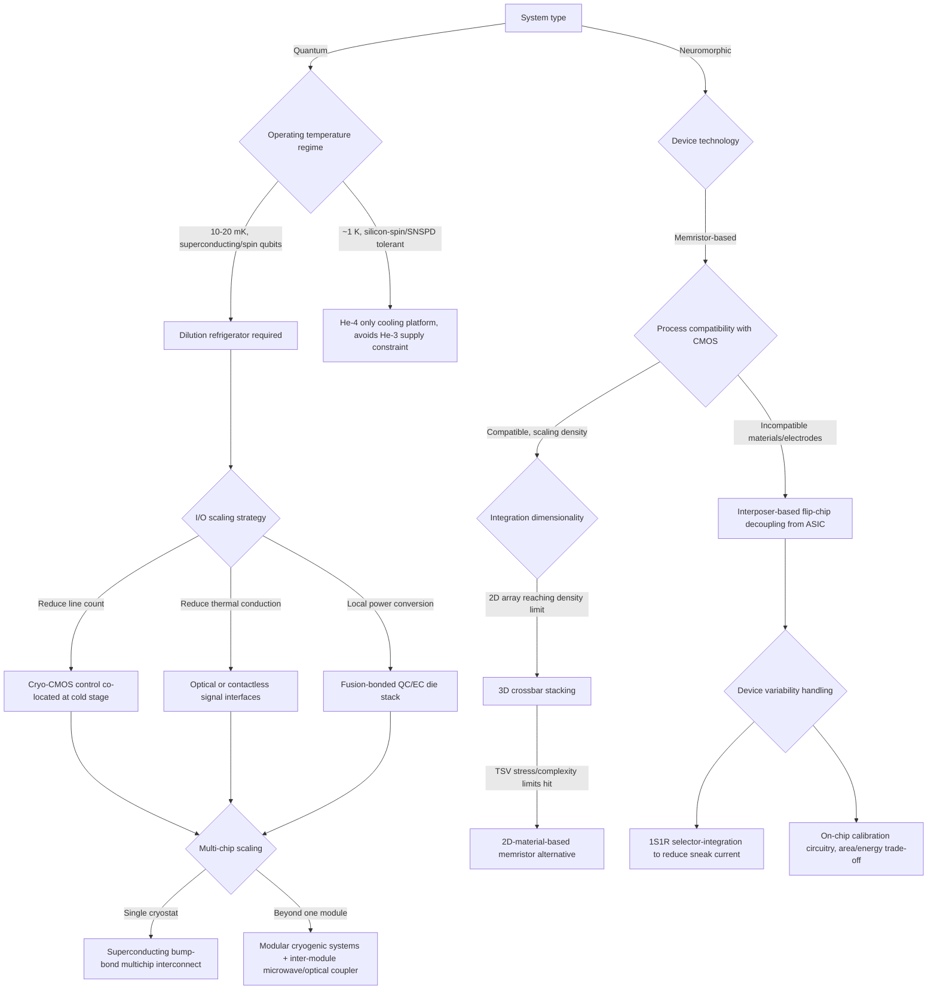

## Packaging Challenges for Neuromorphic and Quantum Computing Systems

### Definition and Scope

Neuromorphic and quantum computing systems both diverge sharply from conventional CMOS logic packaging assumptions, but for different underlying physical reasons. Neuromorphic systems (memristor crossbar arrays, spiking neural network chips, compute-in-memory architectures) demand packaging that supports dense, heterogeneous integration of non-standard materials with conventional CMOS, while tolerating device-to-device variability. Quantum computing systems (superconducting qubits, spin qubits, trapped ions, photonic qubits) demand packaging that operates reliably at millikelvin temperatures, delivers thousands of high-fidelity signal and control lines into an extremely thermally constrained environment, and preserves quantum coherence against vibration, electromagnetic interference, and thermal noise. This entry treats each system's packaging constraints separately, then identifies shared cross-cutting themes (I/O scaling, heterogeneous 3D integration, and system-level co-design) relevant to advanced packaging engineers working across both domains.

### Part I: Quantum Computing Packaging Challenges

#### Core Constraint: The Cryogenic Environment

Superconducting and spin-qubit modalities require the qubits to be kept at extremely low temperatures to function correctly, while control electronics — which conventionally operate at room temperature — generate heat that must be kept from reaching the cold stage, making minimization of thermal load on the cryogenic system a central packaging objective. Dilution refrigerators operate at 10–20 millikelvin, and every watt dissipated at the coldest stage requires orders-of-magnitude more power to extract at room temperature, making passive thermal loads (from materials like stainless steel and NbTi coaxial cabling) and active loads (from signal dissipation in attenuators) the foundational engineering constraint of the entire system.

#### The I/O Wiring Wall

As qubit counts scale, the number of physical control and readout lines threading from room temperature down to the millikelvin stage becomes the dominant scaling bottleneck — commonly termed the "I/O wiring wall." Cryo-CMOS is currently viewed as the leading engineering approach to controlling more than 10,000 qubits without exhausting the I/O wiring budget, though alternative approaches — including single-flux-quantum (SFQ) digital logic and optical interconnects — are under active investigation. Demonstrated progress along this front includes SEEQC's single-flux-quantum digital logic at 4K achieving over 99.9% gate fidelity, and SemiQon's cryo-CMOS transistors reaching a record 0.3 mV/dec sub-threshold swing at 420mK. When cryo-CMOS reaches production maturity, the cryostat's functional role shifts from being a bridge between room temperature and millikelvin stages to acting as a thermal enclosure for a co-integrated quantum-classical chip, simplifying the signal chain considerably.

#### Cryogenic Packaging and Interconnect Requirements

Specialized packaging solutions are required for electronics operating at cryogenic temperatures to address thermal contraction, material compatibility, and signal integrity challenges; these solutions include hermetically sealed packages, specialized substrate materials, and thermal isolation techniques. Advanced interconnect approaches feature superconducting wires and specialized solder materials that remain reliable at extreme cold, along with thermal gradient management techniques between cryogenic components and room-temperature interfaces.

**Vibration and electromagnetic isolation**

Beyond thermal management, packaging must isolate qubits from external vibrations and electromagnetic interference, since any disturbance can induce decoherence, negating the quantum properties the system depends on; advanced shielding materials and mechanical designs to prevent such interference are a major research focus.

**Signal integrity across extreme temperature gradients**

Interconnects — the pathways connecting qubits to external control electronics — must carry high-fidelity signals while remaining compatible with cryogenic operation, requiring meticulous design to prevent signal loss and distortion across the gradient from millikelvin to room temperature.

#### Power Delivery into the Cold Stage

Getting power into a dilution refrigerator without introducing unacceptable thermal load is an active area of packaging innovation, with at least two distinct architectural philosophies emerging from industry patent activity:

- **Optical-signal cryostat interfaces**: an architecture using an external control module communicating with an internal cryogenic control module via optical transmission lines instead of electrically conductive lines, since optical lines do not conduct heat into the cold volume the way metal conductors do.
- **On-die power conversion**: an architecture focusing on power conversion performed locally within the cryogenic chamber itself, where the quantum-circuit die and electronic-circuit die are fusion bonded to minimize interconnect parasitics while keeping power conversion local to the point of use.

#### Multichip and Modular Cryogenic Packaging

Scaling beyond a single chip within one cryostat requires multichip interconnect solutions that preserve superconductivity end-to-end. One industry initiative is specifically focused on advanced cryogenic packaging aimed at scaling both gate-model and annealing quantum processor development, expanding multichip packaging capabilities, equipment, and processes, and building on fully superconducting interconnects with no interruptions in superconductivity from on-chip circuitry all the way through to external control wiring; this work has leveraged a national-laboratory superconducting bump-bond process to demonstrate end-to-end superconducting interconnect between chips, viewed as a foundation for scaling both annealing and fluxonium-based gate-model architectures via scalable control and interconnectivity in multichip quantum processor packages.

At the system level, modular cryogenic architecture is emerging as a response to the recognition that refrigeration capacity, alongside packaging, is the gating input for fault-tolerant quantum computing. A recent demonstration joined and cooled two modular cryogenic systems into a single operating environment for the first time — cooling to 4 kelvin in under 5 days, with each module offering substantially more internal wiring space than prior widely deployed systems — as a physical milestone toward a large-scale fault-tolerant target system. Roadmap specifics for that program include installing next-generation processors into the modules and linking multiple processors to reach at least 1,000 programmable qubits, alongside the requirement that multiple custom control ASICs converge so that total system power consumption (targeted at up to several megawatts) remains manageable.

#### Inter-Module Quantum Interconnect

As systems scale beyond a single cryostat's module, connecting separate quantum processing modules while preserving quantum state fidelity becomes its own packaging discipline. One inter-module coupler approach is designed to connect quantum processors located physically apart from one another; a 2025 experimental demonstration transferred quantum states between separate modules over a microwave connection approximately 60cm long, achieving a state-transfer fidelity around 98.8% and a remote two-qubit gate fidelity around 93.3% for a single operation performed across the two modules. [Unverified] These fidelity figures represent a specific experimental demonstration at a specific link length and should not be generalized to all inter-module coupling schemes or distances without checking the originating publication's exact conditions.

#### Contactless and Terahertz Control Interfaces

Reducing the number of physical conductive lines into the cold stage remains a priority; one contactless communication approach consumes up to ten times less power than metal-cable-based systems, though a key open challenge with such approaches is that photon energy at terahertz frequencies is close to room-temperature thermal energy, complicating noise rejection.

#### Helium-3 Supply Constraint

A materials-supply-chain packaging consideration specific to dilution refrigeration: some next-generation cooling platforms are explicitly designed to operate at approximately 1 kelvin using helium-4 only rather than the conventional 10–20 millikelvin regime requiring helium-3, eliminating dependence on what is described as the most strategically constrained input in the quantum hardware supply chain — relevant for modalities (such as certain silicon-spin and superconducting-nanowire single-photon detector workloads) that can tolerate the higher operating temperature.

### Part II: Neuromorphic Computing Packaging Challenges

#### Core Constraint: Heterogeneous Material and Device Integration

Unlike quantum packaging, whose central constraint is thermal/cryogenic, neuromorphic packaging's central constraint is heterogeneous materials integration: memristor-based synaptic devices frequently require materials and process steps that are non-standard for conventional CMOS foundries — for example, some memristor types require inert metal electrodes and specific oxide stoichiometries not native to standard CMOS flows. This drives a packaging-level, rather than monolithic, integration strategy.

#### Interposer-Based Decoupling Strategy

A prominent packaging approach decouples the memristor array from the CMOS ASIC entirely, placing memristors on a separate interposer die and connecting the two via flip-chip packaging rather than co-fabricating them on a single chip. This decoupling exists specifically so unconventional memristor materials and processes can be used on the interposer without compromising or constraining the ASIC's process. Reported advantages of this heterogeneous ASIC-memristor packaging strategy include:

- Avoiding the alignment/contact-matching difficulty inherent in having one foundry attach memristors onto a chip supplied by a different foundry.
- Simplifying and optimizing fabrication by using well-proven flip-chip packaging techniques instead of novel single-chip co-fabrication.
- Enabling independent re-use: either the memristor interposer or the ASIC can be reused in a different pairing, whereas in a monolithic single-chip ASIC-memristor integration neither component can be repurposed independently.

[Inference] The trade-off implied by this decoupled approach is added interconnect parasitics and packaging cost relative to a monolithic solution, though the source material frames this primarily as a fabrication-flexibility benefit rather than quantifying the interconnect penalty, so the magnitude of that trade-off is not established by the cited material.

#### Device Variability as a Packaging-Adjacent Yield Problem

Memristor variability is a major barrier to packaging at scale: neuromorphic computation is often considered inherently resilient to hardware defects, but this resilience does not eliminate variability costs — if each device performs slightly differently and characteristics vary over time, programming each device to a desired state becomes an individualized task, which is infeasible for training large matrices containing billions of devices due to the time, energy, and chip real estate consumed by supporting calibration circuitry. High-density integration and mass production are described as blocked until this variability problem is resolved, which is itself a difficult undertaking.

#### 3D Integration for Density Scaling

As memristor crossbar array kernel counts and interconnections scale, traditional two-dimensional array architectures face density and routing-efficiency limits, motivating exploration of more compact three-dimensional integration schemes; researchers have extended 2D array designs into 3D configurations by densely integrating multiple kernels within a single 3D memristor array, demonstrating high-density convolutional neural network computation under spatial constraints.

However, wafer-based 3D integration approaches for memristors face their own packaging-level limitations: approaches like through-silicon vias face critical limitations in stacking density, mechanical stress, and fabrication complexity when applied to memristor 3D integration, which has motivated exploration of two-dimensional (2D) material-based memristors as an alternative, since their atomically thin structure offers a compelling path around wafer-based TSV constraints.

#### Sneak-Path Current and Peripheral Circuit Integration

Two-dimensional memristor crossbar arrays specifically encounter limited array size, high sneak-path current, and a lack of integration with peripheral circuits needed for compute-in-memory hardware. A demonstrated mitigation packages 2D memristor arrays alongside silicon selector transistors in a heterogeneously integrated one-selector-one-memristor (1S1R) configuration, which mitigates sneak current; a 32×32 array of this type achieved an 89% yield, alongside integration with peripheral control-sensing circuitry.

#### System-Level Heterogeneous Integration for Edge Neuromorphic SoCs

At the system-on-chip level, neuromorphic packaging must also reconcile multiple dedicated computing cores of different types on a single package to achieve multifunctionality for edge deployment. One demonstrated architecture integrates a general-purpose RISC-V CPU together with a dedicated neuromorphic processor in a heterogeneous SoC, addressing the packaging/architecture-level challenge of establishing efficient coupling between heterogeneous cores and improving on-chip communication efficiency, which prior single-core neuromorphic chip designs had struggled with due to their monofunctional nature.

### Comparative Packaging Constraint Table

| Dimension | Quantum Computing | Neuromorphic Computing |
| --- | --- | --- |
| Primary environmental constraint | Millikelvin cryogenic operation; thermal budget is the limiting resource | Room-temperature operation; materials/process compatibility is the limiting resource |
| Dominant scaling bottleneck | I/O wiring wall (control/readout line count into cold stage) | Device variability and sneak-path current at array scale |
| Preferred integration strategy | Co-located cryo-CMOS control, fusion-bonded QC/EC die stacks, superconducting bump bonds | Interposer-based flip-chip decoupling of memristor array from CMOS ASIC |
| 3D integration approach | Modular cryostats with inter-module microwave/optical coupling | 3D memristor crossbar stacking; 2D-material alternatives to TSV-based stacking |
| Key failure mode being engineered around | Decoherence from vibration, EMI, and thermal noise | Non-ideal device characteristics, sneak-path current, weight-programming variability |
| Representative near-term milestone | ~1,000 programmable qubits via multi-module linkage (target 2027) | High-yield (~89%) 1S1R heterogeneous arrays at 32×32 scale |

### Cross-Cutting Themes for Advanced Packaging

**System-as-the-product framing**

In both domains, packaging has become inseparable from system architecture rather than a downstream afterthought. In quantum systems, cryogenic equipment, high-density wiring, microwave/RF components, control electronics, packaging, and processor interconnects must all be designed to operate together as a single integrated system, and the ability to design and integrate the chip together with its surrounding infrastructure is becoming a competitive differentiator in the industry. The equivalent principle holds in neuromorphic systems: the hierarchical architecture from the top-level application algorithm down to the underlying device is intrinsically linked and must be co-optimized rather than designed in isolation.

**Heterogeneous integration as the shared enabling strategy**

Both domains converge on heterogeneous, multi-die packaging (rather than monolithic single-die fabrication) as the practical path forward: quantum systems fusion-bond quantum-circuit and electronic-circuit dies to co-locate power conversion near the point of use, while neuromorphic systems flip-chip bond memristor interposers to CMOS ASICs to decouple incompatible process requirements. In both cases, the packaging-level heterogeneous integration exists specifically because monolithic co-fabrication of the two component types is currently impractical or yield-limiting.

**Fundamentally different I/O philosophies**

Quantum packaging is fighting to reduce the number and thermal cost of I/O lines penetrating an extreme cryogenic boundary; neuromorphic packaging is fighting to reduce the calibration and support-circuitry overhead per array element at room temperature. These are not analogous problems, and cross-applying a solution architecture from one domain to the other requires care — for example, cryo-CMOS control strategies solve a thermal-budget problem that has no direct equivalent in neuromorphic packaging design.

### Mermaid Diagram: Packaging Decision Trees for Neuromorphic vs. Quantum Systems

### Key Points

- Quantum computing packaging is dominated by the thermal budget of the millikelvin cryogenic environment and the "I/O wiring wall" limiting how many control/readout lines can reach the cold stage without unacceptable heat load.
- Cryo-CMOS, on-die power conversion, optical/contactless control interfaces, and superconducting multichip bump-bonding are the leading engineering responses to the quantum I/O and thermal constraints.
- Modular cryogenic system architecture and inter-module quantum-state coupling (with measured but link-specific fidelities) represent the current frontier for scaling beyond single-cryostat qubit counts.
- Neuromorphic packaging is dominated by heterogeneous materials integration — memristor devices frequently require non-CMOS-compatible materials, driving interposer-based flip-chip decoupling from the CMOS ASIC rather than monolithic co-fabrication.
- Device-to-device variability and sneak-path current, not thermal budget, are the primary yield- and density-limiting factors in memristor-based neuromorphic packaging; 3D crossbar stacking and 2D-material alternatives to TSV-based stacking are active mitigation strategies.
- Despite very different root causes, both domains have converged on the same high-level strategy — treating packaging as inseparable from system architecture and relying on heterogeneous, multi-die integration rather than monolithic fabrication.

### Related Topics

- Cryo-CMOS control ASIC design for large-scale qubit arrays
- Superconducting bump-bond and fusion-bonding processes for quantum multichip modules
- Dilution refrigerator scaling limits and modular cryostat architecture
- Helium-3 supply chain constraints in quantum hardware manufacturing
- Terahertz and optical contactless interconnects for cryogenic control
- Inter-module quantum state transfer and remote entangling gate fidelity
- Memristor crossbar array variability compensation and calibration circuitry
- 2D material (TMD/vdW heterostructure) memristors as TSV-stacking alternatives
- Compute-in-memory heterogeneous integration with silicon selector transistors
- System-technology co-optimization (STCO) applied to non-CMOS computing paradigms