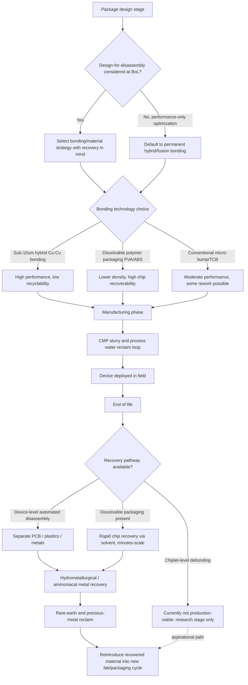

## Sustainability, Recyclability, and Circular-Economy Considerations

### Definition and Scope

This topic addresses the environmental lifecycle of advanced semiconductor packaging: resource consumption during manufacturing, energy and water use, end-of-life material recovery, and the structural tension between packaging technologies that improve system performance (denser interconnects, permanent bonding) and packaging technologies that support a circular economy (reversible bonding, easy disassembly, material separability). Advanced packaging is simultaneously a *driver* of sustainability challenges — increasing structural and process complexity — and a potential *site of solutions*, through design-for-disassembly, closed-loop material recovery, and process-level resource efficiency. Advanced packaging increases emissions and yield challenges industry-wide, which is precisely why sustainability quantification tools are becoming necessary to manage rising environmental risk alongside continued packaging growth.

### The Core Tension: Performance-Optimized Bonding vs. Circularity

**Why advanced packaging makes recycling harder**

The dominant trend in advanced packaging — chiplet-based architectures using hybrid bonding — is architecturally opposed to disassembly. Hybrid bonding enables direct copper-to-copper (Cu-Cu) and dielectric-to-dielectric interfaces between dies or chiplets at sub-10µm pitches, which dramatically increases interconnect density while reducing parasitic resistance, capacitance, and interconnect latency compared to conventional micro-bump and thermo-compression bonding methods. This is precisely why it is being adopted industry-wide for performance reasons — and precisely why it is a circularity problem: hybrid-bonded and fusion-bonded interfaces are, in current production processes, permanent.

A widely cited framing of this problem describes the ideal of "silicon recycling" — an imagined cycle of *package, deploy, disintegrate, repeat*, where chiplets are harvested from old computers and remixed into new products, analogous to how a couch or a toaster might be built with debondable adhesives to ease end-of-life recycling. In conventional multi-chip module (MCM) packaging, chiplets are attached to a silicon interposer at fine bump pitch, and in an idealized "silicon recycling" world, that bonding process would be reversible — heat, lasers, a solvent, or some combination would let chiplets separate from the interposer undamaged, ready to be rebonded into a new product, so that end-of-life recyclers could recover not just precious metals from the case, PCB, and screen, but also debond the MCM's individual chiplets for resale on a second-hand silicon marketplace, potentially routing them into a next-generation device or a downmarket product. The blunt assessment of where the technology actually stands today: reversible packaging of this kind is currently science fiction — in real-world practice, bonding is irreversible, and there is no way to safely disassemble an MCM and recover working chiplets.

[Unverified] The "silicon recycling" framing above is a conceptual/illustrative vision from a single commentator rather than an established industry roadmap; it is useful for understanding the scale of the disassembly problem but should not be read as a near-term production capability.

### Design-for-Disassembly Approaches

Given that hybrid/fusion bonding is not currently reversible at the chiplet level, most practical circularity work in electronics packaging targets material recovery at coarser levels of the assembly, or explores genuinely dissolvable packaging materials as an alternative paradigm entirely.

**Dissolvable packaging materials**

One demonstrated approach uses additively manufactured, dissolvable packaging materials specifically to recover commercial-off-the-shelf (COTS) chips from used electronics, aiming to alleviate supply-chain stress, reduce the need to manufacture replacement chips, and minimize environmental impact. Two candidate dissolvable materials evaluated were polyvinyl alcohol (PVA) and acrylonitrile butadiene styrene (ABS); under optimized dissolving conditions, chip recovery was achieved in under 11 minutes for PVA and under 2 minutes for ABS, with the approach intended to match conventional packaging performance while adding recoverable/recyclable functionality — addressing a gap the author identifies in sustainable IC packaging research generally, noting that sustainable materials for electronics broadly have been studied, but sustainable IC packaging specifically had remained comparatively unexplored.

**Design practices for materials recovery**

A broader design methodology distinction is emphasized in current literature: recovery and recycling outcomes are heavily shaped by decisions made at the beginning-of-life (BoL) design stage, not just end-of-life (EoL) processing — design-for-recycling and design-for-disassembly practices, if incorporated during design, can substantially enhance materials recovery, whereas neglecting these considerations at BoL commonly makes EoL recovery more difficult and costly.

**Automated disassembly at the device level**

Since chiplet-level debonding remains impractical, some recyclers instead automate disassembly at the device/board level. One recycling technology company originally intended to use its semiconductor packaging and testing background to refurbish and resell individual chips, but found that the material actually available in the waste stream was intact devices rather than loose chips; this led it to develop automated disassembly and chip-removal robotics that separate electronics into PCBs, plastics, and metal components as a practical intermediate step. A related driver noted in this space: large CPU manufacturers are often reluctant to restart production of discontinued chip models, which leaves usable laptops stranded without a viable CPU replacement — creating both an economic incentive and a use case for harvested-chip supply chains, particularly relevant to lower-cost electronics markets.

### Material Recovery from Fabrication and End-of-Life Streams

**Process-level closed loops during manufacturing**

Circular-economy practices extend upstream into the fab itself. In wafer fabrication, chemical mechanical polishing (CMP) generates substantial slurry waste containing cerium and other compounds; advanced filtration systems are increasingly deployed to reclaim these materials for reuse, cutting freshwater consumption and lowering disposal costs. At the largest foundry scale, water recycling programs treat and return millions of tons of process water annually, demonstrating closed-loop resource systems operating at high-volume manufacturing scale.

**Rare-earth and precious-metal recovery**

Circular economy practices in the broader semiconductor industry focus on closing material loops, with silicon recycling playing a key role in enabling reuse of valuable materials and reducing dependence on virgin resource extraction. For rare-earth elements specifically — relevant to magnets and certain packaging/interconnect materials — hydrometallurgical recovery methods have been developed, including selective leaching approaches using hydrochloric acid to dissolve magnet material from mixed scrap while leaving steel and copper undissolved, followed by precipitation of the rare-earth content as oxalates for reuse as new magnetic stock; acid can additionally be recovered via pyrohydrolysis and recirculated into the leaching process. A related, gentler alternative approach uses an acid-free hydrometallurgy method for recovering rare-earth elements from permanent magnets (commonly found in hard drives and motors), where reaction conditions are tuned so the magnetic components selectively dissolve at neutral pH while other materials remain intact, minimizing the processing required before recycling.

**Post-consumer chip and metal recovery at scale**

Data center operators are implementing asset-tracking systems to route decommissioned servers into certified recovery streams rather than landfill disposal, preserving embedded gold, copper, and specialty metals for reuse. Geographically distinct circular-economy strategies are also emerging: partnerships between manufacturers and environmental ministries target reclaiming resources directly from production waste, European initiatives emphasize "urban mining" — extracting materials from above-ground accumulated electronics stockpiles rather than virgin mining — and government investment (e.g., defense-sector funding) targets recovery of critical elements in ways that support dual-use benefit to commercial semiconductor supply lines.

**Recovery from printed circuit boards**

For the printed circuit board (PCB) layer surrounding packaged chips, recent review literature has focused specifically on modern e-waste disassembly and sorting methodologies, and on metal recovery from discarded PCBs via ammoniacal (NH3/NH4+) solution-based processes, as an update to older mechanical, hydrometallurgical, pyrometallurgical, and biometallurgical recovery process reviews.

### Regulatory and Market Context

Regional policy is increasingly shaping packaging material choices. In Europe, semiconductor sovereignty goals under the EU Chips Act are combined with an explicit regional emphasis on sustainable electronics, circular economy practices, and supply chain resilience as forces shaping the evolution of advanced packaging, alongside public-private partnerships and EU-funded pilot lines with institutes such as imec, CEA Leti, and Fraunhofer.

More broadly in the packaging/materials regulatory space (a pattern increasingly relevant to electronics packaging by analogy): mandatory legal frameworks and labeling restrictions are described as representing the single greatest financial risk and operational challenge for packaging generally, with laws increasingly requiring manufacturers to use a minimum percentage of post-consumer recycled (PCR) content — material that has been used by a consumer, collected, and reprocessed. [Inference] While the cited regulatory detail is drawn from general consumer packaging (e.g., beverage containers, shopping bags) rather than semiconductor package substrates specifically, the underlying regulatory trend toward mandated recycled content and stricter labeling is plausibly extending toward electronics packaging as circular-economy policy matures, though the source material does not establish semiconductor-specific PCR mandates directly.

### Circular-Economy Framework Concepts Applicable to Packaging

Two general frameworks referenced in current sustainability literature are relevant to how packaging engineers might structure circularity strategy, even though they originate from general consumer packaging rather than semiconductor-specific guidance:

- **Design-for-end-of-life principle**: a package should be designed so it can be reused, recycled, or composted, with accurate labeling communicating exactly how to dispose of it properly; this principle also encourages "reuse" or "refill" program models that keep packaging in circulation longer, lowering overall environmental impact.
- **Systemic circular economy model**: a more radical model focuses on redesigning the entire system rather than optimizing individual packages, requiring investment in the real-world infrastructure — collection programs and processing facilities — needed to make circularity operationally possible, not just materially possible.

[Inference] These two frameworks are drawn from general packaging/retail sustainability guidance, not semiconductor advanced packaging specifically; their direct applicability to chip-level packaging (as opposed to product-level packaging, such as retail boxes) is an extension by analogy rather than a documented industry practice in the source material.

### Diagram: Circular-Economy Flow for Advanced Packaging (svg_diagram)

<svg xmlns="http://www.w3.org/2000/svg" viewBox="0 0 900 520" font-family="Arial, Helvetica, sans-serif">
<text x="450" y="30" font-size="19" font-weight="bold" text-anchor="middle" fill="#1a1a1a">Circular-Economy Flow for Advanced Packaging (svg_diagram)</text>

<rect x="40" y="70" width="180" height="70" rx="8" fill="#c9e3f7" stroke="#2c6e9e" stroke-width="2" />
<text x="130" y="100" font-size="13" text-anchor="middle" fill="#1a1a1a">Wafer Fab &amp;</text>
<text x="130" y="118" font-size="13" text-anchor="middle" fill="#1a1a1a">Advanced Packaging</text>

<rect x="40" y="180" width="180" height="60" rx="8" fill="#d7f0d0" stroke="#2e7d32" stroke-width="1.5" />
<text x="130" y="205" font-size="12" text-anchor="middle" fill="#1a1a1a">CMP Slurry / Water</text>
<text x="130" y="222" font-size="12" text-anchor="middle" fill="#1a1a1a">Reclaim (closed loop)</text>
<line x1="130" y1="140" x2="130" y2="180" stroke="#333" stroke-width="2" marker-end="url(#arrowc)" />

<rect x="360" y="70" width="180" height="70" rx="8" fill="#f4e2b6" stroke="#8a5a10" stroke-width="2" />
<text x="450" y="100" font-size="13" text-anchor="middle" fill="#1a1a1a">Device in Use</text>
<text x="450" y="118" font-size="12" text-anchor="middle" fill="#1a1a1a">(chiplet-based SoC/SiP)</text>
<line x1="220" y1="105" x2="360" y2="105" stroke="#333" stroke-width="2" marker-end="url(#arrowc)" />

<rect x="680" y="70" width="180" height="70" rx="8" fill="#f4b6b6" stroke="#a33" stroke-width="2" />
<text x="770" y="100" font-size="13" text-anchor="middle" fill="#1a1a1a">End-of-Life Device</text>
<text x="770" y="118" font-size="12" text-anchor="middle" fill="#1a1a1a">Collection</text>
<line x1="540" y1="105" x2="680" y2="105" stroke="#333" stroke-width="2" marker-end="url(#arrowc)" />

<rect x="680" y="180" width="180" height="80" rx="8" fill="#e8d6f4" stroke="#7030a0" stroke-width="2" />
<text x="770" y="205" font-size="12" text-anchor="middle" fill="#1a1a1a">Automated Disassembly</text>
<text x="770" y="222" font-size="12" text-anchor="middle" fill="#1a1a1a">(PCB / plastic / metal</text>
<text x="770" y="239" font-size="12" text-anchor="middle" fill="#1a1a1a">separation)</text>
<line x1="770" y1="140" x2="770" y2="180" stroke="#333" stroke-width="2" marker-end="url(#arrowc)" />

<rect x="360" y="180" width="180" height="80" rx="8" fill="#eeeeee" stroke="#888" stroke-width="2" stroke-dasharray="6,4" />
<text x="450" y="203" font-size="12" text-anchor="middle" fill="#555">Reversible Chiplet</text>
<text x="450" y="220" font-size="12" text-anchor="middle" fill="#555">Debonding</text>
<text x="450" y="237" font-size="11" text-anchor="middle" fill="#c0392b">(not yet production-viable)</text>
<line x1="450" y1="140" x2="450" y2="180" stroke="#888" stroke-width="2" stroke-dasharray="4,3" marker-end="url(#arrowg)" />

<rect x="680" y="290" width="180" height="80" rx="8" fill="#c9e7c9" stroke="#2e7d32" stroke-width="2" />
<text x="770" y="313" font-size="12" text-anchor="middle" fill="#1a1a1a">Hydrometallurgical /</text>
<text x="770" y="330" font-size="12" text-anchor="middle" fill="#1a1a1a">Ammoniacal Metal</text>
<text x="770" y="347" font-size="12" text-anchor="middle" fill="#1a1a1a">Recovery</text>
<line x1="770" y1="260" x2="770" y2="290" stroke="#333" stroke-width="2" marker-end="url(#arrowc)" />

<rect x="360" y="290" width="180" height="80" rx="8" fill="#c9e3f7" stroke="#2c6e9e" stroke-width="2" />
<text x="450" y="313" font-size="12" text-anchor="middle" fill="#1a1a1a">Recovered Metals /</text>
<text x="450" y="330" font-size="12" text-anchor="middle" fill="#1a1a1a">Rare Earths /</text>
<text x="450" y="347" font-size="12" text-anchor="middle" fill="#1a1a1a">Reclaimed Chiplets*</text>
<line x1="680" y1="330" x2="540" y2="330" stroke="#333" stroke-width="2" marker-end="url(#arrowc)" />
<line x1="130" y1="290" x2="130" y2="330" stroke="#333" stroke-width="2" />
<line x1="130" y1="330" x2="360" y2="330" stroke="#333" stroke-width="2" marker-end="url(#arrowc)" />
<line x1="130" y1="140" x2="130" y2="290" stroke="#333" stroke-width="0" />
<text x="150" y="440" font-size="11" fill="#555">*Chiplet-level reclaim remains largely aspirational under current bonding technology</text>
<line x1="450" y1="370" x2="130" y2="290" stroke="none" />
<path d="M450,290 L450,270" stroke="none" />

<path d="M360,330 C 250,330 130,330 130,290" stroke="none" />
<line x1="130" y1="180" x2="130" y2="140" stroke="none" />
</svg>

### Mermaid Diagram: Sustainability Decision Points Across the Packaging Lifecycle

### Key Points

- Advanced packaging is a driver of sustainability risk (rising emissions and process complexity) and, simultaneously, a candidate site for circular-economy solutions through design choices made at the beginning-of-life stage.
- The dominant performance-driving trend — sub-10µm hybrid Cu-Cu bonding for chiplet architectures — is structurally opposed to disassembly and material recovery; reversible chiplet-level debonding remains, in current practice, not production-viable.
- Dissolvable packaging materials (e.g., PVA and ABS) represent one concrete alternative demonstrated to recover intact commercial chips on a minutes-scale timeline, at the cost of matching conventional packaging performance rather than exceeding it.
- Practical, deployed circularity today concentrates upstream (CMP slurry and process water reclaim within the fab) and downstream at coarser granularity (device-level automated disassembly, PCB/metal recovery) rather than at the chiplet-interconnect level.
- Rare-earth and precious-metal recovery methods, including both acid-based (hydrochloric acid leaching with oxalate precipitation) and gentler acid-free, neutral-pH hydrometallurgical approaches, are active areas of process innovation feeding the broader semiconductor circular-material-flow effort.
- Regional policy (e.g., EU Chips Act-associated sustainability emphasis) is increasingly linking semiconductor sovereignty goals with circular-economy and supply-chain-resilience objectives, though semiconductor-specific mandated recycled-content regulation is less mature than in general consumer packaging.

### Related Topics

- Design-for-disassembly methodologies specific to chiplet and interposer architectures
- Life-cycle assessment (LCA) methodologies for advanced packaging processes
- Hydrometallurgical vs. pyrometallurgical vs. ammoniacal metal recovery trade-offs for e-waste
- Water and chemical closed-loop systems in wafer fabrication (CMP slurry reclaim)
- Debondable adhesive and reversible bonding research for multi-chip modules
- Regulatory landscape for recycled-content mandates in electronics manufacturing
- Urban mining and above-ground critical-material stockpile recovery
- Automated robotic disassembly technologies for end-of-life electronic devices
- Rare-earth element supply chain resilience and recovery from permanent magnets
- Embedded carbon accounting and emissions quantification tools for advanced packaging