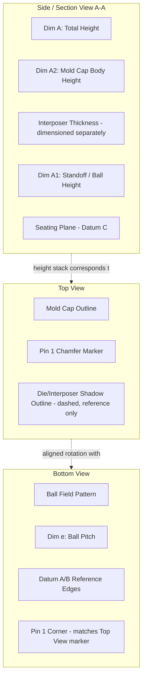

## Reading and Interpreting Package Datasheets and Outline Drawings

### Overview

Package datasheets and mechanical outline drawings are the authoritative interface contract between a semiconductor supplier and a downstream user (PCB designer, system integrator, test engineer, or another fab in a heterogeneous integration flow). For advanced packaging specifically — where a single "package" may itself be a multi-die, multi-substrate assembly (2.5D interposer module, fan-out redistribution package, 3D stack) — correctly reading these documents is a prerequisite skill for footprint design, thermal budgeting, reliability sign-off, and cross-vendor second-sourcing. Misreading a datasheet parameter or outline drawing tolerance is a common root cause of board-level assembly failures, so this topic emphasizes both the *literal* document structure and the *engineering judgment* required to interpret ambiguous or vendor-specific notation correctly.

### Anatomy of a Package Datasheet

A package datasheet is distinct from a device (product) datasheet: the package datasheet (often called a "mechanical data sheet" or published as a JEDEC outline document) describes the physical carrier only, independent of the silicon inside it. Device datasheets reference the package datasheet by outline designation rather than repeating mechanical detail.

#### Standard Sections

**Key Points**

- **Header/Identification Block**: package family name, JEDEC registration number (e.g., MO-xxx or MS-xxx for the outline family), body size, pitch, and lead/ball count — this block is the unique key used to cross-reference across vendors and design tools.
- **Mechanical Outline Drawing**: the dimensioned top, side, and bottom views (detailed separately below).
- **Symbol/Dimension Table**: a tabulated list of every lettered dimension (A, A1, A2, b, D, E, e, etc.) with minimum, nominal, and maximum values.
- **Notes**: critical qualifying text — controlling dimension units, datum definitions, plating allowances, and exceptions. Notes are frequently where the most consequential interpretation errors occur because they modify how the dimension table should be read.
- **Land Pattern / Footprint Recommendation** (increasingly common but not universal): a suggested PCB pad layout, thermal via pattern, and solder mask opening — always advisory, never contractual, since actual optimal land pattern depends on the user's own reflow profile and board stack-up.
- **Thermal Characteristics Table**: $\theta_{JA}$, $\theta_{JC}$, and increasingly $\psi_{JT}$ / $\psi_{JB}$ (junction-to-top and junction-to-board characterization parameters), each tied to a specific JEDEC test board standard (JESD51 series) that must be identified to interpret the number correctly.
- **Moisture Sensitivity Level (MSL) and Reflow Profile Compatibility**: per J-STD-020, defining floor life and peak reflow temperature exposure limits before the package must be re-baked.
- **Marking Diagram**: top-side laser mark layout, used to identify date code, lot traceability, and revision, distinct from the electrical part marking on a device-specific datasheet.

#### Symbol/Dimension Table Convention

The dimension table is built on ASME Y14.5 (or ISO equivalent) geometric dimensioning and tolerancing (GD&T) conventions, with package-specific letter assignments standardized (though not perfectly uniformly) by JEDEC.

| Symbol | Typical Meaning | Interpretation Note |
| --- | --- | --- |
| A | Total package height (seating plane to top) | Maximum value drives z-height/keep-out clearance in system stack-up |
| A1 | Standoff height (seating plane to package body bottom) | Critical for BGA coplanarity and solder joint reliability assessment |
| A2 | Body thickness (mold cap or substrate height, excluding standoff) | Distinguishes body height from total height including balls/leads |
| D, E | Body length, body width | Read against the "Notes" for whether this includes or excludes mold flash allowance |
| D1, E1 | Ball/lead field or die-attach area dimension | Used for interposer/substrate keep-out zones in 2.5D designs |
| e | Pitch (ball-to-ball or lead-to-lead) | Uniform pitch assumed unless a separate "e1"/"e2" row indicates dual-pitch (common in perimeter fan-out or mixed-pitch interposer designs) |
| b | Ball diameter or lead width | At the seating plane / after reflow, not as-manufactured — always verify which condition the value refers to |
| ccc, aaa, bbb | GD&T tolerance zone callouts (coplanarity, flatness, position) | These use feature control frames, not simple ± tolerances — misreading these as linear tolerances is a common error |

**Key Points on Min/Nom/Max interpretation:**

- A dimension given as Min/Max with no Nominal implies the vendor is not committing to a process-centered target — common for standoff height (A1) on BGA/CSP packages where solder ball collapse during reflow is process- and board-dependent, not purely package-dependent.
- "Reference" (REF) dimensions are non-controlling and provided only for informational/drafting convenience; they must never be used as an acceptance criterion in incoming inspection or design rule checks.
- A dimension marked with a basic dimension symbol (boxed value) in true GD&T notation defines a theoretically exact location used only as the origin for a positional tolerance zone — it is not independently measured or toleranced.

### Anatomy of the Mechanical Outline Drawing

**Key Points**

- **Views provided**: typically top view (die/mold cap orientation, pin 1 indicator), bottom view (ball/lead pattern, pin 1 corner), and one or two side/section views (profile height, standoff, lead form for leaded packages).
- **Pin 1 / Reference Corner Indicator**: a chamfer, dot, or index mark defining rotational orientation — critical because a mismatch between the drawing's pin 1 convention and the PCB footprint's pin 1 convention is a leading cause of reversed-part assembly errors, especially for square, rotationally-symmetric-looking BGA packages.
- **Datum Structure**: modern outline drawings define datums (commonly A, B, C in GD&T convention) referencing the seating plane and two orthogonal body edges or the ball-field center; all positional tolerances (ball position, body-to-ball-field concentricity) are expressed relative to these datums, not to each other directly.
- **Section Cut Views**: for stacked or 3D packages (PoP — Package-on-Package, or true 3D stacked die), the section view is where interposer thickness, mold cap thickness over each tier, and inter-tier standoff are specified — this is the primary drawing element relevant to advanced packaging heterogeneous integration, since it shows the internal stack geometry not visible from the exterior views alone.
- **Detail Callouts / Zoom Views**: used to show fine-pitch ball/bump detail, edge seal structure (for fan-out or embedded-die packages), or via-in-pad structure at a legible scale when the full-package view would be too dense to dimension clearly.

### Diagram: Outline Drawing View Correspondence to Physical Package (2.5D Interposer Example)

### Package-Specific Interpretation Considerations for Advanced Packaging

#### 2.5D / Interposer Packages

**Key Points**

- The outline drawing typically dimensions the outer mold/substrate body separately from the interposer footprint and from the die shadow(s) sitting atop the interposer — these are usually shown as nested dashed reference outlines on the top view, and confusing a "reference" die shadow outline with a controlling dimension is a common misread.
- Microbump pitch (die-to-interposer) is almost never on the outward-facing package outline drawing at all — it is an internal assembly dimension documented in a separate interposer-level or die-attach specification, not the customer-facing package mechanical datasheet. A reader looking for microbump pitch on the top-level package datasheet is looking in the wrong document.
- C4 bump (interposer-to-substrate) pitch and count, by contrast, typically *is* on the package-level dimension table since it determines the substrate-side land pattern the customer must design to.

#### Fan-Out Wafer-Level Packages (FOWLP)

**Key Points**

- Body outline tolerance is typically looser (wider min/max spread) than wire-bond or flip-chip packages of comparable size, reflecting the panel/wafer-level molding and reconstitution process variation — a datasheet reader should not assume FOWLP tolerances scale the same way as substrate-based BGA tolerances of similar dimensions.
- "Warpage" is frequently called out as a separate parameter (measured per JEDEC JESD22-B112 or similar) distinct from flatness/coplanarity, because fan-out packages are more susceptible to bow across reflow thermal cycling than substrate-based packages — a datasheet reader assessing SMT process compatibility should check this parameter specifically, not assume flatness alone captures the risk.

#### Package-on-Package (PoP) and 3D Stacks

**Key Points**

- Two outline drawings are typically involved: one for the bottom package (with top-side land pads/interface pads defined) and one for the top package (with bottom-side ball/pad interface matching the bottom package's top pads) — the interface between the two must be cross-checked dimension-by-dimension across both documents, since they are usually published as separate datasheets even when sold as a matched pair.
- Total stack height in the combined configuration is a *derived* value (sum of bottom package height, inter-package gap/standoff, and top package height) and is often not explicitly tabulated anywhere — the reader must compute it from the two individual outline drawings, which is a common oversight in system-level z-height budgeting.

### Thermal and Reliability Data Interpretation

**Key Points**

- $\theta_{JA}$ (junction-to-ambient thermal resistance) is board- and airflow-condition-dependent by definition (per JESD51-2/51-3 test board specification); it is a comparative figure of merit between packages under identical standardized test conditions, not a value directly usable for predicting junction temperature in an arbitrary end-system board design. Behavior in an actual application board may differ substantially from the datasheet value; using it as a direct thermal design input without adjustment is a common and significant interpretation error.
- $\theta_{JC}$ (junction-to-case) is more directly useful for systems using an external heat sink/lid interface, since it isolates the package's own internal thermal resistance from the board-dependent portion of the path.
- $\psi_{JT}$ and $\psi_{JB}$ are not true thermal resistances (they do not represent a fully isolated heat flow path) but are calibration factors for estimating junction temperature from an easily-measured external temperature (package top or board) under the specific standardized test condition — using them outside JESD51's defined boundary conditions requires care and is explicitly flagged as an approximation in the JEDEC standard itself.
- MSL rating and floor-life/bake-out requirements from J-STD-020 must be read together with the package's specific reflow peak temperature classification (which varies by package body thickness and volume per J-STD-020's own reflow classification table) — the same MSL level can carry different floor-life allowances depending on which reflow temperature classification applies to that specific body size.

### Cross-Referencing and Verification Practices

**Key Points**

- **JEDEC Outline Number as Primary Key**: when second-sourcing a package across vendors, matching the JEDEC registered outline number (not just the marketing package name, which varies by vendor) is the reliable way to confirm mechanical interchangeability — vendor marketing names for functionally similar packages are not standardized and can be misleading.
- **Revision/Change Notice Tracking**: outline drawings are revised (tightened tolerances, added notes, corrected datum references); a datasheet reader performing incoming inspection or footprint qualification should confirm the revision letter/date matches the revision the part was actually manufactured to, since older stock may conform to a superseded drawing.
- **Notes Override General Table Values**: a specific note (e.g., "Dimension D does not include mold flash, which shall not exceed 0.15mm per side") modifies how the tabulated value should be applied and takes precedence over a naive reading of the table alone — experienced readers scan the notes section before finalizing any critical dimension interpretation.
- **Land Pattern Is Advisory, Not Contractual**: any suggested PCB footprint published in the datasheet is a starting reference; final footprint design must account for the specific board's solder mask process, stencil design, and assembly equipment capability, and deviating from the vendor's suggested pattern for good engineering reason does not violate the datasheet.

### Worked Example: Interpreting a BGA Outline Drawing Excerpt

**Example**

Given an illustrative dimension table excerpt for a hypothetical 0.4mm pitch, 169-ball fine-pitch BGA:

| Symbol | Min | Nom | Max |
| --- | --- | --- | --- |
| A | — | — | 1.20 mm |
| A1 | 0.25 | 0.30 | 0.35 mm |
| A2 | 0.68 | 0.70 | 0.72 mm |
| D, E | 7.90 | 8.00 | 8.10 mm |
| e | — | 0.40 BSC | — |
| b | 0.20 | 0.25 | 0.30 mm |

**Step-by-step interpretation:**

1. Total package height (A) is Max-only (1.20mm): the vendor guarantees the package will not exceed this height, relevant for system z-height keep-out, but gives no committed nominal — treat 1.20mm as the design-rule input for mechanical clearance, not 1.20mm minus some assumed margin.
2. Standoff height (A1) has a full Min/Nom/Max spread (0.25/0.30/0.35mm): this variation must be considered in solder joint reliability (thermal cycling fatigue) analysis, since standoff height directly affects solder joint strain relief.
3. Pitch (e) is marked BSC (basic dimension, 0.40mm): this is the theoretical exact target used as the positional tolerance datum for every ball location — it is not independently measured on an individual unit, and there is no "0.40mm ± tolerance" reading of this cell; the actual per-ball position tolerance is defined elsewhere via a positional GD&T callout (e.g., ⌖0.08 M relative to datums), not by widening the BSC value itself.
4. Ball diameter (b) Min/Max (0.20–0.30mm) is the *post-reflow* condition per the note convention typical of BGA outline standards — this is the dimension relevant to solder joint inspection after assembly, not the as-shipped, pre-reflow ball size, which is usually documented in a separate incoming-inspection note if given at all.

**Output**

From this excerpt alone, a system designer can correctly derive: maximum system keep-out height (1.20mm), the ball-field positional tolerance basis (0.40mm BSC grid with a separate positional callout governing actual deviation), and the standoff range relevant to solder joint fatigue modeling (0.25–0.35mm) — while correctly avoiding the common misreads of treating the BSC pitch as a toleranced dimension or treating the Max-only body height as if it were a nominal design center value.

### Common Interpretation Pitfalls

**Key Points**

- Confusing "Reference" (REF) dimensions with controlling dimensions in tolerance stack-up calculations.
- Treating a Basic (BSC/boxed) dimension as if it carries its own ± tolerance, rather than understanding it as the origin for a separately-specified positional tolerance zone.
- Assuming $\theta_{JA}$ values are directly comparable across vendors' datasheets without first confirming both used the same JESD51 test board configuration (2s2p vs. 1s0p boards yield very different values for the same package).
- Overlooking a "Notes" qualifier that changes how a body dimension should be measured (e.g., excluding mold flash, excluding lead frame burr).
- For stacked/PoP configurations, failing to sum height and tolerance contributions across two separate datasheets to obtain true combined stack height and its tolerance range.
- Using a vendor's suggested land pattern verbatim without validating it against the actual board's stencil and solder mask process capability.

### Conclusion

Competent interpretation of package datasheets and outline drawings requires reading the dimension table and mechanical drawing together with the Notes section and the applicable GD&T/JEDEC/JESD standard context, rather than extracting numbers in isolation. The most consequential errors — misreading BSC dimensions as toleranced values, applying $\theta_{JA}$ outside its defined test board condition, missing a Notes-section exception to a body dimension, or failing to sum stack contributions across multiple datasheets in PoP/3D configurations — all stem from treating the document as a flat table of numbers rather than as a structured technical specification whose sections modify and qualify one another. This skill is foundational for footprint design, thermal budgeting, incoming inspection criteria, and cross-vendor second-source qualification across every advanced packaging architecture.

**Related Topics**

- ASME Y14.5 / ISO GD&T fundamentals as applied to package tolerancing
- JEDEC JESD51 series thermal test board standards and $\theta_{JA}$/$\psi_{JT}$ derivation
- J-STD-020 moisture sensitivity levels and reflow profile classification
- Land pattern and stencil design rules for fine-pitch BGA and fan-out packages
- Package-on-Package (PoP) interface compatibility verification workflow
- Warpage measurement standards (JESD22-B112) for fan-out and thin-substrate packages
- Cross-vendor second-sourcing qualification using JEDEC registered outline numbers