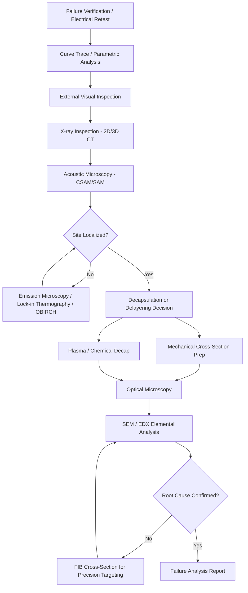

## Package Cross-Sectioning and Physical Failure Analysis Practice

### Overview and Purpose

Package cross-sectioning is a destructive physical analysis technique used to expose internal cross-sections of semiconductor packages for microscopic inspection. In advanced packaging and heterogeneous integration contexts, it is the primary method for verifying interconnect integrity (solder joints, micro-bumps, wire bonds, through-silicon vias), detecting voids and delamination, measuring dimensional tolerances, and root-causing field or test failures. Physical failure analysis (PFA) encompasses the broader discipline of non-destructive and destructive techniques used to localize and characterize a defect down to its physical mechanism.

**Key Points**

- Cross-sectioning destroys the sample, so it is always preceded by non-destructive localization (X-ray, CSAM, electrical test) to target the exact failure site
- The goal is to preserve the failure signature — improper technique can introduce artifacts (smearing, cracking) that mimic or mask the real defect
- Applies across package types: flip-chip BGA, wire-bond QFN/QFP, 2.5D interposer, 3D stacked die, fan-out wafer-level packaging (FOWLP), chiplet/HBM assemblies

### The Standard PFA Workflow

Physical failure analysis follows a structured, non-destructive-to-destructive funnel. Skipping steps or reordering them risks destroying evidence needed to confirm root cause.

### Non-Destructive Pre-Localization Techniques

Before committing a sample to a saw or grinder, its failure location must be narrowed as precisely as possible.

#### X-ray Inspection (2D and 3D CT)

- Reveals gross voids, missing balls, bridging, and misregistration in flip-chip and BGA interconnects
- 3D X-ray computed tomography (CT) reconstructs a volumetric model, allowing virtual "slicing" at any plane without physical destruction — increasingly used to pre-plan the exact cross-section plane before cutting
- Limited resolution for sub-micron features common in fine-pitch hybrid bonding (<10 µm pitch)

#### Scanning Acoustic Microscopy (SAM/CSAM)

- Uses high-frequency ultrasound (typically 15 MHz–230 MHz) reflected off internal interfaces to detect delamination, cracks, and voids
- Time-domain gating isolates specific depth planes (die attach, mold compound interface, substrate)
- Cannot penetrate through many stacked die interfaces reliably at high frequencies; trade-off between resolution and penetration depth

#### Emission Microscopy and Thermal Techniques

- Photon (light) emission microscopy detects hot-carrier luminescence from junction breakdown, ESD damage, or leakage paths
- Lock-in thermography and OBIRCH (Optical Beam Induced Resistance Change) localize resistive shorts and opens by correlating induced thermal/optical signals with electrical response
- Essential for flip-chip parts where the active die faces the substrate, requiring backside (through-silicon) access

### Decapsulation Methods

Decapsulation exposes the die or interconnect region by removing encapsulant (mold compound, underfill, or lid).

**Key Points**

- **Chemical decapsulation**: fuming nitric acid and/or sulfuric acid at controlled temperature, drop-etches mold compound; standard for wire-bond QFP/BGA top-side die exposure
- **Plasma decapsulation**: CF4/O2 plasma etch, slower but avoids acid-related metal corrosion artifacts; preferred when die-level EDX or SEM is planned immediately after
- **Mechanical decapsulation**: precision milling to remove bulk mold compound before finishing with chemical/plasma etch, saves acid exposure time
- Laser decapsulation is used for rapid, localized backside exposure in flip-chip packages, especially for probing or emission microscopy access

### Cross-Sectioning Fundamentals

#### Sample Selection and Mounting

1. Confirm and mark orientation relative to X-ray/SAM-identified defect coordinates
2. Mount the sample in epoxy resin within a cylindrical or rectangular mold; vacuum impregnation removes trapped air that would otherwise smear during polishing
3. Use edge-retention techniques (nickel plating, conductive filler) for packages where edge rounding on solder bumps or fine features must be preserved
4. Allow full resin cure (typically 8–24 hours at room temperature, or accelerated with heat-cure epoxies in 15–30 minutes)

#### Precision Grinding and Polishing Sequence

Cross-sectioning is an iterative grind-inspect-grind cycle, not a single cut. A typical sequence:

| Stage | Abrasive | Grit / Particle Size | Purpose |
| --- | --- | --- | --- |
| Rough grind | SiC paper | 120–320 grit | Reach approximate target plane |
| Fine grind | SiC paper | 600–1200 grit | Approach target plane (~200–500 µm away) |
| Coarse polish | Diamond suspension | 6 µm | Remove grind-induced scratches |
| Fine polish | Diamond suspension | 1 µm | Sub-micron surface finish |
| Final polish | Colloidal silica / diamond | 0.05–0.25 µm | Mirror finish for SEM/optical clarity |

- Progress is checked under optical microscope between stages, comparing remaining distance-to-target against reference markers or known feature geometry
- Automated polishing jigs (tripod polishers, semi-automatic lapping systems) control angle and pressure to avoid rounding ("potato-chip effect") on soft solder relative to hard silicon or copper
- For **micro-bump and hybrid bonding interconnects** (Cu-Cu, Cu pillar, pitch <10 µm), polishing must minimize Cu smearing across dielectric gaps, which is a classic cross-section artifact that fabricates the appearance of an electrical short

#### Precision Cross-Section (PCS) and Grind-to-Depth

- Digital micrometer-controlled grinding heads (e.g., Allied MultiPrep-style systems) enable grind-to-depth accuracy within ±1 µm, critical for hitting a target through-silicon via (TSV) or micro-bump identified by prior X-ray CT coordinates
- Angle-lapping (shallow-angle grinding, e.g., 1–5°) magnifies the effective vertical resolution of a cross-section, useful for measuring thin-film thickness or shallow junction depths without needing sub-micron grinding

### Focused Ion Beam (FIB) Cross-Sectioning

FIB uses a gallium ion beam to mill precise, targeted cross-sections at nanometer resolution, typically as a follow-up to mechanical cross-sectioning when finer localization is required.

**Key Points**

- Enables "surgical" cross-sections at a specific transistor, via, or bump without the multi-hour mechanical polish cycle
- Combined FIB-SEM (dual-beam) systems allow simultaneous milling and imaging, including slice-and-view 3D reconstruction of a defect volume
- Deposits a protective platinum or tungsten cap over the region of interest before milling to prevent ion-beam-induced curtaining artifacts
- Milling rates are slow (minutes to hours for a single cross-section), making FIB impractical as the primary bulk-material-removal method — it is a precision finishing/targeting tool, not a substitute for mechanical polishing

### Imaging and Analysis After Cross-Sectioning

#### Optical Microscopy

- First-pass inspection; identifies gross voiding, cracking, and delamination at 50x–1000x magnification
- Differential interference contrast (DIC/Nomarski) enhances surface topography contrast on polished metal surfaces

#### Scanning Electron Microscopy (SEM)

- Provides much higher resolution and depth of field than optical, essential for sub-micron features (TSV liners, Cu-Cu hybrid bond interfaces, low-k dielectric cracking)
- Secondary electron (SE) imaging shows topography; backscattered electron (BSE) imaging shows compositional (Z-number) contrast, useful for distinguishing intermetallic compound (IMC) layers from bulk solder

#### Energy Dispersive X-ray Spectroscopy (EDX/EDS)

- Elemental mapping performed alongside SEM to confirm IMC composition (e.g., Cu6Sn5 vs Cu3Sn growth at solder joints), contamination species, or diffusion barrier integrity (Ta/TaN in TSVs)
- Quantitative EDX line-scans across an interface reveal diffusion profiles relevant to electromigration or thermal-cycling-induced IMC growth

### Common Failure Signatures Found via Cross-Sectioning

| Failure Mode | Typical Root Cause | Cross-Section Signature |
| --- | --- | --- |
| Solder joint cracking | Thermal cycling fatigue, CTE mismatch | Crack propagation through bulk solder or at IMC interface |
| Voiding in micro-bumps | Insufficient reflow, flux entrapment, Kirkendall voiding | Rounded voids at Cu-Sn IMC boundary |
| Delamination | Poor adhesion, moisture-induced popcorn cracking | Gap/separation at mold-die or underfill-substrate interface |
| TSV cracking/pull-out | CTE mismatch during thermal cycling, poor liner adhesion | Radial cracks around via barrel, liner separation |
| Electromigration voiding | High current density, thermal gradient | Void formation at cathode end of interconnect |
| Cu-Cu hybrid bond voids | Surface roughness, particulate, insufficient bond force | Nanoscale voids at bond interface visible only via FIB-SEM |
| Wire bond lifting | Poor bond parameters, contamination, IMC over-growth (Au-Al) | Heel crack or ball lift with visible IMC (purple plague) |

### Hands-On Practice Framework

**Example**

A structured lab exercise for developing cross-sectioning competency:

1. Obtain a known-good and a known-defective flip-chip BGA sample (defect intentionally induced via thermal cycling or reflow profile deviation)
2. Perform X-ray CT scan on both; document ball/bump positions and any visible voiding
3. Mount both in epoxy, orienting the defect coordinate toward the intended cut plane
4. Grind incrementally, checking progress every 100–200 µm under optical microscope
5. Switch to fine grinding once within 300 µm of target, then proceed through the polish sequence
6. Image the final cross-section under optical microscope, then SEM
7. Run EDX at the solder-to-pad interface on both samples and compare IMC thickness
8. Document with annotated micrographs correlating the physical defect back to the original electrical failure signature

### Sample Cross-Section Schematic

<svg xmlns="http://www.w3.org/2000/svg" viewBox="0 0 640 360">
<text x="320" y="24" font-size="16" font-family="sans-serif" font-weight="bold" text-anchor="middle" fill="#222">Flip-Chip Cross-Section (svg_diagram)</text>

<rect x="120" y="50" width="400" height="60" fill="#a9c4e8" stroke="#333" stroke-width="1.5" />
<text x="320" y="85" font-size="13" font-family="sans-serif" text-anchor="middle" fill="#222">Silicon Die</text>

<circle cx="170" cy="120" r="14" fill="#d4af37" stroke="#333" stroke-width="1" />
<circle cx="240" cy="120" r="14" fill="#d4af37" stroke="#333" stroke-width="1" />
<circle cx="310" cy="120" r="14" fill="#e08080" stroke="#b22222" stroke-width="2" />
<circle cx="380" cy="120" r="14" fill="#d4af37" stroke="#333" stroke-width="1" />
<circle cx="450" cy="120" r="14" fill="#d4af37" stroke="#333" stroke-width="1" />
<text x="310" y="145" font-size="11" font-family="sans-serif" text-anchor="middle" fill="#b22222">void defect</text>

<rect x="120" y="105" width="400" height="35" fill="#e8dfc8" stroke="none" opacity="0.5" />
<text x="560" y="125" font-size="11" font-family="sans-serif" fill="#555">Underfill</text>

<rect x="80" y="135" width="480" height="50" fill="#c8b89a" stroke="#333" stroke-width="1.5" />
<text x="320" y="165" font-size="13" font-family="sans-serif" text-anchor="middle" fill="#222">Substrate</text>

<circle cx="150" cy="210" r="18" fill="#909090" stroke="#333" stroke-width="1" />
<circle cx="230" cy="210" r="18" fill="#909090" stroke="#333" stroke-width="1" />
<circle cx="310" cy="210" r="18" fill="#909090" stroke="#333" stroke-width="1" />
<circle cx="390" cy="210" r="18" fill="#909090" stroke="#333" stroke-width="1" />
<circle cx="470" cy="210" r="18" fill="#909090" stroke="#333" stroke-width="1" />
<text x="560" y="215" font-size="11" font-family="sans-serif" fill="#555">BGA Balls</text>

<rect x="80" y="228" width="480" height="30" fill="#4a6741" stroke="#333" stroke-width="1.5" />
<text x="320" y="248" font-size="13" font-family="sans-serif" text-anchor="middle" fill="#fff">PCB</text>

<line x1="310" y1="134" x2="310" y2="280" stroke="#b22222" stroke-width="1" stroke-dasharray="4,3" />
<text x="320" y="295" font-size="12" font-family="sans-serif" fill="#b22222">SEM/EDX confirms Kirkendall voiding at Cu-Sn IMC</text>

<text x="320" y="330" font-size="11" font-family="sans-serif" text-anchor="middle" fill="#777">Cut plane targeted via prior 3D X-ray CT localization</text>

</svg>

### Safety and Lab Practice Considerations

- Fuming nitric/sulfuric acid decapsulation requires fume hood operation, acid-resistant PPE, and proper neutralization/disposal protocols
- Grinding and polishing generate fine particulate (including potentially hazardous metal dust from lead-containing solders); wet grinding with continuous water flow suppresses dust and prevents thermal damage
- FIB systems use gallium ion sources under high vacuum; operators require training on sample charging mitigation and beam safety interlocks
- [Inference] Institutional lab access to FIB-SEM and 3D X-ray CT is typically limited to university nanofabrication centers, industry failure analysis labs, or specialized foundry/OSAT facilities rather than general-purpose electronics labs, given the capital cost of this equipment

### Documentation and Reporting Standards

A complete PFA report typically includes:

- Sample identification, failure mode observed at electrical test, and prior non-destructive imaging results
- Cross-section plane rationale (why this location was chosen)
- Annotated optical and SEM micrographs with scale bars
- EDX spectra/maps with elemental quantification tables
- Root cause statement distinguishing confirmed findings from working hypotheses
- Correlation back to process step (reflow profile, bonding force, thermal cycle count) implicated in the failure

**Next Steps**

- Void and delamination detection via scanning acoustic microscopy (CSAM) in depth
- X-ray computed tomography (3D CT) for advanced package metrology
- FIB-SEM slice-and-view 3D defect reconstruction techniques
- Electromigration and thermal cycling reliability testing methodologies
- Micro-bump and hybrid bonding interconnect characterization
- Decapsulation chemistry and process optimization for sensitive low-k dielectrics
- Statistical failure analysis and Weibull reliability modeling for interconnect fatigue