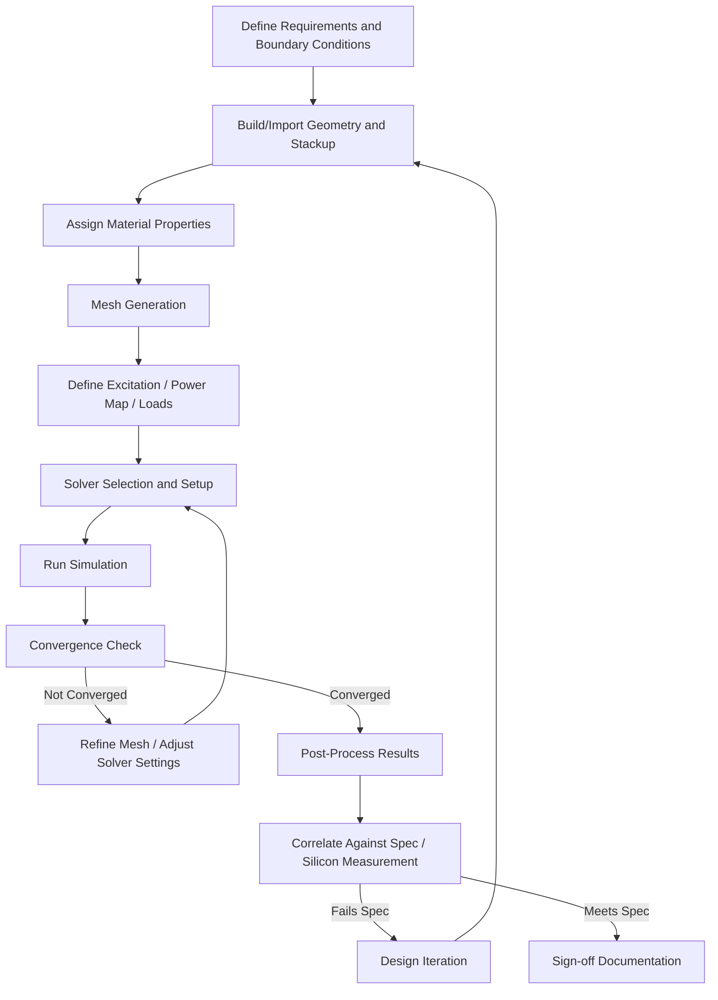
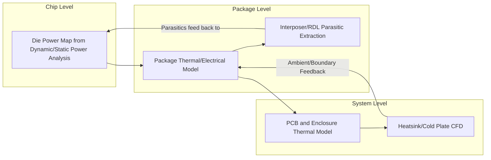

## Thermal and Electrical Simulation Software Workflows

### Overview and Purpose

Thermal and electrical simulation are core predictive engineering disciplines in advanced packaging and heterogeneous integration. As package complexity grows (2.5D interposers, 3D stacked die, chiplets, HBM), physical prototyping alone becomes too slow and expensive to explore design space, so simulation-driven design (co-design of electrical performance, power delivery, and thermal management) is standard practice before tape-out and package qualification.

**Key Points**

- Electrical simulation addresses signal integrity (SI), power integrity (PI), and electromagnetic (EM) effects across interconnects, package substrates, and interposers
- Thermal simulation addresses heat generation, conduction, convection, and radiation across the die-package-board-system stack
- These domains are increasingly co-simulated (electro-thermal, thermal-mechanical) because temperature affects electrical resistance/timing, and current density affects local heating (Joule heating, electromigration)

### The General Simulation Workflow

### Electrical Simulation Domain

#### Signal Integrity (SI) Simulation

- Models high-speed interconnects (bumps, traces, vias, TSVs, wire bonds) as distributed transmission-line networks to predict insertion loss, return loss, crosstalk, and eye-diagram closure
- Key deliverables: S-parameter extraction (Touchstone .sNp files), time-domain reflectometry (TDR) impedance profiles, eye-diagram/bit-error-rate estimates for SerDes channels
- Frequency-domain solvers (finite element method, method of moments) extract broadband S-parameters that are then used in SPICE/IBIS-AMI channel simulations

#### Power Integrity (PI) Simulation

- Analyzes power delivery network (PDN) impedance across frequency, targeting a flat, low impedance profile below a target ceiling to limit voltage droop under transient current demand
- Includes decoupling capacitor placement optimization, plane resonance analysis, and DC IR-drop analysis across power/ground planes and bump/ball arrays
- Simultaneous switching noise (SSN) and ground bounce analysis particularly critical in high-pin-count flip-chip BGA and 2.5D interposer designs with dense I/O

#### Electromagnetic (EM)/Full-Wave Simulation

- 3D full-wave field solvers (finite element method — FEM, finite-difference time-domain — FDTD, method of moments — MoM) model complex 3D geometries (bump arrays, TSV fields, RDL routing) where simplified 2D/2.5D approximations lose accuracy
- Used for package-level antenna design (RF/mmWave packages), EMI/EMC compliance prediction, and fine-pitch coupled interconnect extraction

**Key Points — Common EDA Tools**

- Ansys HFSS / Q3D Extractor — 3D full-wave EM and quasi-static parasitic extraction
- Cadence Sigrity (PowerSI, XtractIM, Clarity 3D) — SI/PI package and PCB analysis
- Keysight ADS (Advanced Design System) — circuit and EM co-simulation, channel simulation
- Synopsys Custom Compiler / RaptorX — RF and interconnect parasitic extraction for advanced nodes and interposers

### Thermal Simulation Domain

#### Governing Physics

Thermal simulation solves the heat diffusion equation across the package stack, subject to boundary conditions representing convection, radiation, and conduction paths to ambient or a cooling solution.

$$\rho c_p \frac{\partial T}{\partial t} = \nabla \cdot (k \nabla T) + Q$$

Where $\rho$ is density, $c_p$ is specific heat, $k$ is thermal conductivity, $T$ is temperature, and $Q$ is the volumetric heat generation term (power density map from the die).

#### Steady-State vs. Transient Analysis

- **Steady-state** analysis determines junction temperature ($T_j$) under sustained maximum power dissipation — used for thermal budget sign-off against $T_j$ limits
- **Transient** analysis captures thermal response to time-varying workloads (burst compute, power-gating cycles) — critical for predicting thermal throttling behavior and short-duration hot-spot excursions that steady-state analysis would miss

#### Key Thermal Metrics

- **Junction-to-ambient thermal resistance** ($\theta_{JA}$) and **junction-to-case** ($\theta_{JC}$): standard figures of merit for package-level heat dissipation capability
- **Thermal interface material (TIM) performance**: bond-line thickness and effective thermal conductivity strongly influence die-to-lid/heatsink heat transfer
- **Hot-spot temperature and gradient mapping**: essential in heterogeneous multi-die packages where compute dies (high power density) sit adjacent to lower-power dies (I/O, SRAM), creating lateral thermal gradients and cross-die thermal coupling
- **Thermal-induced mechanical stress**: coefficient of thermal expansion (CTE) mismatch between silicon, copper, mold compound, and substrate drives warpage and interconnect fatigue, often requiring coupled thermal-mechanical (structural) simulation

**Key Points — Common Thermal Simulation Tools**

- Ansys Icepak / Ansys Mechanical — computational fluid dynamics (CFD)-based system and package-level thermal analysis
- Siemens Simcenter Flotherm — electronics-focused thermal CFD, widely used for package and system-level thermal design
- Cadence Celsius Thermal Solver — chip-package-system co-simulation, integrates directly with IC layout data for power map import
- COMSOL Multiphysics — general-purpose finite element solver supporting coupled thermal-electrical-structural multiphysics

### Chip-Package-System (CPS) Co-Design and Multi-Scale Simulation

Modern heterogeneous packages require multi-scale thermal and electrical co-simulation because heat and current do not respect the traditional boundary between "chip design" and "package design."

- Die-level power maps (from static/dynamic power analysis in tools like Synopsys PrimeTime PX or Ansys RedHawk-SC) are imported as boundary conditions into package/system thermal solvers
- Reduced-order thermal models (compact thermal models, CTMs, per DELPHI/JEDEC JESD15 methodology) allow fast system-level thermal simulation without re-running full 3D CFD for every system configuration
- Electro-thermal co-simulation captures self-heating effects on interconnect resistance (important for fine-pitch Cu-Cu hybrid bonds and TSVs where resistance is temperature-dependent), feeding back into IR-drop and timing analysis

### Meshing Strategy Considerations

**Key Points**

- Fine mesh required at high-gradient regions: bump/via corners, TSV sidewalls, die edges, TIM interfaces
- Coarser mesh acceptable in bulk regions (mold compound interior, substrate core) to control solve time
- Adaptive mesh refinement (AMR) automatically increases mesh density in regions of high field/thermal gradient between solver iterations
- Mesh independence studies (progressively refining mesh until result changes fall below a defined tolerance, e.g., <2% change in $T_j$ or insertion loss) are standard practice before trusting simulation results for sign-off

### Practical Hands-On Workflow Example

**Example**

A representative student/practitioner exercise combining both domains for a 2.5D interposer package:

1. Import interposer/RDL layout (GDSII or design database) and package stackup (materials, layer thicknesses) into the EM/parasitic extraction tool
2. Extract R, L, C parasitics for a representative high-speed channel; generate S-parameters up to the Nyquist frequency of the target data rate
3. Run channel simulation (SPICE or IBIS-AMI) to check eye-diagram margin against a bit-error-rate target
4. Separately, obtain a die-level power map (uniform or hot-spot-weighted approximation)
5. Import package stackup and power map into thermal solver; define ambient temperature, heatsink/TIM boundary conditions
6. Run steady-state thermal simulation; extract $T_j$, $\theta_{JA}$, and hot-spot locations
7. Cross-check: does the hot-spot location correspond to a high-current-density interconnect region from the electrical simulation? If so, evaluate resistance increase at elevated temperature and re-run PI analysis with temperature-dependent resistivity
8. Document convergence behavior, mesh sensitivity, and final sign-off metrics against target specification

### Package Thermal Stack Cross-Section for Boundary Condition Setup

<svg xmlns="http://www.w3.org/2000/svg" viewBox="0 0 640 320">
<text x="320" y="24" font-size="16" font-family="sans-serif" font-weight="bold" text-anchor="middle" fill="#222">Thermal Boundary Conditions (svg_diagram)</text>

<rect x="140" y="40" width="360" height="30" fill="#888" stroke="#333" stroke-width="1" />
<text x="320" y="60" font-size="12" font-family="sans-serif" text-anchor="middle" fill="#fff">Heatsink (convection to ambient)</text>
<line x1="60" y1="55" x2="140" y2="55" stroke="#0066cc" stroke-width="2" marker-end="url(#arrow)" />
<text x="30" y="50" font-size="10" font-family="sans-serif" fill="#0066cc">h, T_amb</text>

<rect x="140" y="70" width="360" height="12" fill="#e8c468" stroke="#333" stroke-width="0.5" />
<text x="560" y="80" font-size="10" font-family="sans-serif" fill="#555">TIM (k, BLT)</text>

<rect x="180" y="82" width="120" height="40" fill="#a9c4e8" stroke="#333" stroke-width="1.5" />
<text x="240" y="106" font-size="11" font-family="sans-serif" text-anchor="middle" fill="#222">Compute Die</text>
<rect x="310" y="82" width="70" height="40" fill="#c8e0a9" stroke="#333" stroke-width="1.5" />
<text x="345" y="106" font-size="10" font-family="sans-serif" text-anchor="middle" fill="#222">I/O Die</text>

<line x1="240" y1="122" x2="240" y2="140" stroke="#b22222" stroke-width="2" marker-end="url(#arrow)" />
<text x="240" y="152" font-size="10" font-family="sans-serif" text-anchor="middle" fill="#b22222">Q (W/mm²)</text>

<rect x="140" y="122" width="360" height="20" fill="#e8dfc8" stroke="#333" stroke-width="0.5" />
<text x="560" y="136" font-size="10" font-family="sans-serif" fill="#555">Interposer</text>

<rect x="100" y="142" width="440" height="40" fill="#c8b89a" stroke="#333" stroke-width="1.5" />
<text x="320" y="166" font-size="12" font-family="sans-serif" text-anchor="middle" fill="#222">Substrate (k_xy, k_z anisotropic)</text>

<rect x="100" y="182" width="440" height="30" fill="#4a6741" stroke="#333" stroke-width="1.5" />
<text x="320" y="202" font-size="12" font-family="sans-serif" text-anchor="middle" fill="#fff">PCB</text>
<line x1="320" y1="212" x2="320" y2="250" stroke="#0066cc" stroke-width="2" marker-end="url(#arrow)" />
<text x="320" y="264" font-size="10" font-family="sans-serif" text-anchor="middle" fill="#0066cc">Conduction to board / natural convection</text>
</svg>

### Correlation and Validation

- Simulation results must be validated against silicon measurement wherever possible: thermal test chips with embedded diode temperature sensors, or vector network analyzer (VNA) S-parameter measurement on test structures
- Discrepancies beyond acceptable tolerance (commonly ±10-15% for thermal, tighter for high-speed SI depending on margin budget) trigger investigation into material property assumptions, boundary condition accuracy, or meshing adequacy
- [Inference] Because material property databases (thermal conductivity, dielectric constant, loss tangent) for novel materials such as new low-k dielectrics or emerging TIMs are often incomplete or vendor-proprietary, simulation accuracy in leading-edge heterogeneous integration frequently depends on supplementary material characterization rather than solver capability alone

### Common Pitfalls in Practice

**Key Points**

- Treating chip-level power maps as spatially uniform when real workloads produce highly non-uniform hot spots, leading to underestimated peak junction temperature
- Ignoring anisotropic thermal conductivity in substrates and interposers (in-plane vs. through-plane conductivity can differ by 2-10x in some laminate and glass-core materials)
- Insufficient mesh density at bump/via corners causing artificially low predicted current density or field concentration
- Neglecting temperature-dependent material properties (resistivity, permittivity) in coupled electro-thermal analysis, which can significantly underpredict self-heating feedback loops
- Running electrical and thermal simulations in isolation without feedback, missing compounding effects (e.g., a hot-spot-induced resistance increase that further increases local power dissipation)

**Next Steps**

- Compact thermal modeling (CTM) methodology per JEDEC JESD15
- Power integrity co-design and decoupling capacitor optimization techniques
- Chip-package-system (CPS) co-simulation flows and tool interoperability (power map exchange formats)
- Warpage and thermal-mechanical stress simulation for CTE-mismatched heterogeneous stacks
- SerDes channel simulation and IBIS-AMI modeling for high-speed interconnects
- Material characterization techniques for thermal conductivity and dielectric properties at package-relevant frequencies