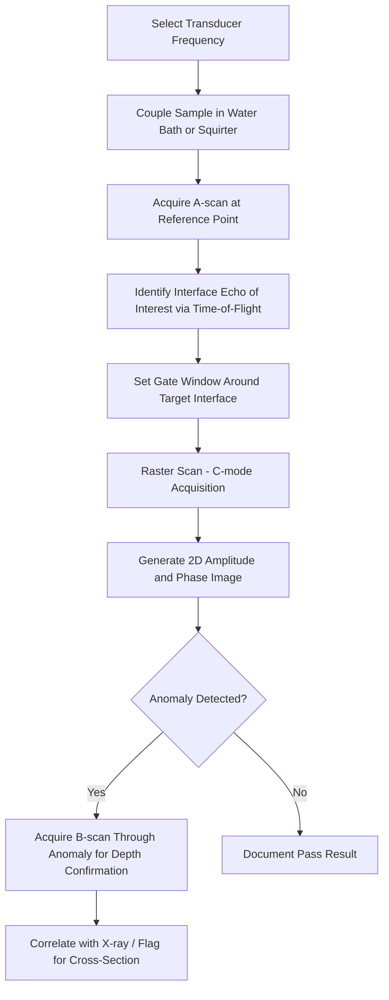

## X-ray and Acoustic Microscopy Image Interpretation

### Overview and Purpose

X-ray inspection and scanning acoustic microscopy (SAM) are the two primary non-destructive imaging techniques used to inspect internal package structures without physical sectioning. Correct image interpretation — distinguishing genuine defects from imaging artifacts — is a critical hands-on skill, since misreading either modality leads to false rejects, missed failures, or misdirected (and wasted) destructive cross-sectioning.

**Key Points**

- X-ray imaging is transmission-based, sensitive to material density and thickness (atomic number contrast), and excels at metallic interconnect inspection
- Acoustic microscopy is reflection-based, sensitive to acoustic impedance mismatches at interfaces, and excels at detecting voids, delamination, and cracks in non-metallic and interface regions
- The two techniques are complementary, not redundant: a comprehensive inspection plan typically uses both

### X-ray Imaging Fundamentals

#### Physical Principle

X-ray transmission imaging relies on differential absorption: denser, higher-atomic-number materials (solder, copper, gold) absorb more X-rays and appear darker (or lighter, depending on display convention) than lower-density materials (silicon, mold compound, polymer). Image contrast follows the Beer-Lambert attenuation relationship:

$$I = I_0 \, e^{-\mu x}$$

Where $I_0$ is incident intensity, $\mu$ is the material's linear attenuation coefficient (dependent on atomic number and X-ray energy), and $x$ is material thickness along the beam path.

#### 2D Transmission X-ray

- Standard first-pass tool for BGA ball inspection, wire bond inspection, and detecting gross voids, bridging, or missing components
- Image is a 2D projection of the entire beam path — features at different depths superimpose, which is the primary interpretation challenge
- Oblique/angled views (tilting the sample or beam) help disambiguate overlapping features by parallax, distinguishing a top-side defect from a bottom-side one

#### 3D X-ray Computed Tomography (CT)

- Reconstructs a full volumetric dataset from many 2D projections taken at different rotation angles, allowing virtual slicing at any arbitrary plane
- Removes the superposition ambiguity inherent to 2D transmission imaging
- Trade-off: significantly longer acquisition time (minutes to hours per sample) versus seconds for 2D transmission, and resolution/field-of-view trade-offs still apply (higher resolution requires smaller field of view or longer scan)

### Interpreting X-ray Images: Key Signatures

| Feature | Appearance | Common Cause |
| --- | --- | --- |
| Solder ball voiding | Circular/irregular lighter (lower density) region within a ball | Flux outgassing, entrapped volatiles during reflow |
| Head-in-pillow (HiP) | Faint boundary line bisecting a ball, often visible as a subtle contrast discontinuity | Poor wetting between paste and ball due to oxidation or warpage during reflow |
| Solder bridging | Continuous dark connection between adjacent balls/bumps | Excess solder volume, insufficient stencil aperture control, pad misalignment |
| Missing ball / open | Absence of expected ball shadow at a grid position | Ball drop-off, non-wetting, transport damage |
| Ball misalignment/shift | Ball centroid offset from expected grid position | Warpage during reflow, placement error |
| Wire bond sag/sweep | Wire arc deviates from expected loop profile | Encapsulation molding flow force, wire bond process drift |
| Foreign material/particle | High-contrast irregular shape unrelated to expected pattern | Contamination during assembly |
| Die crack (via X-ray) | Faint linear discontinuity, often subtle since silicon is low-Z | Usually requires very high resolution or CT; frequently more visible via acoustic microscopy |

**Key Points**

- Voiding percentage in solder joints is typically quantified as void area divided by total ball footprint area in the 2D projection; industry references such as IPC-A-610 define acceptance thresholds by application class
- Head-in-pillow defects are notoriously difficult to catch in 2D transmission images because the poorly-wetted interface can look nearly identical to a fully-reflowed joint from directly overhead; angled/oblique imaging is often required to reveal the "pillow" separation line

### Acoustic Microscopy Fundamentals

#### Physical Principle

Scanning acoustic microscopy pulses high-frequency ultrasound (commonly 15 MHz to 230+ MHz depending on required resolution vs. penetration depth) into the sample through a coupling medium (typically water). At every interface where acoustic impedance ($Z = \rho c$, density times sound velocity) changes, a portion of the wave reflects back to the transducer.

$$R = \left( \frac{Z_2 - Z_1}{Z_2 + Z_1} \right)^2$$

Where $R$ is the reflection coefficient and $Z_1$, $Z_2$ are the acoustic impedances of the two materials at an interface. A large impedance mismatch (e.g., solid material to air/void) produces near-total reflection, which is why voids and delamination — both representing an air gap — produce very strong, easily distinguished acoustic signatures.

#### Modes of Acoustic Imaging

- **C-mode (C-SAM)**: the most common mode; gates the returning echo to a specific depth (time-of-flight window), producing a 2D planar image of a single interface of interest (e.g., die attach layer, mold-die interface)
- **A-mode**: single-point time-domain waveform showing all reflections along the beam path at one XY location — used to identify the correct gate timing before running a full C-mode scan
- **B-mode**: cross-sectional view along one axis, analogous to a vertical slice, useful for visualizing depth relationships without physical sectioning
- **TAM (Through-Acoustic-Microscopy)**: transmission mode, sensitive to complete blockages but less commonly used than reflection mode in package inspection

### Interpreting Acoustic Images: Key Signatures

| Feature | Appearance (C-mode) | Common Cause |
| --- | --- | --- |
| Delamination | Bright, high-amplitude reflection with polarity/phase inversion relative to a bonded interface | Poor adhesion, moisture-induced popcorn cracking, contamination |
| Void | Localized bright spot, sharply bounded | Entrapped air/volatiles during molding or die attach |
| Crack | Bright, often linear or branching high-amplitude feature | Mechanical stress, thermal cycling fatigue |
| Good bond/interface | Lower-amplitude, more uniform gray-scale response (partial transmission, partial reflection at a solid-solid interface) | Normal, expected result |
| Popcorn crack | Combination of delamination signature at die-pad interface plus radiating crack pattern from package edge/corner | Moisture absorption followed by rapid vaporization during reflow (solder reflow simulating IPC/JEDEC J-STD-020 moisture sensitivity testing) |

**Key Points**

- Phase/polarity information (not just amplitude) is often essential to distinguish a genuine delamination (air-gap, strong phase-inverted reflection) from a normal high-reflectivity interface between two dissimilar solid materials (e.g., silicon-to-mold compound), which can also produce a bright signal but without the same phase signature
- Frequency selection is a direct trade-off: higher frequency (e.g., 100-230 MHz) gives finer lateral resolution and is used for thin, near-surface layers (die attach, thin mold cap), while lower frequency (15-50 MHz) penetrates deeper into thick packages but with coarser resolution
- Attenuation increases with frequency and with propagation through lossy materials (mold compound), limiting achievable penetration depth at high resolution — this is why multi-die 3D stacks often cannot be fully characterized through acoustic microscopy alone, especially at lower die in the stack

### Comparative Interpretation: X-ray vs. Acoustic Microscopy

| Aspect | X-ray | Acoustic Microscopy |
| --- | --- | --- |
| Best for | Metallic interconnects (solder, wire bonds, bumps) | Voids, delamination, cracks in interfaces and polymers |
| Contrast mechanism | Density/atomic number | Acoustic impedance mismatch |
| Depth information (2D mode) | Superimposed (2D transmission) or resolved (3D CT) | Depth-resolved via time-gating (C-mode) |
| Coupling medium required | None (air/vacuum) | Water or other liquid couplant |
| Typical resolution | Sub-micron (CT, depending on system) to several microns | ~1-50 µm depending on frequency |
| Common blind spot | Thin non-metallic delamination, low-Z material cracks | Deep multi-layer stacks (attenuation-limited), fine metallic bump detail |

### Common Interpretation Artifacts and Pitfalls

**Key Points**

- **X-ray superposition ambiguity**: in 2D transmission, a defect on the top die and a defect on the bottom die of a stack can appear at the same XY location, misleading root-cause localization; resolved via oblique imaging or 3D CT
- **Acoustic beam spreading/focus loss**: at greater depth, the acoustic beam diverges, degrading lateral resolution and potentially causing a real defect to appear smaller/blurrier than it is, or be missed entirely at the scan step size used
- **Acoustic "shadowing"**: a strong reflector near the surface (e.g., a large void) can block ultrasound from reaching and characterizing structures beneath it, creating a false "no signal" region that must not be misread as "no defect"
- **Couplant bubbles**: trapped air bubbles in the water coupling path produce false bright spots in acoustic images; verified by rescanning or checking A-scan waveform quality
- **X-ray beam hardening and edge effects**: thicker regions near part edges can create artificial contrast gradients unrelated to any real defect

### Practical Interpretation Exercise

**Example**

A representative hands-on exercise pairing both modalities on the same sample set:

1. Acquire a 2D X-ray transmission image of a flip-chip BGA; identify and count any voids exceeding a defined area threshold (e.g., >25% of ball footprint per IPC-7095 guidance for BGA voiding)
2. Acquire an oblique/angled X-ray view of any ball suspected of being a head-in-pillow defect; look for the characteristic separation line
3. Run a C-mode acoustic scan gated at the die-attach interface on the same or a companion sample; compare void locations detected acoustically against those seen in X-ray
4. Identify any acoustic bright spot with phase-inverted signature near a package corner; hypothesize possible moisture-related delamination
5. Cross-reference both datasets to select the single highest-priority defect site for destructive cross-section confirmation
6. After cross-sectioning, compare the ground-truth physical defect against both non-destructive image interpretations to evaluate prediction accuracy and refine interpretation heuristics

### Interpretation Signature Comparison Diagram

<svg xmlns="http://www.w3.org/2000/svg" viewBox="0 0 640 340">
<text x="320" y="24" font-size="16" font-family="sans-serif" font-weight="bold" text-anchor="middle" fill="#222">X-ray vs Acoustic Signatures (svg_diagram)</text>

<text x="160" y="55" font-size="13" font-family="sans-serif" font-weight="bold" text-anchor="middle" fill="#222">X-ray (2D Transmission)</text>

<circle cx="160" cy="110" r="35" fill="#333" />

<circle cx="160" cy="110" r="12" fill="#ccc" />

<text x="160" y="160" font-size="11" font-family="sans-serif" text-anchor="middle" fill="#555">Ball with central void</text>

<text x="160" y="175" font-size="11" font-family="sans-serif" text-anchor="middle" fill="#555">(lighter core region)</text>

<circle cx="160" cy="230" r="35" fill="#333" />
<line x1="160" y1="196" x2="160" y2="264" stroke="#eee" stroke-width="2" />
<text x="160" y="285" font-size="11" font-family="sans-serif" text-anchor="middle" fill="#555">Head-in-pillow</text>
<text x="160" y="300" font-size="11" font-family="sans-serif" text-anchor="middle" fill="#555">(faint bisecting line)</text>

<line x1="320" y1="45" x2="320" y2="320" stroke="#aaa" stroke-width="1" stroke-dasharray="5,4" />

<text x="480" y="55" font-size="13" font-family="sans-serif" font-weight="bold" text-anchor="middle" fill="#222">Acoustic (C-mode)</text>

<rect x="420" y="80" width="120" height="60" fill="`#4a6741`" stroke="#333" />

<circle cx="480" cy="110" r="18" fill="`#ffe066`" stroke="`#b22222`" stroke-width="2" />

<text x="480" y="160" font-size="11" font-family="sans-serif" text-anchor="middle" fill="#555">Void: sharp bright spot</text>

<rect x="420" y="200" width="120" height="60" fill="#4a6741" stroke="#333" />
<path d="M 420 230 Q 460 210 480 230 Q 500 250 540 230" stroke="#ffe066" stroke-width="6" fill="none" />
<text x="480" y="280" font-size="11" font-family="sans-serif" text-anchor="middle" fill="#555">Delamination: bright,</text>
<text x="480" y="295" font-size="11" font-family="sans-serif" text-anchor="middle" fill="#555">phase-inverted band</text>
</svg>

### Reference Standards for Acceptance Criteria

- IPC-7095 — design and assembly guidelines for BGA, including void area interpretation guidance
- IPC-A-610 — acceptability of electronic assemblies, referenced for solder joint visual/X-ray defect classification
- JEDEC J-STD-020 — moisture/reflow sensitivity classification, relevant context for interpreting popcorn-crack acoustic signatures
- [Inference] Specific numeric acceptance thresholds (e.g., maximum allowable void percentage) vary by end-application reliability requirements and are typically defined in a company or program-specific specification rather than a single universal number, since automotive, aerospace, and consumer applications carry different risk tolerances

### Automated vs. Manual Interpretation

**Key Points**

- Automated X-ray inspection (AXI) and automated acoustic inspection increasingly use machine-learning-based defect classification to flag anomalies at production volume, reducing reliance on manual review for routine screening
- Manual interpretation remains essential for edge cases, novel defect modes not represented in training data, and final engineering judgment on borderline calls
- [Unverified] The specific accuracy and false-positive/false-negative rates of any given AI-based automated inspection system are highly dependent on training dataset quality and the specific defect population encountered, and should not be assumed to generalize across different package types without site-specific validation

**Next Steps**

- Cross-sectioning correlation and root-cause confirmation techniques
- IPC/JEDEC standards deep-dive for package inspection acceptance criteria
- Automated optical/X-ray inspection (AOI/AXI) and machine-learning-based defect classification
- Moisture sensitivity level (MSL) classification and popcorn cracking failure mechanisms
- 3D X-ray CT reconstruction and virtual cross-sectioning workflows
- Time-domain reflectometry and electrical correlation with physical defect location