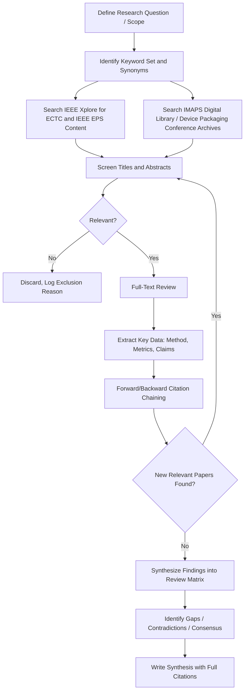

## Literature Review Methodology Using ECTC, IMAPS, and IEEE EPS Proceedings

### Overview and Purpose

Structured literature review is a core research skill for staying current in advanced packaging and heterogeneous integration, a field where progress moves faster than textbooks can track. ECTC (Electronic Components and Technology Conference), IMAPS (International Microelectronics Assembly and Packaging Society) symposia, and IEEE EPS (Electronics Packaging Society, publisher of journals such as IEEE Transactions on Components, Packaging and Manufacturing Technology) are the three most authoritative primary-literature sources in this domain. Learning to search, filter, and synthesize across them is a distinct methodological skill from general academic literature review.

**Key Points**

- ECTC is the flagship annual conference (IEEE EPS and ASME co-sponsored) covering the full breadth of packaging: materials, interconnects, thermal, reliability, 3D/2.5D integration, and emerging heterogeneous integration topics
- IMAPS conferences and its associated journal emphasize microelectronics assembly, hybrid integration, and often carry stronger industrial/manufacturing process orientation
- IEEE EPS publishes peer-reviewed journal content (slower cycle, higher archival rigor) that frequently represents matured, extended versions of conference work first presented at ECTC or IMAPS

### Why Conference Proceedings Matter More Here Than in Some Fields

- Advanced packaging is a fast-moving, industrially-driven field; state-of-the-art results (e.g., a new hybrid bonding pitch record, a novel chiplet interconnect scheme) are typically first disclosed at ECTC months to years before an extended journal version appears, if one appears at all
- Many high-value contributions (process yield data, novel material characterization, first silicon results) are only ever published as conference papers, never journalized
- Conference proceedings serve as the primary "state of the art" signal for roadmapping purposes (comparable in function to ITRS/IRDS roadmap documents but at the level of individual research results)

### Structured Literature Review Workflow

### Search Strategy and Keyword Construction

#### Building an Effective Search Query

- Start broad with core terminology, then narrow using Boolean operators and field-specific filters (publication venue, year range, author)
- Account for terminology drift: the same underlying technology is often described with different terms across years or vendors (e.g., "hybrid bonding" vs. "direct bond interconnect" vs. "Cu-Cu bonding"; "chiplet" vs. "die disaggregation" vs. "multi-die integration")
- Combine a technology term with a metric/property term to narrow results: e.g., "hybrid bonding" AND "bond pitch" AND "reliability"

**Key Points — Practical Search Term Table**

| Topic Area | Core Terms | Related/Alternate Terms |
| --- | --- | --- |
| Fine-pitch bonding | hybrid bonding, Cu-Cu bonding | direct bond interconnect (DBI), wafer-to-wafer bonding |
| 3D stacking | TSV, through-silicon via | 3D IC, die stacking, vertical interconnect |
| Chiplet integration | chiplet, die disaggregation | UCIe, heterogeneous integration, multi-die SiP |
| Fan-out packaging | FOWLP, fan-out wafer-level | eWLB, InFO, RDL-first |
| Thermal management | thermal interface material, TIM | vapor chamber, embedded cooling, liquid cooling |
| Reliability | thermal cycling, drop test | electromigration, HAST, board-level reliability |

#### Access Points

- **IEEE Xplore Digital Library**: primary access point for ECTC proceedings (indexed as IEEE conference publications) and IEEE EPS Transactions journal content; supports advanced Boolean search, citation export, and "cited by" forward-chaining
- **IMAPS Digital Library / Device Packaging Conference archives**: primary access point for IMAPS symposium proceedings; search interface and indexing depth vary and may be less comprehensive than IEEE Xplore's metadata structure
- Many institutions provide access via library subscription; abstracts are typically publicly viewable even without full-text institutional access, which is sufficient for initial relevance screening

### Screening and Triage Methodology

A disciplined screening process prevents literature review from becoming an unstructured, unbounded reading exercise.

**Example**

A practical two-pass screening protocol:

1. **Pass 1 (title/abstract only)**: read title and abstract; assign a relevance flag (Include / Exclude / Maybe) based on whether the paper directly addresses the research question's technology, metric, or application space
2. **Pass 2 (full text on Include + Maybe)**: read introduction and conclusion sections fully; skim methodology and results figures; re-flag "Maybe" papers as Include or Exclude based on this deeper pass
3. Log exclusion reasons systematically (e.g., "wrong material system," "no quantitative data," "superseded by newer paper from same group") — this log prevents accidental re-review of already-screened papers and supports a defensible, auditable review trail

### Citation Chaining Technique

**Key Points**

- **Backward chaining**: examine the reference list of a highly relevant paper to find earlier foundational work it builds on
- **Forward chaining**: use "cited by" functionality (available in IEEE Xplore, Google Scholar) to find newer papers that cite a known key paper — critical for finding the most recent state-of-the-art building on a known result
- Iterating backward and forward chaining from 2-3 strong "seed papers" typically surfaces the core citation network of a subtopic more efficiently than keyword search alone, since author terminology varies but citation relationships are explicit
- Cross-referencing between ECTC/IMAPS conference papers and their later IEEE EPS Transactions journal extensions (often by the same authors, same title with added data) helps identify which conference claims were validated with more rigorous follow-up data

### Data Extraction and Synthesis Matrix

Systematic extraction into a structured comparison table is the practical mechanism that turns a stack of papers into a synthesizable literature review.

**Example**

| Paper (Author, Year, Venue) | Technology/Method | Key Metric Reported | Claimed Advantage | Limitation Noted | Relevance to Research Question |
| --- | --- | --- | --- | --- | --- |
| Smith et al., 2024, ECTC | Cu-Cu hybrid bonding | 4 µm pitch, <5 mΩ contact resistance | Enables higher I/O density than micro-bump | Requires sub-nm surface roughness control | Directly relevant — pitch scaling limit |
| Lee et al., 2023, IEEE Trans. CPMT | Hybrid bonding reliability | 1000 thermal cycles, <10% resistance shift | Extended reliability dataset vs. conference version | Single test vehicle, one material stack | Supports reliability claim |
| Patel et al., 2024, IMAPS | Alternative bonding process | 8 µm pitch, lower cost process | Reduced CapEx vs. plasma activation | Lower density than hybrid bonding | Comparative baseline |

- Extracting into this format across 15-30+ papers on a subtopic makes contradictions, consensus points, and gaps visually apparent in a way that reading papers sequentially does not
- Pay particular attention to reported test conditions and sample sizes — a headline metric (e.g., "4 µm pitch achieved") without accompanying yield or reliability data is a materially different claim than the same metric with a large validated dataset

### Identifying Gaps, Contradictions, and Consensus

**Key Points**

- **Consensus**: when multiple independent groups (different companies/institutions) report converging results or design guidance, this indicates a maturing, reliable finding
- **Contradiction**: when two papers report conflicting results under seemingly similar conditions, this is often the most valuable literature review finding — it usually points to an unstated variable (different material supplier, different test methodology, different sample size) worth investigating directly
- **Gap**: absence of published work at a particular pitch, material combination, or reliability condition often signals either an unsolved technical challenge or a competitively sensitive area companies are not yet disclosing
- [Inference] Because ECTC and IMAPS papers frequently originate from industrial R&D groups, some results may reflect optimized, best-case demonstration conditions rather than typical production yield, so triangulating a headline number against multiple independent sources before treating it as representative is good practice

### Citation Management and Documentation

- Use reference management software (Zotero, Mendeley, EndNote) to maintain a structured library with tags reflecting the review's taxonomy (e.g., tag by technology, by metric type, by relevance tier)
- Export citation metadata directly from IEEE Xplore (BibTeX, RIS formats supported) to avoid manual transcription errors in author names, DOIs, and page numbers
- Maintain a running annotated bibliography alongside the extraction matrix — brief per-paper notes capturing why the paper mattered to the review, which is often lost if only the matrix is kept

### Literature Review Process Flow for a Subtopic

<svg xmlns="http://www.w3.org/2000/svg" viewBox="0 0 640 300">
<text x="320" y="24" font-size="16" font-family="sans-serif" font-weight="bold" text-anchor="middle" fill="#222">Seed-and-Chain Review Process (svg_diagram)</text>
<circle cx="120" cy="150" r="40" fill="#a9c4e8" stroke="#333" stroke-width="1.5" />
<text x="120" y="145" font-size="11" font-family="sans-serif" text-anchor="middle" fill="#222">Seed Paper</text>
<text x="120" y="160" font-size="10" font-family="sans-serif" text-anchor="middle" fill="#222">(ECTC 2023)</text>
<line x1="160" y1="130" x2="260" y2="90" stroke="#333" stroke-width="1.5" marker-end="url(#arr2)" />
<line x1="160" y1="170" x2="260" y2="210" stroke="#333" stroke-width="1.5" marker-end="url(#arr2)" />
<circle cx="300" cy="80" r="32" fill="#e8dfc8" stroke="#333" stroke-width="1" />
<text x="300" y="78" font-size="10" font-family="sans-serif" text-anchor="middle" fill="#222">Backward</text>
<text x="300" y="90" font-size="10" font-family="sans-serif" text-anchor="middle" fill="#222">Citation</text>
<circle cx="300" cy="220" r="32" fill="#c8e0a9" stroke="#333" stroke-width="1" />
<text x="300" y="218" font-size="10" font-family="sans-serif" text-anchor="middle" fill="#222">Forward</text>
<text x="300" y="230" font-size="10" font-family="sans-serif" text-anchor="middle" fill="#222">Citation</text>
<line x1="332" y1="80" x2="440" y2="80" stroke="#333" stroke-width="1.5" marker-end="url(#arr2)" />
<line x1="332" y1="220" x2="440" y2="220" stroke="#333" stroke-width="1.5" marker-end="url(#arr2)" />
<rect x="440" y="50" width="150" height="60" fill="#fff3d6" stroke="#333" stroke-width="1" />
<text x="515" y="75" font-size="10" font-family="sans-serif" text-anchor="middle" fill="#222">Foundational IMAPS</text>
<text x="515" y="90" font-size="10" font-family="sans-serif" text-anchor="middle" fill="#222">/ IEEE EPS papers</text>
<rect x="440" y="190" width="150" height="60" fill="#fff3d6" stroke="#333" stroke-width="1" />
<text x="515" y="215" font-size="10" font-family="sans-serif" text-anchor="middle" fill="#222">Newer ECTC 2024-25</text>
<text x="515" y="230" font-size="10" font-family="sans-serif" text-anchor="middle" fill="#222">follow-on results</text>
</svg>

### Distinguishing Conference vs. Journal Rigor

**Key Points**

- ECTC and IMAPS conference papers undergo peer review but on a compressed timeline relative to journals, and page limits often constrain the amount of supporting data and methodological detail included
- IEEE EPS Transactions journal papers typically undergo more extensive peer review rounds and permit more complete methodology, statistical treatment, and expanded datasets
- When a conference finding is important to a review's conclusions, actively searching for a corresponding journal extension (often published 6-18 months later by the same author group) provides higher-confidence data before relying heavily on the conference-only version
- [Unverified] Not every significant conference result receives a journal extension; the absence of one should not automatically be read as a negative signal, since many industrial authors do not pursue journal publication for competitive or resource reasons

### Practical Exercise Framework

**Example**

A structured practice exercise for building this skill:

1. Select a narrow, well-defined research question (e.g., "What contact resistance values have been reported for sub-5 µm pitch hybrid bonding as of the most recent ECTC?")
2. Conduct an initial IEEE Xplore search limited to ECTC and IEEE EPS Transactions, plus a parallel IMAPS digital library search
3. Screen the first 30-50 results using the two-pass protocol described above
4. Select 3 strong seed papers and perform one round of backward and forward citation chaining
5. Build a data extraction matrix across all included papers (target 10-15 papers for a focused subtopic)
6. Write a one-page synthesis identifying the current best-reported metric, the method used to achieve it, and at least one open question or contradiction found in the literature
7. Peer-review the synthesis with a lab partner or instructor, checking specifically for unsupported claims not traceable to a specific cited source

**Next Steps**

- Citation management tool setup and workflow (Zotero/Mendeley configuration for a packaging research library)
- Reading and critically evaluating packaging reliability test data and statistical claims
- Roadmap documents (IRDS Heterogeneous Integration Roadmap) as a complementary synthesis source to primary literature
- Patent literature search as a complementary source alongside conference/journal proceedings
- Writing a technical literature review report or survey paper structure
- Tracking terminology evolution and standards bodies (JEDEC, SEMI) relevant to packaging literature