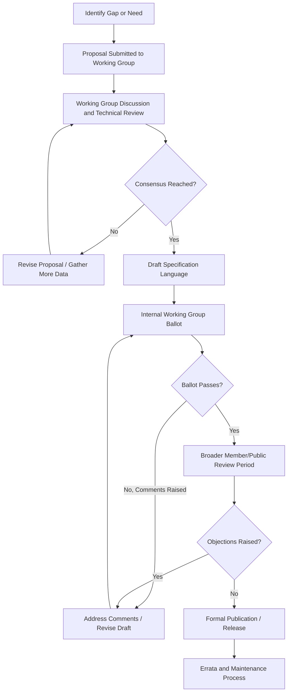
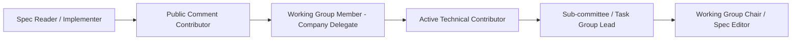

## Contributing to Open Standards and Consortium Working Groups

### Overview and Purpose

Advanced packaging and heterogeneous integration is shaped heavily by industry consortia and standards bodies that define interoperability specifications, test methodologies, and material/process guidelines. Learning to engage with these bodies — as a contributor, reviewer, or implementer — is a practical professional skill distinct from pure technical R&D, since standards work involves consensus-building, formal process navigation, and cross-company technical negotiation.

**Key Points**

- Standards enable multi-vendor interoperability (e.g., a chiplet from one company connecting to a die from another via a common interface standard)
- Consortium participation provides early visibility into roadmap direction before it becomes public, along with influence over specification details relevant to one's own technology
- Contribution models range from passive (reading/implementing published specs) to active (submitting proposals, chairing working groups, voting on ballots)

### Key Organizations Relevant to Advanced Packaging

| Organization | Focus Area | Example Output |
| --- | --- | --- |
| JEDEC | Memory and package reliability/mechanical standards | JESD22 (reliability test methods), JESD15 (compact thermal models) |
| SEMI | Equipment, materials, and manufacturing standards | Wafer/panel handling specs, materials characterization standards |
| UCIe Consortium | Die-to-die chiplet interconnect standard | UCIe specification (physical layer, protocol layer for chiplet interconnect) |
| IEEE (various working groups) | Broad electronics/packaging standards | IEEE P1838 (test access for 3D SICs), heterogeneous integration standards |
| IPC | Assembly, design, and acceptability standards | IPC-A-610, IPC-7095 (BGA design/inspection) |
| Open Compute Project (OCP) | Data center hardware interoperability, including packaging-adjacent thermal/mechanical specs | OCP thermal and mechanical design specifications |
| CXL Consortium | Interconnect protocol (adjacent to chiplet packaging via UCIe-CXL relationship) | CXL specification revisions |

**Key Points**

- [Inference] The relevant standards body for a given engineer depends heavily on their specific technical focus — a materials engineer is more likely to engage with SEMI or JEDEC reliability groups, while a system architect working on chiplet interfaces is more likely to engage with UCIe or CXL
- Some consortia (UCIe, CXL) are relatively young and rapidly evolving as heterogeneous integration adoption accelerates, meaning working group activity and specification revision cadence can be faster than in more mature bodies like JEDEC

### General Standards Development Lifecycle

- This generalized lifecycle applies conceptually across most consortia, though specific terminology, ballot thresholds, and review period lengths differ by organization and are defined in each body's governing bylaws/procedures document
- [Unverified] Exact timelines from proposal to publication vary widely (months to multiple years) depending on the organization, complexity of the technical issue, and level of cross-company consensus required, and should be confirmed against the specific organization's published process documentation rather than assumed generically

### Pathways to Participation

#### Membership Tiers and Access

- Most consortia (UCIe, CXL, OCP) operate tiered membership (e.g., Promoter/Board, Contributor, Adopter/Community), with contribution rights and voting weight typically scaled to membership tier and associated dues
- Some standards bodies (IEEE working groups, certain SEMI committees) allow individual or academic participation with lower or no membership cost, particularly for pre-ratification working group discussion
- [Inference] Given that many consortia in this space are member-company driven, the most common practical pathway for an individual engineer to participate is through their employer's existing membership, rather than independent personal membership, though this varies by organization and membership tier structure

#### Typical Entry Points for a New Contributor

1. **Read and implement the published specification** — the most common and lowest-barrier form of engagement; implementers often surface real-world ambiguities or edge cases that feed back into future revisions via errata submissions
2. **Attend public webinars, workshops, or open working group calls** where available, to understand current discussion topics before attempting to contribute technically
3. **Submit technical comments during public review/ballot periods** — many bodies solicit public comment on draft specifications before ratification
4. **Join a working group as company representative** — typically requires employer membership and formal delegate designation
5. **Propose a technical contribution or errata** — presenting data, a use case, or a specific technical gap to a working group, usually starting as a written contribution document reviewed at a working group meeting

### Anatomy of a Technical Contribution

**Example**

A representative structure for a working-group technical contribution document:

1. **Problem statement** — clearly define the technical gap, ambiguity, or limitation in the current specification
2. **Motivating use case** — describe a concrete scenario (e.g., a specific chiplet interconnect configuration) where the current spec is insufficient or unclear
3. **Proposed solution or specification text** — draft language, often shown as redline/tracked-changes against the existing specification text
4. **Supporting data** — measurement results, simulation data, or analysis substantiating the proposal's technical soundness
5. **Impact analysis** — how the proposed change affects backward compatibility, other spec sections, or existing implementations
6. **Open issues / discussion points** — explicitly flag unresolved questions for working group discussion rather than presenting the proposal as complete and final

**Key Points**

- Contributions are strengthened substantially by real data (silicon measurements, simulation results, test data) rather than purely theoretical argument, since working groups weigh evidence heavily in consensus-building
- Framing a contribution around a shared industry problem (interoperability risk, reliability gap affecting multiple members) tends to build consensus faster than framing around a single company's specific product need
- Anticipating counterarguments and alternative approaches in the contribution itself, rather than only in live discussion, demonstrates preparation and typically shortens the discussion-to-consensus cycle

### Consensus-Building and Negotiation Dynamics

Standards work is inherently a multi-stakeholder negotiation process, distinct from single-organization technical decision-making.

**Key Points**

- Working groups typically include representatives from competing companies, each with potentially different technical preferences shaped by their own existing product architecture — a specification choice that is trivial for one company's architecture may require significant redesign for another's
- Effective participation often requires distinguishing between a **technical objection** (the proposal will not work, or has a demonstrable flaw) and a **strategic objection** (the proposal conflicts with a company's own roadmap or competitive position) — the two require different responses in discussion
- Building informal alignment with other working group participants before a formal ballot (sometimes called "hallway consensus" at in-person meetings) frequently accelerates formal approval, since surprises at ballot time are more likely to generate objections
- Chairs and technical editors play a disproportionately influential role in shaping how competing proposals are reconciled into final specification text; understanding a working group's specific governance structure and who holds these roles is practically useful

### Working Group Roles and Progression

- Progression along this path is not mandatory or linear — many valuable contributors remain at the "active technical contributor" level indefinitely, focusing depth of technical input over administrative/leadership roles
- Editor and chair roles typically require sustained multi-year engagement and are usually filled through election or appointment processes defined in each organization's bylaws

### Errata, Interoperability Testing, and Post-Ratification Contribution

- Published specifications are not static; errata processes allow correction of ambiguities or errors discovered during implementation
- Interoperability/plugfest events (common in interconnect standards like UCIe and CXL) bring multiple vendors together to test real implementations against each other and against the specification, frequently surfacing issues that feed directly back into errata or the next specification revision
- Contributing interoperability test results or compliance test suite development is a valuable, often underrepresented, form of participation compared to pure specification-drafting contribution

### Practical Exercise Framework

**Example**

A structured exercise for building standards-contribution skill without requiring formal consortium membership:

1. Select a publicly available specification excerpt relevant to a packaging interconnect or reliability test method (many organizations publish overview or older superseded specification versions publicly, even when the latest revision is member-gated)
2. Identify one genuine ambiguity, edge case, or gap in the specification's coverage relative to a real technical scenario
3. Draft a mock technical contribution document following the structure outlined above, including a problem statement, use case, proposed redline text, and open issues
4. Present the contribution to a peer group or instructor role-playing as a working group, soliciting both technical and "company-interest" style objections
5. Revise the proposal based on feedback, practicing the consensus-building skill of incorporating competing input without losing the core technical intent
6. Discuss how the exercise's dynamics would differ in a real multi-company setting where competitive interests, not just technical correctness, shape the outcome

### Common Pitfalls for New Contributors

**Key Points**

- Submitting a contribution framed entirely around a single company's proprietary need, without generalizing to the broader interoperability problem, often stalls in working group discussion
- Underestimating the importance of backward compatibility analysis — a technically elegant proposal that breaks existing implementations faces much higher resistance regardless of its technical merit
- Treating a working group meeting as a one-way presentation rather than an interactive discussion; the most effective contributors actively solicit and incorporate feedback rather than defending an unchanged proposal across multiple meetings
- Underestimating the time investment required; meaningful influence over a specification typically requires sustained participation across multiple meeting cycles rather than a single contribution

**Next Steps**

- UCIe and CXL specification architecture and chiplet interconnect protocol layers
- JEDEC reliability test methodology (JESD22 series) and compact thermal modeling (JESD15)
- Interoperability/plugfest event structure and compliance test suite development
- Technical writing and specification-drafting skills for standards documents
- Roadmap alignment: relating consortium specification direction to the IRDS Heterogeneous Integration Roadmap
- Intellectual property policy considerations in standards participation (RAND/FRAND licensing basics)