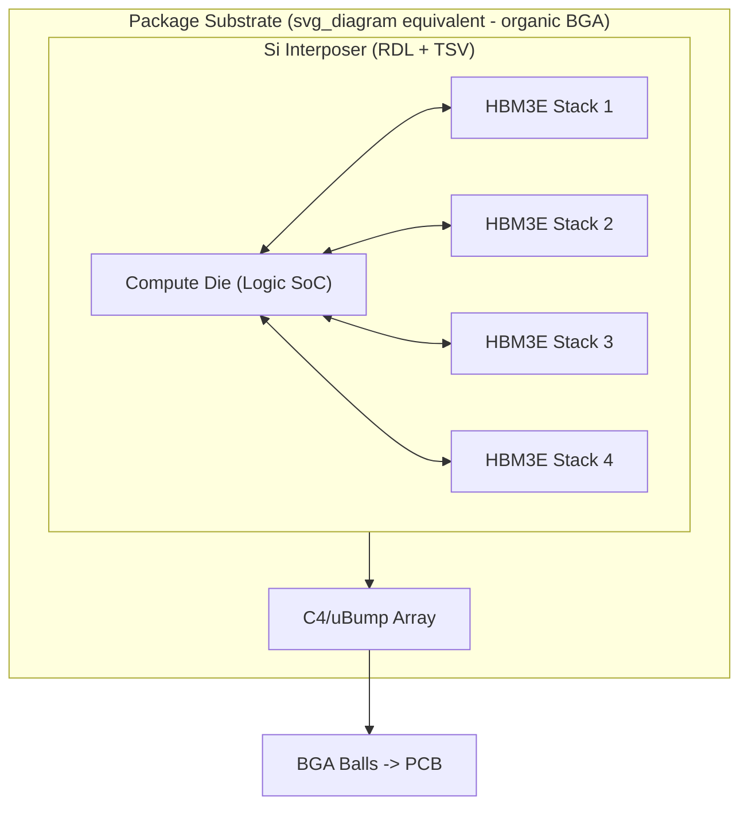
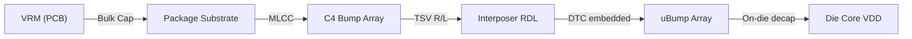
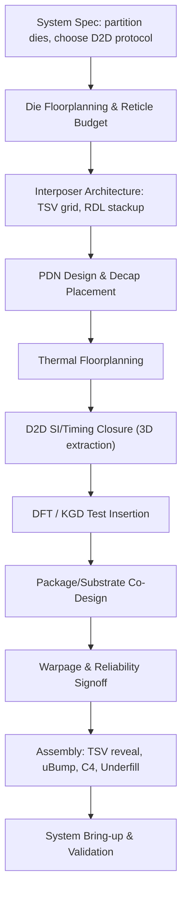

## Designing a 2.5D Interposer-Based Multi-Die System

### Overview

A 2.5D interposer-based multi-die system integrates multiple dies (logic, memory, I/O chiplets) side-by-side on a passive or active interposer, which itself sits on a package substrate. The interposer provides high-density redistribution layers (RDL) and through-silicon vias (TSVs) to route signals between dies at fine pitch, bridging the enormous gap between on-die wiring pitches (tens of nanometers) and organic substrate pitches (tens of microns). This capstone-level design exercise integrates die partitioning, interposer routing, TSV design, power delivery, thermal management, and system-level signoff into a single coherent flow.

### System Architecture Definition

**Key Points**

- Define the die-to-die (D2D) partition: e.g., a large logic/compute die (SoC or GPU tile) plus one or more High Bandwidth Memory (HBM) stacks, plus optional I/O or transceiver chiplets.
- Choose interposer type: silicon interposer (passive, active/embedded RDL), or RDL-based fan-out interposer (e.g., InFO_oS, CoWoS variants).
- Determine interconnect standard for inter-die links: HBM PHY (JEDEC HBM3/HBM3E), UCIe (Universal Chiplet Interconnect Express), or a proprietary parallel bus.

**Example**

A typical AI accelerator capstone target: 1x compute die (reticle-limited, ~700–800 mm²) + 4–8x HBM3E stacks + optional base-die/active-interposer for power management, connected via a silicon interposer with 2 μm–10 μm line/space RDL and 5–10 μm TSVs.

### Die Partitioning and Floorplanning

**Key Points**

- Partition functionality across dies to optimize yield: smaller dies have exponentially better yield than one large monolithic die (Murphy's yield model), which is the primary economic driver for 2.5D/chiplet adoption.
- Floorplan die placement on the interposer to minimize D2D wire length, respect keep-out zones around TSVs, and align micro-bump arrays for memory PHYs.
- Reticle-limit constraint: standard photolithography reticle is ~26 mm × 33 mm (~858 mm²); an interposer can exceed this via stitching, but stitched interposers add cost and yield risk.

**Example**

Yield comparison using a simple Poisson/Murphy model:

$$Y = \left(\frac{1 - e^{-DA}}{DA}\right)$$

where $D$ is defect density (defects/cm²) and $A$ is die area (cm²). Splitting a 600 mm² monolithic die into two 300 mm² dies raises composite yield significantly when $D$ is held constant, since yield loss scales worse than linearly with area.

### Interposer Design (Passive Silicon)

**Key Points**

- **Structure**: thinned silicon wafer (50–100 μm typical after backgrind) with TSVs etched through, backside RDL, and 2–4 layers of frontside Cu damascene RDL for fine-pitch routing.
- **TSV formation**: via-middle process is standard — TSVs etched and filled with Cu (via electroplating) after front-end transistor formation (if active) or directly into blank silicon (if passive), before backside reveal.
- **TSV dimensions**: typical diameter 5–10 μm, depth (post-thinning) 50–100 μm, giving aspect ratios of ~10:1.
- **RDL pitch**: silicon interposer RDL achieves 0.4–2 μm line/space using damascene Cu processes, far finer than organic substrate (~10–15 μm minimum for advanced substrates).
- Passive interposers carry no active transistors — only wiring and TSVs — simplifying qualification but limiting functionality to routing/power distribution.

**Example: TSV Electrical Model**

A TSV is modeled as an RLC element:

$$R_{TSV} = \frac{\rho \cdot h}{\pi r^2}$$

$$C_{TSV} = \frac{2\pi \varepsilon_{ox} h}{\ln(r_{ox}/r)}$$

where $h$ is TSV height, $r$ is via radius, $r_{ox}$ is the liner+radius, $\rho$ is Cu resistivity, and $\varepsilon_{ox}$ is the liner dielectric permittivity. TSV parasitic capacitance is a dominant contributor to signal integrity budgets in dense TSV arrays.

### Micro-bump and Hybrid Bonding Interconnects

**Key Points**

- **Micro-bumps (uBumps)**: solder-capped Cu pillars connecting die to interposer, typical pitch 40–55 μm in current 2.5D production (CoWoS-class), trending toward 25–35 μm.
- **Hybrid bonding (Cu-Cu direct bond)**: emerging alternative for die-to-die or die-to-wafer stacking at ≤10 μm pitch, eliminating bump-limited pitch scaling and solder reflow reliability concerns. [Inference: adoption in 2.5D-specific interposer contexts, as opposed to 3D stacking, is still comparatively limited and roadmap-dependent as of current public disclosures.]
- Bump pitch directly gates I/O density; HBM PHY channels require thousands of parallel micro-bumps per stack (e.g., 1024-bit wide data bus at HBM3/3E).

### Power Delivery Network (PDN) Design

**Key Points**

- PDN must traverse: PCB → package substrate → C4 bumps → interposer RDL/TSVs → micro-bumps → die. Each transition adds parasitic resistance and inductance.
- TSVs used for power/ground carry significant current density; array sizing must respect electromigration (EM) limits.
- On-interposer decoupling: deep trench capacitors (DTCs) or embedded MIM capacitors can be integrated into active/passive interposers to reduce PDN impedance at high frequencies, since off-die decaps are too far (high loop inductance) to suppress fast di/dt transients.
- Target: flat PDN impedance $Z_{PDN}(f)$ below the target impedance $Z_{target} = \Delta V / \Delta I$ across the relevant frequency spectrum, typically requiring a multi-tier decap strategy (bulk caps on PCB, MLCCs on substrate, DTCs on interposer, on-die decap).

**Example: PDN Segment as Ladder Network**

### Thermal Management

**Key Points**

- Stacked/co-planar dies on an interposer create localized hotspots; the compute die (highest power density) typically dominates thermal budget while adjacent HBM stacks have strict junction temperature limits (often ≤85–95 °C for reliable operation).
- Silicon interposer has relatively high thermal conductivity (~150 W/m·K) and can act as a lateral heat spreader between dies, but TSV density and RDL metal fill also influence effective thermal conductivity anisotropically.
- Thermal-aware floorplanning: place high-power dies with adequate spacing from thermally sensitive memory stacks; consider dummy Cu thermal vias in areas without signal TSVs.
- System-level solutions: integrated heat spreader (IHS), vapor chamber, or direct liquid cooling for high-TDP capstone designs (>500 W package power is common in modern AI accelerators).

**Example: 1D Thermal Resistance Model**

$$T_{junction} = T_{ambient} + P \times (R_{θJC} + R_{θCS} + R_{θSA})$$

where $R_{θJC}$, $R_{θCS}$, $R_{θSA}$ are junction-to-case, case-to-sink, and sink-to-ambient thermal resistances respectively.

### Signal Integrity and Timing Closure Across the Interposer

**Key Points**

- D2D interfaces must close timing across die-interposer-die boundary, accounting for RDL trace RC delay, TSV parasitics, and micro-bump parasitics — modeled as an extended interconnect corner in STA (static timing analysis) flows.
- Crosstalk and IR-drop-induced jitter become significant at the fine pitches involved; 3D extraction (field solver-based, e.g., via industry tools) is generally required rather than 2D approximations, since RDL and TSV geometries are non-planar.
- For HBM PHY specifically, the JEDEC spec defines tight skew and eye-mask requirements across the interposer channel that must be validated with combined SPICE/IBIS-AMI channel simulation.

### Verification, DFT, and Known-Good-Die (KGD) Strategy

**Key Points**

- Known-Good-Die testing before assembly is critical: a defective HBM stack or compute die bonded onto an interposer cannot be economically reworked, so pre-bond test coverage directly affects assembly yield.
- Mid-bond and post-bond test access (via TSV-based test structures, boundary scan extensions for D2D interfaces such as IEEE 1838) enables detecting interconnect-level defects (bump opens/shorts, TSV voids) after assembly.
- Design-for-test additions: TSV redundancy (spare TSVs with post-bond repair/rerouting), built-in self-test (BIST) for HBM channels.

### Package-Level Integration and Substrate Co-Design

**Key Points**

- The interposer assembly (dies + interposer) is itself flip-chip bonded onto an organic package substrate via C4 bumps (typically 150–200 μm pitch), which then connects to the PCB via BGA balls.
- Substrate must fan out from fine C4 pitch to coarser BGA pitch using its own multi-layer RDL — co-design between interposer RDL and substrate RDL avoids routing congestion and via count mismatches.
- Warpage management is critical: large interposers (especially at reticle-stitched sizes) combined with CTE (coefficient of thermal expansion) mismatch between silicon (~2.6 ppm/°C) and organic substrate (~15–18 ppm/°C) can cause bow/warpage during reflow, risking bump cracking — mitigated via stiffener rings, controlled collapse chip connection (C4) underfill, and optimized cure profiles.

### Design Flow Summary (End-to-End)

### Capstone Deliverables Checklist

- **Output**: Full floorplan (die placement, TSV keep-out zones, RDL layer stackup) with justification of reticle/yield tradeoffs.
- **Output**: PDN impedance analysis across PCB-to-die path with target impedance verification.
- **Output**: Thermal simulation results (steady-state $T_j$ per die) under worst-case workload power map.
- **Output**: D2D channel timing/SI report for at least one high-speed interface (e.g., HBM3E or UCIe).
- **Output**: DFT/KGD test plan covering pre-bond and post-bond defect coverage.
- **Output**: Warpage/reliability risk assessment with mitigation plan (stiffener, underfill selection).

### Common Pitfalls

- Underestimating TSV parasitic impact on PDN and signal timing during early architecture exploration, leading to late-stage re-spins.
- Treating interposer RDL routing as a 2D problem when TSV via-last/via-middle topology introduces genuine 3D coupling effects requiring field-solver-based extraction.
- Ignoring KGD test coverage economics — a single defective HBM stack discovered only after full assembly can scrap an entire multi-thousand-dollar module.
- Neglecting CTE-mismatch-driven warpage until late package qualification, forcing substrate or stiffener redesign.

**Related Topics**

- 3D IC stacking and hybrid bonding architectures (die-to-wafer, wafer-to-wafer)
- UCIe protocol stack and PHY layer design for chiplet interconnect
- Fan-out wafer-level packaging (InFO, eWLB) as an RDL-interposer alternative
- Warpage simulation and substrate co-design methodologies
- Thermal-aware 3D floorplanning algorithms for multi-die systems
- Known-Good-Die (KGD) test economics and IEEE 1838 3D-DFT standard
- Chiplet ecosystem standards (UCIe Consortium, Open Domain-Specific Architecture)