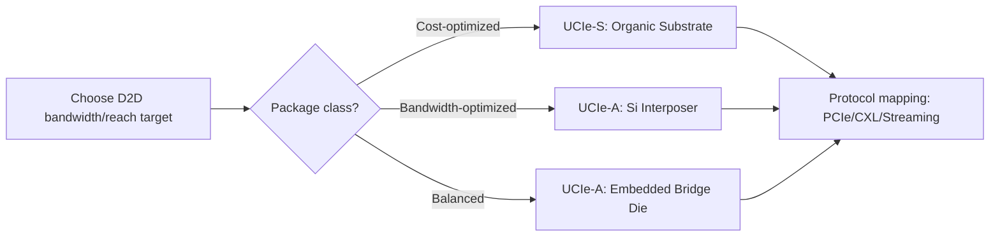

## Architecting a Chiplet-Based SoC Using UCIe Interconnect


### Overview

Universal Chiplet Interconnect Express (UCIe) is an open industry standard defining the die-to-die (D2D) physical layer, protocol stack, and software model for connecting chiplets from potentially different vendors and process nodes into a single package as a cohesive SoC. Architecting a UCIe-based chiplet SoC requires decisions spanning physical layer (PHY) selection, protocol layer mapping, package integration (2D/2.5D/3D), power/thermal co-design, and system-level software enablement (device discovery, RAS, management).

### UCIe Protocol Stack

**Key Points**

- **Physical Layer (PHY)**: analog/mixed-signal layer handling bump mapping, AC/DC signaling, link training, and sideband. Defines two flavors — Standard Package (UCIe-S) for organic substrates and Advanced Package (UCIe-A) for silicon interposer/bridge-based fine-pitch integration.
- **Die-to-Die Adapter**: sits above the PHY; manages link state machine, parameter negotiation, virtual channel arbitration, CRC/retry, and protocol multiplexing.
- **Protocol Layer**: maps standard protocols onto the D2D link — PCIe, CXL (Compute Express Link), or a raw "Streaming" mode for custom/proprietary protocols.

```mermaid
flowchart TB
    subgraph DieA["Chiplet A"]
        ProtoA["Protocol Layer (PCIe/CXL/Streaming)"]
        AdapterA["D2D Adapter"]
        PhyA["UCIe PHY"]
        ProtoA --> AdapterA --> PhyA
    end
    subgraph DieB["Chiplet B"]
        ProtoB["Protocol Layer (PCIe/CXL/Streaming)"]
        AdapterB["D2D Adapter"]
        PhyB["UCIe PHY"]
        ProtoB --> AdapterB --> PhyB
    end
    PhyA <-->|Raw D2D Interconnect| PhyB
```

### PHY Configurations: Standard vs Advanced Package

**Key Points**

- **UCIe-S (Standard Package)**: targets organic substrate integration, bump pitch ~100–130 μm, lane counts per module typically 16, reach up to ~25–45 mm, lower cost/complexity, suited for cost-sensitive multi-die SoCs.
- **UCIe-A (Advanced Package)**: targets silicon interposer, RDL interposer, or bridge-die (e.g., embedded bridge) integration, bump pitch ~25–55 μm (and scaling finer), much higher bandwidth density per mm of die edge, shorter reach (<2 mm typical), suited for HPC/AI accelerator-class designs.
- Per-pin data rate: UCIe 1.x/2.x specifications define data rates in the multi-GT/s range with roadmap scaling across generations; exact figures should be checked against the current UCIe specification revision since the standard iterates rapidly.

**Bandwidth Density Comparison**

| Parameter | UCIe-S | UCIe-A |
| --- | --- | --- |
| Bump pitch | ~100–130 μm | ~25–55 μm |
| Typical reach | ~25–45 mm | <2 mm |
| Package type | Organic substrate | Si interposer / RDL bridge |
| Use case | Cost-sensitive, modular SoC | HPC/AI, bandwidth-dense compute |

[Unverified: exact per-generation data-rate and bandwidth-density numbers change across UCIe spec revisions (1.0, 1.1, 2.0, and later); consult the current UCIe Consortium specification for the authoritative figures at design time.]

### Architectural Partitioning Strategy

**Key Points**

- Partition the SoC into chiplets along natural functional and process-node boundaries: compute cores on a leading-edge node, I/O/SerDes/analog on a trailing-edge node (cost optimization), memory controllers adjacent to memory-facing chiplets.
- UCIe enables "mix-and-match" heterogeneous integration — different foundries/nodes per chiplet — as long as each exposes a UCIe-compliant PHY and adapter.
- Design the on-die protocol mapping: decide whether inter-chiplet traffic rides over CXL.io/CXL.mem/CXL.cache semantics (for coherent memory/cache extension across chiplets) or plain PCIe (for I/O-style traffic) or raw streaming (for proprietary NoC extension across dies).

**Example**

A capstone chiplet SoC: 1x compute die (CPU cores + last-level cache) + 1x I/O die (PCIe/DDR/USB controllers) + 1x accelerator die (e.g., NPU), all interconnected via UCIe-A over a silicon bridge, with CXL.mem used to extend a coherent memory fabric across the compute and accelerator dies.

### Link Training and Sideband Management

**Key Points**

- UCIe defines a **mainband** (data path) and **sideband** (low-speed, always-on auxiliary channel) used for link training, parameter exchange, register access, and lane repair/remapping before the mainband is trained.
- Link training proceeds through defined states (reset, sideband detect, mainband training, link initialization, active) — architecturally analogous to PCIe LTSSM but adapted for die-to-die characteristics (much shorter, lower-latency channels).
- Lane repair: UCIe supports spare lanes so that a certain number of failed bumps/lanes can be remapped post-manufacturing without failing the whole link — critical for yield in fine-pitch advanced-package configurations.

### Protocol Layer Mapping Choices

**Key Points**

- **PCIe mapping**: treats chiplets as PCIe endpoints/root complexes across the D2D link; reuses existing PCIe software stack (enumeration, config space, drivers) with minimal OS-visible changes — good for I/O-style chiplet disaggregation.
- **CXL mapping**: enables coherent memory and cache-line-granular traffic across chiplets, appropriate when treating disaggregated dies as part of one coherent domain (e.g., memory-expansion chiplets, coherent accelerator chiplets).
- **Streaming mode**: raw, low-overhead mode for proprietary NoC/fabric protocols where the SoC architect controls both ends of the link and doesn't need PCIe/CXL semantics — often used for chiplet-internal fabric extension (e.g., extending an AXI/CHI-like fabric across the D2D boundary).

### Physical Integration Path Selection

**Key Points**

- Choose the package integration approach: organic substrate with UCIe-S bumps (lowest cost, moderate bandwidth), silicon interposer with UCIe-A (2.5D, highest bandwidth density, higher cost — see companion 2.5D interposer design topic), or embedded silicon bridge (e.g., localized high-density bridge embedded in an otherwise organic substrate, balancing cost and bandwidth).
- Co-design UCIe PHY bump maps with the chosen package's achievable RDL pitch and via density; UCIe-A pitches assume interposer-class fine-pitch RDL, so an organic-substrate-only flow cannot support UCIe-A specifications.



### Power, Reliability, and RAS Considerations

**Key Points**

- D2D PHY typically supports multiple power/link states (e.g., active, low-power standby, off) to manage energy proportional to traffic — important since D2D interconnect power scales with the number of active lanes/modules in the SoC.
- Reliability, Availability, Serviceability (RAS): UCIe architecture defines CRC and retry mechanisms at the adapter layer, plus lane-level fault detection/repair, so SoC-level RAS policy must account for D2D link error handling paths distinct from intra-die error handling.
- At the system level, define how link-down or degraded-lane events on a UCIe link propagate to OS/firmware fault handling (analogous to PCIe AER — Advanced Error Reporting — when PCIe protocol mapping is used).

### System Software and Discovery Model

**Key Points**

- When mapped over PCIe, chiplets appear to system software largely as standard PCIe topology (enumerable via config space), minimizing driver/OS changes.
- When mapped over CXL, chiplets participate in the CXL device/type model (Type 1/2/3 devices) with associated coherency and memory-pooling software implications.
- Firmware/BIOS-level UCIe link bring-up sequencing must be defined: link training order across multiple D2D interfaces, dependency on power rail sequencing, and fallback/degraded-mode behavior if a chiplet fails to train.

### Verification and Bring-Up Strategy

**Key Points**

- Pre-silicon: verify D2D adapter and protocol-layer interoperability using UCIe compliance test suites/IP vendor verification IP (VIP), simulate link training state machine corner cases (partial lane failures, sideband timeout).
- Post-silicon bring-up: validate mainband eye margins across process/voltage/temperature corners, confirm sideband-driven lane repair actually recovers functional links with intentionally disabled lanes.
- Multi-vendor interoperability testing is a first-order concern specific to UCIe (versus proprietary D2D links) — the UCIe Consortium provides compliance/interoperability test programs; architects integrating third-party chiplets should require UCIe compliance certification as part of chiplet sourcing criteria.

### Capstone Deliverables Checklist

- **Output**: Chiplet partition diagram with functional boundaries and process-node assignment per die.
- **Output**: UCIe PHY configuration selection (UCIe-S vs UCIe-A) with bump-pitch/package justification.
- **Output**: Protocol mapping decision matrix (PCIe vs CXL vs Streaming) per D2D link, with rationale.
- **Output**: Link training/lane-repair architecture description covering sideband bring-up sequence.
- **Output**: RAS/error-propagation plan for D2D link failures.
- **Output**: System software/discovery model description (enumeration path, driver implications).

### Common Pitfalls

- Selecting UCIe-A bump pitches while assuming an organic-substrate-only package — UCIe-A requires interposer/bridge-class RDL density that organic substrates cannot achieve.
- Treating protocol-layer selection (PCIe/CXL/Streaming) as a late-stage detail rather than an early architectural decision — it fundamentally shapes the system software model and coherency domain.
- Underestimating sideband/link-training bring-up complexity across many simultaneous D2D links in a multi-chiplet SoC, leading to non-deterministic boot-time link establishment issues.
- Assuming multi-vendor chiplet interoperability is guaranteed by UCIe compliance alone without dedicated interoperability testing across the specific chiplet set used.

**Related Topics**

- 2.5D interposer-based multi-die system design (companion physical integration topic)
- CXL coherency protocols (CXL.io, CXL.cache, CXL.mem) for chiplet memory pooling
- Hybrid bonding as a future UCIe-A physical integration path
- Chiplet ecosystem standards and the UCIe Consortium compliance program
- Package-level thermal and power co-design for multi-vendor chiplet SoCs
- PCIe Advanced Error Reporting (AER) and its analog in D2D link RAS