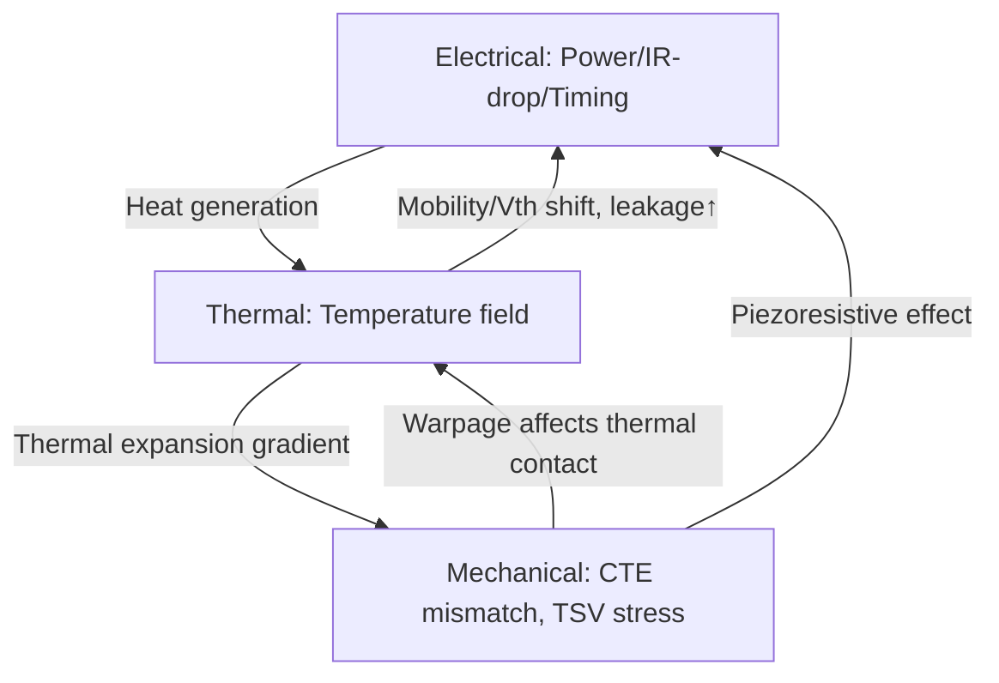
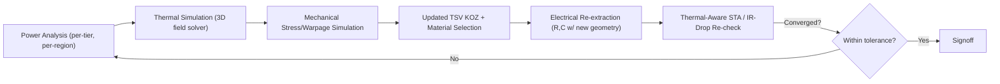

## Thermal-Electrical-Mechanical Co-Design Project for a 3D Stack

### Overview

Thermal-electrical-mechanical (TEM) co-design addresses the fact that in true 3D-stacked systems (die-on-die vertical integration via TSVs/hybrid bonding), the three physical domains are tightly coupled: electrical performance (IR drop, timing) depends on temperature; temperature distribution depends on power density and thermal path, which is shaped by mechanical stackup; and mechanical stress (CTE mismatch, TSV-induced stress) affects transistor mobility and interconnect reliability. Designing any one domain in isolation produces a system that fails in another. This capstone project integrates all three into a unified signoff flow.

### Why Co-Design Is Required (Coupling Mechanisms)

**Key Points**

- **Electrical → Thermal**: power dissipation (dynamic + static/leakage) is the heat source; leakage power itself increases exponentially with temperature, creating a positive feedback loop (thermal runaway risk) if not bounded.
- **Thermal → Electrical**: interconnect resistance increases with temperature (positive temperature coefficient of Cu), and transistor threshold voltage/mobility shift with temperature, changing timing margins across the die stack — critical since different tiers in a 3D stack can sit at different temperatures.
- **Mechanical → Electrical**: TSV-induced mechanical stress (from Cu-Si CTE mismatch during thermal cycling) alters local carrier mobility via piezoresistive effects, requiring keep-out zones (KOZ) around TSVs where transistors are stress-sensitive.
- **Thermal → Mechanical**: temperature gradients across the stack induce differential thermal expansion, producing warpage and interfacial stress at bond lines — a primary driver of bond reliability failures (delamination, micro-cracking).

### Tier Stackup and Bonding Technology Selection

**Key Points**

- Determine number of tiers and bonding method: TSV-based die stacking (via-middle or via-last TSVs with micro-bump interconnect) or hybrid bonding (direct Cu-Cu bonding at sub-10 μm pitch, no solder, enabling much higher vertical interconnect density).
- Hybrid bonding reduces bond-line thickness dramatically versus micro-bump stacking, shortening the thermal path between tiers but also tightening mechanical stress tolerances (since there is no solder compliance layer to absorb CTE mismatch).
- Face-to-face (F2F) vs face-to-back (F2B) bonding orientation affects both TSV routing (F2B requires TSVs through the full tier thickness; F2F can avoid TSVs on the bonded pair but still needs them for further stacking) and thermal path length to the heat sink.

### Electrical Domain: Power Delivery and Timing Across Tiers

**Key Points**

- Vertical PDN must deliver power through TSVs/hybrid bond pads to every tier; IR drop compounds with each additional tier, so tiers farthest from the C4/package interface see the worst voltage droop — requires dedicated power TSV budget separate from signal TSVs.
- Static timing analysis must incorporate per-tier temperature (not a single global temperature) since tiers closer to the heat sink run cooler than tiers buried deeper in the stack — this necessitates **thermal-aware STA**, where timing corners are derived from a coupled thermal simulation rather than a flat on-chip variation (OCV) assumption.
- Signal TSV parasitics (R, C, coupling) must be characterized per the finalized TSV pitch/diameter from the mechanical/process design, since altering TSV geometry for stress relief directly changes signal integrity budgets.

**Example: Coupled IR-Drop/Thermal Iteration**

$$V_{drop,tier_n} = I_{tier_n} \times R_{PDN}(T_{tier_n})$$

$$T_{tier_n} = f(P_{tier_1...n}, R_{thermal,stack})$$

These two equations are interdependent — power dissipation sets temperature, temperature sets PDN resistance, and PDN resistance affects the actual voltage (and thus power) delivered — requiring iterative convergence, typically via co-simulation between an electrical solver and a thermal solver.

### Thermal Domain: 3D Heat Transfer Modeling

**Key Points**

- Unlike 2.5D (lateral heat spreading dominant), 3D stacks are dominated by **vertical** heat conduction, since tiers are stacked directly on top of each other with thin bond interfaces of relatively low thermal conductivity compared to bulk silicon.
- Bond interface thermal resistance (especially for hybrid bonding, with its thin dielectric/oxide layers) becomes a significant series resistance in the vertical heat path and must be characterized rather than assumed negligible.
- Power-map-aware thermal simulation: the compute-heaviest tier's local power density (not just average) drives peak junction temperature; hotspots that don't align across tiers (i.e., a hot spot on tier 2 sitting above a cool region on tier 1) create complex 3D thermal gradients that 1D resistance models cannot capture — full 3D finite-element/finite-volume thermal simulation is required.
- Thermal Design Power (TDP) budget must be apportioned per tier with awareness that the tier farthest from the heat sink (often the bottom-most logic tier in a memory-on-logic stack) has the worst thermal resistance path.

**Example: Simplified Multi-Tier Thermal Resistance Chain**

$$T_{tier,i} = T_{ambient} + \sum_{k=i}^{N} P_k \times R_{θ,k \to sink}$$

where each tier's temperature rise depends on the cumulative thermal resistance of every layer between it and the heat sink, weighted by the power of every tier along that path.

### Mechanical Domain: Stress, Warpage, and Reliability

**Key Points**

- **CTE mismatch stress**: Si (~2.6 ppm/°C), Cu TSV fill (~17 ppm/°C), and bonding dielectrics each expand differently under thermal cycling, generating stress concentrated at TSV-to-silicon interfaces and bond lines.
- **TSV keep-out zone (KOZ)**: a stress-affected annular region around each TSV where placing stress-sensitive transistors is restricted or requires layout guard-banding — KOZ radius is process-dependent and must be obtained from the foundry's TSV design rules.
- **Stack-level warpage**: differential CTE across tiers plus asymmetric metal density can cause the whole stack to bow during thermal excursions (reflow, thermal cycling reliability tests), risking bond delamination at the edges of the stack where stress concentrates.
- **Reliability qualification**: thermal cycling tests (e.g., -40 °C to 125 °C cycling per JEDEC JESD22-A104) are used to qualify bond and TSV reliability against fatigue-driven failure (Cu pumping/protrusion at TSV ends, bond-line cracking).

### Co-Simulation Methodology

**Key Points**

- A converged TEM co-design flow iterates across three solvers: an electrical/power solver (produces per-tier, per-region power maps), a thermal solver (consumes power maps, produces temperature fields), and a mechanical/stress solver (consumes temperature fields plus material CTE data, produces stress/warpage fields) — feeding back into electrical timing/IR-drop analysis for the next iteration.
- Convergence criterion: iterate until temperature field and IR-drop values stabilize within a defined tolerance across successive passes (analogous to electro-thermal co-simulation in advanced 2D ICs, extended to 3D with per-tier granularity).
- [Inference: commercial EDA thermal-mechanical-electrical co-simulation for 3D-IC is an active tooling area; specific tool capabilities and interoperability should be validated against the current offerings of the EDA vendor selected for the capstone project, since flow maturity varies.]

### Mitigation Strategies Toolkit

**Key Points**

- **Thermal**: thermal TSVs/dummy Cu vias placed purely for vertical heat conduction (not signal/power), tier reordering to place hottest die closest to the heat sink, backside metal heat spreaders between tiers.
- **Electrical**: dedicated power/ground TSV arrays sized beyond minimum signal requirements to reduce PDN resistance margin, voltage droop-aware clock gating.
- **Mechanical**: TSV liner material/thickness tuning to reduce stress transfer, KOZ-compliant floorplanning, stiffener rings or underfill optimization at package level to control system-level warpage.
- These mitigations often trade against each other — e.g., adding thermal TSVs consumes floorplan area otherwise available for signal TSVs or transistors, so the co-design process must explicitly balance domain-specific fixes against system-level area/cost budget.

### Capstone Deliverables Checklist

- **Output**: Tier stackup diagram with bonding technology choice (TSV micro-bump vs hybrid bonding) and justification.
- **Output**: Per-tier power map and resulting 3D temperature field from thermal simulation.
- **Output**: TSV KOZ-compliant floorplan showing stress-sensitive circuit placement relative to TSV arrays.
- **Output**: Thermal-aware STA report showing timing closure under per-tier temperature conditions (not flat OCV).
- **Output**: Warpage/reliability risk summary referencing applicable thermal cycling qualification standards.
- **Output**: Co-simulation convergence log/summary demonstrating iteration across electrical-thermal-mechanical domains.

### Common Pitfalls

- Running thermal, electrical, and mechanical analyses sequentially and independently rather than iteratively, missing the feedback loops that dominate 3D-stack behavior.
- Using a flat single-temperature assumption for timing signoff across all tiers instead of tier-specific thermal-aware corners.
- Neglecting bond-interface thermal resistance in hybrid-bonded stacks, underestimating vertical thermal path resistance.
- Under-provisioning power/ground TSVs relative to signal TSVs, causing IR drop that only becomes apparent after thermal feedback is included in the model.
- Ignoring TSV keep-out zone stress effects during early floorplanning, forcing late-stage re-layout.

**Related Topics**

- 2.5D interposer-based multi-die system design (lateral heat-spreading counterpart)
- Hybrid bonding process technology and Cu-Cu direct bond reliability
- Thermal-aware static timing analysis (STA) methodologies
- TSV keep-out zone (KOZ) design rules and piezoresistive stress modeling
- JEDEC thermal cycling reliability qualification standards (JESD22-A104)
- Electro-thermal co-simulation flows in advanced packaging EDA tools