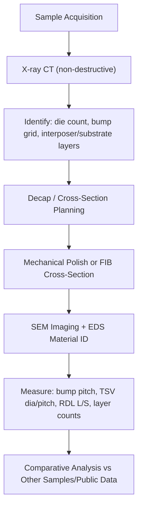
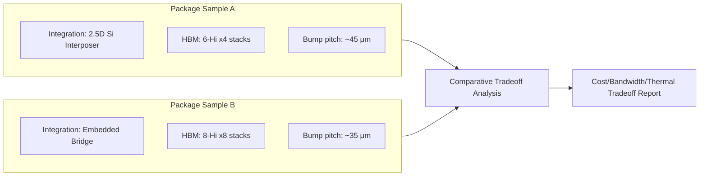

## Comparative Teardown Analysis of a Commercial AI Accelerator Package

### Overview

A comparative teardown analysis is a reverse-engineering-driven capstone exercise: dissect one or more commercial AI accelerator packages (e.g., GPU/AI ASIC modules using CoWoS, EMIB, Foveros, or SoIC-class integration) to identify packaging architecture, interconnect technology, die partitioning strategy, and design tradeoffs — then compare across vendors/generations to extract engineering lessons. This synthesizes everything from prior capstone topics (2.5D interposers, UCIe/chiplets, 3D TEM co-design) into an analytical, evidence-based exercise grounded in physical/imaging inspection techniques.

### Teardown Methodology Overview

**Key Points**

- Non-destructive characterization first: X-ray imaging (2D and computed tomography/CT) to reveal internal bump arrays, TSV presence, die stacking, and voiding without destroying the sample.
- Destructive cross-sectioning: mechanical grinding/polishing or focused ion beam (FIB) milling to expose a cross-section revealing layer stackup, bump/TSV geometry, and interposer structure.
- Scanning Electron Microscopy (SEM) for high-resolution imaging of cross-sectioned features (bump pitch, RDL line/space, TSV diameter); Energy-Dispersive X-ray Spectroscopy (EDS/EDX) for material composition identification (confirming Cu vs solder alloy, underfill material, etc.).
- Die-level delayering (sequential removal of metal/dielectric layers) for logic/memory die architecture analysis, typically beyond package-level teardown scope but relevant if the capstone extends to die-level reverse engineering.

### Package-Level Architecture Identification

**Key Points**

- Determine the integration class from X-ray/cross-section evidence: 2.5D silicon interposer (visible TSV array beneath dies, RDL layers between dies and TSVs), fan-out RDL interposer (no TSVs, RDL-only, dies embedded in mold compound), embedded bridge (localized high-density interconnect region rather than full-area interposer), or true 3D stacking (dies bonded directly on top of each other with vertical TSV/hybrid-bond connections).
- Identify die count, approximate die sizes (from top-down X-ray or delidded photo), and likely function per die (logic/compute vs HBM stack vs I/O tile) based on position, size, and (if visible) marking/branding remnants.
- Estimate bump pitch and count from X-ray bump-array imaging — bump pitch is often a strong indicator of which packaging technology class was used (e.g., very fine uniform pitch under a memory stack suggests HBM PHY micro-bumps).

**Example: Feature-to-Technology Inference Table**

| Observed Feature | Likely Technology |
| --- | --- |
| TSV array visible under multiple dies on common substrate | Silicon interposer (2.5D) |
| RDL-only routing, dies embedded in mold, no TSVs | Fan-out wafer-level packaging (e.g., InFO-class) |
| Localized fine-pitch region only at die-to-die boundary | Embedded bridge die |
| Dies stacked vertically with TSVs through upper die(s) | 3D stacking (TSV-based) |
| Extremely thin bond line, no visible solder/bump layer between two dies | Hybrid bonding (Cu-Cu direct bond) |

### Interposer/Substrate Cross-Section Analysis

**Key Points**

- Count RDL metal layers and measure line/space via SEM to estimate routing density and compare against known process capability ranges for silicon interposers vs organic substrates.
- Measure TSV diameter, pitch, and aspect ratio (depth/diameter) from cross-section; compare against known foundry TSV design rules to infer the TSV process generation.
- Identify underfill and mold compound presence/type (via EDS) — underfill under fine-pitch bump arrays indicates stress mitigation for CTE mismatch; capillary vs molded underfill leaves distinguishable cross-section signatures.
- Substrate layer count and via structure (stacked microvias vs staggered) reveal substrate technology tier (standard BGA substrate vs high-layer-count advanced substrate used in high-bandwidth accelerator modules).

### HBM Stack Analysis (When Present)

**Key Points**

- Cross-section through an HBM stack reveals individual DRAM die count (4-high, 8-high, 12-high, etc.), TSV pitch/diameter per DRAM tier, and base die/logic die presence at the bottom of the stack.
- Micro-bump pitch between DRAM tiers indicates HBM generation class (bump pitch and channel width have historically trended finer/denser across successive HBM generations); cross-referencing measured pitch against publicly documented HBM generation specifications helps identify HBM generation.
- Underfill/capillary fill (or its absence, in the case of some hybrid-bonded next-generation approaches) between DRAM tiers is visible in cross-section and indicates the bonding technology generation used.

### Thermal Solution Analysis

**Key Points**

- Examine integrated heat spreader (IHS) material (typically Cu or Cu-alloy), thermal interface material (TIM) type between die and IHS (TIM1) and between IHS and heatsink (TIM2) — identifiable via EDS composition analysis and visual/mechanical properties.
- Measure IHS contact area relative to die/module footprint to infer intended thermal design power (TDP) class — larger, more elaborate IHS/vapor-chamber solutions generally correlate with higher package power budgets.
- Note any embedded thermal vias or direct-die-contact cooling provisions (relevant for very high-TDP AI accelerator modules that may forgo a traditional IHS in favor of direct liquid cooling contact).

### Comparative Analysis Framework

**Key Points**

- Build a structured comparison matrix across the sample set (or across publicly available teardown data if physical samples are limited to one part) spanning: integration technology (2.5D/3D/fan-out), die count/partitioning strategy, interconnect pitch (bump/TSV), substrate layer count, memory integration approach (HBM count/generation), and thermal solution class.
- Correlate observed physical architecture with publicly known performance/power specifications (from vendor datasheets) to reason about *why* specific packaging choices were made — e.g., higher HBM stack count correlating with higher memory bandwidth specs, denser interposer RDL correlating with higher claimed die-to-die bandwidth.
- Frame conclusions as engineering tradeoff analysis: cost vs bandwidth vs thermal headroom vs yield, using the physical evidence to support or challenge assumptions about each vendor's design philosophy.

### Documentation and Reporting Standards

**Key Points**

- Every measurement (bump pitch, TSV diameter, layer count) should be reported with the imaging method used (X-ray CT, SEM cross-section) and estimated measurement uncertainty, since cross-section measurements can vary based on exact cut plane relative to feature geometry.
- Clearly separate **directly observed** facts (measured dimensions, visible layer counts) from **inferred** conclusions (technology generation guesses, vendor process node assumptions) — the latter should be explicitly flagged as inference since packaging teardown typically cannot directly reveal proprietary process node labeling without corroborating vendor disclosure.
- Where public teardown reports or vendor technical disclosures exist for the specific part being analyzed, cross-reference and cite them to validate or challenge the capstone's own findings.

### Capstone Deliverables Checklist

- **Output**: X-ray CT imagery/description identifying die count, bump grid, and interposer/substrate structure.
- **Output**: Cross-section SEM measurements table (bump pitch, TSV diameter/pitch, RDL line/space, substrate layer count).
- **Output**: EDS material identification summary for key interfaces (bumps, underfill, TIM, IHS).
- **Output**: HBM stack analysis (tier count, inter-tier bump pitch, base die presence) if applicable.
- **Output**: Comparative matrix across at least two samples or generations.
- **Output**: Tradeoff analysis report connecting physical architecture to performance/cost/thermal implications.

### Common Pitfalls

- Conflating directly measured physical evidence with unverified assumptions about process node or exact technology generation — teardown imaging reveals geometry, not proprietary process labels.
- Damaging critical evidence (e.g., cutting through the wrong cross-section plane) before completing non-destructive X-ray characterization — always image non-destructively first.
- Ignoring measurement uncertainty when reporting fine-pitch dimensions from SEM cross-sections, especially when the cut angle isn't perfectly perpendicular to the feature of interest.
- Drawing broad competitive conclusions from a single sample without acknowledging that a single teardown reflects one specific part/revision, not necessarily the vendor's entire product line or roadmap.

**Related Topics**

- 2.5D interposer-based multi-die system design (architecture being reverse-engineered)
- HBM stack architecture and generational evolution
- X-ray CT and SEM/FIB failure analysis techniques for semiconductor packaging
- Package-level thermal solution design (IHS, TIM, vapor chamber)
- Chiplet-based SoC architecture using UCIe interconnect (protocol-side counterpart to physical teardown findings)