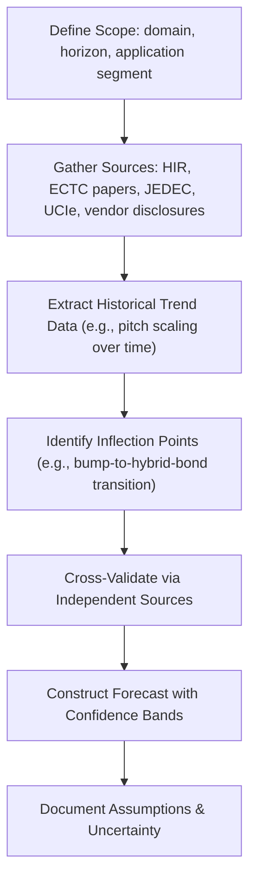
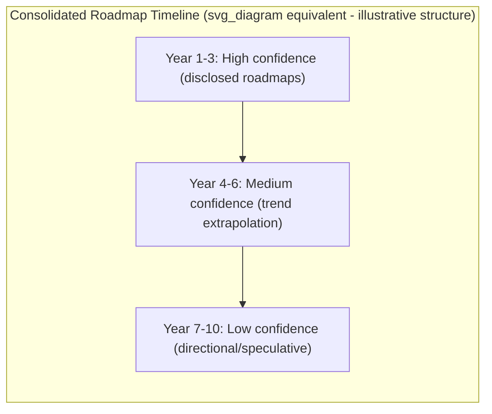

## Technology Roadmap and Trend-Forecasting Research Project

### Overview

This capstone project builds a structured technology roadmap for semiconductor advanced packaging and heterogeneous integration, synthesizing publicly available industry roadmaps, standards body activity, and observable manufacturing trends into a forward-looking forecast. Unlike prior capstones that design or reverse-engineer a specific system, this project develops research and forecasting methodology: identifying authoritative sources, extracting trend trajectories, and reasoning about technology inflection points with appropriately calibrated confidence.

### Authoritative Roadmap Sources

**Key Points**

- **Heterogeneous Integration Roadmap (HIR)**: an industry-consensus roadmap (successor to the historical International Technology Roadmap for Semiconductors' packaging chapters) covering advanced packaging trends across multiple technology working groups (interconnects, substrates, thermal, materials, etc.); a primary reference for structured, chapter-by-chapter trend data.
- **IEEE Electronics Packaging Society (EPS)** publications and conference proceedings (ECTC — Electronic Components and Technology Conference — is the flagship venue for peer-reviewed advanced packaging research).
- **Standards consortiums**: UCIe Consortium (chiplet interconnect roadmap), JEDEC (memory/HBM generational specifications), and foundry/OSAT (Outsourced Semiconductor Assembly and Test) public technology disclosures (e.g., process/packaging platform roadmap announcements from major foundries and OSATs).
- **Vendor and analyst reports**: semiconductor market research firms and vendor investor-day disclosures often reveal near-term product roadmap direction, though these carry inherent promotional bias and should be cross-validated against independent technical sources.

[Unverified: the precise current organizational status and publication cadence of roadmap bodies (e.g., HIR chapter update schedules) should be verified via web search at project execution time, since roadmap governance and publication schedules evolve.]

### Research Methodology Framework

**Key Points**

- Define the forecasting scope explicitly: time horizon (e.g., 3-year near-term vs 10-year long-range), technology domain (interconnect pitch scaling, thermal solutions, materials, integration architecture), and target application space (AI/HPC vs mobile vs automotive), since trend trajectories differ significantly by application segment.
- Use a multi-source triangulation approach: cross-reference roadmap body projections, peer-reviewed conference papers (ECTC, IEDM packaging-adjacent sessions), and observed commercial product introductions (from teardown-style evidence) to validate whether roadmap projections are tracking, ahead, or behind actual industry execution.
- Distinguish **historical trend extrapolation** (fitting a trajectory to past data points, e.g., bump pitch scaling over the last decade) from **discontinuity/inflection point analysis** (identifying where a trend is expected to break from historical trajectory due to a fundamental technology transition, e.g., micro-bump to hybrid bonding transition).

### Key Trend Categories to Track

**Key Points**

- **Interconnect pitch scaling**: micro-bump pitch reduction trajectory, and the transition timeline toward hybrid bonding as a mainstream (not just leading-edge) technology across more package classes.
- **Integration architecture evolution**: trend from single 2.5D interposer designs toward increasingly heterogeneous multi-technology packages combining 2.5D, 3D stacking, and embedded bridges within a single product (sometimes termed "3.5D" or hybrid integration approaches in industry discourse).
- **Standardization trajectory**: UCIe specification version progression and adoption breadth (how many vendors ship UCIe-compliant chiplets) as a proxy for chiplet ecosystem maturity.
- **Memory bandwidth scaling**: HBM generational cadence (capacity per stack, per-pin data rate, stack height) as a bellwether for AI accelerator memory subsystem trends.
- **Thermal solution evolution**: transition points from air-cooled IHS to vapor chamber to direct liquid cooling to (in advanced roadmap discussions) embedded/immersion cooling, tracked against rising package TDP trends.
- **Materials roadmap**: glass-core substrates, low-loss dielectrics, and alternative interposer materials as potential disruptors to silicon-interposer-dominant approaches.

**Example: Trend Table Template**

| Trend Category | Current State (baseline year) | Near-Term (3yr) | Long-Term (10yr) | Confidence |
| --- | --- | --- | --- | --- |
| Micro-bump pitch | [cite current data] | [Inference] | [Speculation] | Medium |
| Hybrid bonding adoption breadth | [cite current data] | [Inference] | [Speculation] | Low-Medium |
| HBM generation in volume | [cite current data] | [Inference] | [Speculation] | Medium-High |
| UCIe spec version / adoption | [cite current data] | [Inference] | [Speculation] | Medium |

[Speculation flags apply to long-horizon projections in this template since 10-year forecasts in a fast-moving field carry substantial inherent uncertainty regardless of source quality.]

### Analytical Techniques for Trend Extraction

**Key Points**

- **Curve fitting on historical data points**: where sufficient historical data exists (e.g., successive HBM generation bandwidth-per-pin figures), fit a trend line to reason about extrapolated future values — while explicitly noting that semiconductor scaling trends historically shift slope at inflection points rather than continuing indefinitely (the packaging analog of the slowing of transistor-level Moore's Law scaling).
- **S-curve/technology adoption modeling**: model adoption breadth of a new technology (e.g., hybrid bonding, UCIe) as following an S-curve (slow initial adoption → rapid mid-phase growth → saturation), useful for reasoning about *when* an emerging technology crosses from niche/leading-edge to mainstream.
- **Cross-industry analogy**: reason by analogy to prior technology transitions in the same domain (e.g., how wire bonding gave way to flip-chip, or how 2D IC scaling trends historically inflected) to bound expectations for current transitions (e.g., bump-based to hybrid-bond-based stacking) — while explicitly flagging analogy-based reasoning as directional, not quantitative, evidence.

### Structuring the Forecast Document

**Key Points**

- Organize output as a formal roadmap document: executive summary, scope/methodology section, per-trend-category detailed analysis (with supporting data/citations), a consolidated roadmap timeline visualization, and an explicit "key uncertainties and risks" section.
- Use a confidence-graded presentation: clearly distinguish near-term forecasts (grounded in disclosed product roadmaps, higher confidence) from long-term forecasts (grounded in trend extrapolation and technology-readiness reasoning, lower confidence) rather than presenting all timeline entries with uniform certainty.
- Include explicit callouts for potential disruptive/discontinuous events (e.g., a new materials breakthrough, a major standards consolidation, or a manufacturing capacity shift) that could invalidate extrapolation-based projections — framed as risk factors rather than predictions.

### Research Rigor and Source Evaluation

**Key Points**

- Weight sources by type: peer-reviewed conference/journal publications (ECTC, IEEE Transactions on Components, Packaging and Manufacturing Technology) generally carry higher technical rigor than vendor marketing material or analyst press releases, though the latter may offer more current near-term product visibility.
- Explicitly note vendor-disclosed roadmap items as **stated intent**, not guaranteed outcome — product roadmaps are frequently revised, delayed, or cancelled, so treat vendor-announced future dates as directional rather than committed facts.
- When the research project is conducted at a point in time, use web search to verify that cited roadmap milestones and standards versions reflect the most current publicly available information, since this is a domain where static training data can become outdated relatively quickly (specification versions, HBM generation naming, latest ECTC proceedings).

### Capstone Deliverables Checklist

- **Output**: Defined forecast scope (time horizon, technology domains, application segment).
- **Output**: Source bibliography with source-type classification (peer-reviewed, standards body, vendor disclosure).
- **Output**: Trend tables per category with current-state data and confidence-graded projections.
- **Output**: Identified inflection points/technology transitions with supporting rationale.
- **Output**: Consolidated roadmap timeline document with explicit uncertainty/confidence annotations.
- **Output**: Risk/disruption factors section identifying what could invalidate the forecast.

### Common Pitfalls

- Presenting long-horizon speculative projections with the same apparent certainty as near-term, well-sourced roadmap data — always confidence-grade forecasts explicitly.
- Relying solely on vendor marketing disclosures without cross-referencing independent technical sources (standards bodies, peer-reviewed research), risking promotional bias in the forecast.
- Naive linear extrapolation of historical trends without considering known physical or economic limits that typically cause scaling trends to inflect (e.g., assuming bump pitch scaling continues indefinitely at historical rate rather than approaching physical/yield limits that motivate the shift to hybrid bonding).
- Failing to date-stamp the research (noting the "as of" date for cited data), which is essential for a forecasting document's long-term usability given how quickly roadmap specifics change.

**Related Topics**

- Heterogeneous Integration Roadmap (HIR) working group structure and chapter scope
- Hybrid bonding technology adoption trajectory
- UCIe Consortium specification evolution and ecosystem adoption
- HBM generational roadmap (capacity, bandwidth, stack height trends)
- Glass-core and alternative substrate materials as emerging disruptors
- Comparative teardown analysis methodology (source of empirical trend validation data)