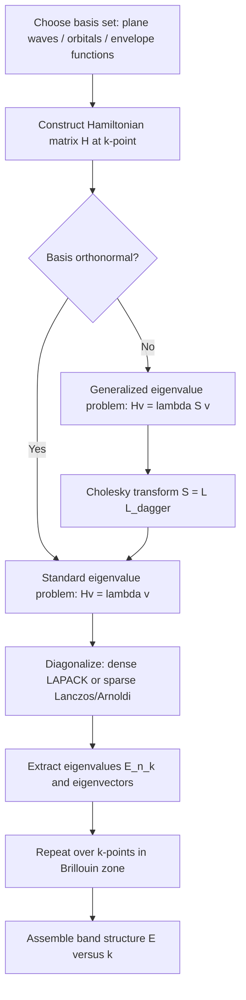

## Linear Algebra and Eigenvalue Problems

### Overview and Relevance to Semiconductor Physics

Linear algebra provides the mathematical backbone for nearly every quantitative model in semiconductor physics. Quantum mechanical states are represented as vectors in Hilbert space, observables (energy, momentum, spin) are represented as Hermitian operators (matrices), and finding the allowed energy levels of a semiconductor system reduces to solving an eigenvalue problem. Band structure calculations, quantum well confinement, tight-binding models, k·p perturbation theory, and device simulation (finite-element/finite-difference discretizations of Schrödinger and Poisson equations) all terminate in large matrix eigenvalue problems or linear systems $Ax = b$.

### Vector Spaces and Basis Sets

**Key Points**

- A vector space $V$ over a field (typically $\mathbb{C}$ for quantum problems) consists of vectors closed under addition and scalar multiplication.
- A basis $\{|e_i\rangle\}$ spans $V$ such that any state $|\psi\rangle$ can be written as $|\psi\rangle = \sum_i c_i |e_i\rangle$.
- In semiconductor physics, common bases include plane waves (for bulk crystals), atomic orbitals (tight-binding), and envelope functions (effective mass theory).
- Orthonormality condition: $\langle e_i | e_j \rangle = \delta_{ij}$.

**Example**

In a tight-binding model of silicon, the basis set might consist of $sp^3$ hybrid orbitals localized at each atom. A crystal with $N$ atoms and 4 orbitals per atom yields a $4N$-dimensional Hilbert space, and the Hamiltonian is a $4N \times 4N$ matrix.

### Matrices and Linear Operators

**Key Points**

- A linear operator $\hat{A}$ acting on basis vectors is represented by a matrix with elements $A_{ij} = \langle e_i | \hat{A} | e_j \rangle$.
- Matrix-vector multiplication represents the action of an operator on a state: $|\phi\rangle = \hat{A}|\psi\rangle \Leftrightarrow \phi_i = \sum_j A_{ij}\psi_j$.
- Matrix multiplication corresponds to sequential operator application, and is generally non-commutative: $\hat{A}\hat{B} \neq \hat{B}\hat{A}$ in general.
- The commutator $[\hat{A},\hat{B}] = \hat{A}\hat{B} - \hat{B}\hat{A}$ quantifies this non-commutativity and underlies the Heisenberg uncertainty principle.

### Special Matrix Types Relevant to Physics

**Hermitian Matrices**

A matrix $H$ is Hermitian if $H = H^\dagger$ (equal to its own conjugate transpose), i.e., $H_{ij} = H_{ji}^*$. All quantum mechanical Hamiltonians are represented by Hermitian matrices because:

- Their eigenvalues are guaranteed real (required for physically measurable energies).
- Their eigenvectors corresponding to distinct eigenvalues are automatically orthogonal.

**Unitary Matrices**

A matrix $U$ is unitary if $U^\dagger U = U U^\dagger = I$. Unitary matrices represent basis transformations and time evolution operators; they preserve inner products (probability normalization), $\langle U\psi | U\phi \rangle = \langle \psi|\phi\rangle$.

**Real Symmetric Matrices**

A special case of Hermitian matrices when all elements are real, common in finite-difference discretizations of the effective-mass Schrödinger equation on a real spatial grid.

**Diagonal and Block-Diagonal Matrices**

Diagonal matrices represent operators already expressed in their eigenbasis. Block-diagonal structure often arises from symmetry decomposition (e.g., spin-up/spin-down decoupling in the absence of spin-orbit coupling), which reduces computational cost by allowing each block to be diagonalized independently.

### The Eigenvalue Problem

**Key Points**

The central eigenvalue equation is:

$$\hat{A}|\psi\rangle = \lambda|\psi\rangle$$

where $\lambda$ is a scalar (the eigenvalue) and $|\psi\rangle$ is the corresponding eigenvector. In matrix form:

$$A\mathbf{v} = \lambda \mathbf{v}$$

This is equivalent to:

$$(A - \lambda I)\mathbf{v} = 0$$

Nontrivial solutions ($\mathbf{v} \neq 0$) exist only when the matrix $(A - \lambda I)$ is singular, i.e.:

$$\det(A - \lambda I) = 0$$

This determinant expands into the **characteristic polynomial**, whose roots are the eigenvalues.

**Physical Interpretation**

For the time-independent Schrödinger equation $\hat{H}\psi = E\psi$, the Hamiltonian operator $\hat{H}$ plays the role of $A$, the wavefunction $\psi$ plays the role of $\mathbf{v}$, and the allowed energy levels $E$ are the eigenvalues. Solving for the band structure of a semiconductor, the confined states in a quantum well, or the discrete levels of a quantum dot is fundamentally an eigenvalue problem.

### Worked Example: 2×2 Hermitian Matrix

Consider a simplified two-level system (e.g., a two-band $k \cdot p$ model at a single $k$-point):

$$H = \begin{pmatrix} E_c & t \\ t^* & E_v \end{pmatrix}$$

with $E_c, E_v$ real (band edge energies) and $t$ a complex coupling term. The characteristic equation is:

$$(E_c - \lambda)(E_v - \lambda) - |t|^2 = 0$$

Expanding:

$$\lambda^2 - (E_c + E_v)\lambda + (E_c E_v - |t|^2) = 0$$

Solving via the quadratic formula:

$$\lambda_{\pm} = \frac{E_c + E_v}{2} \pm \sqrt{\left(\frac{E_c - E_v}{2}\right)^2 + |t|^2}$$

This shows the characteristic **anticrossing/level repulsion** behavior: even when $E_c$ and $E_v$ would cross as a function of some parameter, the coupling $t$ prevents true degeneracy, opening a gap of magnitude $2|t|$ at the crossing point. This exact structure appears in $\mathbf{k}\cdot\mathbf{p}$ band-edge coupling and in avoided crossings in coupled quantum well states.

### Diagonalization

**Key Points**

- A matrix $A$ is diagonalizable if it can be written as $A = PDP^{-1}$, where $D$ is diagonal (containing eigenvalues) and $P$'s columns are the corresponding eigenvectors.
- For Hermitian $A$, diagonalization can always be performed with $P = U$ unitary, so $A = UDU^\dagger$. This is the **spectral theorem**.
- Diagonalization physically corresponds to transforming into the eigenbasis, where the operator acts by simple scalar multiplication on each basis vector.
- In semiconductor simulation, diagonalizing the discretized Hamiltonian directly yields the energy spectrum and corresponding wavefunctions (e.g., subband energies in a quantum well).

### Generalized Eigenvalue Problems

Many discretized semiconductor models produce a **generalized eigenvalue problem**:

$$H\mathbf{v} = \lambda S \mathbf{v}$$

where $S$ is an overlap matrix (non-identity because the basis functions are not orthonormal, as in Gaussian-orbital or non-orthogonal tight-binding bases). This arises frequently in:

- Non-orthogonal tight-binding methods (basis orbitals overlap between neighboring atoms).
- Finite-element discretizations of the Schrödinger equation, where basis functions (shape functions) are not orthogonal.

Solution methods typically transform this into a standard eigenvalue problem via Cholesky decomposition of $S = LL^\dagger$, substituting $\mathbf{v} = L^{-\dagger}\mathbf{u}$ to yield $L^{-1}HL^{-\dagger}\mathbf{u} = \lambda\mathbf{u}$.

### Perturbation Theory as a Linear Algebra Tool

**Key Points**

- Perturbation theory computes approximate eigenvalues/eigenvectors of $H = H_0 + \lambda' V$ from known eigensolutions of $H_0$, avoiding full re-diagonalization.
- First-order energy correction: $E_n^{(1)} = \langle n^{(0)} | V | n^{(0)} \rangle$.
- Second-order energy correction: $E_n^{(2)} = \sum_{m \neq n} \dfrac{|\langle m^{(0)} | V | n^{(0)} \rangle|^2}{E_n^{(0)} - E_m^{(0)}}$.
- This is the mathematical basis of $\mathbf{k}\cdot\mathbf{p}$ theory, where the Hamiltonian at $\mathbf{k}$ near a band extremum is treated as a perturbation of the $\mathbf{k}=0$ Hamiltonian, expanding the band matrix in powers of $\mathbf{k}$.
- Degenerate perturbation theory requires diagonalizing $V$ within the degenerate subspace first, relevant for degenerate valence bands (heavy-hole/light-hole) in zinc-blende semiconductors.

### Numerical Methods for Large Eigenvalue Problems

**Key Points**

Realistic semiconductor device simulations involve matrices too large for direct (dense) diagonalization ($O(N^3)$ cost). Practical approaches include:

- **Direct dense diagonalization** (e.g., LAPACK routines like `zheev`/`dsyev`): feasible for $N$ up to a few thousand; used for small unit cells or few-band $\mathbf{k}\cdot\mathbf{p}$ models.
- **Sparse iterative methods** (Lanczos, Arnoldi): exploit sparsity in finite-difference/finite-element Hamiltonians to compute only a few eigenvalues of interest (e.g., band-edge states) without forming the full spectrum. Complexity scales closer to $O(N)$–$O(N^2)$ per iteration depending on sparsity.
- **Shift-invert methods**: transform the problem to $(A - \sigma I)^{-1}$ to rapidly converge eigenvalues near a target energy $\sigma$ (useful for finding states near the band gap rather than at the spectrum extremes).
- **Density matrix / recursion methods**: used in large-scale tight-binding (e.g., $10^6$+ atoms) where explicit diagonalization is infeasible; local density of states is obtained via Green's function recursion instead of full diagonalization.

[Inference] The specific choice of solver in practice depends on matrix size, sparsity pattern, and how many eigenstates are needed; performance characteristics can vary substantially with hardware and implementation.

### Systems of Linear Equations in Device Simulation

Beyond eigenvalue problems, solving $A\mathbf{x} = \mathbf{b}$ directly is central to:

- **Poisson's equation discretization**: $\nabla \cdot (\varepsilon \nabla \phi) = -\rho$ becomes a sparse linear system for the electrostatic potential $\phi$ at each mesh node, self-consistently coupled to carrier densities in drift-diffusion or Schrödinger-Poisson solvers.
- **Self-consistent Schrödinger-Poisson loops**: iteratively solve the eigenvalue problem for wavefunctions/energies, compute carrier density, solve Poisson's equation for updated potential, and repeat until convergence—each step involving both eigenvalue and linear-system solves.

Common solution techniques include LU decomposition for direct solves and iterative Krylov subspace methods (conjugate gradient for symmetric positive-definite systems, GMRES for general sparse systems) for large grids.

### Eigenvalue Problems in Band Structure Calculations

**Example**

In the empirical pseudopotential or tight-binding method, the crystal Hamiltonian in reciprocal space at a given $\mathbf{k}$-point is:

$$H(\mathbf{k})\mathbf{c}(\mathbf{k}) = E(\mathbf{k})\mathbf{c}(\mathbf{k})$$

Diagonalizing $H(\mathbf{k})$ at each $\mathbf{k}$-point in the Brillouin zone and plotting $E(\mathbf{k})$ against $\mathbf{k}$ traces out the semiconductor's band structure. The conduction band minimum and valence band maximum, and hence the bandgap, emerge directly from the eigenvalue spectrum as a function of $\mathbf{k}$.

**Diagram: Eigenvalue Problem Workflow in Band Structure Calculation**

### Illustration: Level Repulsion (Avoided Crossing)

<svg xmlns="http://www.w3.org/2000/svg" viewBox="0 0 600 360" font-family="sans-serif">
<text x="300" y="25" font-size="16" text-anchor="middle" fill="#222">Eigenvalue Anticrossing (svg_diagram)</text>
<line x1="60" y1="320" x2="560" y2="320" stroke="#333" stroke-width="1.5" />
<line x1="60" y1="320" x2="60" y2="40" stroke="#333" stroke-width="1.5" />
<text x="300" y="345" font-size="13" text-anchor="middle" fill="#333">Parameter (e.g., k or bias)</text>
<text x="25" y="180" font-size="13" text-anchor="middle" fill="#333" transform="rotate(-90 25 180)">Energy</text>

<line x1="80" y1="280" x2="540" y2="90" stroke="#999" stroke-width="1.5" stroke-dasharray="6,4" />
<line x1="80" y1="90" x2="540" y2="280" stroke="#999" stroke-width="1.5" stroke-dasharray="6,4" />
<text x="500" y="85" font-size="11" fill="#999">E_c (uncoupled)</text>
<text x="500" y="295" font-size="11" fill="#999">E_v (uncoupled)</text>

<path d="M 80 280 Q 310 175 540 90" stroke="#1a5fb4" stroke-width="2.5" fill="none" />
<path d="M 80 90 Q 310 175 540 280" stroke="#c01c28" stroke-width="2.5" fill="none" />
<text x="480" y="110" font-size="11" fill="#1a5fb4">lambda_+ (upper)</text>
<text x="480" y="265" font-size="11" fill="#c01c28">lambda_- (lower)</text>

<line x1="310" y1="155" x2="310" y2="195" stroke="#222" stroke-width="1.5" />
<line x1="300" y1="155" x2="320" y2="155" stroke="#222" stroke-width="1" />
<line x1="300" y1="195" x2="320" y2="195" stroke="#222" stroke-width="1" />
<text x="330" y="180" font-size="12" fill="#222">gap = 2|t|</text>
</svg>

### Common Pitfalls and Clarifications

**Key Points**

- Confusing eigenvalues with singular values: singular values (from SVD) apply to any matrix, including non-square/non-Hermitian ones, and are always real and non-negative; eigenvalues require a square matrix and are generally complex unless the matrix has special structure (e.g., Hermitian).
- Degenerate eigenvalues (multiple eigenvectors sharing the same eigenvalue) require care: any linear combination within the degenerate subspace is also a valid eigenvector, so the eigenbasis is not unique and must be chosen based on additional criteria (e.g., symmetry, as in choosing heavy-hole/light-hole basis states).
- Numerical diagonalization of near-degenerate levels can be sensitive to rounding error; [Inference] convergence behavior near degeneracies can depend on the specific numerical library and matrix conditioning.
- Non-Hermitian effective Hamiltonians (e.g., with complex absorbing potentials for open quantum systems, or non-Hermitian $\mathbf{k}\cdot\mathbf{p}$ terms modeling finite lifetimes) can have complex eigenvalues, whose imaginary parts represent decay rates/broadening.

### Related Topics

- Differential equations and boundary value problems (Schrödinger, Poisson)
- Fourier analysis and reciprocal space methods
- Group theory and crystal symmetry
- Perturbation theory and variational methods
- Tensor calculus for anisotropic material properties
- Numerical methods: finite difference and finite element methods
- Tight-binding and $\mathbf{k}\cdot\mathbf{p}$ band structure methods
- Green's function methods in quantum transport