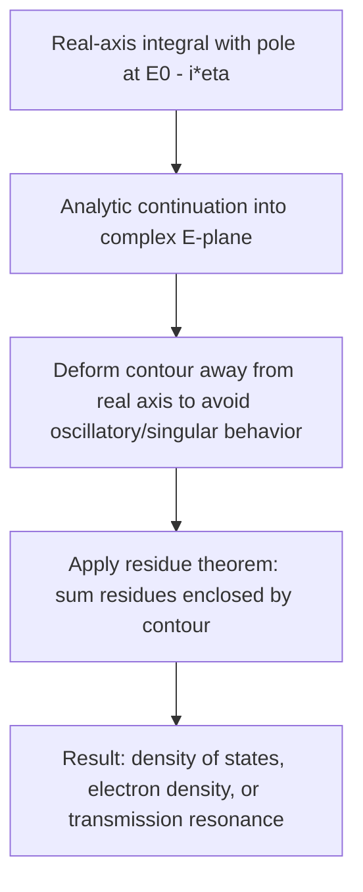

## Complex Variables and Contour Methods

### Overview and Relevance to Semiconductor Physics

Complex analysis provides essential tools for evaluating the integrals and analyzing the analytic structure that arise throughout semiconductor physics: Green's function methods in quantum transport, dispersion relations linking absorption and refractive index (Kramers-Kronig relations), evaluation of density-of-states and transport integrals, and pole/residue analysis of transfer functions in device electronics. Many physically meaningful real-valued integrals — such as those defining optical response functions or scattering rates — are most efficiently and rigorously evaluated using contour integration in the complex plane.

### Complex Functions and Analyticity

**Key Points**

- A complex function $f(z) = u(x,y) + iv(x,y)$, with $z = x+iy$, is **analytic** (holomorphic) at a point if it is complex-differentiable in a neighborhood of that point.
- Analyticity is equivalent to the **Cauchy-Riemann equations**:

$$\frac{\partial u}{\partial x} = \frac{\partial v}{\partial y}, \quad \frac{\partial u}{\partial y} = -\frac{\partial v}{\partial x}$$

- Analytic functions are infinitely differentiable and can be locally represented by a convergent Taylor series; this smoothness is why response functions built from analytic building blocks (Green's functions, dielectric functions) have strong, exploitable mathematical structure.
- **Singularities** occur where $f(z)$ fails to be analytic: poles (where $f(z) \to \infty$ as an inverse power of $(z-z_0)$), branch points (associated with multivalued functions like $\sqrt{z}$ or $\ln z$), and essential singularities.

### Poles and Residues

**Key Points**

- A function has a **simple pole** at $z_0$ if $f(z) = \dfrac{g(z)}{z - z_0}$ with $g(z)$ analytic and nonzero at $z_0$.
- The **residue** at a simple pole is $\text{Res}(f, z_0) = g(z_0) = \lim_{z\to z_0}(z-z_0)f(z)$.
- For a pole of order $n$: $\text{Res}(f,z_0) = \dfrac{1}{(n-1)!}\lim_{z\to z_0}\dfrac{d^{n-1}}{dz^{n-1}}\left[(z-z_0)^n f(z)\right]$.
- Poles of physical response functions (Green's functions, susceptibilities) correspond directly to physical excitation energies, resonance frequencies, or decay rates — the location of a pole in the complex plane encodes both an energy (real part) and a lifetime/damping (imaginary part).

### The Residue Theorem

**Key Points**

For $f(z)$ analytic inside and on a simple closed contour $C$, except for isolated poles enclosed by $C$:

$$\oint_C f(z)\,dz = 2\pi i \sum_k \text{Res}(f, z_k)$$

where the sum runs over all poles $z_k$ enclosed by $C$ (traversed counterclockwise). This theorem converts contour integrals into a sum of local, algebraically computable residues, and is the workhorse for evaluating physically important real-axis integrals by closing the contour in the complex plane.

### Worked Example: Lorentzian Integral via Residues

**Example**

Consider evaluating the integral defining the total spectral weight of a Lorentzian lineshape (a common model for a broadened optical transition or a quasiparticle spectral function):

$$I = \int_{-\infty}^{\infty} \frac{\Gamma/\pi}{(\omega - \omega_0)^2 + \Gamma^2}\,d\omega$$

Rewrite the denominator: $(\omega-\omega_0)^2 + \Gamma^2 = (\omega - \omega_0 - i\Gamma)(\omega - \omega_0 + i\Gamma)$, so the integrand has simple poles at $\omega = \omega_0 + i\Gamma$ (upper half-plane) and $\omega = \omega_0 - i\Gamma$ (lower half-plane).

Close the contour in the upper half-plane with a large semicircular arc (which contributes zero as its radius $\to \infty$, by Jordan's lemma, since the integrand decays as $1/\omega^2$). Only the pole at $\omega_0 + i\Gamma$ is enclosed:

$$\text{Res} = \frac{\Gamma/\pi}{(\omega_0 + i\Gamma) - (\omega_0 - i\Gamma)} = \frac{\Gamma/\pi}{2i\Gamma} = \frac{1}{2\pi i}$$

Applying the residue theorem:

$$I = 2\pi i \cdot \frac{1}{2\pi i} = 1$$

This confirms the Lorentzian is correctly normalized to unit spectral weight — a routine check used when constructing spectral functions in Green's function calculations of semiconductor quasiparticle properties.

### Kramers-Kronig Relations

**Key Points**

Causality (a physical response cannot precede its stimulus) implies that the real and imaginary parts of any linear response function are not independent but are related by a Hilbert transform, derived via contour integration and the residue theorem applied to a response function analytic in the upper half of the complex frequency plane:

$$\varepsilon_1(\omega) - 1 = \frac{2}{\pi}\mathcal{P}\int_0^\infty \frac{\omega' \varepsilon_2(\omega')}{\omega'^2 - \omega^2}d\omega'$$

$$\varepsilon_2(\omega) = -\frac{2\omega}{\pi}\mathcal{P}\int_0^\infty \frac{\varepsilon_1(\omega') - 1}{\omega'^2 - \omega^2}d\omega'$$

where $\mathcal{P}$ denotes the Cauchy principal value (required because the integrand has a pole at $\omega' = \omega$ on the real axis, handled via a small semicircular indentation around the pole in the contour). In semiconductor optics, this is precisely how the real part of the refractive index/dielectric function (dispersion, $\varepsilon_1$) is computed from measured absorption spectra (dissipation, $\varepsilon_2$), and vice versa — the two are not independently adjustable but are locked together by causality.

### The Principal Value and Indented Contours

**Key Points**

- When a pole lies exactly on the integration contour (real axis), the integral is only defined in the **Cauchy principal value** sense, symmetrically excluding a small neighborhood around the pole.
- The standard technique is to indent the contour with a small semicircular detour of radius $\epsilon$ around the pole, then take $\epsilon \to 0$; a semicircular indentation contributes $\mp i\pi \,\text{Res}(f,z_0)$ depending on whether the detour goes above or below the pole.
- This technique underlies the **Sokhotski-Plemelj theorem**:

$$\lim_{\eta\to 0^+} \frac{1}{x - x_0 \pm i\eta} = \mathcal{P}\frac{1}{x-x_0} \mp i\pi\delta(x-x_0)$$

- This identity is used extensively in constructing retarded/advanced Green's functions in quantum transport theory, where the infinitesimal $i\eta$ shift determines whether a Green's function is retarded (causal, poles in the lower half-plane) or advanced (poles in the upper half-plane).

### Green's Functions and Complex Energy Contours

**Key Points**

- In quantum transport (e.g., the Non-Equilibrium Green's Function, NEGF, formalism used for nanoscale device simulation), the retarded Green's function is defined as:

$$G^R(E) = \left[(E + i\eta)I - H - \Sigma^R(E)\right]^{-1}$$

with $\eta \to 0^+$ ensuring causality (poles pushed into the lower half of the complex energy plane).

- The density of states is obtained from the imaginary part of the retarded Green's function: $D(E) = -\dfrac{1}{\pi}\text{Im}\,\text{Tr}[G^R(E)]$, a direct application of the Sokhotski-Plemelj identity connecting the pole structure to a real, physically measurable quantity.
- Equilibrium quantities (e.g., electron density) are often computed by contour integration in the complex energy plane along a contour that avoids poles on the real axis, exploiting analyticity to achieve smoother, more numerically stable integration than direct real-axis integration — a standard technique in density-functional and Green's function based electronic structure codes.

### Branch Cuts and Multivalued Functions

**Key Points**

- Functions like $\sqrt{z}$, $\ln z$, or $z^{\alpha}$ (non-integer $\alpha$) are multivalued in the complex plane and require a **branch cut** (a chosen curve, often along the negative real axis) to define a single-valued branch.
- In semiconductor band structure calculations, the complex band structure (evanescent states with complex $k$ inside a bandgap, relevant to tunneling and heterojunction interface states) often involves square-root-like dispersion relations near band extrema, and correctly tracking which branch (sign of $\text{Im}(k)$) corresponds to a physically decaying (rather than growing) evanescent wave is essential and directly analogous to branch selection in complex analysis.
- Improper branch selection is a common source of unphysical (divergent) solutions in complex band structure and transfer-matrix based tunneling calculations.

### Application: Transfer-Matrix Tunneling and Poles of the Transmission Coefficient

**Example**

In a resonant tunneling diode, the transmission coefficient $T(E)$ as a function of (generally complex) energy $E$ has poles at complex energies $E = E_r - i\Gamma/2$, corresponding to quasi-bound resonant states with energy $E_r$ and lifetime $\tau = \hbar/\Gamma$. Analytically continuing $T(E)$ into the complex plane and locating these poles is a standard method (complementary to direct real-energy scattering calculations) for extracting resonance energies and linewidths in double-barrier and superlattice structures, directly paralleling the pole-residue interpretation used in Green's function and Lorentzian lineshape analysis above.

### Diagram: Contour Deformation for a Green's Function Integral

### Illustration: Pole Location and Physical Meaning

<svg xmlns="http://www.w3.org/2000/svg" viewBox="0 0 560 340" font-family="sans-serif">
<text x="280" y="25" font-size="16" text-anchor="middle" fill="#222">Poles in the Complex Energy Plane (svg_diagram)</text>

<line x1="60" y1="180" x2="500" y2="180" stroke="#333" stroke-width="1.5" />
<line x1="280" y1="300" x2="280" y2="60" stroke="#333" stroke-width="1.5" />
<text x="490" y="200" font-size="12" fill="#333">Re(E)</text>
<text x="290" y="75" font-size="12" fill="#333">Im(E)</text>

<text x="100" y="90" font-size="11" fill="#888">Upper half-plane (advanced)</text>

<text x="100" y="290" font-size="11" fill="#888">Lower half-plane (retarded)</text>

<circle cx="360" cy="230" r="6" fill="#c01c28" />
<text x="375" y="235" font-size="11" fill="#c01c28">E_r - i*Gamma/2 (resonance)</text>

<circle cx="360" cy="130" r="6" fill="#1a5fb4" opacity="0.4" />
<text x="375" y="128" font-size="11" fill="#1a5fb4" opacity="0.6">E_r + i*Gamma/2 (advanced, mirror)</text>

<path d="M 100 180 A 190 60 0 0 1 460 180" stroke="#222" stroke-width="1.5" fill="none" stroke-dasharray="5,4" />
<polygon points="450,175 462,180 450,187" fill="#222" />
</svg>

### Common Pitfalls and Clarifications

**Key Points**

- Forgetting Jordan's lemma conditions: closing a contour with a large semicircular arc only contributes zero in the limit if the integrand decays sufficiently fast (typically at least as $1/|z|$) as $|z|\to\infty$ in the relevant half-plane; applying the residue theorem without checking this leads to incorrect results.
- Mixing up retarded vs. advanced prescriptions ($+i\eta$ vs $-i\eta$): this sign determines physical causality and which half-plane poles are analytically continued into; getting it backward produces acausal or divergent (rather than decaying) responses.
- Treating branch cut placement as arbitrary in a physical context: while mathematically any branch cut avoiding the domain of interest is valid, the physically correct branch (e.g., for evanescent decaying states) must be selected based on boundary conditions, not just mathematical convenience.
- Assuming the principal value integral alone captures the full physical response: the delta-function term from the Sokhotski-Plemelj identity often carries essential physical information (e.g., the imaginary/dissipative part of a response function) and must not be dropped.

### Related Topics

- Linear algebra and eigenvalue problems
- Ordinary and partial differential equations
- Fourier and Laplace transforms
- Green's function methods in quantum transport (NEGF)
- Optical response functions and the dielectric function
- Resonant tunneling and complex band structure
- Density of states calculations
- Perturbation theory and scattering theory