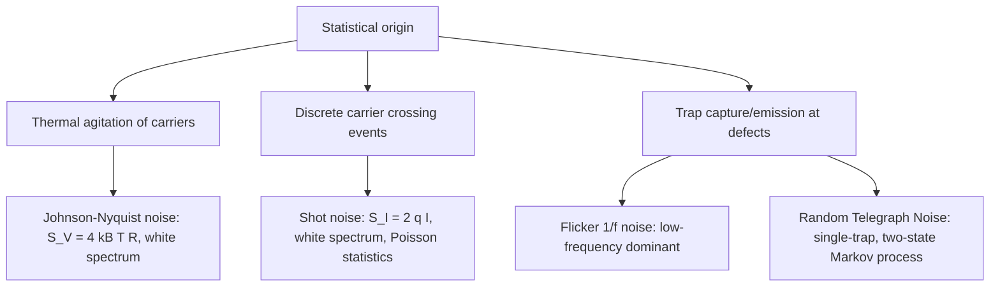

## Probability, Statistics, and Random Processes

### Overview and Relevance to Semiconductor Physics

Probability and statistics underlie the statistical mechanics of carrier populations (Fermi-Dirac and Bose-Einstein statistics), the stochastic nature of carrier transport and scattering, device-to-device variability in fabrication, and noise in electronic devices. Random process theory describes fluctuation phenomena — thermal (Johnson-Nyquist) noise, shot noise, and flicker (1/f) noise — that set the fundamental sensitivity limits of semiconductor devices and circuits. Statistical treatment of dopant placement and process variation is also central to modern nanoscale device reliability and yield analysis.

### Basic Probability Concepts

**Key Points**

- A random variable $X$ has a probability distribution: discrete variables use a probability mass function $P(X=x)$; continuous variables use a probability density function (PDF) $f(x)$, with $P(a \le X \le b) = \int_a^b f(x)\,dx$.
- **Expectation value**: $\langle X \rangle = \sum_x x P(x)$ (discrete) or $\int x f(x)\,dx$ (continuous).
- **Variance**: $\text{Var}(X) = \langle X^2\rangle - \langle X\rangle^2$, with standard deviation $\sigma = \sqrt{\text{Var}(X)}$.
- **Independence**: two random variables are independent if their joint PDF factorizes, $f(x,y) = f_X(x)f_Y(y)$; this assumption underlies many simplified noise and transport models.

### Common Distributions in Semiconductor Physics

**Binomial and Poisson Distributions**

- The **binomial distribution** describes the number of successes in $N$ independent trials with success probability $p$; relevant to discrete dopant implantation statistics (whether a given site receives a dopant atom).
- The **Poisson distribution** is the limiting case of the binomial for large $N$, small $p$, with fixed mean $\lambda = Np$:

$$P(k) = \frac{\lambda^k e^{-\lambda}}{k!}$$

The Poisson distribution governs the statistics of discrete, independent, rare events — most notably the arrival of individual charge carriers crossing a potential barrier, which is the microscopic origin of **shot noise**.

**Gaussian (Normal) Distribution**

$$f(x) = \frac{1}{\sigma\sqrt{2\pi}}\exp\left(-\frac{(x-\mu)^2}{2\sigma^2}\right)$$

The Gaussian distribution arises whenever many independent random contributions sum together (Central Limit Theorem), and is the standard model for: thermal (Johnson) noise amplitude distributions, dopant concentration fluctuations from many independent implantation/diffusion events, and process variation in transistor threshold voltage across a wafer.

### Fermi-Dirac Statistics

**Key Points**

Electrons are fermions and obey the Pauli exclusion principle, so the equilibrium occupation probability of a state with energy $E$ is given by the **Fermi-Dirac distribution**:

$$f(E) = \frac{1}{1 + \exp\left(\dfrac{E - E_F}{k_BT}\right)}$$

where $E_F$ is the Fermi level (chemical potential) and $T$ is temperature. This single statistical formula underlies essentially all semiconductor carrier statistics:

- At $E = E_F$, $f(E) = 1/2$ regardless of temperature.
- For $E - E_F \gg k_BT$ (non-degenerate limit, typical of lightly doped semiconductors), $f(E) \approx \exp\left(-\dfrac{E-E_F}{k_BT}\right)$, recovering **Maxwell-Boltzmann statistics** as an approximation.
- This approximation is the basis of the standard equations $n = N_c \exp\left(-\dfrac{E_c - E_F}{k_BT}\right)$ and $p = N_v\exp\left(-\dfrac{E_F - E_v}{k_BT}\right)$ used throughout introductory and device-level semiconductor physics.

**Example: Carrier Concentration via Fermi-Dirac Integral**

The free electron concentration in the conduction band is obtained by integrating the density of states $g(E)$ weighted by the occupation probability:

$$n = \int_{E_c}^{\infty} g(E) f(E)\,dE$$

For a 3D parabolic band, $g(E) \propto \sqrt{E - E_c}$, and this integral reduces to the Fermi-Dirac integral of order $1/2$, $\mathcal{F}_{1/2}\left(\dfrac{E_F - E_c}{k_BT}\right)$, which has no closed elementary form and is typically evaluated numerically or via tabulated approximations in degenerate (heavily doped) semiconductor calculations.

### Random Processes and Stochastic Signals

**Key Points**

- A **random process** (stochastic process) $X(t)$ is a time-indexed collection of random variables; device noise, carrier velocity fluctuations, and thermal vibrations are all modeled as random processes.
- A process is **stationary** if its statistical properties do not change with a shift in time origin; **wide-sense stationary (WSS)** requires only that the mean is constant and the autocorrelation depends only on the time lag $\tau$.
- The **autocorrelation function** is $R(\tau) = \langle X(t)X(t+\tau)\rangle$, and the **Wiener-Khinchin theorem** relates it to the power spectral density (PSD) via the Fourier transform: $S(\omega) = \int_{-\infty}^{\infty} R(\tau)e^{-i\omega\tau}d\tau$ — directly connecting random process theory to the Fourier methods covered elsewhere in this chapter.
- **Ergodicity** (time averages equal ensemble averages) is often assumed in practice to allow noise PSDs to be estimated from a single long time-domain measurement.

### Thermal (Johnson-Nyquist) Noise

**Key Points**

Thermal agitation of charge carriers in any resistive element produces a random, zero-mean voltage fluctuation with power spectral density:

$$S_V(f) = 4k_BTR$$

(white noise, frequency-independent up to very high frequencies where quantum corrections become relevant). This is derived from the fluctuation-dissipation theorem, linking the equilibrium thermal fluctuations of a system to its dissipative (resistive) response — a foundational result connecting statistical mechanics to circuit-level noise behavior in all resistive semiconductor device elements (channel resistance, contact resistance, etc.).

### Shot Noise

**Key Points**

Shot noise arises from the discreteness of charge carriers crossing a potential barrier (e.g., a p-n junction or Schottky barrier) as statistically independent, Poisson-distributed events. The current noise power spectral density is:

$$S_I(f) = 2qI$$

where $I$ is the DC current and $q$ is the elementary charge. This is white noise (frequency-independent) under the assumption of fully uncorrelated carrier crossing events. In devices where carrier crossings are correlated (e.g., due to Coulomb blockade or space-charge-limited transport), shot noise is **suppressed** relative to the full Poissonian value, quantified by the **Fano factor** $F = S_I / 2qI$, with $F < 1$ indicating sub-Poissonian (suppressed) noise.

### Flicker (1/f) Noise

**Key Points**

- Flicker noise has a power spectral density that scales approximately as $S(f) \propto 1/f^{\alpha}$ with $\alpha$ typically near 1, dominating at low frequencies and becoming less significant than thermal/shot noise at high frequencies.
- The physical origin in semiconductor devices is generally attributed to trapping/detrapping of carriers at defect states (e.g., at the Si/SiO2 interface in a MOSFET) or mobility fluctuations, described phenomenologically by models such as the McWhorter (trapping) model or the Hooge (mobility fluctuation) model.
- [Inference] The relative dominance of trapping versus mobility-fluctuation mechanisms in a given device is generally determined by the specific technology, interface quality, and bias conditions, and may require device-specific characterization to distinguish.
- 1/f noise is a critical design constraint in analog/RF and precision sensing circuits (e.g., oscillator phase noise, low-frequency amplifier noise floor).

### Random Telegraph Noise (RTN)

**Key Points**

- In very small-area (nanoscale) devices, a single trap capturing and emitting a single carrier produces discrete, two-level fluctuations in device current, known as **Random Telegraph Noise**, statistically well-described by a two-state Markov process with characteristic capture and emission time constants.
- As transistor dimensions shrink, RTN from a single active trap can dominate the overall low-frequency noise (since fewer traps are averaged over a smaller channel area), making it an increasingly important reliability and variability concern in advanced CMOS nodes.

### Statistical Process Variation and Device Reliability

**Key Points**

- **Random dopant fluctuation (RDF)**: at nanoscale channel dimensions, the discrete, random placement of a finite (and small) number of dopant atoms causes device-to-device threshold voltage variation, well-modeled using Poisson statistics on dopant count combined with electrostatic sensitivity analysis.
- **Line-edge roughness (LER)** and **oxide thickness variation**: stochastic process-induced geometric variations are typically characterized via measured statistical distributions (mean, standard deviation, correlation length) and propagated through device simulation (often via Monte Carlo methods) to predict circuit-level yield and variability.
- **Monte Carlo simulation**: widely used in semiconductor device and process simulation to propagate statistical input variability (dopant profiles, geometric variation) through a nonlinear device model to obtain output distributions (e.g., threshold voltage spread) that cannot be obtained analytically.

### Markov Processes and Carrier Scattering

**Key Points**

- Semiclassical carrier transport (via the Boltzmann transport equation) treats scattering events (phonon, impurity, interface scattering) as instantaneous, memoryless transitions between momentum states — a Markov process assumption, where the scattering rate out of a state depends only on the current state, not on prior history.
- The **Monte Carlo method for semiconductor transport** directly simulates this stochastic Markov process: carrier free-flight times are drawn from an exponential (Poisson-process) distribution determined by the total scattering rate, and scattering mechanisms are selected probabilistically according to their relative rates — a widely used numerical technique for simulating hot-carrier transport beyond the drift-diffusion approximation.

### Diagram: Noise Sources and Their Statistical Origins

### Illustration: Fermi-Dirac Distribution vs. Boltzmann Approximation

<svg xmlns="http://www.w3.org/2000/svg" viewBox="0 0 560 340" font-family="sans-serif">
<text x="280" y="25" font-size="16" text-anchor="middle" fill="#222">Fermi-Dirac vs. Boltzmann Occupation (svg_diagram)</text>

<line x1="60" y1="280" x2="500" y2="280" stroke="#333" stroke-width="1.5" />
<line x1="60" y1="280" x2="60" y2="50" stroke="#333" stroke-width="1.5" />
<text x="280" y="305" font-size="12" text-anchor="middle" fill="#333">Energy E</text>
<text x="30" y="165" font-size="12" text-anchor="middle" fill="#333" transform="rotate(-90 30 165)">f(E)</text>

<line x1="60" y1="70" x2="500" y2="70" stroke="#999" stroke-width="1" stroke-dasharray="3,3" />
<text x="505" y="74" font-size="10" fill="#999">1</text>

<line x1="230" y1="280" x2="230" y2="50" stroke="#666" stroke-width="1" stroke-dasharray="4,3" />
<text x="230" y="300" font-size="11" text-anchor="middle" fill="#666">E_F</text>

<path d="M 60 75 Q 150 78 200 100 Q 225 150 230 175 Q 235 200 260 250 Q 320 275 500 278" stroke="`#1a5fb4`" stroke-width="2.5" fill="none" />

<text x="90" y="65" font-size="11" fill="`#1a5fb4`">Fermi-Dirac</text>

<path d="M 260 250 Q 320 220 380 130 Q 420 90 450 60" stroke="`#c01c28`" stroke-width="2" fill="none" stroke-dasharray="6,4" />

<text x="360" y="115" font-size="11" fill="`#c01c28`">Boltzmann approx.</text>

<text x="360" y="130" font-size="10" fill="`#c01c28`">(valid for E - E_F &gt;&gt; kT)</text>

</svg>

### Common Pitfalls and Clarifications

**Key Points**

- Applying the Maxwell-Boltzmann (non-degenerate) approximation to heavily doped or degenerately doped semiconductors, where $E_F$ lies within or close to a band; the full Fermi-Dirac integral (or numerical evaluation) is required for accurate carrier concentration in these regimes.
- Confusing the Fano factor's role: $F=1$ corresponds to full (uncorrelated) shot noise, not the absence of noise; $F=0$ would indicate fully correlated, noiseless transport, an idealized limit.
- Assuming all semiconductor noise sources are white (frequency-independent): only thermal and (ideal, uncorrelated) shot noise are white; flicker noise and RTN have strongly frequency- or time-dependent statistical character.
- Treating Monte Carlo device/process simulation results as exact: [Inference] statistical simulation outputs carry their own sampling uncertainty (dependent on the number of Monte Carlo trials), and adequate trial counts are generally needed for converged variability statistics, though required counts vary by application and target confidence level.

### Related Topics

- Fermi-Dirac statistics and carrier concentration
- Boltzmann transport equation and semiclassical transport
- Fourier and Laplace transforms
- Noise analysis in semiconductor devices
- Monte Carlo methods in device and process simulation
- Random dopant fluctuation and nanoscale device variability
- Statistical mechanics and thermodynamics of semiconductors
- Reliability physics: trapping, RTN, and 1/f noise