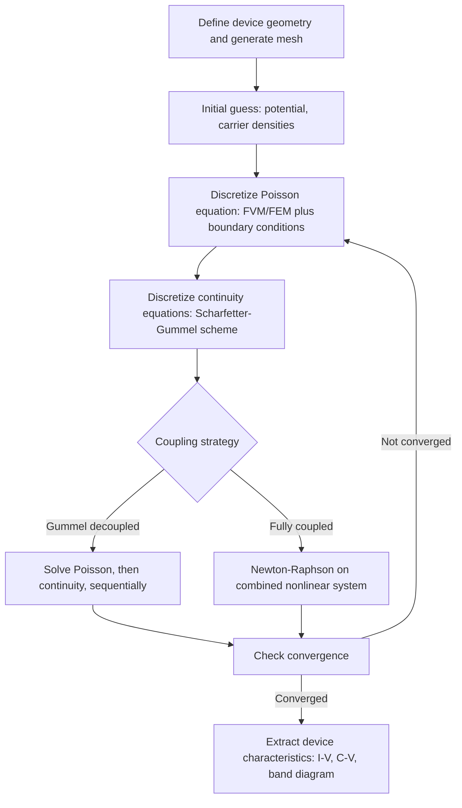

## Numerical Methods for Physical Modeling

### Overview and Relevance to Semiconductor Physics

Analytical solutions to the coupled nonlinear PDEs and eigenvalue problems that govern semiconductor devices exist only for idealized geometries and simplified physics. Real device and materials simulation — Technology Computer-Aided Design (TCAD), electronic structure calculation, and quantum transport modeling — relies on numerical discretization and iterative solution methods. This topic surveys the core numerical techniques that convert the continuous mathematics developed elsewhere in this chapter (differential equations, eigenvalue problems, linear algebra) into algorithms executable on a computer, and the practical considerations (stability, convergence, accuracy) that govern their reliable use.

### Discretization Strategies: From Continuous to Discrete

**Key Points**

Three major families of spatial discretization convert continuous field equations into finite systems of algebraic equations:

- **Finite Difference Method (FDM)**: replaces derivatives with difference quotients on a structured (typically rectangular) grid. Simple to implement, computationally efficient for regular geometries, but less flexible for complex device shapes.
- **Finite Element Method (FEM)**: divides the domain into elements (triangles/tetrahedra in 2D/3D) with local polynomial basis (shape) functions; naturally handles complex, irregular device geometries and is the standard approach in most commercial TCAD tools.
- **Finite Volume Method (FVM)**: integrates the governing equation over discrete control volumes, enforcing exact local conservation (e.g., of charge or current) by construction; widely used for the current-continuity equations in drift-diffusion device simulation because it guarantees physically consistent current conservation at the discrete level.

### Finite Difference Approximations

**Key Points**

The first derivative can be approximated by:

- **Forward difference**: $f'(x) \approx \dfrac{f(x+h)-f(x)}{h}$, first-order accurate, truncation error $O(h)$.
- **Backward difference**: $f'(x) \approx \dfrac{f(x)-f(x-h)}{h}$, also first-order accurate.
- **Central difference**: $f'(x) \approx \dfrac{f(x+h)-f(x-h)}{2h}$, second-order accurate, truncation error $O(h^2)$; generally preferred when applicable due to higher accuracy for the same grid spacing.

The second derivative (appearing in the Schrödinger and Poisson equations) uses the standard three-point central difference:

$$f''(x) \approx \frac{f(x+h) - 2f(x) + f(x-h)}{h^2}$$

**Example: Discretized 1D Schrödinger Equation**

Applying the central-difference formula to the effective-mass Schrödinger equation on a uniform grid with spacing $h$ converts the differential eigenvalue problem into a matrix eigenvalue problem:

$$-\frac{\hbar^2}{2m^*h^2}\left(\psi_{i+1} - 2\psi_i + \psi_{i-1}\right) + V_i\psi_i = E\psi_i$$

This produces a tridiagonal matrix $H$ (each row coupling only to nearest neighbors), whose eigenvalues and eigenvectors (obtained via the linear algebra methods discussed elsewhere in this chapter) give the discrete energy levels and wavefunctions of, e.g., a quantum well or heterostructure.

### The Scharfetter-Gummel Discretization

**Key Points**

Naive central-differencing of the drift-diffusion current equation $J_n = q\mu_n nE + qD_n\nabla n$ becomes numerically unstable (produces spurious oscillations) when the drift term dominates over diffusion — a common situation in regions of strong electric field. The **Scharfetter-Gummel scheme** assumes the current density and electric field are constant between adjacent mesh nodes and solves the resulting local ODE exactly, yielding a discretized current expression involving Bernoulli functions:

$$J_{n,i+1/2} = \frac{qD_n}{h}\left[B\left(\frac{\Delta\phi}{V_T}\right)n_{i+1} - B\left(-\frac{\Delta\phi}{V_T}\right)n_i\right]$$

where $B(x) = \dfrac{x}{e^x - 1}$ is the Bernoulli function and $V_T = k_BT/q$. This discretization is stable across the full range of drift-dominated to diffusion-dominated transport and is the de facto standard for drift-diffusion current discretization in essentially all commercial and academic TCAD device simulators.

### Numerical Stability and Convergence

**Key Points**

- **Consistency**: a discretization scheme is consistent if its local truncation error tends to zero as the grid spacing tends to zero — a necessary but not sufficient condition for a correct numerical solution.
- **Stability**: errors introduced at one step (e.g., roundoff, or in time-stepping) do not grow uncontrollably as the computation proceeds; time-domain (transient) simulations of the diffusion/continuity equations using explicit time-stepping are subject to a stability criterion analogous to the Courant-Friedrichs-Lewy (CFL) condition, limiting the maximum stable time step relative to the spatial grid spacing and diffusion coefficient.
- **Lax equivalence theorem** (for well-posed linear initial value problems): consistency and stability together are necessary and sufficient for convergence (the numerical solution approaches the true solution as discretization is refined).
- Implicit time-stepping schemes (e.g., backward Euler, Crank-Nicolson) trade increased per-step computational cost (solving a linear system at each step) for unconditional or improved stability, often preferred for stiff semiconductor transport problems with widely varying time constants.

### Newton-Raphson Iteration for Nonlinear Systems

**Key Points**

The coupled Poisson and continuity equations in device simulation are strongly nonlinear (carrier concentrations depend exponentially on potential). The standard solution approach is **Newton-Raphson iteration**: linearize the nonlinear system $\mathbf{F}(\mathbf{x}) = 0$ around a current estimate $\mathbf{x}_k$ using the Jacobian matrix $J = \partial \mathbf{F}/\partial \mathbf{x}$:

$$\mathbf{x}_{k+1} = \mathbf{x}_k - J^{-1}(\mathbf{x}_k)\,\mathbf{F}(\mathbf{x}_k)$$

Each iteration requires solving a large sparse linear system (connecting back to the linear algebra methods discussed elsewhere in this chapter), and the process is repeated until the residual $\mathbf{F}(\mathbf{x}_k)$ falls below a specified convergence tolerance. Near a well-behaved solution, Newton-Raphson exhibits quadratic convergence (the number of correct digits roughly doubles each iteration), but convergence is not guaranteed from a poor initial guess, motivating techniques like damped Newton methods or continuation (gradually ramping bias/parameters) in practical device simulators.

### Gummel Iteration (Decoupled Self-Consistent Solution)

**Key Points**

An alternative to fully coupled Newton-Raphson is **Gummel's method**, which decouples the Poisson and continuity equations and solves them sequentially in an outer iteration loop: solve Poisson's equation for $\phi$ given fixed carrier densities, then solve the continuity equations for updated $n, p$ given the new $\phi$, and repeat until self-consistency. Gummel iteration is simpler to implement and more robust at poor initial guesses than fully coupled Newton methods, though [Inference] it typically converges more slowly (linearly rather than quadratically) near the solution, so many practical simulators use Gummel iteration for initial convergence followed by full Newton iteration for final refinement.

### Iterative Linear Solvers for Large Sparse Systems

**Key Points**

Each Newton or Gummel step requires solving a large, sparse linear system $A\mathbf{x} = \mathbf{b}$. Two general classes of methods are used:

- **Direct methods** (e.g., LU decomposition, sparse Gaussian elimination): give an exact solution (up to roundoff) in a predictable number of operations, but memory and computational cost can scale unfavorably (fill-in) for very large 3D problems.
- **Iterative (Krylov subspace) methods**: build up an approximate solution through repeated matrix-vector multiplications, converging to the desired tolerance without ever forming a dense factorization.
  - **Conjugate Gradient (CG)**: for symmetric positive-definite systems (e.g., discretized Poisson's equation with appropriate boundary conditions).
  - **GMRES (Generalized Minimal Residual)**: for general (non-symmetric) sparse systems, common for the fully coupled Jacobian in drift-diffusion Newton iteration.
- **Preconditioning**: iterative methods' convergence rate depends strongly on the conditioning of $A$; preconditioners (e.g., incomplete LU factorization, algebraic multigrid) are typically applied to accelerate convergence, and are often essential for practical convergence on realistic 3D device meshes.

### Eigenvalue Solvers for Large Systems

**Key Points**

Building on the eigenvalue problem formulation discussed elsewhere in this chapter, large discretized Hamiltonians (from finite-difference Schrödinger equations, tight-binding models, or plane-wave band structure calculations) require specialized numerical eigenvalue solvers:

- **Dense solvers** (e.g., LAPACK's `zheev`/`dsyev`): practical for matrices up to roughly a few thousand basis states; return the full eigenvalue spectrum.
- **Sparse iterative solvers** (Lanczos, Arnoldi, or Davidson methods): exploit sparsity to efficiently compute a small number of eigenvalues/eigenvectors near a target energy (e.g., band-edge or Fermi-level states) without computing the full spectrum, essential for large-scale quantum transport and electronic structure calculations.

### Monte Carlo Methods

**Key Points**

Monte Carlo techniques use random sampling to solve problems that are difficult to address deterministically, and are widely used in two distinct semiconductor modeling contexts:

- **Process/variability Monte Carlo**: propagates statistical input variation (random dopant fluctuation, line-edge roughness) through a device model to obtain output distributions (e.g., threshold voltage spread across many simulated device instances), connecting directly to the probability and statistics methods discussed elsewhere in this chapter.
- **Ensemble Monte Carlo (EMC) for carrier transport**: simulates individual carrier trajectories in momentum space, with free-flight durations drawn from the total scattering rate (an exponential/Poisson-process distribution) and scattering mechanism selected probabilistically at each scattering event; widely used to model hot-carrier and non-equilibrium transport effects beyond the drift-diffusion approximation, particularly in short-channel and high-field device regions.

### Mesh Generation and Adaptive Refinement

**Key Points**

- Numerical accuracy in FEM/FVM simulation depends critically on mesh quality: element size, aspect ratio, and local refinement near regions of rapid field/carrier-density variation (e.g., near a junction, oxide interface, or high-field region).
- **Adaptive mesh refinement (AMR)**: automatically refines the mesh in regions where a computed error estimator (e.g., gradient of the solution, or a posteriori error indicator) exceeds a threshold, concentrating computational effort where it is most needed and improving accuracy-per-computational-cost relative to a uniform fine mesh.
- [Inference] Balancing mesh resolution against computational cost is typically an iterative, problem-dependent process in practical TCAD workflows, often requiring convergence studies (repeating a simulation at progressively finer mesh resolution to confirm the solution has stabilized).

### Diagram: Self-Consistent Device Simulation Numerical Workflow

### Illustration: Finite Difference Grid and Stencil

<svg xmlns="http://www.w3.org/2000/svg" viewBox="0 0 560 300" font-family="sans-serif">
<text x="280" y="25" font-size="16" text-anchor="middle" fill="#222">Central Difference Stencil (svg_diagram)</text>

<line x1="60" y1="180" x2="500" y2="180" stroke="#333" stroke-width="1.5" />

<circle cx="140" cy="180" r="6" fill="#666" />
<circle cx="280" cy="180" r="8" fill="#1a5fb4" />
<circle cx="420" cy="180" r="6" fill="#666" />

<text x="140" y="210" font-size="12" text-anchor="middle" fill="#333">i-1</text>

<text x="280" y="210" font-size="12" text-anchor="middle" fill="`#1a5fb4`">i</text>

<text x="420" y="210" font-size="12" text-anchor="middle" fill="#333">i+1</text>

<text x="140" y="160" font-size="11" text-anchor="middle" fill="#333">psi_{i-1}</text>

<text x="280" y="150" font-size="11" text-anchor="middle" fill="`#1a5fb4`">psi_i</text>

<text x="420" y="160" font-size="11" text-anchor="middle" fill="#333">psi_{i+1}</text>

<line x1="140" y1="230" x2="280" y2="230" stroke="#888" stroke-width="1" />
<text x="210" y="245" font-size="11" text-anchor="middle" fill="#888">h</text>
<line x1="280" y1="230" x2="420" y2="230" stroke="#888" stroke-width="1" />
<text x="350" y="245" font-size="11" text-anchor="middle" fill="#888">h</text>

<text x="280" y="270" font-size="12" text-anchor="middle" fill="#333">f'' ~ (psi_{i+1} - 2 psi_i + psi_{i-1}) / h^2</text>

</svg>

### Common Pitfalls and Clarifications

**Key Points**

- Using naive central-difference discretization of the drift term in strongly convection-dominated transport regions without a stabilized scheme (like Scharfetter-Gummel) can introduce spurious numerical oscillations that are easily mistaken for physical effects.
- Insufficient mesh resolution near sharp physical features (junctions, oxide interfaces, high-field regions) can produce results that appear converged but are quantitatively inaccurate; a mesh convergence study is the standard way to check this.
- Confusing convergence of the Newton/Gummel nonlinear iteration (residual tolerance) with mesh/discretization convergence (grid refinement tolerance); both must be independently verified for a trustworthy result.
- Assuming Monte Carlo transport results are free of statistical noise: [Inference] Monte Carlo transport simulations carry inherent statistical sampling noise that decreases only slowly (as $1/\sqrt{N}$) with the number of simulated particles/trajectories, so adequate ensemble size is generally needed for smooth, reliable output quantities such as velocity or energy distributions.

### Related Topics

- Linear algebra and eigenvalue problems
- Ordinary and partial differential equations
- Vector calculus and boundary value problems
- Probability, statistics, and random processes
- Drift-diffusion and hydrodynamic transport models
- TCAD device simulation workflows
- Boltzmann transport equation and Monte Carlo transport simulation
- Electronic structure methods: tight-binding, k·p, and plane-wave DFT