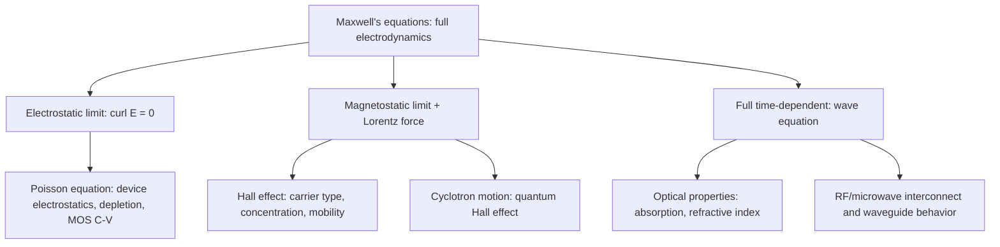

## Electromagnetism and Maxwell's Equations

### Overview and Relevance to Semiconductor Physics

Maxwell's equations are the complete classical description of electric and magnetic fields and their sources, and they underlie every electrostatic, magnetostatic, and electromagnetic phenomenon exploited or managed in semiconductor devices. The electrostatic limit gives Poisson's equation, the foundation of all device electrostatics (depletion regions, MOS capacitors, band bending). The magnetostatic and full time-dependent forms govern Hall-effect sensors, magnetoresistance, cyclotron motion in the quantum Hall effect, and high-frequency/RF device behavior where displacement current and electromagnetic wave propagation cannot be neglected. Constitutive relations (permittivity, permeability, conductivity) connect the macroscopic Maxwell equations to material-specific semiconductor properties.

### Maxwell's Equations: Differential Form

**Key Points**

The four Maxwell's equations, in differential (local) form using $\mathbf{D}$ (electric displacement) and $\mathbf{H}$ (magnetic field intensity) to account for material response:

$$\nabla \cdot \mathbf{D} = \rho_f \quad \text{(Gauss's law)}$$

$$\nabla \cdot \mathbf{B} = 0 \quad \text{(no magnetic monopoles)}$$

$$\nabla \times \mathbf{E} = -\frac{\partial \mathbf{B}}{\partial t} \quad \text{(Faraday's law)}$$

$$\nabla \times \mathbf{H} = \mathbf{J}_f + \frac{\partial \mathbf{D}}{\partial t} \quad \text{(Ampère-Maxwell law)}$$

where $\rho_f$ and $\mathbf{J}_f$ are free (as opposed to bound/polarization) charge and current densities. These equations, combined with **constitutive relations** linking $\mathbf{D}$ to $\mathbf{E}$ and $\mathbf{B}$ to $\mathbf{H}$, fully determine electromagnetic behavior in any medium, including semiconductors.

### Constitutive Relations in Semiconductors

**Key Points**

- **Linear, isotropic dielectric response**: $\mathbf{D} = \varepsilon \mathbf{E} = \varepsilon_r \varepsilon_0 \mathbf{E}$, where $\varepsilon_r$ is the material's (frequency- and possibly direction-dependent) relative permittivity — e.g., $\varepsilon_r \approx 11.7$ for silicon, $\approx 3.9$ for SiO2.
- Most semiconductors are effectively non-magnetic ($\mu_r \approx 1$, $\mathbf{B} = \mu_0\mathbf{H}$), so magnetic constitutive effects are typically negligible except in specialized spintronic or magnetic-semiconductor materials.
- **Ohmic conduction**: $\mathbf{J}_f = \sigma \mathbf{E}$ (Ohm's law in local form), where $\sigma$ is the material conductivity — in semiconductors, $\sigma = q(n\mu_n + p\mu_p)$, directly connecting Maxwell's equations to carrier transport parameters covered elsewhere in the curriculum.
- Anisotropic materials (e.g., strained or crystallographically anisotropic semiconductors) require $\varepsilon$ and $\sigma$ to be treated as tensors rather than scalars.

### The Electrostatic Limit: Poisson's Equation

**Key Points**

When fields are static or slowly varying (quasistatic approximation, valid when the relevant length scales are much smaller than the electromagnetic wavelength at the frequency of interest), $\nabla \times \mathbf{E} = 0$, allowing $\mathbf{E} = -\nabla\phi$. Substituting into Gauss's law:

$$\nabla \cdot (\varepsilon \nabla \phi) = -\rho_f$$

This is **Poisson's equation**, the central equation of semiconductor device electrostatics, governing depletion regions, MOS capacitor band bending, and self-consistent Schrödinger-Poisson simulations — directly connecting this topic to the PDE and vector calculus material developed elsewhere in this chapter. The quasistatic approximation is well justified for the DC and low-to-moderate frequency operation of most conventional semiconductor devices, but breaks down at RF/microwave frequencies where full electromagnetic (wave) treatment becomes necessary.

### Magnetostatics and the Lorentz Force

**Key Points**

In the magnetostatic limit ($\partial \mathbf{B}/\partial t = 0$), the **Lorentz force law** governs the force on a charge carrier:

$$\mathbf{F} = q(\mathbf{E} + \mathbf{v}\times\mathbf{B})$$

This is the microscopic origin of the **Hall effect**: carriers moving under an applied electric field (current flow) in the presence of a perpendicular magnetic field experience a transverse force, causing charge accumulation until a transverse (Hall) electric field balances the magnetic force in steady state. Hall measurements are a standard semiconductor characterization technique for directly determining carrier type (electron vs. hole), concentration, and mobility.

**Example: Hall Voltage Derivation**

For a semiconductor bar carrying current density $J_x$ in a magnetic field $B_z$, steady-state balance of the transverse Lorentz force against the Hall electric field $E_y$ gives:

$$qE_y = qv_xB_z \implies E_y = v_xB_z$$

Using $J_x = qnv_x$ (for electron carriers), the Hall coefficient is $R_H = \dfrac{E_y}{J_xB_z} = \dfrac{1}{qn}$, directly yielding carrier concentration $n$ from a measured Hall voltage, current, and magnetic field — a foundational semiconductor characterization result derived directly from the Lorentz force term in Maxwell's equations framework.

### Faraday's Law and Induced Fields

**Key Points**

- Faraday's law, $\nabla \times \mathbf{E} = -\partial \mathbf{B}/\partial t$, describes how a time-varying magnetic field induces a circulating electric field — relevant to inductive coupling, eddy current effects in conductive substrates, and electromagnetic interference (EMI) considerations in high-frequency semiconductor packaging and interconnects.
- In most standard low-frequency device physics (DC I-V, C-V characterization), induced-field (Faraday) effects are negligible compared to electrostatic effects, but become significant at RF/mmWave operating frequencies relevant to modern high-speed CMOS and compound semiconductor devices.

### Displacement Current and the Ampère-Maxwell Law

**Key Points**

- Maxwell's key historical contribution was adding the **displacement current** term $\partial \mathbf{D}/\partial t$ to Ampère's law, ensuring consistency with charge conservation ($\nabla \cdot \mathbf{J} + \partial\rho/\partial t = 0$) even in regions (like a capacitor gap) where no free conduction current flows.
- In semiconductor devices, the displacement current through a depletion region or gate oxide capacitance is the physical basis of **junction and gate capacitance** — the time-varying electric field within a capacitive device region sources a genuine (Maxwell) displacement current even though no free carriers cross that region, directly relevant to AC/small-signal device modeling, C-V characterization, and RF device behavior.

### Electromagnetic Wave Propagation

**Key Points**

In a source-free, linear, homogeneous medium, combining Faraday's and Ampère-Maxwell's laws yields the electromagnetic wave equation:

$$\nabla^2 \mathbf{E} - \mu\varepsilon\frac{\partial^2\mathbf{E}}{\partial t^2} = 0$$

with wave speed $v = 1/\sqrt{\mu\varepsilon} = c/\sqrt{\varepsilon_r\mu_r}$ (reducing to the vacuum speed of light $c$ when $\varepsilon_r = \mu_r = 1$). This connects directly to the wave-equation classification of PDEs discussed elsewhere in this chapter, and underlies:

- **Optical properties of semiconductors**: the complex refractive index $\tilde{n} = \sqrt{\varepsilon_r}$ (generally complex, with the imaginary part related to absorption) governs light propagation, reflection, and absorption in semiconductor optoelectronic devices (LEDs, photodetectors, solar cells).
- **RF/microwave transmission line and waveguide behavior** in integrated circuit interconnects and packaging at high operating frequencies.

### Boundary Conditions at Material Interfaces

**Key Points**

Maxwell's equations, applied via the divergence and Stokes theorems to infinitesimal pillbox and loop constructions at a material interface (directly connecting to the vector calculus boundary-condition treatment elsewhere in this chapter), give the standard interface matching conditions:

| Field Component | Condition |
| --- | --- |
| Tangential $\mathbf{E}$ | Continuous: $E_{1,\parallel} = E_{2,\parallel}$ |
| Normal $\mathbf{D}$ | Discontinuous by free surface charge: $D_{1,\perp} - D_{2,\perp} = \sigma_s$ |
| Tangential $\mathbf{H}$ | Discontinuous by free surface current: $H_{1,\parallel} - H_{2,\parallel} = K_f$ |
| Normal $\mathbf{B}$ | Continuous: $B_{1,\perp} = B_{2,\perp}$ |

These conditions are applied directly at semiconductor heterojunction and gate-oxide interfaces to correctly solve the coupled electrostatic problem across dissimilar materials.

### Electromagnetic Energy and the Poynting Vector

**Key Points**

- The **Poynting vector** $\mathbf{S} = \mathbf{E}\times\mathbf{H}$ represents electromagnetic power flux (energy flow per unit area per unit time), and **Poynting's theorem** expresses local conservation of electromagnetic energy, accounting for field energy storage and resistive (Ohmic) dissipation.
- In semiconductor photonics and optoelectronics, Poynting-vector-based power flow analysis is used to compute optical power absorption, waveguide mode confinement, and photodetector responsivity.
- Ohmic (resistive) power dissipation, $P = \mathbf{J}\cdot\mathbf{E}$ integrated over volume, connects directly to Joule heating in semiconductor devices, relevant to thermal management and self-heating effects in high-power and densely integrated circuits.

### Diagram: Maxwell's Equations and Their Semiconductor Physics Applications

### Illustration: Hall Effect Geometry

<svg xmlns="http://www.w3.org/2000/svg" viewBox="0 0 560 320" font-family="sans-serif">
<text x="280" y="25" font-size="16" text-anchor="middle" fill="#222">Hall Effect Configuration (svg_diagram)</text>

<rect x="120" y="120" width="320" height="100" fill="#f3f3f3" stroke="#333" stroke-width="1.5" />
<text x="280" y="175" font-size="12" text-anchor="middle" fill="#333">Semiconductor bar</text>

<line x1="120" y1="270" x2="440" y2="270" stroke="#1a5fb4" stroke-width="2.5" />
<polygon points="430,265 442,270 430,275" fill="#1a5fb4" />
<text x="280" y="290" font-size="12" text-anchor="middle" fill="#1a5fb4">J_x (current density)</text>

<circle cx="280" cy="90" r="4" fill="#c01c28" />
<circle cx="280" cy="90" r="4" fill="none" stroke="#c01c28" stroke-width="1" />
<text x="330" y="95" font-size="12" fill="#c01c28">B_z (out of page)</text>

<line x1="120" y1="120" x2="120" y2="220" stroke="#2e7d32" stroke-width="2" />
<polygon points="115,130 120,118 125,130" fill="#2e7d32" />
<text x="80" y="170" font-size="12" fill="#2e7d32" transform="rotate(-90 80 170)">V_H</text>
</svg>

### Common Pitfalls and Clarifications

**Key Points**

- Confusing $\mathbf{E}$ and $\mathbf{D}$ (or $\mathbf{B}$ and $\mathbf{H}$): the constitutive relations connecting them involve material-dependent factors, and boundary conditions apply differently to each pair (tangential $E$/normal $D$ vs. tangential $H$/normal $B$); mixing these up leads to incorrect interface matching.
- Applying the quasistatic (electrostatic) approximation outside its regime of validity: at sufficiently high frequency or for sufficiently large device dimensions relative to wavelength, displacement current and wave propagation effects become non-negligible, requiring full electromagnetic (not just electrostatic) treatment.
- Neglecting displacement current in transient/AC device capacitance analysis: junction and gate capacitance are physically displacement-current phenomena, not simply "parasitic" additions to a DC picture, and are essential to correctly modeling AC and transient device response.
- Overlooking sign conventions in the Hall effect: the sign of the measured Hall voltage directly indicates carrier type (electron vs. hole), and sign errors in the Lorentz force or coordinate convention are common sources of misinterpreted Hall measurement data.

### Related Topics

- Vector calculus and boundary value problems
- Ordinary and partial differential equations
- Classical mechanics and Lagrangian formulation
- Hall effect and magnetotransport characterization
- Optical properties of semiconductors and the complex refractive index
- MOS capacitor electrostatics and C-V characterization
- RF and high-frequency semiconductor device modeling
- Quantum Hall effect and cyclotron motion