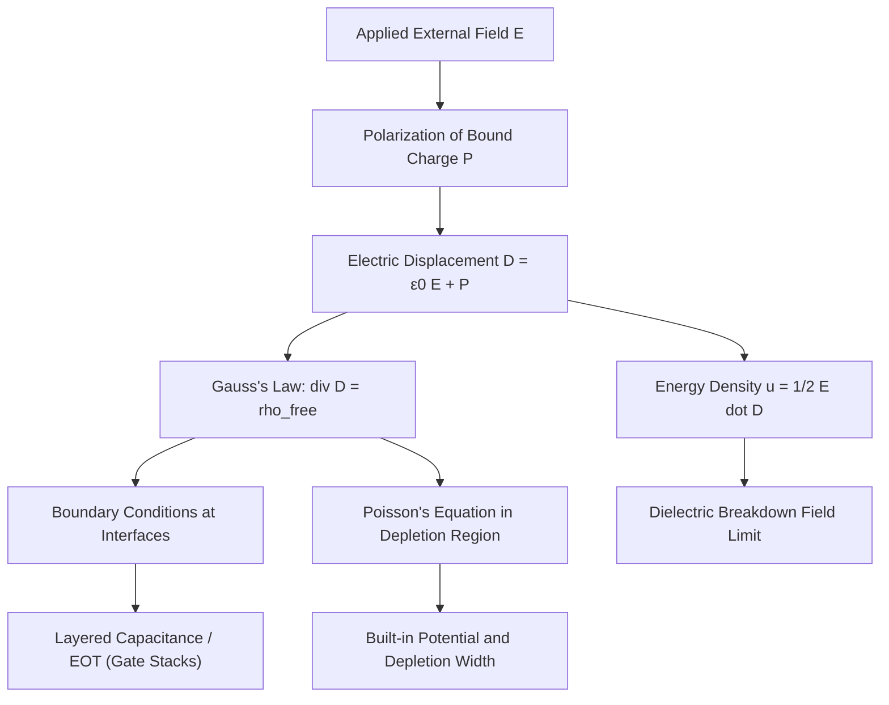

## Electrostatics in Dielectric Media

### Overview

Electrostatics in dielectric media extends vacuum electrostatics to describe how electric fields, charges, and potentials behave inside materials that respond to an applied field through polarization rather than free charge conduction. This subject is foundational to semiconductor physics because dielectric behavior governs gate oxide performance, depletion region electrostatics, capacitor design, and the screening of charges by the crystal lattice itself.

A dielectric is a material with no (or negligible) free charge carriers under normal conditions, but whose bound charges — electrons tightly held to atoms or ions — can shift slightly in response to an external field. This microscopic charge displacement is called polarization, and it modifies the macroscopic electric field inside the material.

### Polarization

When an external field $\vec{E}$ is applied to a dielectric, each atom or molecule develops a small dipole moment $\vec{p}$. The bulk response is described by the polarization vector $\vec{P}$, defined as the dipole moment per unit volume:

$$\vec{P} = \lim_{\Delta V \to 0} \frac{\sum \vec{p}_i}{\Delta V}$$

**Key Points**

- Polarization arises from several microscopic mechanisms:
  - **Electronic polarization**: displacement of the electron cloud relative to the nucleus (present in all atoms, fast response, up to optical frequencies)
  - **Ionic polarization**: relative displacement of positive and negative ions in an ionic lattice (present in compounds like SiO₂, slower than electronic)
  - **Orientational (dipolar) polarization**: alignment of permanent molecular dipoles (dominant in polar liquids, largely absent in covalent semiconductor lattices)
  - **Interfacial/space-charge polarization**: charge accumulation at internal boundaries or defects, significant at low frequencies in heterogeneous materials
- Bound surface charge density is related to polarization by $\sigma_b = \vec{P} \cdot \hat{n}$, and bound volume charge density by $\rho_b = -\nabla \cdot \vec{P}$

### The Electric Displacement Field

Gauss's law in a dielectric must account for both free and bound charge. To simplify this, the electric displacement field $\vec{D}$ is introduced:

$$\vec{D} = \varepsilon_0 \vec{E} + \vec{P}$$

Gauss's law then takes the form:

$$\nabla \cdot \vec{D} = \rho_{\text{free}}$$

This is the practically useful form, since $\rho_{\text{free}}$ (dopant ions, injected carriers, electrode charge) is typically what is externally controlled or measured, while bound charge is absorbed into $\vec{D}$ implicitly.

For linear, isotropic, homogeneous (LIH) dielectrics, polarization is proportional to the local field:

$$\vec{P} = \varepsilon_0 \chi_e \vec{E}$$

where $\chi_e$ is the electric susceptibility. Substituting gives:

$$\vec{D} = \varepsilon_0(1 + \chi_e)\vec{E} = \varepsilon_0 \varepsilon_r \vec{E} = \varepsilon \vec{E}$$

where $\varepsilon_r = 1 + \chi_e$ is the relative permittivity (dielectric constant) and $\varepsilon = \varepsilon_0 \varepsilon_r$ is the absolute permittivity.

**Example**

For silicon dioxide (SiO₂), $\varepsilon_r \approx 3.9$; for silicon, $\varepsilon_r \approx 11.7$; for high-$k$ gate dielectrics like HfO₂, $\varepsilon_r \approx 20$–25. This is why high-$k$ materials replaced SiO₂ in advanced MOSFET gate stacks: a thicker physical layer of a high-$\varepsilon_r$ material can produce the same gate capacitance (and hence the same electrostatic control of the channel) as a very thin SiO₂ layer, while suppressing quantum-mechanical tunneling leakage.

### Boundary Conditions at Dielectric Interfaces

At an interface between two dielectric media (permittivities $\varepsilon_1$, $\varepsilon_2$), Maxwell's equations impose two conditions:

1. **Tangential E is continuous** (assuming no surface current, which holds in electrostatics):

   $$E_{1t} = E_{2t}$$
2. **Normal D is continuous if there is no free surface charge**, otherwise it jumps by the free surface charge density:

   $$D_{2n} - D_{1n} = \sigma_{\text{free}}$$

Combining these with $D = \varepsilon E$ gives the refraction-like bending of field lines across a dielectric boundary:

$$\frac{\tan\theta_1}{\tan\theta_2} = \frac{\varepsilon_1}{\varepsilon_2}$$

where $\theta_1$, $\theta_2$ are the angles the field lines make with the normal in each medium.

**Illustration — Field lines bending at a dielectric interface (svg_diagram)**

<svg xmlns="http://www.w3.org/2000/svg" viewBox="0 0 500 320">
<rect x="0" y="0" width="500" height="320" fill="#ffffff" />
<text x="250" y="25" text-anchor="middle" font-size="16" font-weight="bold" fill="#111">Field Refraction at Dielectric Interface (svg_diagram)</text>

<rect x="30" y="50" width="440" height="110" fill="#eaf2ff" stroke="none" />
<rect x="30" y="160" width="440" height="110" fill="#fff3e0" stroke="none" />

<text x="45" y="70" font-size="13" fill="`#1a4d8f`">Medium 1 (ε₁ = 3.9, SiO₂)</text>

<text x="45" y="285" font-size="13" fill="`#a15c00`">Medium 2 (ε₂ = 11.7, Si)</text>

<line x1="30" y1="160" x2="470" y2="160" stroke="#333" stroke-width="2" />

<line x1="250" y1="90" x2="250" y2="230" stroke="#888" stroke-width="1" stroke-dasharray="5,4" />
<text x="255" y="95" font-size="12" fill="#555">normal</text>

<line x1="200" y1="90" x2="250" y2="160" stroke="#1a4d8f" stroke-width="2.5" marker-end="url(#arrow1)" />
<text x="170" y="100" font-size="12" fill="#1a4d8f">E₁, θ₁</text>

<line x1="250" y1="160" x2="360" y2="230" stroke="#a15c00" stroke-width="2.5" marker-end="url(#arrow2)" />
<text x="345" y="225" font-size="12" fill="#a15c00">E₂, θ₂</text>

<path d="M 250 130 A 30 30 0 0 1 228 105" fill="none" stroke="#1a4d8f" stroke-width="1" />
<path d="M 250 190 A 30 30 0 0 0 278 210" fill="none" stroke="#a15c00" stroke-width="1" />
<text x="60" y="300" font-size="12" fill="#333">Since ε₂ &gt; ε₁, θ₂ &gt; θ₁ (field bends away from normal entering higher-ε medium)</text>

</svg>

### Gauss's Law and Capacitance in Layered Dielectrics

Semiconductor devices frequently involve stacked dielectric layers (e.g., interfacial SiO₂ beneath a high-$k$ layer in a MOSFET gate stack). For $N$ series dielectric layers, each of thickness $t_i$ and permittivity $\varepsilon_i$, sandwiched between parallel-plate electrodes of area $A$, the layers behave as capacitors in series:

$$\frac{1}{C_{\text{total}}} = \sum_{i=1}^{N} \frac{1}{C_i} = \sum_{i=1}^{N} \frac{t_i}{\varepsilon_i A}$$

This leads to the concept of **equivalent oxide thickness (EOT)**, widely used in MOSFET gate stack engineering:

$$\text{EOT} = t_{\text{high-}k} \cdot \frac{\varepsilon_{\text{SiO}_2}}{\varepsilon_{\text{high-}k}}$$

EOT expresses the physical thickness of SiO₂ that would produce the same gate capacitance as the actual high-$k$ layer, enabling direct comparison of gate control strength across different dielectric materials.

### Energy Density and Forces in Dielectrics

The energy stored in an electric field within a dielectric is:

$$u = \frac{1}{2} \vec{E} \cdot \vec{D} = \frac{1}{2} \varepsilon E^2$$

Total electrostatic energy in a volume $V$:

$$U = \frac{1}{2} \int_V \vec{E} \cdot \vec{D} \, dV$$

A dielectric placed in a non-uniform field, or partially inserted between capacitor plates, experiences a net force pulling it toward the region of stronger field, since this increases the field's ability to polarize the material and lowers the system's total energy at constant charge (or increases stored energy at constant voltage, depending on the boundary condition considered). This underlies electrostatic effects relevant to MEMS dielectric actuators and charge-trapping phenomena in dielectric films.

### Application to Semiconductor Device Electrostatics

**Key Points**

- **MOS capacitor / gate stack**: The gate dielectric's $\varepsilon_r$ and thickness $t_{ox}$ set the oxide capacitance $C_{ox} = \varepsilon_{ox}/t_{ox}$ per unit area, which directly determines threshold voltage, subthreshold slope, and transconductance in a MOSFET.
- **Depletion region electrostatics**: Although the semiconductor's bulk is not a classical dielectric (it contains mobile and fixed charge from ionized dopants), the same $\nabla \cdot \vec{D} = \rho_{\text{free}}$ formalism with $\varepsilon_{Si}$ is used to solve Poisson's equation for the depletion width, built-in potential, and field profile in p-n junctions.
- **Dielectric breakdown**: Every real dielectric has a maximum field, $E_{BD}$, before catastrophic conduction (breakdown) occurs. SiO₂ has $E_{BD} \approx 10$ MV/cm [Inference: typical literature range 8–10 MV/cm depending on film quality and measurement method], a key limit on how thin a gate oxide can be scaled without excessive leakage or reliability failure.
- **Fringing fields and parasitic capacitance**: In dense interconnect and fin/gate geometries, dielectric electrostatics govern fringe-field capacitance, which becomes a dominant parasitic effect at advanced technology nodes.

**System Relationship Diagram**

### Worked Example

**Example**

Consider a parallel-plate MOS capacitor with a high-$k$ HfO₂ layer ($\varepsilon_r = 22$) of physical thickness 4 nm, replacing SiO₂ ($\varepsilon_r = 3.9$).

Equivalent oxide thickness:

$$\text{EOT} = 4\,\text{nm} \times \frac{3.9}{22} \approx 0.71\,\text{nm}$$

This shows the HfO₂ layer provides the same electrostatic gate control as a SiO₂ layer less than 1 nm thick, while being physically over 5 times thicker — dramatically reducing direct tunneling leakage current for the same effective capacitance.

### Conclusion

Electrostatics in dielectric media provides the field-theoretic foundation for nearly every capacitive and gate-control phenomenon in semiconductor devices. The introduction of the displacement field $\vec{D}$ cleanly separates free charge (which engineers control via doping, biasing, and electrode design) from bound polarization charge (an intrinsic material response), and the resulting boundary-condition and layered-capacitance formalism directly underlies gate stack design, EOT scaling, and depletion-region analysis used throughout MOSFET and junction physics.

**Related Topics**

- Poisson's and Laplace's equations in semiconductor electrostatics
- Depletion approximation and p-n junction built-in potential
- MOS capacitor C–V characteristics and threshold voltage
- High-$k$ dielectric materials and gate stack engineering
- Dielectric breakdown mechanisms and time-dependent dielectric breakdown (TDDB)
- Piezoelectric and ferroelectric dielectrics in emerging memory devices
- Debye screening and space-charge polarization in doped semiconductors