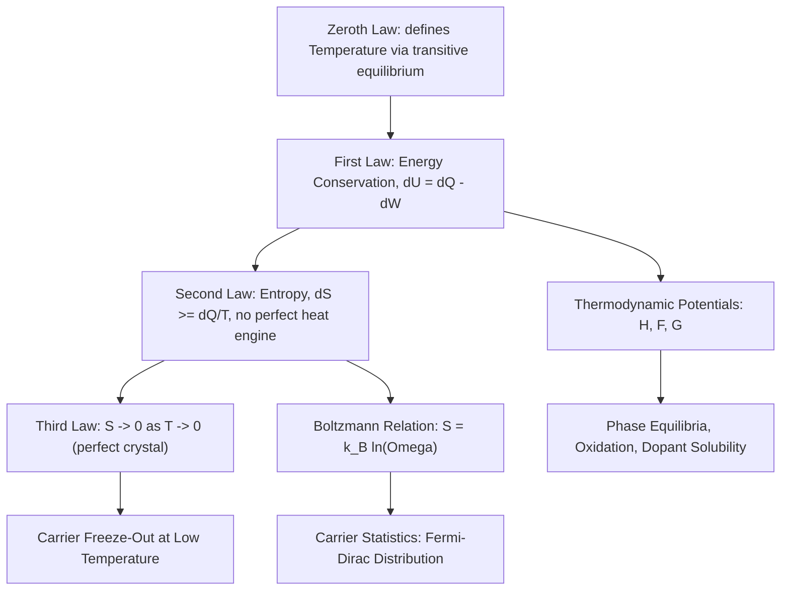

## Thermodynamics and the Laws of Heat

### Overview

Thermodynamics describes how energy, heat, and work relate to the macroscopic state of a system, and how systems evolve toward equilibrium. In semiconductor physics, thermodynamics underlies carrier statistics (Fermi-Dirac distribution), thermal generation and recombination, diffusion, thermal budget management during fabrication, and reliability phenomena such as electromigration and thermal runaway. This chapter establishes the classical framework — the four laws of thermodynamics — that later chapters build on for carrier transport and device thermal behavior.

### Core Thermodynamic Concepts

**Key Points**

- **System**: the region of matter/energy under study, separated from its surroundings by a boundary (open, closed, or isolated)
- **State variables**: quantities describing the system's condition — temperature $T$, pressure $P$, volume $V$, internal energy $U$, entropy $S$
- **Thermodynamic equilibrium**: a state in which no net macroscopic flows of heat, matter, or work occur, and state variables are uniform and unchanging in time
- **Process types**: isothermal (constant $T$), isobaric (constant $P$), isochoric (constant $V$), adiabatic (no heat exchange, $Q=0$)

### The Zeroth Law of Thermodynamics

If system A is in thermal equilibrium with system C, and system B is also in thermal equilibrium with system C, then A and B are in thermal equilibrium with each other.

This law establishes temperature as a well-defined, transitive property and justifies the use of thermometers: a thermometer (system C) can be equilibrated separately with two bodies to compare their temperatures without needing to bring the bodies into direct contact.

### The First Law of Thermodynamics

The first law is a statement of energy conservation. The change in internal energy $\Delta U$ of a system equals the heat added to the system $Q$ minus the work done by the system $W$:

$$\Delta U = Q - W$$

or in differential form:

$$dU = \delta Q - \delta W$$

where $\delta Q$ and $\delta W$ are inexact differentials (path-dependent), while $dU$ is exact (state-function, path-independent).

For a quasi-static process, mechanical work done by a gas expanding against pressure is:

$$\delta W = P\, dV$$

**Key Points**

- Internal energy $U$ is a **state function** — it depends only on the current state, not the path taken to reach it
- Heat $Q$ and work $W$ are **path functions** — their values depend on the specific process
- Sign convention (this text): $Q > 0$ when heat flows *into* the system; $W > 0$ when work is done *by* the system on the surroundings

**Example**

An ideal gas undergoes isothermal expansion from $V_1$ to $V_2$ at temperature $T$. Since $\Delta U = 0$ for an ideal gas at constant $T$ (internal energy depends only on $T$), the first law gives $Q = W$. The work done is:

$$W = nRT \ln\left(\frac{V_2}{V_1}\right)$$

All heat absorbed is converted entirely into work in this idealized case.

### The Second Law of Thermodynamics

The second law introduces entropy $S$ and establishes the directionality of spontaneous processes. Several equivalent formulations exist:

- **Clausius statement**: Heat cannot spontaneously flow from a colder body to a hotter body without external work being performed.
- **Kelvin-Planck statement**: It is impossible to construct a heat engine that, operating in a cycle, converts heat entirely into work with no other effect (i.e., no 100% efficient heat engine exists).
- **Entropy statement**: The total entropy of an isolated system never decreases over time:

$$\Delta S_{\text{universe}} \geq 0$$

with equality only for reversible processes.

For an infinitesimal reversible heat transfer:

$$dS = \frac{\delta Q_{\text{rev}}}{T}$$

**Carnot Efficiency**

The maximum possible efficiency of any heat engine operating between a hot reservoir at $T_H$ and a cold reservoir at $T_C$ is the Carnot efficiency:

$$\eta_{\text{Carnot}} = 1 - \frac{T_C}{T_H}$$

No real engine operating between these two temperatures can exceed this efficiency; it is achieved only in the idealized, reversible Carnot cycle.

**Statistical Interpretation (Boltzmann)**

Entropy has a microscopic, statistical meaning via the Boltzmann relation:

$$S = k_B \ln \Omega$$

where $k_B$ is Boltzmann's constant and $\Omega$ is the number of accessible microstates consistent with the system's macroscopic state. This connects thermodynamics to statistical mechanics and directly motivates the Fermi-Dirac and Maxwell-Boltzmann distributions used to describe electron and hole populations in semiconductors.

### The Third Law of Thermodynamics

As a system's temperature approaches absolute zero, its entropy approaches a minimum, constant value (zero for a perfect crystal with a unique ground state):

$$\lim_{T \to 0} S = 0 \quad \text{(for a perfect crystal)}$$

**Key Points**

- The third law implies that absolute zero cannot be reached in a finite number of thermodynamic steps (unattainability principle)
- It provides an absolute reference point for entropy calculations, unlike energy, which is typically only defined up to an additive constant
- In semiconductor physics, this underlies why carrier freeze-out occurs at very low temperatures: as $T \to 0$, thermal energy $k_B T$ becomes insufficient to ionize dopant atoms, and free carrier concentration collapses toward zero

### Thermodynamic Potentials

Beyond internal energy, several derived potentials are useful depending on which variables are held constant:

$$H = U + PV \quad \text{(Enthalpy)}$$

$$F = U - TS \quad \text{(Helmholtz free energy)}$$

$$G = H - TS \quad \text{(Gibbs free energy)}$$

**Key Points**

- Enthalpy $H$ is useful at constant pressure (common in chemical/materials processing, e.g., CVD reaction energetics)
- Helmholtz free energy $F$ is useful at constant volume and temperature; minimized at equilibrium under those constraints
- Gibbs free energy $G$ is useful at constant pressure and temperature; its minimization governs phase equilibria and chemical reaction spontaneity — directly relevant to semiconductor crystal growth, oxidation reactions, and dopant solid solubility

### Relationship Between the Laws

### Relevance to Semiconductor Physics and Fabrication

**Key Points**

- **Carrier statistics**: The Fermi-Dirac distribution, $f(E) = \frac{1}{1 + e^{(E-E_F)/k_BT}}$, is derived from statistical thermodynamics and governs electron/hole occupation probabilities as a function of temperature
- **Thermal generation-recombination**: Thermal energy $k_BT$ drives electron-hole pair generation; the balance between generation and recombination is an equilibrium thermodynamic process
- **Diffusion and drift**: The Einstein relation, $D = \mu \frac{k_BT}{q}$, links the diffusion coefficient $D$ to carrier mobility $\mu$ through thermal energy, directly derived from thermodynamic/statistical mechanics arguments
- **Thermal budget in fabrication**: Process steps like oxidation, diffusion, and annealing are governed by thermally activated rate processes (Arrhenius behavior, $k \propto e^{-E_a/k_BT}$), where cumulative thermal exposure ("thermal budget") must be carefully controlled to avoid excessive dopant diffusion or unwanted phase changes
- **Device self-heating and thermal runaway**: Power dissipation ($P = IV$) raises local device temperature, which in turn affects carrier mobility, threshold voltage, and leakage current — a thermodynamic feedback loop critical to power device reliability and thermal management design
- **Crystal growth thermodynamics**: Gibbs free energy minimization governs phase transitions during Czochralski and epitaxial crystal growth, determining melt-solid equilibrium conditions and dopant segregation coefficients

### Conclusion

The four laws of thermodynamics establish temperature, energy conservation, entropy, and the behavior of systems near absolute zero as the foundational pillars for describing energy exchange in physical systems. In semiconductor physics, these classical principles are not merely background — they directly underpin the statistical distributions governing carrier populations, the kinetics of fabrication processes, and the reliability-limiting thermal behavior of operating devices.

**Related Topics**

- Statistical mechanics and the Maxwell-Boltzmann distribution
- Fermi-Dirac statistics and the Fermi level
- Heat transfer mechanisms: conduction, convection, and radiation in device packaging
- Arrhenius kinetics and thermally activated diffusion processes
- Phase diagrams and solid solubility limits in doped semiconductors
- Thermal budget management in IC fabrication
- Self-heating effects and thermal runaway in power semiconductor devices