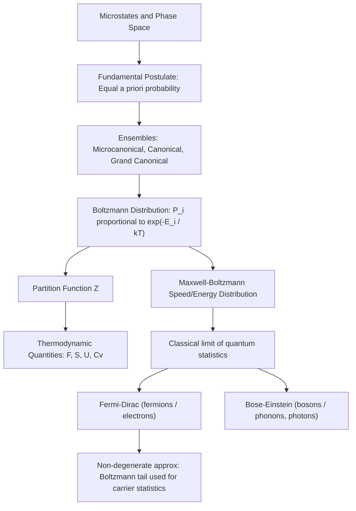

## Classical Statistical Mechanics

### Overview

Classical statistical mechanics provides the bridge between the microscopic behavior of large ensembles of particles and the macroscopic thermodynamic quantities that describe them. Rather than tracking every particle's exact trajectory, statistical mechanics treats a system's state probabilistically, deriving quantities like temperature, pressure, and entropy from averages over many microscopic configurations. This framework is the direct precursor to the quantum statistics (Fermi-Dirac, Bose-Einstein) used later to describe electron and hole populations in semiconductors, and understanding its classical limit is essential for recognizing when simpler approximations (like Maxwell-Boltzmann statistics) are valid for carrier transport.

### Microstates, Macrostates, and Phase Space

**Key Points**

- A **microstate** specifies the exact position and momentum of every particle in a system
- A **macrostate** is defined by a small number of bulk observable quantities (e.g., total energy $U$, volume $V$, particle number $N$)
- Many microstates correspond to the same macrostate; statistical mechanics counts and weights these microstates to predict macroscopic behavior
- **Phase space** is the abstract space spanned by all position and momentum coordinates $(q_1, ..., q_N, p_1, ..., p_N)$ of a system; a single point in phase space represents one microstate, and its time evolution traces a trajectory governed by classical (Hamiltonian) mechanics

The connection between microstates and entropy is given by the Boltzmann relation, introduced in thermodynamics:

$$S = k_B \ln \Omega$$

where $\Omega$ is the number of microstates consistent with a given macrostate.

### The Fundamental Postulate and Ensembles

The **fundamental postulate of statistical mechanics** states that for an isolated system in equilibrium, all accessible microstates consistent with the macroscopic constraints are equally probable.

To handle systems that exchange energy or particles with their surroundings, statistical mechanics defines several standard ensembles:

**Key Points**

- **Microcanonical ensemble ($N, V, U$ fixed)**: isolated system with fixed energy; all accessible microstates equally probable
- **Canonical ensemble ($N, V, T$ fixed)**: system in thermal contact with a heat bath at temperature $T$; energy fluctuates, but the system's microstate probabilities follow the Boltzmann distribution
- **Grand canonical ensemble ($\mu, V, T$ fixed)**: system exchanges both energy and particles with a reservoir at temperature $T$ and chemical potential $\mu$; essential for open systems like electron gases where particle number is not fixed — this ensemble is the direct ancestor of the derivation of Fermi-Dirac statistics

### The Boltzmann Distribution

For a system in the canonical ensemble, the probability of finding it in a microstate $i$ with energy $E_i$ is:

$$P_i = \frac{e^{-E_i / k_B T}}{Z}$$

where $Z$ is the **partition function**, a normalization factor that sums over all accessible microstates:

$$Z = \sum_i e^{-E_i / k_B T}$$

**Key Points**

- The partition function $Z$ is the central computational object in statistical mechanics — nearly all thermodynamic quantities can be derived from it
- Average energy: $\langle E \rangle = -\frac{\partial \ln Z}{\partial \beta}$, where $\beta = 1/k_BT$
- Helmholtz free energy: $F = -k_B T \ln Z$
- Entropy, pressure, and heat capacity can all be obtained as derivatives of $\ln Z$ with respect to appropriate variables

**Example**

For a single classical particle with kinetic energy $E = \frac{1}{2}mv^2$ in three dimensions in thermal contact with a bath at temperature $T$, integrating the Boltzmann factor over all velocity space yields the **Maxwell-Boltzmann speed distribution**:

$$f(v) = 4\pi n \left(\frac{m}{2\pi k_B T}\right)^{3/2} v^2 e^{-mv^2/2k_BT}$$

This distribution describes the spread of thermal velocities in a classical gas, and its energy-space analog, $f(E) \propto e^{-E/k_BT}$, is the classical (non-degenerate) limit that carrier statistics reduce to when the semiconductor is non-degenerately doped (Fermi level well inside the bandgap, away from the band edges).

### Equipartition Theorem

For a classical system in thermal equilibrium, each quadratic degree of freedom in the energy (each independent term like $\frac{1}{2}mv_x^2$ or $\frac{1}{2}kx^2$) contributes an average energy of $\frac{1}{2}k_BT$:

$$\langle E \rangle = \frac{f}{2} k_B T$$

where $f$ is the number of quadratic degrees of freedom.

**Example**

A monatomic ideal gas particle has 3 translational degrees of freedom, giving average kinetic energy $\langle E \rangle = \frac{3}{2}k_BT$ per particle, and total internal energy $U = \frac{3}{2}Nk_BT$ for $N$ particles — consistent with the classical ideal gas law and heat capacity $C_V = \frac{3}{2}Nk_B$.

### Classical vs. Quantum Statistics

Classical statistical mechanics assumes particles are distinguishable and can occupy any energy state with unrestricted occupation. This breaks down when:

1. Particle wave functions overlap significantly (quantum degeneracy), or
2. Particles are indistinguishable and subject to quantum exchange symmetry (fermions vs. bosons)

This leads to the two quantum statistical distributions:

$$f_{FD}(E) = \frac{1}{e^{(E-\mu)/k_BT}+1} \quad \text{(Fermi-Dirac, for fermions — electrons)}$$

$$f_{BE}(E) = \frac{1}{e^{(E-\mu)/k_BT}-1} \quad \text{(Bose-Einstein, for bosons — phonons, photons)}$$

**Key Points**

- When $E - \mu \gg k_BT$ (non-degenerate limit), both quantum distributions reduce to the classical **Maxwell-Boltzmann distribution**:

  $$f_{MB}(E) \approx e^{-(E-\mu)/k_BT}$$
- This is precisely the approximation used for carriers in a **non-degenerately doped semiconductor**, where the Fermi level lies well within the bandgap, several $k_BT$ away from either band edge
- In **degenerately doped** semiconductors (Fermi level inside or very close to a band), the full Fermi-Dirac distribution must be used, and the classical approximation fails

### Relevance to Semiconductor Physics

**Key Points**

- **Carrier concentration formulas**: The standard textbook expressions $n = N_C e^{-(E_C-E_F)/k_BT}$ and $p = N_V e^{-(E_F-E_V)/k_BT}$ are direct applications of the Maxwell-Boltzmann (classical, non-degenerate) approximation to the conduction and valence bands
- **Phonon statistics**: Lattice vibrations (phonons) are bosonic quasiparticles described by Bose-Einstein statistics, governing thermal conductivity and electron-phonon scattering rates that limit carrier mobility
- **Mobility and scattering**: Classical kinetic theory concepts — mean free path, collision frequency, drift velocity — extend directly from classical statistical mechanics of gases to the semiclassical treatment of carrier transport in the Drude and Boltzmann transport models
- **Doping regime classification**: Whether a semiconductor is treated with classical (Boltzmann) or quantum (Fermi-Dirac) statistics depends entirely on how close the Fermi level sits to the band edge relative to $k_BT$, a direct consequence of the classical-to-quantum statistical crossover described here

### Conclusion

Classical statistical mechanics establishes the probabilistic machinery — microstates, ensembles, the partition function, and the Boltzmann distribution — that connects microscopic particle behavior to macroscopic thermodynamic observables. Its classical (Maxwell-Boltzmann) limit is the direct mathematical ancestor of the non-degenerate carrier statistics used throughout introductory semiconductor device theory, making this topic an essential conceptual bridge before introducing quantum statistical distributions.

**Related Topics**

- Quantum statistics: Fermi-Dirac and Bose-Einstein distributions
- Density of states in semiconductors
- Non-degenerate vs. degenerate semiconductor approximations
- Kinetic theory of gases and the Drude model of conduction
- Phonon statistics and lattice thermal conductivity
- Boltzmann transport equation for carrier drift and diffusion
- Partition functions for multi-level and band-structure systems