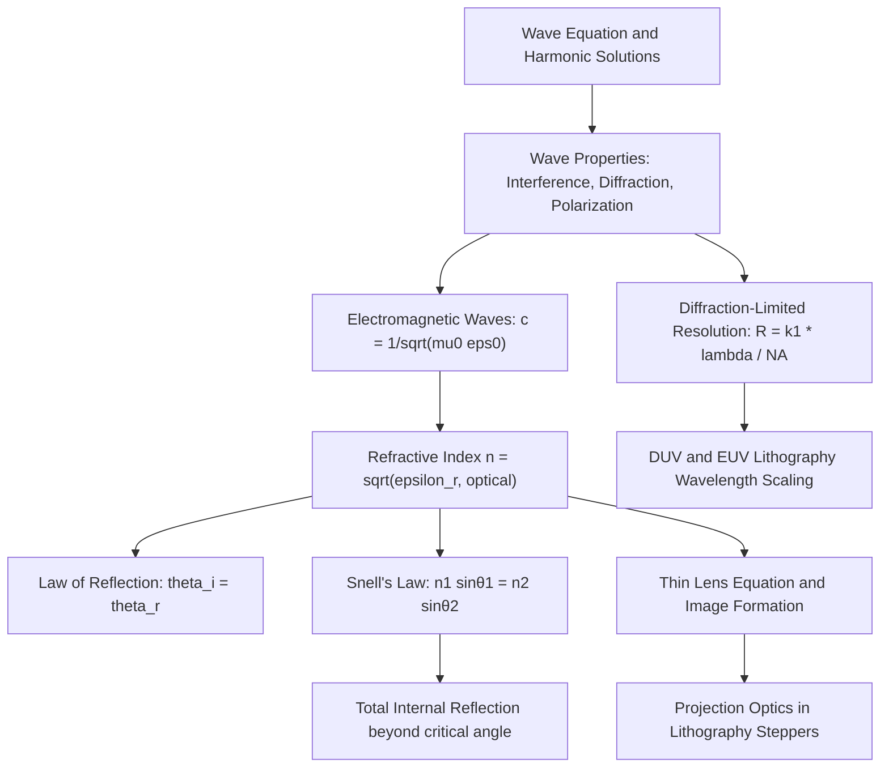

## Wave Motion and Geometrical Optics

### Overview

Wave motion and geometrical optics establish the classical framework for describing how disturbances propagate through space and how light interacts with interfaces, lenses, and media. In semiconductor physics, this foundation underlies photolithography (the optical patterning process central to IC fabrication), optical characterization techniques (ellipsometry, reflectometry), photodetector and LED operation, and the wave-mechanical treatment of electrons that follows in quantum mechanics chapters. Geometrical (ray) optics, in particular, is the direct working model for lithographic lens systems and projection optics.

### Wave Motion Fundamentals

**Key Points**

- A **wave** is a disturbance that propagates through space and time, transporting energy without net transport of matter
- The general one-dimensional wave equation is:

$$\frac{\partial^2 y}{\partial t^2} = v^2 \frac{\partial^2 y}{\partial x^2}$$

where $v$ is the wave propagation speed

- A traveling harmonic wave solution takes the form:

$$y(x,t) = A \sin(kx - \omega t + \phi)$$

where $A$ is amplitude, $k = 2\pi/\lambda$ is the wavenumber, $\omega = 2\pi f$ is the angular frequency, and $\phi$ is the phase constant

- Wave speed, wavelength, and frequency are related by:

$$v = f\lambda = \frac{\omega}{k}$$

### Wave Properties

**Key Points**

- **Superposition**: When two or more waves overlap, the resultant displacement is the algebraic sum of individual displacements — this is the basis of interference
- **Interference**: Constructive interference occurs when waves are in phase (path difference $= m\lambda$); destructive interference occurs when out of phase (path difference $= (m+\tfrac{1}{2})\lambda$)
- **Diffraction**: Bending of waves around obstacles or through apertures, becoming significant when aperture size is comparable to wavelength; governs the resolution limit of optical lithography systems
- **Standing waves**: Formed by superposition of two counter-propagating waves of equal frequency and amplitude, producing fixed nodes and antinodes — relevant to resonant optical cavities in laser diodes
- **Polarization**: Description of the orientation of oscillation for transverse waves (such as light); relevant to optical metrology and liquid-crystal-based photomask alignment systems

### Electromagnetic Waves and Light

Light is a transverse electromagnetic wave, with oscillating electric ($\vec{E}$) and magnetic ($\vec{B}$) fields perpendicular to each other and to the direction of propagation. In vacuum, its speed is the universal constant:

$$c = \frac{1}{\sqrt{\mu_0 \varepsilon_0}} \approx 3.00 \times 10^8 \, \text{m/s}$$

In a medium with refractive index $n$, light travels at:

$$v = \frac{c}{n}$$

The refractive index of a non-magnetic dielectric medium relates to its relative permittivity by $n = \sqrt{\varepsilon_r}$ (at the relevant optical frequency), directly connecting this topic back to the dielectric electrostatics covered earlier — although at optical frequencies, only the fast electronic polarization response contributes, so $\varepsilon_r$ at optical frequency is generally much lower than the static (DC) dielectric constant.

### Geometrical Optics: Reflection

**Law of Reflection**: The angle of incidence equals the angle of reflection, both measured from the normal to the surface:

$$\theta_i = \theta_r$$

This holds for specular (mirror-like) reflection from smooth surfaces, relevant to reflectometry-based thin-film thickness measurement on polished wafer surfaces.

### Geometrical Optics: Refraction

**Snell's Law** governs the bending of light as it crosses an interface between two media of differing refractive index:

$$n_1 \sin\theta_1 = n_2 \sin\theta_2$$

**Key Points**

- When light travels from a lower-index to a higher-index medium ($n_1 < n_2$), it bends *toward* the normal
- When light travels from higher to lower index, it bends *away* from the normal
- Beyond the **critical angle** $\theta_c$, given by $\sin\theta_c = n_2/n_1$ (for $n_1 > n_2$), **total internal reflection (TIR)** occurs — no light is transmitted into the second medium

**Illustration — Refraction and total internal reflection (svg_diagram)**

<svg xmlns="http://www.w3.org/2000/svg" viewBox="0 0 520 300">
<rect x="0" y="0" width="520" height="300" fill="#ffffff" />
<text x="260" y="24" text-anchor="middle" font-size="15" font-weight="bold" fill="#111">Refraction and Total Internal Reflection (svg_diagram)</text>
<rect x="30" y="45" width="460" height="105" fill="#eaf6ff" />
<rect x="30" y="150" width="460" height="105" fill="#fff7e6" />
<line x1="30" y1="150" x2="490" y2="150" stroke="#333" stroke-width="2" />
<text x="40" y="65" font-size="12" fill="#0a6b9c">n1 (lower index, e.g. air)</text>
<text x="40" y="270" font-size="12" fill="#a15c00">n2 (higher index, e.g. glass/photoresist)</text>

<line x1="130" y1="150" x2="130" y2="100" stroke="#888" stroke-dasharray="4,3" />
<line x1="90" y1="70" x2="130" y2="150" stroke="#0a6b9c" stroke-width="2.5" />
<line x1="130" y1="150" x2="150" y2="245" stroke="#a15c00" stroke-width="2.5" />
<text x="60" y="70" font-size="11" fill="#0a6b9c">incident</text>
<text x="150" y="240" font-size="11" fill="#a15c00">refracted</text>
<text x="100" y="290" font-size="11" fill="#333" text-anchor="middle">Case 1: n1 sinθ1 = n2 sinθ2</text>

<line x1="380" y1="150" x2="380" y2="100" stroke="#888" stroke-dasharray="4,3" />
<line x1="330" y1="245" x2="380" y2="150" stroke="#a15c00" stroke-width="2.5" />
<line x1="380" y1="150" x2="430" y2="245" stroke="#c0392b" stroke-width="2.5" />
<text x="330" y="255" font-size="11" fill="#a15c00">incident (θ &gt; θc)</text>
<text x="400" y="255" font-size="11" fill="#c0392b">totally reflected</text>
<text x="380" y="290" font-size="11" fill="#333" text-anchor="middle">Case 2: Total Internal Reflection</text>
</svg>

### Lenses and Image Formation

For a thin lens, the **thin lens equation** relates object distance $d_o$, image distance $d_i$, and focal length $f$:

$$\frac{1}{f} = \frac{1}{d_o} + \frac{1}{d_i}$$

Magnification is given by:

$$m = -\frac{d_i}{d_o}$$

**Key Points**

- **Converging (convex) lenses** have positive focal length and can form real, inverted images (when $d_o > f$) or virtual, upright, magnified images (when $d_o < f$)
- **Diverging (concave) lenses** have negative focal length and always form virtual, upright, reduced images
- Lens systems (compound optics) are used in photolithography steppers/scanners to project a reduced mask pattern onto the photoresist-coated wafer, typically at reduction ratios such as 4:1

### Diffraction-Limited Resolution

For an optical system with numerical aperture $NA$, the minimum resolvable feature size $R$ is approximated by the Rayleigh criterion:

$$R = k_1 \frac{\lambda}{NA}$$

where $\lambda$ is the exposure wavelength and $k_1$ is a process-dependent constant (typically $\geq 0.25$ for advanced immersion lithography).

**Example**

Deep ultraviolet (DUV) lithography using a 193 nm ArF excimer laser with $NA = 1.35$ (immersion) and $k_1 = 0.27$ yields:

$$R = 0.27 \times \frac{193\,\text{nm}}{1.35} \approx 38.6\,\text{nm}$$

This directly illustrates why shorter wavelengths (leading eventually to EUV lithography at 13.5 nm) and higher numerical apertures are pursued to shrink minimum feature sizes in advanced semiconductor manufacturing. [Inference: exact resolution also depends heavily on resist chemistry, illumination scheme, and computational lithography techniques such as OPC, beyond the basic Rayleigh formula.]

### Relevance to Semiconductor Physics and Fabrication

**Key Points**

- **Photolithography**: Geometrical and wave optics jointly govern the projection system that images a photomask pattern onto photoresist; resolution limits set by diffraction directly determine the smallest features that can be patterned
- **Optical metrology**: Techniques like spectroscopic ellipsometry and reflectometry use interference and refraction principles to non-destructively measure thin-film thickness and refractive index on wafers
- **Anti-reflective coatings**: Thin-film interference is deliberately engineered (using quarter-wave dielectric layers) to minimize unwanted reflection during lithographic exposure or to enhance light absorption in photodetectors and solar cells
- **LEDs and photodetectors**: Refractive index mismatches at semiconductor-air interfaces cause significant TIR-related light trapping in LEDs (motivating surface texturing) and influence the efficiency of light coupling into or out of optoelectronic devices
- **Waveguiding**: Total internal reflection is the operating principle behind optical waveguides and fiber-coupled photonic integrated circuits used in silicon photonics

### Conclusion

Wave motion and geometrical optics establish the classical description of light propagation, reflection, refraction, and image formation that underlies both the equipment used to fabricate semiconductor devices (lithography optics) and the physical principles governing many optoelectronic devices themselves. The diffraction-limited resolution relationship in particular provides the direct physical justification for the historical progression toward shorter exposure wavelengths in the semiconductor industry's pursuit of smaller feature sizes.

**Related Topics**

- Wave-particle duality and the photoelectric effect
- Photolithography process flow and resist chemistry
- Numerical aperture and resolution enhancement techniques (OPC, phase-shift masks)
- Thin-film interference and anti-reflective coating design
- Optical characterization: ellipsometry and reflectometry
- EUV lithography source and optics architecture
- Waveguide theory and silicon photonics