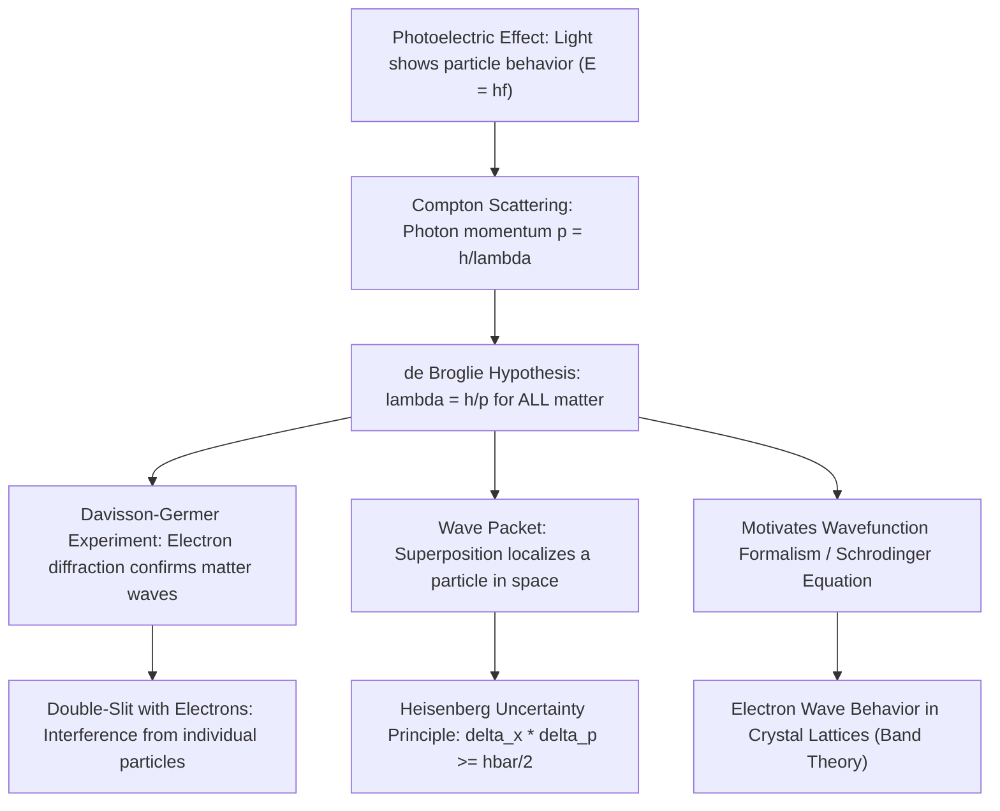

## Wave-Particle Duality and the de Broglie Hypothesis

### Overview

Wave-particle duality is the foundational principle of quantum mechanics stating that all matter and energy exhibit both wave-like and particle-like properties, with the dominant behavior depending on the scale and nature of the observation. The de Broglie hypothesis extends this duality — first established for light through the photoelectric effect and Compton scattering — to matter itself, proposing that every particle has an associated wavelength. This concept is the essential conceptual bridge from classical wave optics into quantum mechanics, and it directly motivates the Schrödinger equation and the quantum treatment of electrons in crystalline solids that underlies all of semiconductor band theory.

### Historical Motivation: Duality of Light

Before de Broglie's hypothesis, evidence had already accumulated that light — long understood as a wave (per the wave motion and optics of the previous chapter) — also behaves as a particle under certain conditions.

**Key Points**

- **Photoelectric effect**: Einstein explained that light ejects electrons from a metal surface only above a threshold frequency, with the ejected electron's maximum kinetic energy given by:

$$KE_{max} = hf - \phi$$

where $h$ is Planck's constant, $f$ is the light frequency, and $\phi$ is the material's work function. This behavior is inexplicable by classical wave theory (which predicts that intensity, not frequency, should determine ejection energy) but is naturally explained if light delivers energy in discrete quanta, or **photons**, each carrying energy $E = hf$.

- **Compton scattering**: X-rays scattering off electrons show a wavelength shift dependent on scattering angle, consistent with treating photons as particles carrying momentum $p = h/\lambda$ and undergoing elastic collisions, conserving both energy and momentum like billiard balls.
- These results established that light — despite unambiguous wave behavior in interference and diffraction experiments — also carries discrete, particle-like quanta of energy and momentum.

### The de Broglie Hypothesis

In 1924, Louis de Broglie proposed a symmetry argument: if light (traditionally a wave) can behave as a particle, then matter (traditionally particles) should also exhibit wave-like behavior. He postulated that any particle with momentum $p$ has an associated wavelength, now called the **de Broglie wavelength**:

$$\lambda = \frac{h}{p}$$

For a non-relativistic particle of mass $m$ moving at velocity $v$, $p = mv$, so:

$$\lambda = \frac{h}{mv}$$

**Key Points**

- $h = 6.626 \times 10^{-34}\,\text{J·s}$ is Planck's constant
- The de Broglie wavelength applies universally — to electrons, protons, atoms, and even macroscopic objects — but is only observable when $\lambda$ is comparable to relevant physical length scales (interatomic spacing, slit widths, etc.)
- For macroscopic objects, $\lambda$ is vanishingly small due to large $m$, explaining why everyday objects show no observable wave behavior

**Example**

Consider an electron accelerated through a potential difference of 100 V. Its kinetic energy is $KE = qV = 1.6\times10^{-19}\,\text{C} \times 100\,\text{V} = 1.6\times10^{-17}\,\text{J}$.

Solving $KE = p^2/2m$ for momentum:

$$p = \sqrt{2m \cdot KE} = \sqrt{2 \times 9.11\times10^{-31}\,\text{kg} \times 1.6\times10^{-17}\,\text{J}} \approx 5.40\times10^{-24}\,\text{kg·m/s}$$

De Broglie wavelength:

$$\lambda = \frac{h}{p} = \frac{6.626\times10^{-34}}{5.40\times10^{-24}} \approx 1.23\times10^{-10}\,\text{m} = 0.123\,\text{nm}$$

This is comparable to interatomic spacing in crystals (on the order of 0.1–0.5 nm), which is precisely why electron diffraction from crystal lattices is observable — a direct experimental confirmation of matter waves.

### Experimental Confirmation

**Davisson-Germer Experiment (1927)**: Electrons scattered from a nickel crystal produced a diffraction pattern with intensity maxima at angles matching the Bragg diffraction condition for waves of wavelength $\lambda = h/p$, providing direct experimental confirmation that electrons exhibit wave interference behavior consistent with the de Broglie relation.

**Key Points**

- The diffraction condition follows Bragg's law: $n\lambda = 2d\sin\theta$, where $d$ is the interplanar spacing of the crystal
- Subsequent experiments extended matter-wave confirmation to atoms, molecules, and even large molecules (e.g., fullerenes) in modern interferometry experiments
- Electron diffraction is now a standard structural characterization technique (e.g., reflection high-energy electron diffraction, RHEED, used to monitor epitaxial crystal growth in real time during semiconductor thin-film deposition)

### Wave-Particle Duality as a General Principle

**Key Points**

- Duality is not "sometimes a wave, sometimes a particle" in a naive alternating sense — it reflects that quantum objects are fundamentally described by a single mathematical entity (the wavefunction) whose behavior manifests as wave-like or particle-like depending on the experimental context
- The **double-slit experiment**, performed with electrons (or even single photons) one at a time, produces an interference pattern built up from individual, discrete detection events — direct evidence that each particle's probability of arrival is governed by wave interference, even though each detection is a localized, particle-like event
- This duality directly motivates the probabilistic, wavefunction-based formalism of quantum mechanics (covered in the next topic), where $|\psi(x,t)|^2$ gives the probability density of finding a particle at position $x$

### The Wave Packet and Uncertainty

A localized particle is represented not by a single infinite plane wave (which has a perfectly defined momentum but is spread over all space) but by a **wave packet** — a superposition of many plane waves of different wavelengths, localized in space.

**Key Points**

- Superposing waves of a range of wavenumbers $\Delta k$ produces a wave packet localized to a spatial extent $\Delta x$, with the two related by $\Delta x \cdot \Delta k \gtrsim 1$
- Using $p = \hbar k$ (where $\hbar = h/2\pi$), this becomes the position-momentum form of the **Heisenberg uncertainty principle**:

$$\Delta x \, \Delta p \geq \frac{\hbar}{2}$$

- This is a direct mathematical consequence of describing particles as waves, not an independent postulate — it reflects the fundamental impossibility of simultaneously localizing a wave in both position and wavenumber (momentum) space

### Relevance to Semiconductor Physics

**Key Points**

- **Band theory foundation**: The wave nature of electrons is essential to understanding how electrons propagate through a periodic crystal lattice, forming Bloch waves and leading to the formation of allowed and forbidden energy bands (covered in later chapters)
- **Quantum confinement**: When a semiconductor structure's physical dimension approaches the electron's de Broglie wavelength (as in quantum wells, wires, and dots used in nanoscale devices), quantization effects become significant, altering the density of states and energy levels — a direct, practical consequence of this hypothesis
- **Tunneling phenomena**: The wave nature of electrons allows finite-probability penetration through classically forbidden potential barriers, underlying phenomena like quantum tunneling in tunnel diodes, Fowler-Nordheim tunneling in gate oxides, and direct tunneling leakage in ultra-thin high-$k$ dielectrics
- **RHEED and electron diffraction metrology**: Real-time crystal growth monitoring during molecular beam epitaxy (MBE) directly exploits electron diffraction, a practical fabrication application of the de Broglie relation
- **Scale threshold for classical vs. quantum treatment**: The de Broglie wavelength of conduction electrons in silicon (tens of nanometers, considering effective mass) sets the length scale below which classical (Drude-model) transport breaks down and full quantum treatment becomes necessary — directly relevant as transistor gate lengths shrink toward atomic scales

### Conclusion

The de Broglie hypothesis generalizes the wave-particle duality first observed in light to all matter, proposing that every particle possesses an associated wavelength inversely proportional to its momentum. Experimentally confirmed by electron diffraction, this principle is the conceptual seed from which the full quantum mechanical wavefunction formalism grows, and it directly explains why electrons in a periodic crystal lattice must be treated as waves — the essential starting point for deriving semiconductor band structure.

**Related Topics**

- The Schrödinger equation and the quantum wavefunction
- Heisenberg uncertainty principle and its physical consequences
- Electron diffraction techniques: RHEED, LEED, and TEM
- Bloch's theorem and electron waves in periodic potentials
- Quantum tunneling and its role in tunnel diodes and gate leakage
- Quantum confinement in low-dimensional structures (quantum wells, wires, dots)
- Particle-in-a-box model as an introductory quantum system