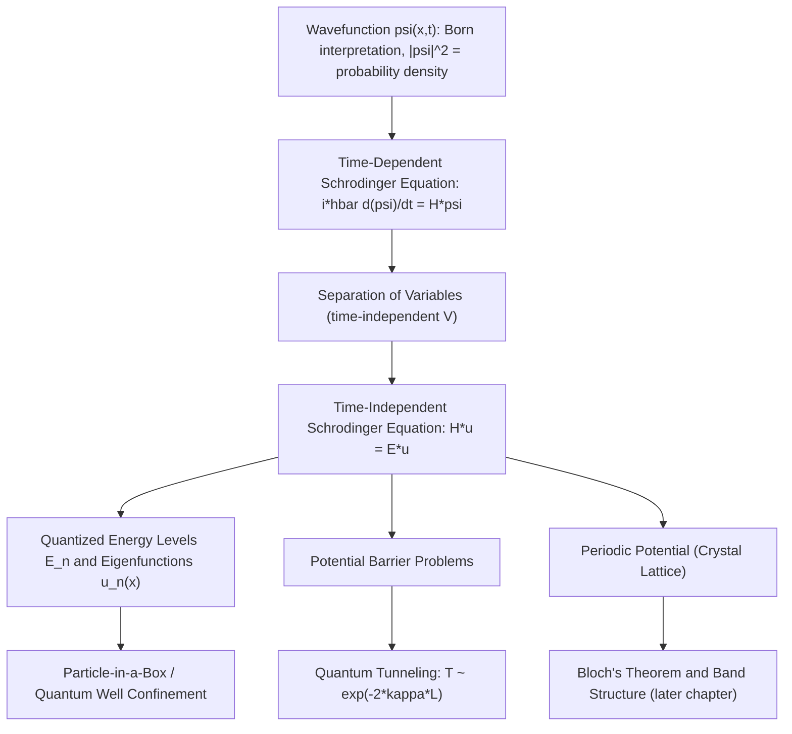

## The Schrödinger Equation and Wavefunctions

### Overview

The Schrödinger equation is the central equation of non-relativistic quantum mechanics, describing how the quantum state of a physical system evolves over time. It elevates the wave-particle duality and de Broglie hypothesis from qualitative concepts into a precise mathematical formalism centered on the **wavefunction**, $\psi$. For semiconductor physics, the Schrödinger equation is the direct tool used to derive electron behavior in periodic crystal potentials (leading to band theory), quantum wells, and tunneling phenomena — making it arguably the single most consequential equation for understanding why semiconductors behave the way they do at the device level.

### The Wavefunction

**Key Points**

- The **wavefunction** $\psi(x,t)$ is a complex-valued function that encodes the complete quantum state of a particle
- The wavefunction itself is not directly observable; its physical meaning comes through the **Born interpretation**: the probability density of finding the particle at position $x$ at time $t$ is:

$$P(x,t) = |\psi(x,t)|^2 = \psi^*(x,t)\psi(x,t)$$

- For $\psi$ to represent a valid physical state, it must be **normalizable**:

$$\int_{-\infty}^{\infty} |\psi(x,t)|^2 \, dx = 1$$

- Additional mathematical requirements for a physically acceptable wavefunction: it must be single-valued, finite, and (in most cases) continuous, with a continuous first derivative except at points of infinite potential discontinuity

### The Time-Dependent Schrödinger Equation

The fundamental equation governing the evolution of $\psi(x,t)$ in one dimension is:

$$i\hbar \frac{\partial \psi(x,t)}{\partial t} = -\frac{\hbar^2}{2m}\frac{\partial^2 \psi(x,t)}{\partial x^2} + V(x,t)\psi(x,t)$$

where $\hbar = h/2\pi$ is the reduced Planck constant, $m$ is the particle's mass, and $V(x,t)$ is the potential energy function.

**Key Points**

- This equation is a postulate of quantum mechanics — it is not derived from more fundamental principles but is justified by the correctness of its experimentally verified predictions
- It can be written compactly using the Hamiltonian operator $\hat{H}$:

$$i\hbar \frac{\partial \psi}{\partial t} = \hat{H}\psi, \qquad \hat{H} = -\frac{\hbar^2}{2m}\frac{\partial^2}{\partial x^2} + V(x,t)$$

- The equation is first-order in time (unlike the classical wave equation, which is second-order), reflecting the fact that quantum evolution is deterministic once $\psi(x,0)$ is known, but the outcome of a *measurement* remains probabilistic

### The Time-Independent Schrödinger Equation

When the potential $V(x)$ does not depend on time, the wavefunction can be separated into spatial and temporal parts:

$$\psi(x,t) = u(x)e^{-iEt/\hbar}$$

Substituting into the time-dependent equation yields the **time-independent Schrödinger equation (TISE)**:

$$-\frac{\hbar^2}{2m}\frac{d^2u(x)}{dx^2} + V(x)u(x) = Eu(x)$$

or compactly, $\hat{H}u(x) = Eu(x)$ — an eigenvalue equation, where $E$ is the allowed energy (eigenvalue) and $u(x)$ is the corresponding spatial eigenfunction.

**Key Points**

- States of this form, $\psi(x,t) = u(x)e^{-iEt/\hbar}$, are called **stationary states**: the probability density $|\psi(x,t)|^2 = |u(x)|^2$ is time-independent, even though $\psi$ itself oscillates in phase
- Solving the TISE for a given potential $V(x)$, subject to boundary conditions, yields the allowed (quantized) energy levels $E_n$ and corresponding eigenfunctions $u_n(x)$ of the system
- This is the workhorse equation used to derive discrete energy levels in confined systems — including the particle-in-a-box, the quantum harmonic oscillator, the hydrogen atom, and — critically for this course — electrons confined in quantum wells and periodic crystal potentials

### Worked Example: Infinite Square Well (Particle in a Box)

Consider a particle confined to $0 \leq x \leq L$ with $V(x) = 0$ inside and $V(x) = \infty$ outside. The boundary conditions require $u(0) = u(L) = 0$. Solving the TISE inside the well gives sinusoidal solutions, and applying the boundary conditions yields:

$$u_n(x) = \sqrt{\frac{2}{L}} \sin\left(\frac{n\pi x}{L}\right), \qquad n = 1, 2, 3, \ldots$$

with quantized energy levels:

$$E_n = \frac{n^2 \pi^2 \hbar^2}{2mL^2}$$

**Example**

For an electron confined in a 10 nm quantum well ($L = 10\times10^{-9}\,\text{m}$), the ground state energy ($n=1$) is:

$$E_1 = \frac{\pi^2 \hbar^2}{2mL^2} = \frac{\pi^2 (1.055\times10^{-34})^2}{2 \times 9.11\times10^{-31} \times (10\times10^{-9})^2} \approx 6.0\times10^{-22}\,\text{J} \approx 3.76\,\text{meV}$$

This directly illustrates **quantum confinement**: shrinking $L$ (as in nanoscale semiconductor quantum wells) increases $E_n \propto 1/L^2$, raising the effective bandgap of confined structures — the physical basis for tunable-emission quantum well lasers and LEDs.

**Illustration — Infinite square well wavefunctions and energy levels (svg_diagram)**

<svg xmlns="http://www.w3.org/2000/svg" viewBox="0 0 480 320">
<rect x="0" y="0" width="480" height="320" fill="#ffffff" />
<text x="240" y="22" text-anchor="middle" font-size="15" font-weight="bold" fill="#111">Infinite Square Well: u_n(x) and E_n (svg_diagram)</text>

<line x1="100" y1="40" x2="100" y2="290" stroke="#333" stroke-width="3" />
<line x1="380" y1="40" x2="380" y2="290" stroke="#333" stroke-width="3" />
<line x1="100" y1="290" x2="380" y2="290" stroke="#333" stroke-width="2" />

<line x1="100" y1="240" x2="380" y2="240" stroke="#999" stroke-dasharray="4,3" />
<line x1="100" y1="180" x2="380" y2="180" stroke="#999" stroke-dasharray="4,3" />
<line x1="100" y1="100" x2="380" y2="100" stroke="#999" stroke-dasharray="4,3" />
<text x="385" y="244" font-size="12" fill="#555">E1</text>
<text x="385" y="184" font-size="12" fill="#555">E2</text>
<text x="385" y="104" font-size="12" fill="#555">E3</text>

<path d="M 100 240 Q 240 200 380 240" fill="none" stroke="#0a6b9c" stroke-width="2.5" />

<path d="M 100 180 Q 170 140 240 180 Q 310 220 380 180" fill="none" stroke="#a15c00" stroke-width="2.5" />

<path d="M 100 100 Q 145 65 190 100 Q 240 135 290 100 Q 335 65 380 100" fill="none" stroke="#7a2fa8" stroke-width="2.5" />

<text x="240" y="308" text-anchor="middle" font-size="12" fill="#333">x = 0 to L, V(x) = infinity outside well</text>

</svg>

### Interpreting the Wavefunction: Expectation Values and Operators

In quantum mechanics, physical observables (position, momentum, energy) are represented by **operators** acting on the wavefunction. The expectation value (average result of many measurements) of an observable represented by operator $\hat{A}$ is:

$$\langle A \rangle = \int_{-\infty}^{\infty} \psi^*(x,t) \, \hat{A} \, \psi(x,t) \, dx$$

**Key Points**

- Position operator: $\hat{x} = x$ (multiplication)
- Momentum operator: $\hat{p} = -i\hbar \frac{\partial}{\partial x}$
- Energy (Hamiltonian) operator: $\hat{H} = -\frac{\hbar^2}{2m}\frac{\partial^2}{\partial x^2} + V(x)$
- Only certain operators (Hermitian operators) correspond to physically measurable quantities, guaranteeing real-valued expectation values

### Tunneling Through a Potential Barrier

One of the most consequential predictions of the Schrödinger equation for semiconductor devices is **quantum tunneling**: a particle has a nonzero probability of being found on the far side of a potential barrier even when its energy $E$ is less than the barrier height $V_0$ — a result strictly forbidden in classical mechanics.

For a rectangular barrier of height $V_0 > E$ and width $L$, solving the TISE in each region and matching boundary conditions yields a transmission probability approximately:

$$T \approx e^{-2\kappa L}, \qquad \kappa = \frac{\sqrt{2m(V_0 - E)}}{\hbar}$$

**Key Points**

- Transmission probability decreases exponentially with barrier width $L$ and with $\sqrt{V_0 - E}$
- This exponential sensitivity to thickness is the direct physical reason why gate oxide scaling faces a hard leakage-current wall: shaving even a fraction of a nanometer off an ultra-thin dielectric barrier can increase tunneling leakage current by orders of magnitude
- Practical semiconductor applications of tunneling include Fowler-Nordheim tunneling (flash memory programming/erase), direct tunneling leakage (thin gate oxides), and resonant tunneling diodes

### Relevance to Semiconductor Physics

**Key Points**

- **Band structure derivation**: Solving the Schrödinger equation for an electron in a periodic crystal potential (via Bloch's theorem, covered in a later chapter) directly produces the allowed and forbidden energy bands that define whether a material is a conductor, semiconductor, or insulator
- **Quantum wells, wires, and dots**: The particle-in-a-box solution is the direct conceptual and mathematical model for quantum-confined nanostructures used in modern optoelectronics and some advanced transistor architectures
- **Tunnel diodes and resonant tunneling diodes**: Device operation is explained entirely by solving the Schrödinger equation across a heterostructure potential profile with one or more barriers
- **Gate oxide leakage and flash memory**: Both direct tunneling leakage in scaled MOSFETs and the Fowler-Nordheim tunneling used to program/erase flash memory cells are quantitatively predicted using barrier-penetration solutions of the Schrödinger equation
- **Effective mass approximation**: In crystals, the free-electron mass $m$ in the Schrödinger equation is replaced by an effective mass $m^*$ that accounts for the periodic lattice potential, allowing the same equation to describe carrier behavior inside a semiconductor using a modified but still free-particle-like form

### Conclusion

The Schrödinger equation transforms the qualitative wave-particle duality of the previous topic into a precise, solvable mathematical framework describing how quantum systems evolve and what energies and configurations they can occupy. Its time-independent form, applied to increasingly realistic potentials — from the simple infinite well to the periodic crystal lattice — is the direct mathematical origin of semiconductor band theory, quantum confinement effects, and tunneling phenomena that govern modern device operation.

**Related Topics**

- Bloch's theorem and electron states in periodic potentials
- The effective mass approximation and its use in semiconductor transport
- The quantum harmonic oscillator and phonon quantization
- Density of states in bulk, 2D, 1D, and 0D confined systems
- Resonant tunneling diodes and superlattice structures
- Fowler-Nordheim tunneling in flash memory devices
- Perturbation theory and its application to doped semiconductors