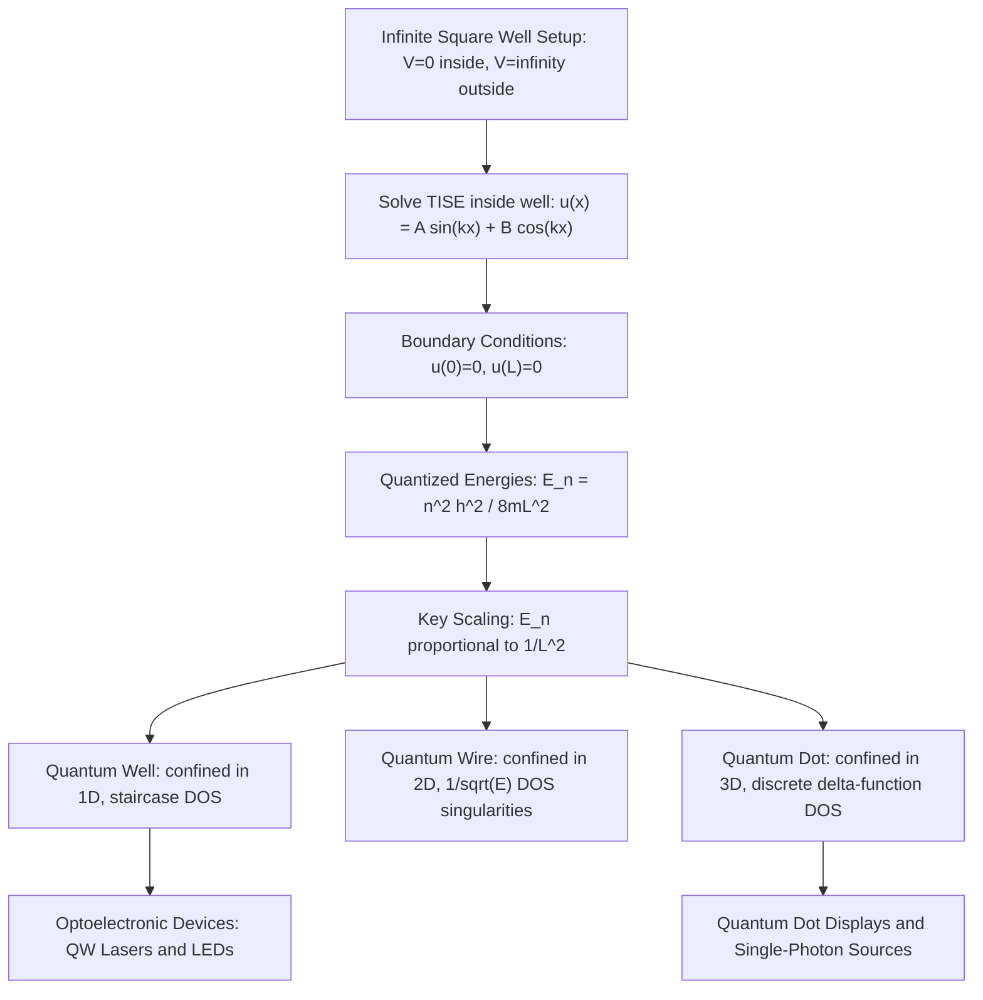

## Particle in a Box and Quantum Confinement

### Overview

The particle-in-a-box model is the simplest exactly solvable problem in quantum mechanics, yet it captures the essential physics of quantum confinement: when a particle is restricted to a finite spatial region, its energy becomes quantized rather than continuous. This idealized model, built directly on the time-independent Schrödinger equation from the previous topic, provides the conceptual and mathematical foundation for understanding quantum wells, wires, and dots — nanostructures that are central to modern optoelectronic and advanced transistor device engineering.

### The Infinite Square Well Setup

Consider a particle of mass $m$ confined to move freely within a one-dimensional region $0 \leq x \leq L$, with infinitely high potential walls outside this region:

$$V(x) = \begin{cases} 0, & 0 \leq x \leq L \\ \infty, & x < 0 \text{ or } x > L \end{cases}$$

**Key Points**

- The infinite potential outside the well forces the wavefunction to be exactly zero there, since no finite-energy particle can exist where $V = \infty$
- This is the idealized limiting case of a "hard wall" confinement, applicable when the actual barrier height is much larger than the particle's confinement energy
- Inside the well, the particle behaves as a free particle, so the time-independent Schrödinger equation reduces to:

$$-\frac{\hbar^2}{2m}\frac{d^2u(x)}{dx^2} = Eu(x), \qquad 0 \leq x \leq L$$

### Solving for Eigenfunctions and Energy Levels

The general solution inside the well is $u(x) = A\sin(kx) + B\cos(kx)$, where $k = \sqrt{2mE}/\hbar$. Applying the boundary conditions:

- $u(0) = 0 \Rightarrow B = 0$
- $u(L) = 0 \Rightarrow \sin(kL) = 0 \Rightarrow kL = n\pi, \; n = 1, 2, 3, \ldots$

This yields the normalized eigenfunctions:

$$u_n(x) = \sqrt{\frac{2}{L}}\sin\left(\frac{n\pi x}{L}\right)$$

and the quantized energy eigenvalues:

$$E_n = \frac{n^2\pi^2\hbar^2}{2mL^2} = \frac{n^2h^2}{8mL^2}$$

**Key Points**

- $n = 0$ is excluded because it would give $u(x) = 0$ everywhere — no particle at all — so the lowest allowed state is $n = 1$, the **ground state**, with nonzero **zero-point energy** $E_1 = \frac{\pi^2\hbar^2}{2mL^2}$
- Energy spacing between adjacent levels *increases* with $n$: $\Delta E_{n,n+1} = E_{n+1} - E_n \propto (2n+1)$, so higher states are progressively further apart in energy
- The eigenfunction $u_n(x)$ has exactly $n-1$ interior nodes (points where the wavefunction crosses zero), a general feature of bound-state solutions that also applies to more complex confining potentials
- Eigenfunctions for different $n$ are mutually orthogonal, $\int_0^L u_m^*(x)u_n(x)\,dx = 0$ for $m \neq n$, reflecting that these are distinct, independent quantum states

### The Key Scaling Relationship

The central physical result of this model is the inverse-square dependence of energy on confinement length:

$$E_n \propto \frac{1}{L^2}$$

**Key Points**

- Shrinking the confinement length $L$ raises all energy levels, with the effect growing rapidly as $L$ becomes very small
- This single relationship is the quantitative basis for **quantum confinement effects** observed across all confined semiconductor nanostructures — smaller nanocrystals or thinner quantum wells have larger level spacings and larger effective bandgaps
- The relationship also depends inversely on mass $m$: lighter effective mass carriers show stronger confinement effects at a given $L$, which is why confinement effects are often more pronounced for electrons (typically lighter effective mass) than for holes in the same structure [Inference: the relative strength depends on the specific material's conduction- and valence-band effective masses, which vary significantly across semiconductor systems]

### From 1D Box to Real Quantum Confinement: Dimensionality

Real semiconductor nanostructures confine carriers in one, two, or three spatial dimensions, each producing a qualitatively different density of states.

**Key Points**

- **Quantum well (2D confinement of motion, i.e., confined in 1 dimension)**: A thin semiconductor layer sandwiched between wider-bandgap barrier layers confines carriers in the growth direction while leaving free motion in the plane; discrete subbands appear (energy quantized in the confined direction, continuous in the other two), and the density of states becomes a staircase function of energy
- **Quantum wire (confined in 2 dimensions)**: Carriers are free to move only along one axis; the density of states develops sharp $1/\sqrt{E}$ singularities at each subband edge
- **Quantum dot (confined in all 3 dimensions)**: Carriers are fully confined, producing fully discrete, atom-like energy levels and a density of states composed of delta functions — quantum dots are sometimes described as "artificial atoms" for this reason
- Each additional dimension of confinement is modeled, to a good first approximation, by separately applying the particle-in-a-box solution along each confined axis and summing the resulting energies (for a separable, e.g., rectangular, confining potential)

### Worked Example: Comparing Confinement Energies

**Example**

Compare the ground-state confinement energy of an electron (effective mass $m^* \approx 0.067m_0$ in GaAs) in quantum wells of width 20 nm versus 5 nm.

Using $E_1 = \dfrac{\pi^2\hbar^2}{2m^*L^2}$:

For $L = 20\,\text{nm}$:

$$E_1 = \frac{\pi^2(1.055\times10^{-34})^2}{2(0.067 \times 9.11\times10^{-31})(20\times10^{-9})^2} \approx 2.25\times10^{-21}\,\text{J} \approx 14\,\text{meV}$$

For $L = 5\,\text{nm}$ (4× smaller):

$$E_1 \propto \frac{1}{L^2} \Rightarrow E_1(5\,\text{nm}) = 14\,\text{meV} \times 4^2 = 224\,\text{meV}$$

Reducing the well width by a factor of 4 increases the confinement energy by a factor of 16, directly demonstrating the strong $1/L^2$ sensitivity that makes quantum well thickness a critical, tightly controlled design parameter in laser diode and LED epitaxial growth.

### Finite Potential Wells and Realistic Confinement

**Key Points**

- Real semiconductor heterostructure quantum wells have *finite* barrier height, not infinite walls, meaning the wavefunction is not strictly zero outside the well but instead decays exponentially into the barrier region (evanescent tail) — a direct manifestation of the tunneling behavior introduced with the Schrödinger equation
- A finite well supports only a limited number of bound states (unlike the infinite well, which supports infinitely many), and very shallow or narrow wells may support no bound states at all
- The finite-well correction generally lowers the energy levels slightly compared to the infinite-well approximation, because the wavefunction "leaks" into the barrier, effectively increasing its spatial extent beyond the nominal well width [Inference: the magnitude of this correction depends on the barrier height and width relative to the well]

### Relevance to Semiconductor Physics and Device Engineering

**Key Points**

- **Quantum well lasers and LEDs**: Precisely engineered well widths tune the emission wavelength by directly controlling the confinement energy added to the bulk bandgap, per $E_n \propto 1/L^2$
- **Multi-quantum-well (MQW) and superlattice structures**: Stacks of alternating well and barrier layers create coupled quantum wells, producing minibands relevant to quantum cascade lasers and resonant tunneling devices
- **Quantum dot technology**: Colloidal and epitaxial quantum dots exploit 3D confinement for tunable-emission displays (QLED), single-photon sources, and some emerging photovoltaic and qubit architectures
- **FinFET and gate-all-around transistor channels**: As transistor channel dimensions shrink toward nanometer scales, quantum confinement effects begin to noticeably shift the effective bandgap and threshold voltage, requiring quantum-corrected device models in advanced technology node simulation
- **Density of states engineering**: Choosing a confinement dimensionality (well, wire, or dot) is a deliberate design lever for tailoring the density of states available for optical transitions, directly affecting gain characteristics in semiconductor lasers

### Conclusion

The particle-in-a-box model, while highly idealized, provides the exact mathematical scaling law — $E_n \propto n^2/L^2$ — that governs quantum confinement in real semiconductor nanostructures. Extending this model across one, two, and three confined dimensions directly predicts the qualitatively distinct density-of-states behavior of quantum wells, wires, and dots, making this simple solved problem one of the most practically consequential results in the entire quantum mechanics foundation for semiconductor device design.

**Related Topics**

- Finite square well and bound-state tunneling corrections
- Density of states in 3D, 2D, 1D, and 0D systems
- Quantum well laser and LED design principles
- Multi-quantum-well structures and superlattices
- Quantum dot synthesis and optical properties
- The quantum harmonic oscillator as a confinement model
- Effective mass approximation in heterostructure band engineering