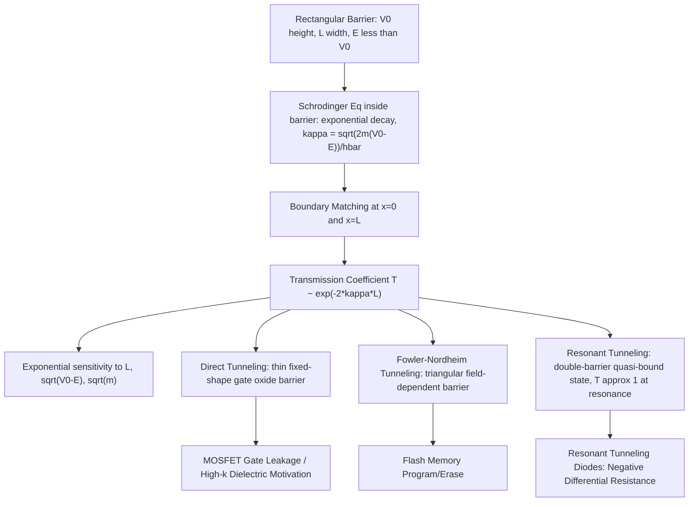

## Quantum Tunneling Through Potential Barriers

### Overview

Quantum tunneling is the phenomenon in which a particle has a nonzero probability of traversing a potential energy barrier even when its total energy $E$ is less than the barrier height $V_0$ — an outcome strictly forbidden in classical mechanics, where a particle simply cannot exist in a region where its kinetic energy would be negative. Tunneling arises directly from solving the Schrödinger equation across a finite barrier and finding that the wavefunction does not vanish abruptly at the barrier edge but instead decays exponentially through it. This phenomenon is one of the most device-relevant results in all of quantum mechanics for semiconductor engineering, directly governing gate oxide leakage, flash memory operation, and tunnel diode behavior.

### Setting Up the Barrier Problem

Consider a one-dimensional rectangular potential barrier of height $V_0$ and width $L$, located between $x = 0$ and $x = L$, with a particle of energy $E < V_0$ incident from the left:

$$V(x) = \begin{cases} 0, & x < 0 \quad \text{(Region I)} \\ V_0, & 0 \leq x \leq L \quad \text{(Region II)} \\ 0, & x > L \quad \text{(Region III)} \end{cases}$$

**Key Points**

- In Region I and III, the particle behaves as a free particle, with oscillatory (propagating) wavefunction solutions
- In Region II, since $E < V_0$, the time-independent Schrödinger equation produces a solution that is **exponentially decaying/growing** rather than oscillatory
- Solving the Schrödinger equation in each region and enforcing continuity of $u(x)$ and $u'(x)$ at each boundary ($x=0$ and $x=L$) yields the full solution, including a nonzero transmitted wave in Region III

### Solving Inside the Barrier

Inside the barrier (Region II), the time-independent Schrödinger equation is:

$$-\frac{\hbar^2}{2m}\frac{d^2u}{dx^2} + V_0 u = Eu \quad \Rightarrow \quad \frac{d^2u}{dx^2} = \kappa^2 u$$

where

$$\kappa = \frac{\sqrt{2m(V_0 - E)}}{\hbar}$$

The general solution is a combination of growing and decaying real exponentials, $u(x) = Ce^{\kappa x} + De^{-\kappa x}$, rather than the oscillatory $\sin/\cos$ or complex-exponential form found in classically allowed regions.

**Key Points**

- $\kappa$ (sometimes called the decay constant) has units of inverse length and sets the spatial scale over which the wavefunction amplitude falls off inside the barrier
- A larger $(V_0 - E)$ or larger mass $m$ increases $\kappa$, causing faster decay and therefore lower tunneling probability
- The wavefunction — and hence the probability density $|u(x)|^2$ — is nonzero throughout the barrier, meaning there is a finite probability of finding the particle inside the "classically forbidden" region

### The Transmission Coefficient

Matching boundary conditions at $x=0$ and $x=L$ and solving for the ratio of transmitted to incident wave amplitude gives the exact transmission probability:

$$T = \left[1 + \frac{V_0^2 \sinh^2(\kappa L)}{4E(V_0-E)}\right]^{-1}$$

In the common **thick/opaque barrier limit** ($\kappa L \gg 1$), this simplifies to the widely used approximate form:

$$T \approx 16\frac{E(V_0-E)}{V_0^2} e^{-2\kappa L}$$

which is very often further simplified to the leading exponential dependence:

$$T \approx e^{-2\kappa L} = \exp\left(-\frac{2L\sqrt{2m(V_0-E)}}{\hbar}\right)$$

**Key Points**

- Transmission probability decreases **exponentially** with barrier width $L$ — doubling the barrier width does not halve $T$, it squares it (roughly), making tunneling extraordinarily sensitive to thickness
- $T$ also decreases exponentially with $\sqrt{V_0 - E}$ — higher or "harder" barriers suppress tunneling much more strongly than a linear relationship would suggest
- $T$ depends exponentially on $\sqrt{m}$: heavier particles tunnel far less readily than lighter ones at the same barrier, which is why electrons (and even more so, light-effective-mass carriers) tunnel far more readily than heavier ions or atoms under comparable conditions
- Reflection probability $R = 1 - T$; even for a "classically forbidden" barrier, some part of the wave is always reflected back into Region I

**Illustration — Wavefunction across a tunneling barrier (svg_diagram)**

<svg xmlns="http://www.w3.org/2000/svg" viewBox="0 0 520 300">
<rect x="0" y="0" width="520" height="300" fill="#ffffff" />
<text x="260" y="22" text-anchor="middle" font-size="15" font-weight="bold" fill="#111">Wavefunction Across a Potential Barrier (svg_diagram)</text>

<line x1="40" y1="250" x2="490" y2="250" stroke="#333" stroke-width="1.5" />
<text x="495" y="254" font-size="11" fill="#333">x</text>

<rect x="220" y="60" width="90" height="190" fill="#f5e6d3" stroke="#a15c00" stroke-width="1.5" />
<text x="240" y="75" font-size="11" fill="#a15c00">Barrier: V0, width L</text>
<text x="100" y="270" font-size="11" fill="#333">Region I (E, free)</text>
<text x="235" y="270" font-size="11" fill="#333">Region II</text>
<text x="390" y="270" font-size="11" fill="#333">Region III (transmitted)</text>

<path d="M 40 190 Q 60 160 80 190 Q 100 220 120 190 Q 140 160 160 190 Q 180 220 200 190 Q 210 175 220 175" fill="none" stroke="`#0a6b9c`" stroke-width="2.5" />

<path d="M 220 175 Q 250 175 265 190 Q 280 205 310 210" fill="none" stroke="#c0392b" stroke-width="2.5" />

<path d="M 310 210 Q 330 195 350 210 Q 370 225 390 210 Q 410 195 430 210 Q 450 225 470 210" fill="none" stroke="`#1a8f4c`" stroke-width="2.5" />

<text x="60" y="150" font-size="11" fill="`#0a6b9c`">incident + reflected</text>

<text x="380" y="195" font-size="11" fill="`#1a8f4c`">transmitted (reduced amplitude)</text>

</svg>

### Worked Example

**Example**

An electron with kinetic energy $E = 1.0\,\text{eV}$ approaches a barrier of height $V_0 = 2.0\,\text{eV}$ and width $L = 0.5\,\text{nm}$ (typical of a thin gate-oxide-like barrier).

Decay constant:

$$\kappa = \frac{\sqrt{2m(V_0-E)}}{\hbar} = \frac{\sqrt{2(9.11\times10^{-31})(1.0\times1.6\times10^{-19})}}{1.055\times10^{-34}} \approx 5.12\times10^9\,\text{m}^{-1}$$

Exponent:

$$2\kappa L = 2 \times 5.12\times10^9 \times 0.5\times10^{-9} \approx 5.12$$

Transmission probability:

$$T \approx e^{-5.12} \approx 6.0\times10^{-3}$$

Roughly a 0.6% chance of transmission per attempt. Doubling the barrier width to 1.0 nm gives $2\kappa L \approx 10.24$, so $T \approx e^{-10.24} \approx 3.6\times10^{-5}$ — a drop of nearly two orders of magnitude from doubling the thickness, vividly demonstrating the exponential sensitivity that makes barrier width the dominant design lever in tunneling-based devices.

### Related Tunneling Phenomena

**Key Points**

- **Fowler-Nordheim tunneling**: Tunneling through a *triangular* (field-dependent) barrier under a strong applied electric field, rather than a fixed rectangular barrier; the transmission probability depends exponentially on $1/E_{field}$ rather than on a fixed width, making it the dominant mechanism at high fields — this is the physical basis for programming and erasing floating-gate flash memory cells
- **Direct tunneling**: Tunneling through an ultra-thin (typically < ~3 nm) rectangular-like oxide barrier at low-to-moderate field, dominant in modern scaled MOSFET gate oxides and the reason high-$k$ dielectrics were adopted to allow physically thicker (lower-leakage) barriers at equivalent capacitance
- **Resonant tunneling**: In a double-barrier structure (barrier-well-barrier), transmission probability shows sharp peaks (resonances) when the incident particle's energy matches a quasi-bound state energy inside the well, approaching $T \approx 1$ at resonance despite the presence of two barriers — the operating principle of resonant tunneling diodes (RTDs), which exhibit negative differential resistance
- **Alpha decay** (a non-semiconductor but illustrative example): Gamow's tunneling model explains radioactive alpha decay as tunneling of an alpha particle through the nuclear Coulomb barrier, historically one of the first confirmed applications of this theory

### Relevance to Semiconductor Physics and Device Engineering

**Key Points**

- **Gate oxide scaling limit**: The exponential dependence of $T$ on barrier width is the fundamental physical reason gate oxides cannot be scaled below a few atomic layers without incurring unacceptable leakage current, directly motivating the industry shift to high-$k$/metal-gate stacks
- **Flash memory (NAND/NOR)**: Fowler-Nordheim tunneling through the tunnel oxide is the physical write/erase mechanism for floating-gate and charge-trap flash memory cells; controlling oxide thickness and field precisely balances programming speed against charge retention (data-loss) reliability
- **Tunnel diodes and resonant tunneling diodes**: Heavily doped p-n junctions (Esaki tunnel diodes) and engineered double-barrier heterostructures (RTDs) exploit tunneling to produce negative differential resistance, useful in high-frequency oscillators and switching circuits
- **Scanning tunneling microscopy (STM)**: A sharp conducting tip brought within a few angstroms of a sample surface allows electrons to tunnel across the vacuum gap; the exponential sensitivity of $T$ to gap distance provides the sub-angstrom vertical resolution that makes STM a key semiconductor surface characterization tool
- **Contact resistance in scaled devices**: Tunneling through thin Schottky barriers at metal-semiconductor contacts becomes an increasingly important (and sometimes desirable) transport mechanism as contact dimensions shrink in advanced technology nodes

### Conclusion

Quantum tunneling demonstrates that particles can traverse energy barriers that classical mechanics would deem impossible, with a transmission probability that falls off exponentially with barrier width, barrier height, and particle mass. This single, precisely quantifiable phenomenon underlies both a fundamental scaling limit of modern semiconductor devices (gate oxide leakage) and a set of devices that deliberately exploit it (flash memory, tunnel diodes, resonant tunneling diodes, and STM), making it one of the most practically important results to emerge from the Schrödinger equation.

**Related Topics**

- Fowler-Nordheim tunneling theory and flash memory reliability
- Resonant tunneling diodes and negative differential resistance
- High-$k$ gate dielectrics and equivalent oxide thickness
- Scanning tunneling microscopy and surface characterization
- Esaki tunnel diodes and heavily doped p-n junctions
- WKB approximation for non-rectangular barrier shapes
- Metal-semiconductor (Schottky) contact transport mechanisms