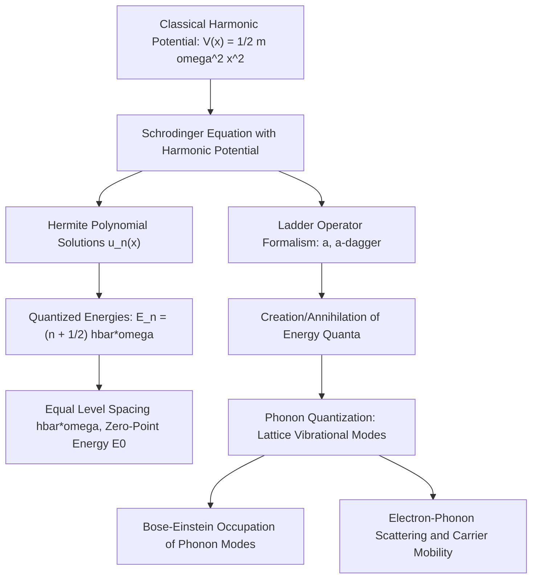

## The Quantum Harmonic Oscillator

### Overview

The quantum harmonic oscillator (QHO) is one of the most important exactly solvable systems in quantum mechanics, describing a particle subject to a restoring force proportional to displacement — the quantum analog of a mass on a spring. Beyond its role as a foundational pedagogical model, the QHO is directly physically relevant to semiconductor physics because lattice vibrations (phonons) are, to a very good approximation, quantized harmonic oscillators. Understanding the QHO's quantized energy spectrum and ladder-operator formalism is therefore essential preparation for later treatment of phonons, thermal transport, and electron-phonon scattering in semiconductor crystals.

### The Classical Harmonic Oscillator

Classically, a particle of mass $m$ attached to a spring of force constant $k$ experiences a restoring force $F = -kx$, leading to the potential energy:

$$V(x) = \frac{1}{2}kx^2 = \frac{1}{2}m\omega^2 x^2$$

where $\omega = \sqrt{k/m}$ is the classical angular oscillation frequency. Classically, the oscillator can have any energy $\geq 0$, oscillating with amplitude determined by that energy.

### The Quantum Harmonic Oscillator: Setting Up the Schrödinger Equation

Substituting the harmonic potential into the time-independent Schrödinger equation gives:

$$-\frac{\hbar^2}{2m}\frac{d^2u(x)}{dx^2} + \frac{1}{2}m\omega^2x^2\,u(x) = Eu(x)$$

**Key Points**

- Unlike the infinite square well, this potential is smooth (no hard walls), and the solutions must decay to zero as $x \to \pm\infty$ for normalizability rather than vanish at fixed boundary points
- Solving this differential equation (via a power-series/Hermite polynomial method, standard in quantum mechanics courses) yields wavefunctions of the form:

$$u_n(x) = N_n H_n\left(\sqrt{\frac{m\omega}{\hbar}}x\right) e^{-m\omega x^2/2\hbar}$$

where $H_n$ are the **Hermite polynomials** and $N_n$ is a normalization constant

### Quantized Energy Levels

The allowed energies of the quantum harmonic oscillator are:

$$E_n = \left(n + \frac{1}{2}\right)\hbar\omega, \qquad n = 0, 1, 2, 3, \ldots$$

**Key Points**

- Energy levels are **equally spaced** by $\hbar\omega$, in sharp contrast to the particle-in-a-box, where spacing grows with $n$
- The ground state ($n=0$) has nonzero energy $E_0 = \frac{1}{2}\hbar\omega$, the **zero-point energy** — a direct quantum mechanical consequence of the Heisenberg uncertainty principle, since a classical particle at rest exactly at $x=0$ with zero momentum would violate $\Delta x\Delta p \geq \hbar/2$
- Unlike the particle in a box, the QHO potential extends to infinity in both directions but still produces bound, quantized states because it grows without bound as $|x| \to \infty$, confining the particle for any finite energy

### Ladder Operators (Creation and Annihilation Operators)

The QHO admits an elegant algebraic solution using **ladder operators**, avoiding the need to solve the differential equation directly. Define the annihilation operator $\hat{a}$ and creation operator $\hat{a}^\dagger$:

$$\hat{a} = \sqrt{\frac{m\omega}{2\hbar}}\left(\hat{x} + \frac{i\hat{p}}{m\omega}\right), \qquad \hat{a}^\dagger = \sqrt{\frac{m\omega}{2\hbar}}\left(\hat{x} - \frac{i\hat{p}}{m\omega}\right)$$

The Hamiltonian can then be rewritten compactly as:

$$\hat{H} = \hbar\omega\left(\hat{a}^\dagger\hat{a} + \frac{1}{2}\right)$$

**Key Points**

- $\hat{a}^\dagger$ acting on state $|n\rangle$ raises it to $|n+1\rangle$: $\hat{a}^\dagger|n\rangle = \sqrt{n+1}\,|n+1\rangle$ — physically, this **creates one quantum of energy** $\hbar\omega$
- $\hat{a}$ acting on state $|n\rangle$ lowers it to $|n-1\rangle$: $\hat{a}|n\rangle = \sqrt{n}\,|n-1\rangle$ — this **annihilates (removes) one quantum of energy**
- The **number operator** $\hat{N} = \hat{a}^\dagger\hat{a}$ has eigenvalues $n$, directly counting the number of energy quanta in the state
- This creation/annihilation language is not just a mathematical convenience — it is the same formalism used to describe the quantization of lattice vibrations as discrete quanta called **phonons**, where $\hat{a}^\dagger$ creates a phonon and $\hat{a}$ destroys one

### The QHO as a Model for Lattice Vibrations (Phonons)

**Key Points**

- Atoms in a crystal lattice are bound to their equilibrium positions by interatomic forces that, for small displacements, are well approximated as harmonic (Hooke's-law-like) restoring forces
- Treating each normal mode of lattice vibration as an independent quantum harmonic oscillator, the vibrational energy of the crystal is quantized in units of $\hbar\omega$ for each mode, with the energy quantum itself called a **phonon**
- The equally-spaced energy ladder $E_n = (n+\tfrac{1}{2})\hbar\omega$ directly explains why lattice vibrational energy is absorbed and emitted in discrete quanta during electron-phonon scattering events, rather than continuously
- This connection is the reason the QHO is placed in the quantum mechanics foundations of a semiconductor curriculum: it is the exact mathematical model later reused, largely unchanged in form, to quantize the vibrational modes of the crystal lattice

**Illustration — QHO potential, energy levels, and wavefunctions (svg_diagram)**

<svg xmlns="http://www.w3.org/2000/svg" viewBox="0 0 480 320">
<rect x="0" y="0" width="480" height="320" fill="#ffffff" />
<text x="240" y="22" text-anchor="middle" font-size="15" font-weight="bold" fill="#111">Quantum Harmonic Oscillator: Levels and Wavefunctions (svg_diagram)</text>

<path d="M 60 290 Q 240 40 420 290" fill="none" stroke="#333" stroke-width="2" />
<text x="360" y="70" font-size="12" fill="#333">V(x) = 1/2 m ω² x²</text>

<line x1="130" y1="250" x2="350" y2="250" stroke="#999" stroke-dasharray="4,3" />
<line x1="110" y1="210" x2="370" y2="210" stroke="#999" stroke-dasharray="4,3" />
<line x1="90" y1="170" x2="390" y2="170" stroke="#999" stroke-dasharray="4,3" />
<line x1="75" y1="130" x2="405" y2="130" stroke="#999" stroke-dasharray="4,3" />
<text x="395" y="254" font-size="11" fill="#555">E0 = ħω/2</text>
<text x="395" y="214" font-size="11" fill="#555">E1 = 3ħω/2</text>
<text x="395" y="174" font-size="11" fill="#555">E2 = 5ħω/2</text>
<text x="395" y="134" font-size="11" fill="#555">E3 = 7ħω/2</text>

<path d="M 190 250 Q 240 225 290 250" fill="none" stroke="#0a6b9c" stroke-width="2.5" />

<text x="240" y="305" text-anchor="middle" font-size="12" fill="#333">Equal spacing ħω between all adjacent levels</text>

</svg>

### Worked Example

**Example**

An optical phonon mode in a semiconductor crystal has an angular frequency $\omega \approx 5\times10^{13}\,\text{rad/s}$ (a typical order of magnitude for optical phonons in polar semiconductors like GaAs).

Zero-point energy:

$$E_0 = \frac{1}{2}\hbar\omega = \frac{1}{2}(1.055\times10^{-34})(5\times10^{13}) \approx 2.6\times10^{-21}\,\text{J} \approx 16.5\,\text{meV}$$

Energy quantum (spacing between levels):

$$\hbar\omega \approx 33\,\text{meV}$$

At room temperature, $k_BT \approx 25.9\,\text{meV}$, which is comparable to this phonon energy — meaning optical phonon modes are only partially thermally populated at room temperature. This comparison between $\hbar\omega$ and $k_BT$ directly determines phonon occupation via Bose-Einstein statistics and governs the temperature dependence of phonon-limited carrier mobility.

### Relevance to Semiconductor Physics

**Key Points**

- **Phonon quantization**: The QHO formalism is applied essentially unchanged to each normal mode of lattice vibration, providing the theoretical basis for treating heat and sound in a crystal as a gas of quantized phonon quasiparticles
- **Specific heat of solids**: The Einstein and Debye models of solid specific heat use the QHO energy spectrum (via Bose-Einstein statistics) to correctly predict the low-temperature falloff of heat capacity, resolving a key failure of classical (equipartition-based) predictions
- **Electron-phonon scattering and mobility**: Carrier mobility in semiconductors is fundamentally limited by scattering off lattice vibrations; the discrete, quantized nature of phonon energy exchange (absorbing or emitting exactly $\hbar\omega$) directly follows from the QHO's ladder structure
- **Optical properties and Raman spectroscopy**: Phonon energies, derived from the QHO model applied to specific lattice vibrational modes, are measured via Raman and infrared spectroscopy and used as a standard semiconductor material characterization and strain-diagnostic technique
- **Thermal conductivity**: Phonon transport, scattering, and group velocity — central to semiconductor thermal management in high-power devices — are described using the quantized QHO-based phonon dispersion relations

### Conclusion

The quantum harmonic oscillator provides an exactly solvable model whose equally spaced, quantized energy spectrum and elegant ladder-operator formalism extend directly and almost without modification to the quantization of lattice vibrations as phonons. This connection makes the QHO far more than a textbook exercise — it is the direct mathematical origin of phonon physics, thermal transport theory, and electron-phonon scattering mechanisms that limit carrier mobility throughout semiconductor device physics.

**Related Topics**

- Phonon dispersion relations and acoustic/optical phonon branches
- Bose-Einstein statistics and phonon occupation number
- Debye and Einstein models of specific heat
- Electron-phonon scattering and mobility limits
- Raman and infrared spectroscopy for semiconductor characterization
- Thermal conductivity and phonon transport in semiconductor devices
- Coherent states and their relation to classical oscillator limits