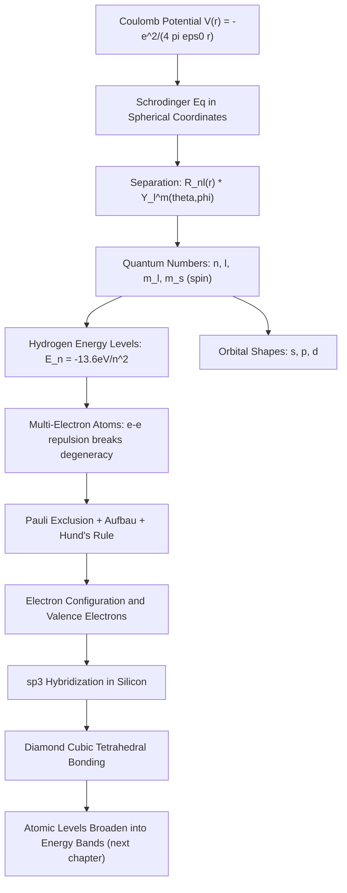

## Atomic Structure and Electron Orbitals

### Overview

Atomic structure and electron orbital theory extends the single-particle quantum mechanics developed in prior topics — the Schrödinger equation, quantized energy levels, and wavefunctions — to the three-dimensional Coulomb potential of the atom. Solving the Schrödinger equation for an electron bound to a nucleus produces the quantized orbital structure that underlies the periodic table, chemical bonding, and, most importantly for this course, the atomic orbital hybridization that forms covalent bonds in silicon and other semiconductor crystals — the direct precursor to band theory.

### The Hydrogen Atom: Setting Up the Problem

The hydrogen atom consists of a single electron bound to a proton by the Coulomb potential:

$$V(r) = -\frac{e^2}{4\pi\varepsilon_0 r}$$

where $r$ is the electron-nucleus separation. Because this potential is spherically symmetric, the three-dimensional Schrödinger equation is most naturally solved in spherical coordinates $(r, \theta, \phi)$, and the wavefunction separates into radial and angular parts:

$$\psi_{n\ell m}(r,\theta,\phi) = R_{n\ell}(r)\, Y_\ell^m(\theta,\phi)$$

**Key Points**

- $R_{n\ell}(r)$ is the radial wavefunction, depending on the principal quantum number $n$ and orbital angular momentum quantum number $\ell$
- $Y_\ell^m(\theta,\phi)$ are the **spherical harmonics**, describing the angular shape of the orbital, depending on $\ell$ and the magnetic quantum number $m$
- This separation of variables mirrors the same mathematical strategy used to separate time and space dependence in the time-independent Schrödinger equation from the earlier topic

### Quantum Numbers

Solving the hydrogen atom Schrödinger equation with appropriate boundary conditions (finite, normalizable, single-valued wavefunctions) naturally produces three quantized quantum numbers, plus a fourth from relativistic/spin considerations:

**Key Points**

- **Principal quantum number** $n = 1, 2, 3, \ldots$: determines the overall energy level and average orbital size; larger $n$ means higher energy and larger spatial extent
- **Orbital angular momentum quantum number** $\ell = 0, 1, \ldots, n-1$: determines the orbital's angular momentum magnitude, $L = \sqrt{\ell(\ell+1)}\,\hbar$, and its shape; conventionally labeled $s\,(\ell=0)$, $p\,(\ell=1)$, $d\,(\ell=2)$, $f\,(\ell=3)$
- **Magnetic quantum number** $m_\ell = -\ell, \ldots, +\ell$: determines the orbital's orientation and the z-component of angular momentum, $L_z = m_\ell\hbar$
- **Spin quantum number** $m_s = \pm\frac{1}{2}$: describes the electron's intrinsic angular momentum (spin), an inherently relativistic/quantum property with no classical analog, but essential for the full description of electron states

### Energy Levels of the Hydrogen Atom

For the hydrogen atom (or any single-electron/hydrogen-like ion), the energy depends only on the principal quantum number $n$:

$$E_n = -\frac{m_e e^4}{8\varepsilon_0^2 h^2 n^2} = -\frac{13.6\,\text{eV}}{n^2}$$

**Key Points**

- Energy is negative, indicating a bound state; $E \to 0$ as $n \to \infty$, representing the ionization limit
- All orbitals with the same $n$ but different $\ell$ and $m_\ell$ are **degenerate** (same energy) in the pure hydrogen atom — a special feature of the exact $1/r$ Coulomb potential that does not hold in multi-electron atoms
- The ground state ($n=1$) binding energy of $13.6\,\text{eV}$ is the hydrogen ionization energy, a widely used reference scale in atomic and solid-state physics

### Orbital Shapes and Probability Densities

**Key Points**

- **s orbitals** ($\ell=0$): spherically symmetric probability distributions, with radial nodes appearing for $n > 1$ (e.g., $2s$ has one radial node)
- **p orbitals** ($\ell=1$): dumbbell-shaped, oriented along three possible axes ($p_x$, $p_y$, $p_z$ for $m_\ell = -1, 0, +1$ combinations), each with a nodal plane through the nucleus
- **d orbitals** ($\ell=2$): more complex, typically four-lobed shapes (with one exception), relevant in atoms and compounds involving transition metals but less central to standard group IV/III-V semiconductor bonding
- The **radial probability distribution**, $P(r) = r^2|R_{n\ell}(r)|^2$, gives the probability of finding the electron at a given distance $r$ from the nucleus, peaking at the Bohr radius $a_0 \approx 0.529\,\text{Å}$ for the hydrogen ground state

**Illustration — s and p orbital shapes (svg_diagram)**

<svg xmlns="http://www.w3.org/2000/svg" viewBox="0 0 480 260">
<rect x="0" y="0" width="480" height="260" fill="#ffffff" />
<text x="240" y="22" text-anchor="middle" font-size="15" font-weight="bold" fill="#111">s and p Orbital Shapes (svg_diagram)</text>

<circle cx="110" cy="140" r="70" fill="#cfe8fb" stroke="#0a6b9c" stroke-width="2" />
<circle cx="110" cy="140" r="3" fill="#333" />
<text x="110" y="230" text-anchor="middle" font-size="13" fill="#333">1s orbital (spherical)</text>

<ellipse cx="330" cy="110" rx="35" ry="55" fill="#f5cfa0" stroke="#a15c00" stroke-width="2" />
<ellipse cx="330" cy="190" rx="35" ry="55" fill="#f5a0a0" stroke="#a15c00" stroke-width="2" />
<circle cx="330" cy="150" r="3" fill="#333" />
<text x="330" y="230" text-anchor="middle" font-size="13" fill="#333">2p_z orbital (two lobes, opposite phase)</text>
</svg>

### Multi-Electron Atoms and the Periodic Table

Real atoms with more than one electron require additional physics beyond the exact hydrogen solution:

**Key Points**

- **Electron-electron repulsion** breaks the degeneracy between different $\ell$ values at the same $n$: for a given $n$, energy increases with $\ell$ (e.g., $3s < 3p < 3d$ in multi-electron atoms), because higher-$\ell$ orbitals are less effective at penetrating the inner electron shells to feel the full nuclear charge
- The **Pauli exclusion principle** states that no two electrons in an atom can share the same complete set of four quantum numbers ($n, \ell, m_\ell, m_s$); consequently, each orbital (specified by $n, \ell, m_\ell$) can hold at most two electrons, with opposite spins
- The **Aufbau principle** describes how electrons fill orbitals in order of increasing energy, building up the electron configurations that determine each element's position and chemical behavior in the periodic table
- **Hund's rule** states that electrons fill degenerate orbitals (same $n, \ell$) singly, with parallel spins, before pairing up — minimizing electron-electron repulsion energy

### Valence Electrons and Hybridization: The Bridge to Semiconductors

**Key Points**

- **Valence electrons** — those in the outermost, incompletely filled shell — determine an atom's bonding behavior and are the electrons directly responsible for chemical and crystalline bonding
- Silicon (atomic number 14) has electron configuration $1s^2\,2s^2\,2p^6\,3s^2\,3p^2$, with 4 valence electrons in the $n=3$ shell
- **sp³ hybridization**: The atomic $3s$ and three $3p$ orbitals of silicon mix (hybridize) to form four equivalent, tetrahedrally oriented **sp³ hybrid orbitals**, each capable of forming one strong covalent bond with a neighboring atom
- This tetrahedral sp³ bonding geometry is the direct structural origin of the **diamond cubic crystal structure** shared by silicon, germanium, and diamond — each atom bonds to four nearest neighbors at $109.5°$ angles
- When many silicon atoms bond together in this tetrahedral network, the discrete atomic energy levels (like the individual $3s$ and $3p$ levels) broaden and merge into continuous **energy bands** — this atomic orbital overlap and hybridization picture is the conceptual (and in tight-binding models, mathematical) starting point for deriving the semiconductor band structure covered in the next chapter

### Worked Example

**Example**

For a silicon atom, the four valence electrons (2 in $3s$, 2 in $3p$) redistribute during sp³ hybridization into four degenerate hybrid orbitals, each occupied by one electron. Each hybrid orbital overlaps with one hybrid orbital from a neighboring atom to form a covalent (shared electron pair) bond. In the resulting crystal, each silicon atom is bonded to exactly 4 neighbors, and there are no "leftover" valence electrons or missing bonds at 0 K — this exactly filled valence bonding configuration is what makes intrinsic silicon an insulator at absolute zero and only weakly conducting at room temperature, since promoting an electron to a conducting state requires breaking a covalent bond by supplying at least the bandgap energy $E_g \approx 1.12\,\text{eV}$ [Inference: bandgap value is a well-established measured property of crystalline silicon at room temperature, included here as context rather than derived from the atomic model alone].

### Relevance to Semiconductor Physics

**Key Points**

- **Band structure origin**: The transition from discrete atomic orbitals to continuous energy bands, driven by orbital overlap when atoms are brought into a periodic lattice, is most intuitively understood as the many-atom extension of the orbital hybridization described here
- **Doping and impurity levels**: Understanding valence electron count directly explains why Group V elements (P, As) act as electron donors and Group III elements (B, Ga) act as acceptors when substituted into the silicon lattice — donors have one extra valence electron beyond what's needed for the four covalent bonds, while acceptors have one too few
- **Compound semiconductors**: III-V compounds (e.g., GaAs) and II-VI compounds (e.g., CdTe) achieve the same average 4 valence electrons per atom pair through different combinations of Group III/V or II/VI elements, producing a similar tetrahedral bonding structure with different band structure and optical properties
- **X-ray and optical characterization**: Techniques like X-ray photoelectron spectroscopy (XPS) directly probe atomic core-level electron binding energies derived from this orbital structure, used for compositional and chemical-state analysis of semiconductor materials
- **Effective mass and orbital character**: The specific atomic orbitals (s-like vs. p-like) contributing to the conduction and valence band edges influence the effective mass and band curvature, connecting back to this orbital-level description

### Conclusion

Solving the Schrödinger equation for the Coulomb potential produces the quantized orbital structure — principal, angular momentum, and magnetic quantum numbers — that governs atomic electron configuration. Extending this picture to multi-electron atoms and then to sp³ hybridization in silicon provides the essential conceptual and structural bridge from single-atom quantum mechanics to the periodic crystal lattice, directly motivating the formation of continuous energy bands from discrete atomic levels covered in the next chapter.

**Related Topics**

- Tight-binding approximation and orbital overlap in crystals
- Formation of energy bands from atomic orbitals (LCAO method)
- Bloch's theorem and periodic potentials
- Diamond cubic and zinc blende crystal structures
- Donor and acceptor impurity levels in doped semiconductors
- X-ray photoelectron spectroscopy (XPS) for material characterization
- III-V and II-VI compound semiconductor bonding