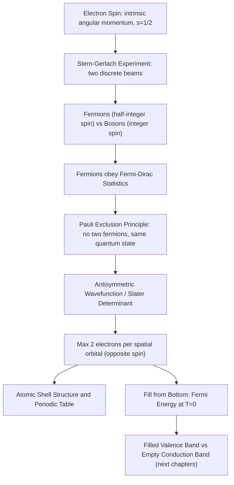

## Pauli Exclusion Principle and Electron Spin

### Overview

The Pauli exclusion principle and the concept of electron spin together resolve a deep puzzle left open by the orbital theory of the previous topic: why don't all electrons in a multi-electron atom simply collapse into the lowest-energy orbital? The answer lies in electron spin — an intrinsic, purely quantum mechanical property with no classical analog — combined with the exclusion principle, which forbids any two identical fermions from occupying the same complete quantum state. Together, these principles explain atomic shell structure, the periodic table, and, crucially for this course, why electrons in a semiconductor crystal fill energy bands from the bottom up in pairs, directly setting up the distinction between filled valence bands and empty conduction bands.

### Electron Spin

**Key Points**

- Electron spin is an intrinsic form of angular momentum, entirely distinct from orbital angular momentum ($\ell, m_\ell$) discussed previously; it has no classical counterpart and cannot be understood as literal physical rotation
- Spin is quantized with spin quantum number $s = \frac{1}{2}$ for the electron, giving spin magnitude $S = \sqrt{s(s+1)}\,\hbar = \frac{\sqrt{3}}{2}\hbar$
- The z-component of spin is quantized to only two possible values, described by the spin magnetic quantum number:

$$m_s = +\frac{1}{2} \; (\text{"spin up"}, \uparrow) \quad \text{or} \quad m_s = -\frac{1}{2} \; (\text{"spin down"}, \downarrow)$$

- Spin was first postulated by Uhlenbeck and Goudsmit (1925) to explain fine structure in atomic spectra, and later shown by Dirac to emerge naturally from combining quantum mechanics with special relativity

### Experimental Evidence: The Stern-Gerlach Experiment

The **Stern-Gerlach experiment** (1922) passed a beam of silver atoms through an inhomogeneous magnetic field and observed the beam split into exactly two discrete spots on a detection screen, rather than a continuous spread.

**Key Points**

- A continuous spread would be expected if the atoms' magnetic moments could point in any direction (as in classical physics); instead, the sharp splitting into two discrete beams directly demonstrated that angular momentum (in this case, arising from the unpaired valence electron's spin) is quantized into exactly two values
- This experiment is considered one of the most direct and conceptually clean demonstrations of quantum mechanical angular momentum quantization, and it historically preceded the full theoretical understanding of spin

### Fermions, Bosons, and Quantum Statistics

**Key Points**

- Particles with half-integer spin ($\frac{1}{2}, \frac{3}{2}, \ldots$) are called **fermions**; electrons, protons, and neutrons are all fermions
- Particles with integer spin ($0, 1, 2, \ldots$) are called **bosons**; photons and phonons (introduced in the quantum harmonic oscillator topic) are bosons
- This classification determines which quantum statistics a particle obeys: fermions obey **Fermi-Dirac statistics**, while bosons obey **Bose-Einstein statistics** — directly connecting back to the classical/quantum statistics distinction introduced in the classical statistical mechanics topic
- The spin-statistics relationship is a deep theorem of relativistic quantum field theory, but its practical consequence — that electrons obey the exclusion principle while phonons and photons do not — is what matters most for semiconductor device physics

### The Pauli Exclusion Principle

Formulated by Wolfgang Pauli in 1925, the exclusion principle states:

**No two identical fermions in a system can simultaneously occupy the same complete quantum state.**

For electrons in an atom, this means no two electrons can share the same full set of four quantum numbers $(n, \ell, m_\ell, m_s)$.

**Key Points**

- Since $m_s$ can only take two values, this is equivalent to saying that each spatial orbital (fixed $n, \ell, m_\ell$) can hold **at most two electrons**, and only if they have opposite spins
- The exclusion principle is not a force or an interaction — it is a fundamental symmetry requirement on the multi-particle wavefunction: the total wavefunction describing a system of identical fermions must be **antisymmetric** under exchange of any two particles
- This antisymmetry requirement, more fundamental than the "no two electrons, same state" statement, is written formally as $\Psi(\ldots, \vec{r}_i, \ldots, \vec{r}_j, \ldots) = -\Psi(\ldots, \vec{r}_j, \ldots, \vec{r}_i, \ldots)$ for any exchange of particles $i$ and $j$

### Antisymmetry and the Slater Determinant

**Key Points**

- For a system of $N$ non-interacting fermions occupying single-particle states $\psi_1, \psi_2, \ldots, \psi_N$, the properly antisymmetrized many-body wavefunction is constructed as a **Slater determinant**:

$$\Psi(\vec{r}_1,\ldots,\vec{r}_N) = \frac{1}{\sqrt{N!}}\begin{vmatrix} \psi_1(\vec{r}_1) & \psi_2(\vec{r}_1) & \cdots \\ \psi_1(\vec{r}_2) & \psi_2(\vec{r}_2) & \cdots \\ \vdots & \vdots & \ddots \end{vmatrix}$$

- A key mathematical property of determinants directly enforces the exclusion principle: if any two single-particle states $\psi_i = \psi_j$ are identical, two columns of the determinant become identical, and the determinant — hence the entire wavefunction — vanishes identically
- This construction is the rigorous mathematical origin of the exclusion principle, showing it as a direct consequence of fermionic antisymmetry rather than an independent, ad hoc postulate

### Consequence: Atomic Shell Structure

**Key Points**

- Combined with the Aufbau principle and Hund's rule (introduced previously), the exclusion principle explains why electrons fill up successive atomic shells and subshells rather than all collapsing into the $1s$ ground state
- Each subshell holds a maximum number of electrons set directly by the exclusion principle: $s$ subshells hold 2, $p$ subshells hold 6, $d$ subshells hold 10, following $2(2\ell+1)$
- This shell-filling behavior directly produces the periodic recurrence of chemical properties across the periodic table, since elements with similar outer (valence) shell configurations behave similarly

**Illustration — Pauli exclusion in a multi-level system (svg_diagram)**

<svg xmlns="http://www.w3.org/2000/svg" viewBox="0 0 480 260">
<rect x="0" y="0" width="480" height="260" fill="#ffffff" />
<text x="240" y="22" text-anchor="middle" font-size="15" font-weight="bold" fill="#111">Pauli Filling of Energy Levels (svg_diagram)</text>

<line x1="100" y1="220" x2="380" y2="220" stroke="#333" stroke-width="2" />
<line x1="100" y1="170" x2="380" y2="170" stroke="#333" stroke-width="2" />
<line x1="100" y1="120" x2="380" y2="120" stroke="#333" stroke-width="2" />
<line x1="100" y1="70" x2="380" y2="70" stroke="#333" stroke-width="2" />

<text x="385" y="224" font-size="12" fill="#555">E1</text>

<text x="385" y="174" font-size="12" fill="#555">E2</text>

<text x="385" y="124" font-size="12" fill="#555">E3</text>

<text x="385" y="74" font-size="12" fill="#555">E4 (empty)</text>

<text x="220" y="216" font-size="18" fill="`#0a6b9c`">↑</text>

<text x="240" y="216" font-size="18" fill="`#c0392b`">↓</text>

<text x="220" y="166" font-size="18" fill="`#0a6b9c`">↑</text>

<text x="240" y="166" font-size="18" fill="`#c0392b`">↓</text>

<text x="220" y="116" font-size="18" fill="`#0a6b9c`">↑</text>

<text x="240" y="116" font-size="18" fill="`#c0392b`">↓</text>

<text x="150" y="250" font-size="12" fill="#333">Each level holds exactly 2 electrons (opposite spin) — E4 remains empty</text>

</svg>

### Worked Example

**Example**

Consider filling the particle-in-a-box energy levels from the earlier topic ($E_n \propto n^2$) with 6 non-interacting electrons, ignoring electron-electron interaction for simplicity. Since each spatial level $n$ can hold 2 electrons (spin up and spin down) by the exclusion principle, the 6 electrons fill levels $n=1$, $n=2$, and $n=3$ completely (2 electrons each), leaving $n=4$ and above empty. The **Fermi energy** — the energy of the highest filled level at absolute zero — is $E_F = E_3 = 9E_1$. This exact "fill from the bottom, two per level" logic, applied instead to the continuous energy bands of a crystal rather than discrete box levels, is precisely how the Fermi level and filled/empty band structure of a solid are determined.

### Relevance to Semiconductor Physics

**Key Points**

- **Fermi level and band filling**: The exclusion principle is the direct reason electrons in a crystal fill available states from the lowest energy upward, two per state, establishing the Fermi energy/Fermi level concept central to all subsequent semiconductor band-filling discussions
- **Valence band vs. conduction band distinction**: In a semiconductor at 0 K, the exclusion principle combined with the total electron count determines that the valence band is completely filled and the conduction band completely empty — the exact starting condition that defines a semiconductor (as opposed to a metal, where the highest band is only partially filled)
- **Density of states and degeneracy**: Because each spatial state accommodates exactly 2 electrons (spin degeneracy), essentially all semiconductor density-of-states and carrier-concentration formulas carry an explicit factor of 2 for spin, tracing directly back to this principle
- **Fermi-Dirac distribution**: The probabilistic occupation function $f(E) = 1/(e^{(E-E_F)/k_BT}+1)$ used throughout semiconductor carrier statistics is itself a direct mathematical consequence of the exclusion principle applied to a large ensemble of electrons in thermal equilibrium
- **Pauli blocking in optical transitions**: In heavily doped or optically pumped semiconductors, the exclusion principle can block certain optical absorption or emission transitions when the relevant final states are already occupied — relevant to laser diode gain saturation and Burstein-Moss shift effects

### Conclusion

Electron spin, an intrinsic quantum property with no classical analog, combines with the requirement that multi-electron wavefunctions be antisymmetric under particle exchange to produce the Pauli exclusion principle: no two electrons can occupy an identical quantum state. This single principle explains atomic shell structure and, when extended to the many-electron system of a crystal, directly establishes the two-per-state band-filling rule and Fermi level concept that distinguishes a semiconductor's filled valence band from its empty conduction band — the essential starting point for all subsequent semiconductor band theory.

**Related Topics**

- Fermi-Dirac distribution and the Fermi level in semiconductors
- Density of states and spin degeneracy in band structure
- Valence and conduction band formation from atomic orbitals
- Degenerate semiconductors and the Burstein-Moss shift
- Exchange interaction and its role in magnetism
- Pauli blocking and gain saturation in semiconductor lasers
- Spin-orbit coupling and its effect on band structure (spintronics contexts)