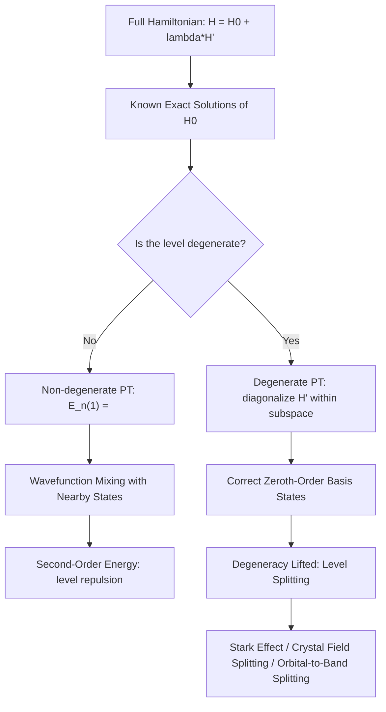

## Time-Independent Perturbation Theory

### Overview

Time-independent perturbation theory is a systematic approximation method for finding the energy levels and wavefunctions of a quantum system whose Hamiltonian is close to, but not exactly equal to, one that can be solved exactly. Since only a small number of idealized potentials (infinite well, harmonic oscillator, hydrogen atom) admit exact analytical solutions, perturbation theory is the essential practical tool for handling the vast majority of real quantum systems — including, centrally for this course, how an unperturbed atomic or crystal system responds to small additional effects like electric fields, weak periodic potentials, and impurity interactions in a doped semiconductor.

### The General Setup

Suppose the full Hamiltonian $\hat{H}$ can be split into an exactly solvable part $\hat{H}_0$ and a small perturbation $\hat{H}'$:

$$\hat{H} = \hat{H}_0 + \lambda\hat{H}'$$

where $\lambda$ is a formal bookkeeping parameter (eventually set to 1) tracking the order of the perturbation, and $\hat{H}_0$ has known, exactly solved eigenstates:

$$\hat{H}_0|n^{(0)}\rangle = E_n^{(0)}|n^{(0)}\rangle$$

**Key Points**

- The method assumes $\hat{H}'$ is "small" in the sense that its matrix elements are much smaller than the relevant energy level spacings of $\hat{H}_0$
- The goal is to express the true (perturbed) energies $E_n$ and eigenstates $|n\rangle$ as a power series in $\lambda$:

$$E_n = E_n^{(0)} + \lambda E_n^{(1)} + \lambda^2 E_n^{(2)} + \cdots$$

$$|n\rangle = |n^{(0)}\rangle + \lambda|n^{(1)}\rangle + \lambda^2|n^{(2)}\rangle + \cdots$$

- Two distinct cases must be treated separately: **non-degenerate** perturbation theory (each unperturbed level is unique) and **degenerate** perturbation theory (multiple unperturbed states share the same energy)

### Non-Degenerate First-Order Perturbation Theory

For a non-degenerate unperturbed state $|n^{(0)}\rangle$, the first-order energy correction is remarkably simple — just the expectation value of the perturbation in the unperturbed state:

$$E_n^{(1)} = \langle n^{(0)}|\hat{H}'|n^{(0)}\rangle$$

**Key Points**

- This is the single most-used formula in practical perturbation theory: to first order, the energy shift equals the average value of the perturbing interaction, evaluated using the *unperturbed* wavefunction
- No knowledge of the perturbed wavefunction is needed to compute this leading-order energy shift — a major practical advantage
- This result directly follows from substituting the power series into the full Schrödinger equation and collecting terms order-by-order in $\lambda$

### Non-Degenerate First-Order Wavefunction Correction

The first-order correction to the wavefunction is a sum over all *other* unperturbed states, weighted by the perturbation's coupling strength divided by the energy gap:

$$|n^{(1)}\rangle = \sum_{m \neq n} \frac{\langle m^{(0)}|\hat{H}'|n^{(0)}\rangle}{E_n^{(0)} - E_m^{(0)}}|m^{(0)}\rangle$$

**Key Points**

- States $m$ that are closer in energy to $n$ (smaller denominator) contribute more strongly to the wavefunction distortion — nearby levels "mix" more easily under a perturbation than distant ones
- This formula makes explicit why the perturbative approach breaks down when $\hat{H}'$ is not small compared to the energy gap to a nearby level: the correction term diverges as $E_n^{(0)} \to E_m^{(0)}$, signaling the approach's validity range

### Second-Order Energy Correction

The second-order energy shift, needed when the first-order correction vanishes or when higher accuracy is required, is:

$$E_n^{(2)} = \sum_{m \neq n} \frac{|\langle m^{(0)}|\hat{H}'|n^{(0)}\rangle|^2}{E_n^{(0)} - E_m^{(0)}}$$

**Key Points**

- The ground state always experiences a second-order energy *decrease* (the sum is always negative for the ground state, since $E_n^{(0)} - E_m^{(0)} < 0$ for all $m$ above it) — the ground state is always pushed lower by mixing with excited states
- This "level repulsion" pattern — states push each other apart in energy under mutual coupling — is a general and recurring feature throughout quantum mechanics, including the formation of bonding/antibonding levels and energy bands from coupled atomic orbitals

### Degenerate Perturbation Theory

When multiple unperturbed states $|n_1^{(0)}\rangle, |n_2^{(0)}\rangle, \ldots$ share the same unperturbed energy $E_n^{(0)}$, the simple non-degenerate formula fails (it produces a divergent denominator). Instead:

**Key Points**

- The correct **zeroth-order states** are not necessarily the original degenerate basis states, but specific linear combinations of them that diagonalize $\hat{H}'$ within the degenerate subspace
- This requires diagonalizing the perturbation matrix $\langle n_i^{(0)}|\hat{H}'|n_j^{(0)}\rangle$ restricted to the degenerate subspace; the eigenvalues of this matrix give the first-order energy splittings, and the eigenvectors give the correct zeroth-order combinations
- Physically, this describes how a perturbation can **lift degeneracy**, splitting a single degenerate energy level into several distinct levels — a pattern seen directly in the Stark effect (electric field splitting atomic levels) and in the splitting of atomic orbital degeneracies when atoms are brought together in a crystal

**Illustration — Level splitting under a perturbation (svg_diagram)**

<svg xmlns="http://www.w3.org/2000/svg" viewBox="0 0 480 260">
<rect x="0" y="0" width="480" height="260" fill="#ffffff" />
<text x="240" y="22" text-anchor="middle" font-size="15" font-weight="bold" fill="#111">Degenerate Level Splitting Under Perturbation (svg_diagram)</text>

<line x1="80" y1="140" x2="200" y2="140" stroke="#0a6b9c" stroke-width="3" />
<text x="90" y="130" font-size="12" fill="#0a6b9c">3-fold degenerate E_n(0)</text>

<line x1="210" y1="140" x2="260" y2="140" stroke="#333" stroke-width="1.5" marker-end="url(#arrow3)" />
<text x="215" y="130" font-size="11" fill="#333">H'</text>
<line x1="280" y1="90" x2="400" y2="90" stroke="#a15c00" stroke-width="3" />
<line x1="280" y1="140" x2="400" y2="140" stroke="#1a8f4c" stroke-width="3" />
<line x1="280" y1="190" x2="400" y2="190" stroke="#c0392b" stroke-width="3" />
<text x="405" y="94" font-size="11" fill="#a15c00">E_n(0)+ΔE_a</text>
<text x="405" y="144" font-size="11" fill="#1a8f4c">E_n(0)</text>
<text x="405" y="194" font-size="11" fill="#c0392b">E_n(0)-ΔE_c</text>

<text x="240" y="240" text-anchor="middle" font-size="12" fill="#333">Perturbation lifts degeneracy, splitting one level into three</text>

</svg>

### Worked Example: The Stark Effect

**Example**

Consider a hydrogen atom's $n=2$ level, which is four-fold degenerate (one $2s$ and three $2p$ states) in the absence of external fields. Applying a weak uniform external electric field $\mathcal{E}$ along the z-axis adds a perturbation $\hat{H}' = e\mathcal{E}\hat{z}$ to the Hamiltonian.

Because the $2s$ and $2p_z$ states are degenerate and have a nonzero matrix element $\langle 2s|\hat{z}|2p_z\rangle$ connecting them, degenerate perturbation theory must be used. Diagonalizing the perturbation within this degenerate subspace yields two shifted linear-combination states with energies $E_2^{(0)} \pm 3ea_0\mathcal{E}$ (where $a_0$ is the Bohr radius), while the $2p_x$ and $2p_y$ states remain unshifted at first order. This produces the observed **linear Stark effect**: a splitting of spectral lines proportional to the applied field strength — in contrast to the ground state, where the leading Stark shift is quadratic in $\mathcal{E}$, since the ground state has no other same-$n$ degenerate partner to mix with.

### Relevance to Semiconductor Physics

**Key Points**

- **Tight-binding / LCAO band formation**: When atomic orbitals on neighboring lattice sites overlap weakly, the resulting energy band structure is derived using essentially the same degenerate perturbation theory machinery — atomic orbital degeneracy is lifted by the "perturbation" of neighboring-atom coupling, spreading discrete levels into bands
- **Impurity and defect levels**: Shallow donor and acceptor levels in a doped semiconductor are often calculated using a hydrogen-like effective-mass model, with perturbation theory used to account for deviations from the ideal Coulomb potential (central-cell corrections)
- **Stark effect in quantum-confined structures**: Applying an electric field across a quantum well (the quantum-confined Stark effect, QCSE) shifts and splits confined energy levels, a direct application of perturbation theory exploited in electro-absorption modulators
- **Strain effects on band structure**: Mechanical strain in a semiconductor lattice (from lattice mismatch in heteroepitaxy) acts as a perturbation that splits degenerate valence band states (heavy-hole/light-hole degeneracy at the zone center), a widely used strain engineering technique to improve carrier mobility in strained-silicon technology
- **Spin-orbit coupling**: Often treated as a perturbation added to an unperturbed Hamiltonian, spin-orbit coupling splits otherwise degenerate bands and is essential for accurately modeling valence band structure in compound semiconductors

### Conclusion

Time-independent perturbation theory provides a systematic, order-by-order method for approximating the energy levels and wavefunctions of a quantum system that is close to an exactly solvable one, correctly distinguishing between the non-degenerate case (simple expectation-value energy shifts) and the degenerate case (which requires diagonalizing the perturbation and generally lifts degeneracy through level splitting). This machinery — particularly the degenerate case — is the direct mathematical tool used to explain how weakly overlapping atomic orbitals spread into energy bands, how strain and electric fields split confined or bulk semiconductor energy levels, and how shallow dopant levels are calculated, making it an essential analytical bridge into the band theory chapters that follow.

**Related Topics**

- Tight-binding (LCAO) method for band structure formation
- Effective mass theory for shallow donor and acceptor levels
- Quantum-confined Stark effect in quantum well modulators
- Strain engineering and valence band splitting in strained silicon
- Spin-orbit coupling and its role in compound semiconductor band structure
- Time-dependent perturbation theory and optical transition rates
- Variational method as an alternative approximation technique