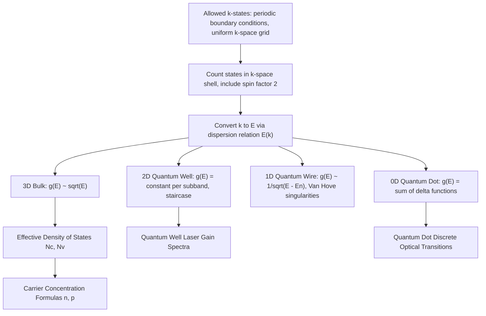

## Density of States in Quantum Systems

### Overview

The density of states (DOS) counts how many quantum states are available per unit energy interval in a system, and it is one of the most consequential quantities in all of semiconductor physics — nearly every calculation of carrier concentration, optical absorption, and transport rate involves the density of states as a direct multiplicative factor. This topic connects the discrete quantum levels derived from the particle-in-a-box and Schrödinger equation treatments to the continuous, statistically-averaged quantities used throughout device physics, and it directly explains why confinement dimensionality (bulk, well, wire, dot) produces qualitatively different DOS behavior.

### Defining the Density of States

**Key Points**

- The density of states $g(E)$ is defined such that $g(E)\,dE$ gives the number of allowed quantum states with energy between $E$ and $E + dE$
- For a system with a large but finite number of closely spaced discrete energy levels, $g(E)$ is a smooth function obtained by counting the number of states in a given range and dividing by the range width — a continuum approximation valid when level spacing is much smaller than $k_BT$ or other relevant energy scales
- The DOS is a purely geometric/kinematic property of the system's energy dispersion relation $E(\vec{k})$ and its dimensionality; it says nothing by itself about whether those states are occupied — occupation is separately determined by the Fermi-Dirac distribution introduced earlier

### Counting States in k-Space

For a free (or effective-mass) particle confined to a box of volume $V = L_x L_y L_z$ with periodic boundary conditions, the allowed wavevectors form a uniform grid in k-space:

$$k_i = \frac{2\pi n_i}{L_i}, \qquad n_i = 0, \pm1, \pm2, \ldots$$

**Key Points**

- Each allowed $\vec{k}$ state occupies a k-space volume of $(2\pi)^3/V$ in three dimensions, so the number of states within a k-space volume element is that volume divided by this unit cell size
- Including the factor of 2 for spin degeneracy (from the Pauli exclusion principle topic), the number of states in a spherical shell of k-space between $k$ and $k+dk$ is:

$$dN = 2 \times \frac{V}{(2\pi)^3} \times 4\pi k^2\,dk$$

- Converting from $k$-space to energy using the dispersion relation $E(k)$ and its derivative $dE/dk$ yields the density of states as a function of energy

### Density of States in 3D (Bulk)

For a free-electron-like (parabolic) dispersion relation, $E = \hbar^2k^2/2m^*$, carrying out the k-space-to-energy conversion above yields the classic 3D density of states per unit volume:

$$g_{3D}(E) = \frac{1}{2\pi^2}\left(\frac{2m^*}{\hbar^2}\right)^{3/2}\sqrt{E}$$

**Key Points**

- $g_{3D}(E) \propto \sqrt{E}$: the density of states increases smoothly and monotonically with energy in bulk 3D materials
- This exact functional form, applied separately to the conduction band (measuring $E$ from the band edge $E_C$) and valence band (measuring from $E_V$), is the DOS used in the standard textbook derivation of the effective density of states $N_C$ and $N_V$ and the resulting carrier concentration formulas $n = N_C e^{-(E_C-E_F)/k_BT}$
- The effective mass $m^*$ (rather than the free electron mass) enters directly, connecting this result back to how the periodic crystal potential modifies electron dynamics

### Dimensionality Dependence: 2D, 1D, and 0D Systems

Repeating the same k-space counting procedure, but restricting the available k-space dimensions according to the confinement (as introduced in the quantum confinement topic), yields qualitatively different DOS behavior for each dimensionality:

**Key Points**

- **2D (quantum well)**: The density of states per subband is a **constant, energy-independent step function**:

  $$g_{2D}(E) = \frac{m^*}{\pi\hbar^2} \quad \text{(per subband, per unit area)}$$

  The total DOS is a staircase, jumping by this constant amount at each new confined subband edge.
- **1D (quantum wire)**: The density of states diverges at each subband edge, following:

  $$g_{1D}(E) \propto \frac{1}{\sqrt{E - E_n}}$$

  producing sharp Van Hove singularities at the bottom of each 1D subband.
- **0D (quantum dot)**: All states are fully discrete, so the density of states is a series of Dirac delta functions:

  $$g_{0D}(E) = \sum_n 2\,\delta(E - E_n)$$

  reflecting the atom-like discrete spectrum of a fully confined system.

**Illustration — Density of states vs. dimensionality (svg_diagram)**

<svg xmlns="http://www.w3.org/2000/svg" viewBox="0 0 560 320">
<rect x="0" y="0" width="560" height="320" fill="#ffffff" />
<text x="280" y="22" text-anchor="middle" font-size="15" font-weight="bold" fill="#111">Density of States by Confinement Dimensionality (svg_diagram)</text>

<g>
<line x1="40" y1="280" x2="160" y2="280" stroke="#333" stroke-width="1.5" />
<line x1="40" y1="280" x2="40" y2="60" stroke="#333" stroke-width="1.5" />
<path d="M 40 280 Q 100 260 160 100" fill="none" stroke="#0a6b9c" stroke-width="2.5" />
<text x="100" y="300" text-anchor="middle" font-size="12" fill="#333">3D: g(E) ~ √E</text>
</g>

<g>
<line x1="200" y1="280" x2="320" y2="280" stroke="#333" stroke-width="1.5" />
<line x1="200" y1="280" x2="200" y2="60" stroke="#333" stroke-width="1.5" />
<path d="M 200 280 L 230 280 L 230 220 L 260 220 L 260 160 L 290 160 L 290 100 L 320 100" fill="none" stroke="#a15c00" stroke-width="2.5" />
<text x="260" y="300" text-anchor="middle" font-size="12" fill="#333">2D: staircase (const. steps)</text>
</g>

<g>
<line x1="360" y1="280" x2="480" y2="280" stroke="#333" stroke-width="1.5" />
<line x1="360" y1="280" x2="360" y2="60" stroke="#333" stroke-width="1.5" />
<path d="M 372 70 Q 380 200 420 270 Q 440 100 460 70" fill="none" stroke="#1a8f4c" stroke-width="2.5" />
<text x="420" y="300" text-anchor="middle" font-size="12" fill="#333">1D: 1/√E singularities</text>
</g>

<g>
<line x1="500" y1="280" x2="555" y2="280" stroke="#333" stroke-width="1.5" />
<line x1="500" y1="280" x2="500" y2="60" stroke="#333" stroke-width="1.5" />
<line x1="515" y1="280" x2="515" y2="200" stroke="#c0392b" stroke-width="3" />
<line x1="530" y1="280" x2="530" y2="130" stroke="#c0392b" stroke-width="3" />
<line x1="545" y1="280" x2="545" y2="90" stroke="#c0392b" stroke-width="3" />
<text x="520" y="300" text-anchor="middle" font-size="10" fill="#333">0D: delta functions</text>
</g>
</svg>

### Worked Example

**Example**

Compute the 3D bulk density of states in GaAs ($m^* = 0.067m_0$) at an energy $E = 50\,\text{meV}$ above the conduction band edge.

$$g_{3D}(E) = \frac{1}{2\pi^2}\left(\frac{2(0.067)(9.11\times10^{-31})}{(1.055\times10^{-34})^2}\right)^{3/2}\sqrt{50\times10^{-3}\times1.6\times10^{-19}}$$

Evaluating the bracketed term: $\dfrac{2m^*}{\hbar^2} \approx 1.10\times10^{37}\,\text{J}^{-1}\text{m}^{-2}$, raised to the 3/2 power gives $\approx 3.65\times10^{55}$. Multiplying by $\sqrt{E} \approx 8.94\times10^{-11}\,\text{J}^{1/2}$ and $1/(2\pi^2) \approx 0.0507$:

$$g_{3D}(E) \approx 0.0507 \times 3.65\times10^{55} \times 8.94\times10^{-11} \approx 1.66\times10^{44}\,\text{states/(J·m}^3\text{)}$$

Converting to more conventional units (states per eV per cm³) gives a value on the order of $10^{20}\,\text{eV}^{-1}\text{cm}^{-3}$ [Inference: unit conversion arithmetic; order of magnitude is consistent with standard textbook values for III-V semiconductor conduction bands]. This large state density is why bulk semiconductors support smoothly varying, quasi-continuous carrier populations, in contrast to the sparse, discrete levels of a quantum dot.

### Relevance to Semiconductor Physics

**Key Points**

- **Carrier concentration derivation**: The effective density of states $N_C$ and $N_V$ used in every standard semiconductor carrier-concentration formula are obtained by integrating $g_{3D}(E)$ against the Fermi-Dirac (or Maxwell-Boltzmann) occupation function over the relevant band
- **Optical gain and laser design**: The sharper, more favorable DOS profiles of quantum wells (step function) and quantum dots (delta functions) compared to bulk (smooth $\sqrt{E}$) directly translate into narrower gain spectra and lower threshold currents, which is the central physical motivation for using quantum well and quantum dot active regions in semiconductor lasers
- **Joint density of states and absorption spectra**: Optical absorption coefficient calculations require the "joint" density of states between conduction and valence bands, directly built from the same k-space counting method, and it determines the characteristic absorption edge shape (square-root onset in bulk, sharp steps in quantum wells)
- **Density of states effective mass**: In semiconductors with multiple equivalent conduction band valleys (e.g., silicon's six equivalent X-valleys), an effective "density of states mass" combines the valley degeneracy and individual valley effective masses into a single parameter used in the standard $N_C$ formula
- **Scanning tunneling spectroscopy**: Differential conductance measurements in STM directly probe the local density of states of a semiconductor surface, providing an experimental window into band structure and defect states

### Conclusion

The density of states translates the discrete energy-level structure derived from solving the Schrödinger equation into the continuous, dimensionality-dependent functions that populate every standard formula for carrier concentration, optical absorption, and gain in semiconductor devices. Its qualitatively different forms across bulk (3D), quantum well (2D), quantum wire (1D), and quantum dot (0D) systems directly explain why reducing confinement dimensionality is a deliberate and powerful design strategy for improving the performance of modern optoelectronic devices.

**Related Topics**

- Effective density of states ($N_C$, $N_V$) and carrier concentration formulas
- Joint density of states and optical absorption edge shapes
- Multi-valley band structure and density-of-states effective mass
- Quantum well, wire, and dot laser design principles
- Van Hove singularities in low-dimensional systems
- Scanning tunneling spectroscopy and local density of states
- Fermi-Dirac statistics combined with density of states (carrier concentration integrals)