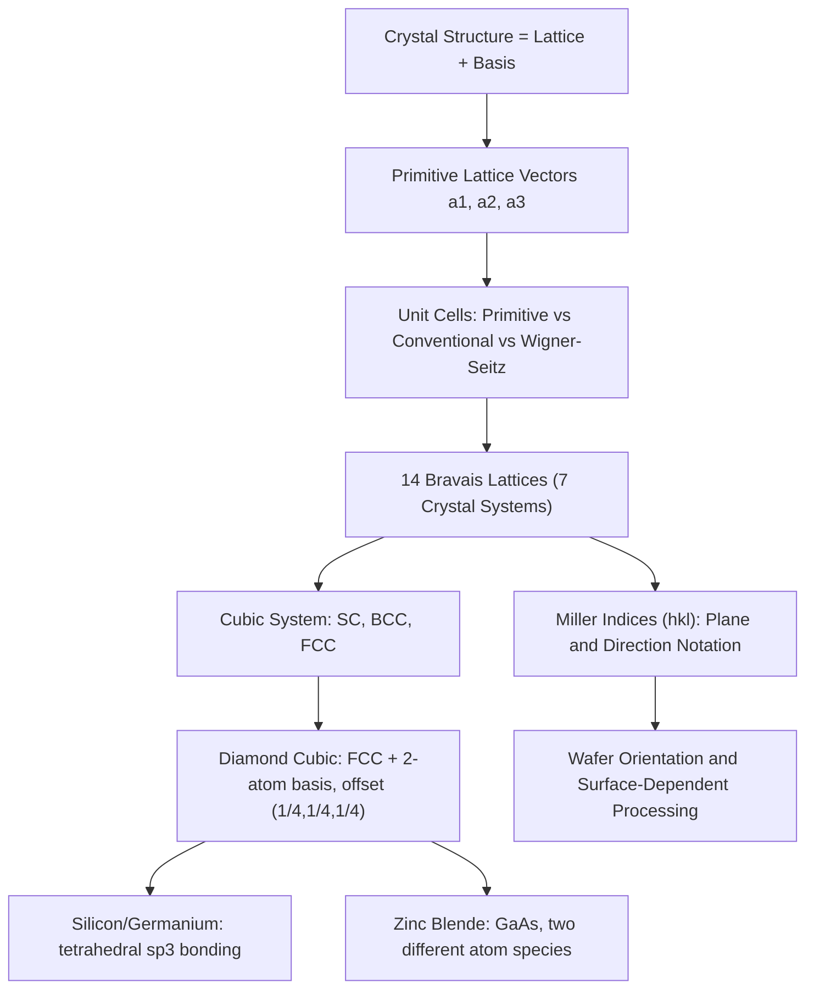

## Crystal Lattices and Unit Cells

### Overview

Crystal lattices and unit cells provide the geometric and mathematical language for describing the periodic atomic arrangement that defines a crystalline solid. This periodicity is not a minor structural detail — it is the essential ingredient that, combined with the quantum mechanics developed in the previous chapter, produces the entire band theory framework underlying semiconductor device physics. Understanding lattice geometry, unit cells, and crystallographic notation is a necessary prerequisite before introducing Bloch's theorem and energy band formation.

### The Crystal Lattice Concept

**Key Points**

- A **crystal lattice** is an infinite, periodic array of points in space, each representing an identical local environment
- The actual physical crystal is described by a **basis** — one or more atoms attached to each lattice point — such that the full crystal structure is:

$$\text{Crystal Structure} = \text{Lattice} + \text{Basis}$$

- This separation is conceptually important: the lattice describes pure geometric periodicity, while the basis describes what atoms actually occupy each repeating unit (e.g., silicon has a single-atom-type basis of two atoms per lattice point in the diamond structure)
- Any lattice point can be reached from any other lattice point by a **lattice translation vector**:

$$\vec{R} = n_1\vec{a}_1 + n_2\vec{a}_2 + n_3\vec{a}_3, \qquad n_1, n_2, n_3 \in \mathbb{Z}$$

where $\vec{a}_1, \vec{a}_2, \vec{a}_3$ are the **primitive lattice vectors**

### Unit Cells

**Key Points**

- A **unit cell** is a region of space that, when repeated by lattice translations, fills all of space and reproduces the entire crystal
- A **primitive unit cell** contains exactly one lattice point (accounting for points shared between adjacent cells) and has the smallest possible volume that can tile the lattice by translation alone
- A **conventional unit cell** is often chosen instead of the primitive cell because it more clearly displays the full symmetry of the lattice, even if it contains more than one lattice point — the conventional cubic cell of the FCC lattice (used to describe silicon's underlying lattice) is a common example
- The **Wigner-Seitz cell** is a specific, symmetric choice of primitive cell constructed by bisecting the lines to all nearby lattice points with perpendicular planes; it is the direct real-space analog of the first Brillouin zone used later in k-space band structure diagrams

### The 14 Bravais Lattices

**Key Points**

- In three dimensions, there are exactly **14 distinct Bravais lattices**, classified by the combination of lattice vector lengths and angles between them, grouped into 7 crystal systems (cubic, tetragonal, orthorhombic, monoclinic, triclinic, trigonal, hexagonal)
- Within the cubic system alone, there are three distinct Bravais lattices:
  - **Simple cubic (SC)**: lattice points only at the corners of the cube
  - **Body-centered cubic (BCC)**: corner points plus one additional point at the cube center
  - **Face-centered cubic (FCC)**: corner points plus one additional point at the center of each face
- Semiconductor crystals of interest (silicon, germanium, GaAs) are based on the **FCC lattice**, though with a two-atom basis, as detailed below

### Coordination Number and Packing Fraction

**Key Points**

- **Coordination number** is the number of nearest-neighbor lattice points (or atoms, when a monatomic basis is used) surrounding any given point
- Simple cubic: coordination number 6; BCC: coordination number 8; FCC: coordination number 12
- **Atomic packing fraction (APF)** is the fraction of the unit cell volume occupied by atoms, modeled as hard touching spheres:

  $$\text{APF} = \frac{\text{volume of atoms in unit cell}}{\text{volume of unit cell}}$$
- FCC has the highest packing fraction of the simple structures, APF $= \pi/(3\sqrt{2}) \approx 0.740$, describing a close-packed arrangement — though the diamond cubic structure (used by silicon) has a much lower APF (~0.34) because the tetrahedral sp³ bonding geometry from the previous chapter's atomic orbital discussion forces a more open structure than simple close-packing would allow

### The Diamond Cubic Structure

Silicon and germanium crystallize in the **diamond cubic** structure: an FCC lattice with a two-atom basis, where the second atom is displaced by $(\tfrac{1}{4},\tfrac{1}{4},\tfrac{1}{4})$ of the conventional cubic cell edge from the first.

**Key Points**

- This structure can be visualized as two interpenetrating FCC sublattices, offset along the body diagonal by one-quarter of its length
- Each atom is tetrahedrally bonded to exactly 4 nearest neighbors, directly matching the sp³ hybridization geometry established in the atomic structure chapter
- The conventional cubic unit cell contains 8 atoms total: 4 from the corner/face contributions of one FCC sublattice, and 4 more from the interpenetrating sublattice
- **Zinc blende structure**: III-V compound semiconductors like GaAs adopt the same diamond cubic geometry, but with the two interpenetrating FCC sublattices occupied by different atomic species (Ga on one sublattice, As on the other) — structurally identical to diamond cubic but with two distinct atom types, breaking a symmetry (inversion symmetry) that diamond cubic silicon possesses

**Illustration — Diamond cubic unit cell (svg_diagram)**

<svg xmlns="http://www.w3.org/2000/svg" viewBox="0 0 400 400">
<rect x="0" y="0" width="400" height="400" fill="#ffffff" />
<text x="200" y="24" text-anchor="middle" font-size="15" font-weight="bold" fill="#111">Diamond Cubic Unit Cell (svg_diagram)</text>

<polygon points="80,320 280,320 320,260 120,260" fill="none" stroke="#333" stroke-width="1.5" />
<polygon points="80,320 80,100 280,100 280,320" fill="none" stroke="#333" stroke-width="1.5" />
<polygon points="280,100 320,40 320,260 280,320" fill="none" stroke="#333" stroke-width="1.5" />
<line x1="80" y1="100" x2="120" y2="40" stroke="#333" stroke-width="1.5" />
<line x1="120" y1="40" x2="320" y2="40" stroke="#333" stroke-width="1.5" />
<line x1="120" y1="40" x2="120" y2="260" stroke="#333" stroke-width="1.5" />

<circle cx="80" cy="320" r="8" fill="#0a6b9c" />
<circle cx="280" cy="320" r="8" fill="#0a6b9c" />
<circle cx="80" cy="100" r="8" fill="#0a6b9c" />
<circle cx="280" cy="100" r="8" fill="#0a6b9c" />
<circle cx="120" cy="260" r="8" fill="#0a6b9c" />
<circle cx="320" cy="260" r="8" fill="#0a6b9c" />
<circle cx="120" cy="40" r="8" fill="#0a6b9c" />
<circle cx="320" cy="40" r="8" fill="#0a6b9c" />

<circle cx="180" cy="310" r="7" fill="#0a6b9c" />
<circle cx="200" cy="70" r="7" fill="#0a6b9c" />
<circle cx="100" cy="210" r="7" fill="#0a6b9c" />
<circle cx="300" cy="190" r="7" fill="#0a6b9c" />
<circle cx="220" cy="150" r="7" fill="#0a6b9c" />

<circle cx="150" cy="270" r="7" fill="#c0392b" />
<circle cx="250" cy="230" r="7" fill="#c0392b" />
<circle cx="150" cy="150" r="7" fill="#c0392b" />
<circle cx="250" cy="110" r="7" fill="#c0392b" />

<line x1="150" y1="270" x2="180" y2="310" stroke="#555" stroke-width="1.2" />
<line x1="150" y1="270" x2="100" y2="210" stroke="#555" stroke-width="1.2" />
<line x1="150" y1="270" x2="80" y2="320" stroke="#555" stroke-width="1.2" />
<line x1="150" y1="270" x2="120" y2="260" stroke="#555" stroke-width="1.2" />

<text x="200" y="385" text-anchor="middle" font-size="12" fill="#333">Blue: FCC sublattice — Red: offset (1/4,1/4,1/4) sublattice, tetrahedrally bonded</text>

</svg>

### Lattice Constants and Miller Indices

**Key Points**

- The **lattice constant** $a$ is the edge length of the conventional cubic unit cell; silicon has $a \approx 0.543\,\text{nm}$, GaAs has $a \approx 0.565\,\text{nm}$
- **Miller indices** $(hkl)$ provide a standardized notation for identifying crystal planes: found by taking the reciprocals of the plane's intercepts with the crystal axes (in units of the lattice constant) and clearing fractions to the smallest integer set
- Common low-index planes in cubic crystals — $(100)$, $(110)$, $(111)$ — have distinct atomic packing densities and surface energies, directly affecting wafer cleaving behavior, oxidation rates, and etch characteristics used in semiconductor fabrication
- **Directions** in a crystal use square brackets, $[hkl]$, and by convention are perpendicular to the plane of the same indices in cubic systems

### Worked Example

**Example**

For silicon's conventional cubic cell (lattice constant $a = 0.543\,\text{nm}$), the atomic packing fraction is calculated using 8 atoms per conventional cell and the nearest-neighbor bond length $d = \frac{\sqrt{3}}{4}a$ (the tetrahedral bond distance in diamond cubic):

$$d = \frac{\sqrt{3}}{4}(0.543\,\text{nm}) \approx 0.235\,\text{nm}$$

Treating atoms as hard spheres of radius $r = d/2 \approx 0.1175\,\text{nm}$ touching along the bond direction, the packing fraction works out to APF $\approx 0.34$ — notably lower than the 0.74 of simple close-packed FCC, quantitatively confirming that the tetrahedral covalent bonding requirement leaves the diamond cubic structure comparatively open, with significant void space between bonded atoms.

### Relevance to Semiconductor Physics and Fabrication

**Key Points**

- **Band structure calculation**: Bloch's theorem (next topic) requires precise knowledge of the lattice's primitive vectors and reciprocal lattice, both of which are defined directly from the real-space lattice geometry established here
- **Wafer orientation**: Silicon wafers are commercially specified by their surface crystallographic orientation (commonly $(100)$ or $(111)$), which affects oxidation rate, dopant diffusion, anisotropic etch behavior, and MOSFET channel mobility
- **Epitaxial growth and lattice matching**: Heteroepitaxial growth of compound semiconductor layers (e.g., AlGaAs on GaAs) requires close lattice constant matching between substrate and film to avoid strain-induced defects — a direct, quantitative application of the lattice constant concept
- **Cleaving and dicing**: Semiconductor wafers cleave preferentially along specific low-index crystal planes due to their lower bond density, a practical fabrication consideration rooted directly in Miller index geometry
- **X-ray diffraction (XRD) characterization**: Crystal structure and strain state of semiconductor wafers and epitaxial layers are routinely measured via XRD, whose diffraction condition (Bragg's law) depends directly on the interplanar spacing defined by the crystal's lattice geometry

### Conclusion

The crystal lattice and unit cell framework provides the precise geometric language — Bravais lattices, primitive vectors, and Miller indices — needed to describe the periodic atomic arrangement of a crystalline solid. Applying this framework to silicon and III-V compounds reveals the diamond cubic and zinc blende structures as the direct geometric expression of the tetrahedral sp³ bonding established in the previous chapter, and this same lattice geometry is the essential starting input for deriving the reciprocal lattice, Brillouin zone, and ultimately the electronic band structure that follows.

**Related Topics**

- Reciprocal lattice and the first Brillouin zone
- Bloch's theorem and electron states in periodic potentials
- X-ray diffraction and Bragg's law for structural characterization
- Crystal defects: point defects, dislocations, and grain boundaries
- Epitaxial growth and lattice-matching considerations
- Wafer orientation effects on fabrication processes
- Miller-Bravais indices for hexagonal crystal systems