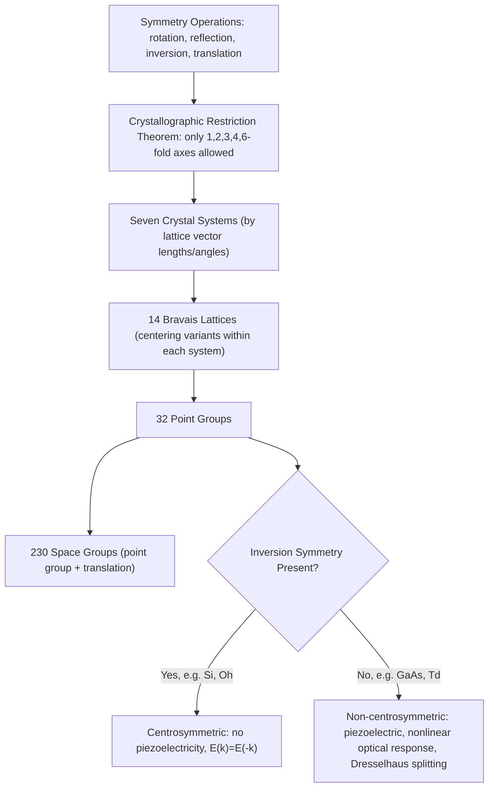

## Bravais Lattices and Crystal Symmetry

### Overview

Bravais lattices and crystal symmetry provide the systematic mathematical classification of all possible periodic point arrangements in three-dimensional space, going beyond the specific cubic lattices introduced previously to the complete set of 14 distinct lattice types and the symmetry operations that characterize them. This classification is not merely descriptive bookkeeping — the symmetry group of a crystal directly determines the degeneracy structure of its electronic energy bands, the anisotropy of its physical properties (mobility, thermal conductivity, piezoelectric response), and the selection rules governing optical transitions used throughout semiconductor device physics.

### Symmetry Operations

**Key Points**

- A **symmetry operation** is a transformation (rotation, reflection, inversion, translation, or combination thereof) that maps a crystal structure onto itself, leaving it indistinguishable from the original
- **Point symmetry operations** leave at least one point fixed: rotations (by angles $2\pi/n$ for $n$-fold axes), reflections through mirror planes, and inversion through a center of symmetry
- **Translational symmetry** is the lattice periodicity itself — translation by any lattice vector $\vec{R}$ maps the crystal onto itself, as introduced in the previous topic
- **Space groups** combine point symmetry operations with translations (including "compound" operations like screw axes and glide planes) to fully describe a crystal's symmetry; there are 230 distinct space groups in three dimensions, though most introductory semiconductor physics only requires the point-group classification

### Crystallographic Restriction Theorem

**Key Points**

- A fundamental mathematical result, the **crystallographic restriction theorem**, proves that only rotational symmetries of order 1, 2, 3, 4, and 6 are compatible with translational periodicity in a lattice
- 5-fold and rotations of order greater than 6 (e.g., 7-fold, 8-fold) cannot tile space periodically and are therefore forbidden in ordinary crystals — this is why quasicrystals (which do exhibit forbidden symmetries like 5-fold) are classified as a distinct category, lacking true translational periodicity
- This restriction, together with the requirement of compatibility with translational symmetry, is precisely what limits the number of distinct lattice types to a finite, enumerable set

### The Seven Crystal Systems

Based on the relative lengths of the lattice vectors ($a, b, c$) and angles between them ($\alpha, \beta, \gamma$), all lattices fall into seven crystal systems:

**Key Points**

- **Cubic**: $a = b = c$, $\alpha = \beta = \gamma = 90°$ — highest symmetry, includes silicon and GaAs's underlying lattice
- **Tetragonal**: $a = b \neq c$, $\alpha = \beta = \gamma = 90°$
- **Orthorhombic**: $a \neq b \neq c$, $\alpha = \beta = \gamma = 90°$
- **Monoclinic**: $a \neq b \neq c$, $\alpha = \gamma = 90° \neq \beta$
- **Triclinic**: $a \neq b \neq c$, $\alpha \neq \beta \neq \gamma \neq 90°$ — lowest symmetry
- **Trigonal (rhombohedral)**: $a = b = c$, $\alpha = \beta = \gamma \neq 90°$
- **Hexagonal**: $a = b \neq c$, $\alpha = \beta = 90°$, $\gamma = 120°$ — relevant to wurtzite-structure semiconductors like GaN and SiC

### The 14 Bravais Lattices

Within these seven crystal systems, allowing for additional lattice points at cell centers or face centers where consistent with the system's symmetry, exactly **14 distinct Bravais lattices** exist — first enumerated by Auguste Bravais in 1850.

**Key Points**

- The cubic system contributes three: simple cubic (P), body-centered cubic (I), and face-centered cubic (F)
- The tetragonal system contributes two (P, I); orthorhombic contributes four (P, I, F, C-base-centered); monoclinic contributes two (P, C); triclinic, trigonal, and hexagonal each contribute exactly one
- Not every combination of centering and crystal system produces a genuinely distinct lattice — e.g., a face-centered tetragonal lattice can always be redescribed as a smaller body-centered tetragonal lattice, which is why the count is 14 rather than a naively larger number
- Every real crystal structure, however complex its basis, is built by attaching a basis of atoms to one of these 14 underlying point lattices

**Illustration — The seven crystal systems (svg_diagram)**

<svg xmlns="http://www.w3.org/2000/svg" viewBox="0 0 560 280">
<rect x="0" y="0" width="560" height="280" fill="#ffffff" />
<text x="280" y="20" text-anchor="middle" font-size="14" font-weight="bold" fill="#111">Seven Crystal Systems, by Symmetry (svg_diagram)</text>

<g>
<polygon points="30,220 80,220 100,195 50,195" fill="none" stroke="#0a6b9c" stroke-width="1.5" />
<polygon points="30,220 30,170 50,145 50,195" fill="none" stroke="#0a6b9c" stroke-width="1.5" />
<polygon points="30,170 80,170 100,145 50,145" fill="none" stroke="#0a6b9c" stroke-width="1.5" />
<line x1="80" y1="220" x2="100" y2="195" stroke="#0a6b9c" stroke-width="1.5" />
<line x1="80" y1="170" x2="80" y2="220" stroke="#0a6b9c" stroke-width="1.5" />
<line x1="100" y1="145" x2="100" y2="195" stroke="#0a6b9c" stroke-width="1.5" />
<text x="65" y="245" text-anchor="middle" font-size="11" fill="#333">Cubic</text>
</g>

<g transform="translate(120,0)">
<polygon points="30,220 65,220 85,195 50,195" fill="none" stroke="#a15c00" stroke-width="1.5" />
<polygon points="30,220 30,140 50,115 50,195" fill="none" stroke="#a15c00" stroke-width="1.5" />
<polygon points="30,140 65,140 85,115 50,115" fill="none" stroke="#a15c00" stroke-width="1.5" />
<line x1="65" y1="220" x2="85" y2="195" stroke="#a15c00" stroke-width="1.5" />
<line x1="65" y1="140" x2="65" y2="220" stroke="#a15c00" stroke-width="1.5" />
<line x1="85" y1="115" x2="85" y2="195" stroke="#a15c00" stroke-width="1.5" />
<text x="55" y="245" text-anchor="middle" font-size="11" fill="#333">Tetragonal</text>
</g>

<g transform="translate(240,0)">
<polygon points="20,220 80,220 95,200 35,200" fill="none" stroke="#1a8f4c" stroke-width="1.5" />
<polygon points="20,220 20,175 35,155 35,200" fill="none" stroke="#1a8f4c" stroke-width="1.5" />
<polygon points="20,175 80,175 95,155 35,155" fill="none" stroke="#1a8f4c" stroke-width="1.5" />
<line x1="80" y1="220" x2="95" y2="200" stroke="#1a8f4c" stroke-width="1.5" />
<line x1="80" y1="175" x2="80" y2="220" stroke="#1a8f4c" stroke-width="1.5" />
<line x1="95" y1="155" x2="95" y2="200" stroke="#1a8f4c" stroke-width="1.5" />
<text x="55" y="245" text-anchor="middle" font-size="11" fill="#333">Orthorhombic</text>
</g>

<g transform="translate(360,0)">
<polygon points="20,220 75,220 100,195 45,195" fill="none" stroke="#7a2fa8" stroke-width="1.5" />
<polygon points="20,220 30,165 55,140 45,195" fill="none" stroke="#7a2fa8" stroke-width="1.5" />
<polygon points="30,165 85,165 100,195 45,195" fill="none" stroke="#7a2fa8" stroke-width="1.5" />
<text x="55" y="245" text-anchor="middle" font-size="11" fill="#333">Monoclinic</text>
</g>

<g transform="translate(460,0)">
<polygon points="45,140 65,150 65,175 45,185 25,175 25,150" fill="none" stroke="#c0392b" stroke-width="1.5" />
<polygon points="45,180 65,190 65,215 45,225 25,215 25,190" fill="none" stroke="#c0392b" stroke-width="1.5" />
<line x1="45" y1="140" x2="45" y2="180" stroke="#c0392b" stroke-width="1.5" />
<line x1="65" y1="150" x2="65" y2="190" stroke="#c0392b" stroke-width="1.5" />
<line x1="25" y1="150" x2="25" y2="190" stroke="#c0392b" stroke-width="1.5" />
<text x="45" y="245" text-anchor="middle" font-size="11" fill="#333">Hexagonal</text>
</g>
</svg>

### Point Groups and Notation

**Key Points**

- A **point group** is the set of point symmetry operations (rotations, reflections, inversion) that leave at least one point of the structure fixed, without regard to translations — 32 distinct crystallographic point groups exist in three dimensions
- **Schoenflies notation** ($C_n$, $D_n$, $T_d$, $O_h$, etc.) and **Hermann-Mauguin (international) notation** ($4/mmm$, $\bar{4}3m$, etc.) are the two standard systems used to label point groups and space groups; semiconductor literature most often uses Hermann-Mauguin notation
- Diamond cubic silicon belongs to point group $O_h$ (full cubic symmetry, including inversion), while zinc blende GaAs belongs to the lower-symmetry point group $T_d$ (cubic symmetry *without* inversion), since the two sublattices are occupied by different atomic species

### Inversion Symmetry and Its Physical Consequences

**Key Points**

- A crystal possesses **inversion symmetry** if the point $-\vec{r}$ is equivalent to $\vec{r}$ for every point in the structure; silicon (diamond cubic, monatomic basis) has this symmetry, while GaAs (zinc blende) does not
- The presence or absence of inversion symmetry has direct, measurable physical consequences: **centrosymmetric** crystals like silicon cannot exhibit a linear piezoelectric effect or a bulk second-order nonlinear optical response, while **non-centrosymmetric** crystals like GaAs can and do exhibit both — this is why GaAs and other III-V compounds are used in piezoelectric and nonlinear/electro-optic device applications where silicon cannot be
- Inversion symmetry also affects electronic band structure: in a centrosymmetric crystal without spin-orbit coupling, energy bands satisfy $E(\vec{k}) = E(-\vec{k})$ automatically, while non-centrosymmetric crystals can exhibit additional band splitting effects (e.g., Dresselhaus spin splitting) absent in centrosymmetric materials

### Worked Example

**Example**

Compare silicon and GaAs, both based on the same underlying FCC-derived lattice geometry: silicon's diamond cubic structure has identical atoms on both interpenetrating FCC sublattices, preserving inversion symmetry and placing it in point group $O_h$. GaAs's zinc blende structure has Ga atoms on one sublattice and As atoms on the other; swapping $\vec{r} \to -\vec{r}$ would exchange the roles of Ga and As sites, which are physically distinct — so inversion is *not* a valid symmetry operation, placing GaAs in the lower-symmetry point group $T_d$. This single structural difference (same-vs-different species on the two sublattices) is the entire reason GaAs exhibits piezoelectricity and a usable linear electro-optic (Pockels) effect while silicon does not, despite both sharing the same parent lattice geometry.

### Relevance to Semiconductor Physics

**Key Points**

- **Piezoelectric and electro-optic devices**: The presence or absence of inversion symmetry, determined directly from a material's point group, dictates which semiconductors can be used for surface acoustic wave (SAW) devices, piezoelectric MEMS actuators, and electro-optic modulators
- **Band degeneracy and selection rules**: Group theory applied to a crystal's point group symmetry determines which electronic states are degenerate at high-symmetry k-points and which optical transitions are allowed or forbidden by symmetry — directly used in interpreting semiconductor photoluminescence and absorption spectra
- **Anisotropic material properties**: Lower-symmetry crystal systems (tetragonal, orthorhombic, hexagonal) generally exhibit direction-dependent (anisotropic) mobility, thermal conductivity, and refractive index, relevant to wurtzite GaN/SiC power and RF device design
- **Wurtzite vs. zinc blende polymorphism**: Some compound semiconductors (GaN, SiC, ZnO) can crystallize in either the cubic zinc blende or hexagonal wurtzite structure depending on growth conditions, with different point group symmetries leading to measurably different piezoelectric and polarization properties exploited in GaN-based power electronics
- **Reciprocal lattice and Brillouin zone shape**: A crystal's point group symmetry directly determines the shape and high-symmetry points of its reciprocal lattice and first Brillouin zone, the essential k-space framework for the band structure diagrams introduced in the next topics

### Conclusion

The classification of crystals into 7 crystal systems and 14 Bravais lattices, governed by the crystallographic restriction theorem and characterized by 32 point groups, provides the complete and rigorous symmetry framework underlying all crystalline solids. For semiconductor physics specifically, whether a material's structure possesses inversion symmetry — directly readable from its point group — determines fundamental device-relevant properties like piezoelectricity and nonlinear optical response, making crystal symmetry classification a practically consequential tool rather than a purely abstract mathematical exercise.

**Related Topics**

- Reciprocal lattice and Brillouin zone construction from real-space symmetry
- Group theory applied to electronic band degeneracy and selection rules
- Wurtzite vs. zinc blende polymorphism in GaN and SiC
- Piezoelectricity and the electro-optic (Pockels) effect in non-centrosymmetric semiconductors
- Dresselhaus and Rashba spin splitting in non-centrosymmetric band structures
- X-ray diffraction symmetry analysis and space group determination
- Point defects and their interaction with crystal symmetry