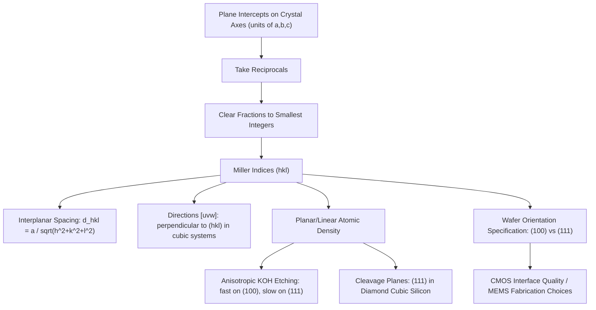

## Miller Indices and Crystallographic Planes

### Overview

Miller indices provide the standardized notation used to identify and label the orientation of crystallographic planes and directions within a crystal lattice. Building directly on the lattice geometry and symmetry framework of the previous topics, this notation is indispensable in semiconductor engineering: wafer surfaces, cleavage planes, etch profiles, and epitaxial growth directions are all specified using Miller indices, making this one of the most practically applied pieces of crystallographic notation in the entire fabrication process.

### Defining Miller Indices for Planes

**Key Points**

- Miller indices $(hkl)$ label a family of parallel crystallographic planes using three integers, determined by a standard procedure:
  1. Find the plane's intercepts with the three crystallographic axes, measured in units of the lattice constants $a$, $b$, $c$
  2. Take the **reciprocals** of these intercepts
  3. **Clear fractions** by multiplying through to obtain the smallest set of integers with the same ratio
- If a plane is parallel to an axis (never intersects it), that axis's intercept is taken as infinity, and its reciprocal is 0
- Negative intercepts are indicated with a bar over the corresponding index, e.g., $(1\bar{1}0)$, read as "one, bar-one, zero"
- Curly braces $\{hkl\}$ denote the full family of symmetry-equivalent planes (e.g., $\{100\}$ includes $(100)$, $(010)$, $(001)$, and their negatives, in cubic crystals)

### Worked Example: Deriving Miller Indices

**Example**

Suppose a plane intersects the crystallographic axes at $x = 2a$, $y = 3a$, $z = \infty$ (parallel to the z-axis).

1. Intercepts (in units of $a$): $2, 3, \infty$
2. Reciprocals: $\frac{1}{2}, \frac{1}{3}, 0$
3. Clear fractions (multiply by 6, the least common denominator): $3, 2, 0$

The plane is designated $(320)$. This systematic reciprocal-based procedure is precisely why Miller indices, unlike raw intercepts, always give clean integer sets even for planes with irrational-looking intercepts, and why parallel planes to an axis always show a 0 in that position.

### Common Low-Index Planes in Cubic Crystals

**Key Points**

- The **(100) plane** intercepts only the x-axis (at $a$) and is parallel to the y- and z-axes; in a simple cubic lattice, this corresponds to the face of the conventional cube
- The **(110) plane** intercepts both x- and y-axes equally and is parallel to z; it cuts diagonally through the cube
- The **(111) plane** intercepts all three axes equally, forming a triangular cross-section through the cube — in the diamond cubic and zinc blende structures, this is the closest-packed, highest atomic-density plane and corresponds to the natural cleavage plane in many III-V compounds
- Interplanar spacing $d_{hkl}$ for a cubic crystal with lattice constant $a$ is given by:

$$d_{hkl} = \frac{a}{\sqrt{h^2+k^2+l^2}}$$

showing that higher-index planes are more closely spaced than low-index planes

**Illustration — Common Miller index planes in a cubic cell (svg_diagram)**

<svg xmlns="http://www.w3.org/2000/svg" viewBox="0 0 560 260">
<rect x="0" y="0" width="560" height="260" fill="#ffffff" />
<text x="280" y="20" text-anchor="middle" font-size="14" font-weight="bold" fill="#111">Miller Index Planes in a Cubic Cell (svg_diagram)</text>

<g>
<polygon points="30,220 130,220 150,190 50,190" fill="none" stroke="#333" stroke-width="1.2" />
<polygon points="30,220 30,120 50,90 50,190" fill="none" stroke="#333" stroke-width="1.2" />
<polygon points="30,120 130,120 150,90 50,90" fill="none" stroke="#333" stroke-width="1.2" />
<line x1="130" y1="220" x2="150" y2="190" stroke="#333" stroke-width="1.2" />
<line x1="130" y1="120" x2="130" y2="220" stroke="#333" stroke-width="1.2" />
<line x1="150" y1="90" x2="150" y2="190" stroke="#333" stroke-width="1.2" />
<polygon points="130,220 150,190 150,90 130,120" fill="#0a6b9c" fill-opacity="0.4" stroke="#0a6b9c" stroke-width="2" />
<text x="90" y="245" text-anchor="middle" font-size="12" fill="#333">(100)</text>
</g>

<g transform="translate(190,0)">
<polygon points="30,220 130,220 150,190 50,190" fill="none" stroke="#333" stroke-width="1.2" />
<polygon points="30,220 30,120 50,90 50,190" fill="none" stroke="#333" stroke-width="1.2" />
<polygon points="30,120 130,120 150,90 50,90" fill="none" stroke="#333" stroke-width="1.2" />
<line x1="130" y1="220" x2="150" y2="190" stroke="#333" stroke-width="1.2" />
<line x1="130" y1="120" x2="130" y2="220" stroke="#333" stroke-width="1.2" />
<line x1="150" y1="90" x2="150" y2="190" stroke="#333" stroke-width="1.2" />
<polygon points="30,120 150,190 150,90 130,120" fill="#a15c00" fill-opacity="0.4" stroke="#a15c00" stroke-width="2" />
<text x="90" y="245" text-anchor="middle" font-size="12" fill="#333">(110)</text>
</g>

<g transform="translate(380,0)">
<polygon points="30,220 130,220 150,190 50,190" fill="none" stroke="#333" stroke-width="1.2" />
<polygon points="30,220 30,120 50,90 50,190" fill="none" stroke="#333" stroke-width="1.2" />
<polygon points="30,120 130,120 150,90 50,90" fill="none" stroke="#333" stroke-width="1.2" />
<line x1="130" y1="220" x2="150" y2="190" stroke="#333" stroke-width="1.2" />
<line x1="130" y1="120" x2="130" y2="220" stroke="#333" stroke-width="1.2" />
<line x1="150" y1="90" x2="150" y2="190" stroke="#333" stroke-width="1.2" />
<polygon points="130,220 30,120 50,90" fill="#1a8f4c" fill-opacity="0.4" stroke="#1a8f4c" stroke-width="2" />
<text x="90" y="245" text-anchor="middle" font-size="12" fill="#333">(111)</text>
</g>
</svg>

### Crystallographic Directions

**Key Points**

- Directions are specified with **square brackets**, $[uvw]$, where $u, v, w$ are integers proportional to the components of a vector along that direction, expressed in units of the lattice vectors
- In cubic crystals only, the direction $[hkl]$ is always perpendicular to the plane $(hkl)$ with the same indices — a convenient simplification that does not generally hold in lower-symmetry crystal systems
- Angle brackets $\langle uvw \rangle$ denote a family of symmetry-equivalent directions, analogous to curly braces for planes
- Common directions in cubic crystals include $[100]$ (along a cube edge), $[110]$ (a face diagonal), and $[111]$ (the body diagonal, along which the tetrahedral bonds of diamond cubic silicon are oriented)

### Planar and Linear Atomic Density

**Key Points**

- **Planar density** is the number of atoms per unit area on a given crystallographic plane; **linear density** is the number of atoms per unit length along a given direction
- These densities directly affect surface energy, growth kinetics, and mechanical/chemical anisotropy: more densely packed planes generally have lower surface energy and different reactivity than open, low-density planes
- In diamond cubic silicon, the $(111)$ planes are the most widely spaced but also the natural cleavage planes, because bonds crossing between adjacent $(111)$ planes are fewer in number than those within a plane — this is why silicon wafers cleave cleanly along $(111)$ when scored appropriately

### Relevance to Semiconductor Fabrication

**Key Points**

- **Wafer specification**: Commercial silicon wafers are specified by surface orientation, most commonly $(100)$ (standard for modern CMOS due to lower interface trap density at the Si/SiO₂ interface) or $(111)$ (historically common, still used for certain applications and for some bipolar and MEMS processes)
- **Anisotropic wet etching**: Alkaline etchants like KOH etch silicon highly anisotropically, etching much faster along $(100)$ directions than along $(111)$ planes (due to the higher atomic density and fewer dangling bonds on $(111)$), producing the characteristic sloped sidewalls used in MEMS cavity and V-groove fabrication
- **Epitaxial growth orientation**: Molecular beam epitaxy (MBE) and metal-organic chemical vapor deposition (MOCVD) growth quality, surface reconstruction, and defect density depend strongly on the substrate's Miller-index orientation, with $(100)$ and off-cut variants commonly used to control step-flow growth
- **Cleaving and dicing**: Wafer dicing and chip singulation exploit natural low-index cleavage planes (commonly $(111)$ in silicon) to achieve clean breaks with minimal damage to circuit structures
- **Piezoresistive and mechanical sensors**: Silicon's piezoresistive coefficient is strongly direction-dependent, so MEMS stress/pressure sensors are deliberately oriented along specific crystallographic directions (often $[110]$) to maximize sensitivity

### Worked Example: Interplanar Spacing Comparison

**Example**

For silicon ($a = 0.543\,\text{nm}$), compare the interplanar spacing of $(100)$ and $(111)$ planes:

$$d_{100} = \frac{a}{\sqrt{1^2+0^2+0^2}} = 0.543\,\text{nm}$$

$$d_{111} = \frac{a}{\sqrt{1^2+1^2+1^2}} = \frac{0.543}{\sqrt{3}} \approx 0.313\,\text{nm}$$

Although $(111)$ has a smaller *conventional* interplanar spacing by this simple formula, the diamond cubic structure's actual bonding arrangement means the $(111)$ planes come in closely spaced pairs separated by a much larger gap to the next pair — this wider double-layer gap, not the naive formula above, is what creates the true low-bond-density cleavage plane. [Inference: this refinement reflects the specific two-atom basis of diamond cubic and is a well-known correction to the simple cubic interplanar spacing formula when applied to structures with a multi-atom basis.]

### Conclusion

Miller indices provide a compact, standardized, and universally adopted notation for specifying crystallographic planes and directions, derived directly from the reciprocal-intercept procedure applied to a crystal's lattice geometry. This notation is far more than an abstract labeling convention in semiconductor fabrication — it directly governs wafer orientation choices, anisotropic etch profiles, cleavage behavior, and epitaxial growth quality, making fluency with Miller index notation a practical necessity throughout semiconductor process engineering.

**Related Topics**

- Anisotropic wet etching and MEMS microfabrication
- Wafer orientation effects on MOSFET channel mobility
- Reciprocal lattice vectors and their relation to Miller indices
- X-ray diffraction and Bragg's law plane identification
- Epitaxial growth and substrate orientation selection
- Piezoresistive sensor design and crystallographic orientation
- Stacking faults and planar crystal defects