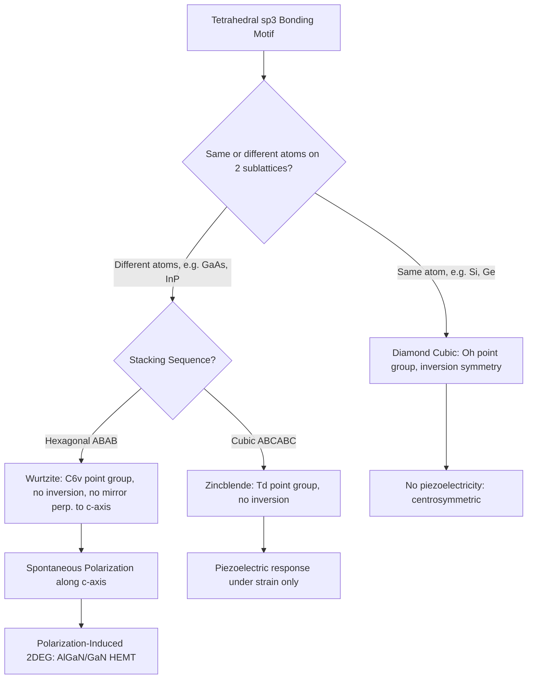

## Diamond, Zincblende, and Wurtzite Structures

### Overview

Diamond, zincblende, and wurtzite are the three crystal structures that host essentially every technologically important semiconductor, and this topic examines them as concrete physical realizations of the lattice, symmetry, and bonding concepts developed across this chapter. Diamond and zincblende share identical underlying geometry but differ in atomic composition, while wurtzite represents an alternative close-packing arrangement favored by certain compounds — and the choice between these structures has direct, measurable consequences for band structure, piezoelectricity, and device design.

### The Diamond Structure (Revisited and Formalized)

**Key Points**

- The diamond structure consists of two interpenetrating FCC lattices, displaced from one another by $(\tfrac{1}{4}, \tfrac{1}{4}, \tfrac{1}{4})$ of the cubic cell body diagonal, occupied by identical atoms
- Elemental group IV semiconductors — silicon, germanium, and diamond (carbon) itself — all crystallize in this structure, each atom tetrahedrally bonded to four identical neighbors via sp³ hybrid orbitals
- Space group: $Fd\bar{3}m$; point group $O_h$, preserving full inversion symmetry since both sublattices carry the same atomic species
- The conventional cubic unit cell contains 8 atoms total, with a coordination number of 4 (tetrahedral) despite the FCC-derived lattice's own coordination number of 12 — the basis, not the bare lattice, determines the actual nearest-neighbor bonding count

### The Zincblende Structure

**Key Points**

- Zincblende (also called sphalerite) shares the exact same geometric arrangement as diamond cubic — two interpenetrating FCC sublattices offset by $(\tfrac{1}{4},\tfrac{1}{4},\tfrac{1}{4})$ — but the two sublattices are occupied by **different** atomic species
- Most III-V compound semiconductors adopt this structure: GaAs, InP, InAs, GaP, and AlAs, with the group III element (Ga, In, Al) on one sublattice and the group V element (As, P) on the other
- Some II-VI compounds also adopt zincblende, including cubic ZnS (the structure's namesake), CdTe, and cubic ZnSe
- Space group: $F\bar{4}3m$; point group $T_d$ — lower symmetry than diamond cubic because exchanging the two sublattices via inversion is no longer a valid symmetry operation when they hold different atoms, exactly as established in the previous topic's inversion symmetry discussion
- Each atom remains tetrahedrally coordinated to four neighbors of the *opposite* species (every Ga atom bonds to four As atoms, and vice versa)

### The Wurtzite Structure

**Key Points**

- Wurtzite is a **hexagonal** structure (belonging to the hexagonal crystal system introduced previously), representing an alternative stacking arrangement of the same tetrahedrally-bonded building blocks found in zincblende
- Both zincblende and wurtzite share identical local bonding: each atom is tetrahedrally coordinated to four opposite-species neighbors, with essentially the same bond length and bond angle
- The structures differ only in their **stacking sequence** of close-packed bilayers: zincblende follows a cubic ABCABC... stacking sequence, while wurtzite follows a hexagonal ABAB... stacking sequence
- Common wurtzite semiconductors include GaN, AlN, InN (the group III-nitrides), ZnO, and one polymorph of SiC (among several SiC polytypes); some materials like GaN are essentially only stable in wurtzite form under normal growth conditions, while others (like ZnS and CdS) can crystallize in either structure depending on growth conditions
- Space group: $P6_3mc$; point group $C_{6v}$ — this point group notably **lacks inversion symmetry**, similar to zincblende, but its hexagonal symmetry additionally permits a **spontaneous electric polarization along the c-axis**, a property absent in cubic zincblende

**Illustration — Zincblende (cubic ABC stacking) vs. wurtzite (hexagonal AB stacking) (svg_diagram)**

<svg xmlns="http://www.w3.org/2000/svg" viewBox="0 0 520 300">
<rect x="0" y="0" width="520" height="300" fill="#ffffff" />
<text x="260" y="20" text-anchor="middle" font-size="14" font-weight="bold" fill="#111">Zincblende vs. Wurtzite Stacking (svg_diagram)</text>

<g>
<text x="130" y="45" text-anchor="middle" font-size="12" fill="#333">Zincblende (cubic): ABCABC...</text>
<ellipse cx="130" cy="80" rx="60" ry="14" fill="#cfe8fb" stroke="#0a6b9c" />
<text x="130" y="85" text-anchor="middle" font-size="11" fill="#0a6b9c">A</text>
<ellipse cx="150" cy="120" rx="60" ry="14" fill="#f5cfa0" stroke="#a15c00" />
<text x="150" y="125" text-anchor="middle" font-size="11" fill="#a15c00">B</text>
<ellipse cx="110" cy="160" rx="60" ry="14" fill="#cfe8c0" stroke="#1a8f4c" />
<text x="110" y="165" text-anchor="middle" font-size="11" fill="#1a8f4c">C</text>
<ellipse cx="130" cy="200" rx="60" ry="14" fill="#cfe8fb" stroke="#0a6b9c" />
<text x="130" y="205" text-anchor="middle" font-size="11" fill="#0a6b9c">A</text>
<ellipse cx="150" cy="240" rx="60" ry="14" fill="#f5cfa0" stroke="#a15c00" />
<text x="150" y="245" text-anchor="middle" font-size="11" fill="#a15c00">B</text>
</g>

<g>
<text x="390" y="45" text-anchor="middle" font-size="12" fill="#333">Wurtzite (hexagonal): ABAB...</text>
<ellipse cx="390" cy="80" rx="60" ry="14" fill="#cfe8fb" stroke="#0a6b9c" />
<text x="390" y="85" text-anchor="middle" font-size="11" fill="#0a6b9c">A</text>
<ellipse cx="390" cy="120" rx="60" ry="14" fill="#f5cfa0" stroke="#a15c00" />
<text x="390" y="125" text-anchor="middle" font-size="11" fill="#a15c00">B</text>
<ellipse cx="390" cy="160" rx="60" ry="14" fill="#cfe8fb" stroke="#0a6b9c" />
<text x="390" y="165" text-anchor="middle" font-size="11" fill="#0a6b9c">A</text>
<ellipse cx="390" cy="200" rx="60" ry="14" fill="#f5cfa0" stroke="#a15c00" />
<text x="390" y="205" text-anchor="middle" font-size="11" fill="#a15c00">B</text>
<ellipse cx="390" cy="240" rx="60" ry="14" fill="#cfe8fb" stroke="#0a6b9c" />
<text x="390" y="245" text-anchor="middle" font-size="11" fill="#0a6b9c">A</text>
</g>
</svg>

### Polytypism and Polymorphism

**Key Points**

- Several semiconductor compounds are **polymorphic**, capable of crystallizing in more than one of these structures depending on growth temperature, pressure, and substrate: ZnS, CdS, and SiC are notable examples
- **SiC polytypism** is especially extensive: silicon carbide exhibits over 200 known polytypes, distinguished purely by their stacking sequence along the c-axis, with 3C-SiC (cubic, zincblende-like), 4H-SiC, and 6H-SiC (both hexagonal) being the technologically dominant forms used in power electronics
- Because zincblende and wurtzite share identical local tetrahedral bonding and nearly identical bond energies, the energy difference between polytypes is often small, meaning growth kinetics and substrate choice can determine which polytype forms — this is a practically important consideration in GaN and SiC epitaxial growth process design [Inference: general statement about polytype energetics; exact energy differences are material-specific and are typically determined computationally or experimentally rather than from a simple universal rule]

### Spontaneous and Piezoelectric Polarization in Wurtzite

**Key Points**

- Because wurtzite's $C_{6v}$ point group lacks a mirror plane perpendicular to the c-axis, wurtzite crystals possess an intrinsic **spontaneous polarization** along that axis, even in the absence of any applied strain or field
- Under mechanical strain (e.g., from lattice-mismatched heteroepitaxy), wurtzite materials also exhibit a strong **piezoelectric polarization** that adds to the spontaneous polarization
- This combined polarization produces large internal electric fields at heterojunction interfaces in wurtzite III-nitride devices — most notably the polarization-induced two-dimensional electron gas (2DEG) that forms at the AlGaN/GaN interface without any intentional doping, the operating basis of GaN high-electron-mobility transistors (HEMTs)
- Zincblende materials, lacking this hexagonal-axis asymmetry, do not exhibit spontaneous polarization, though they can still show a (typically weaker) piezoelectric response under strain due to their own lack of inversion symmetry

### Worked Example

**Example**

Compare GaN grown in its stable wurtzite form versus a hypothetical cubic zincblende GaN film. In wurtzite GaN, the intrinsic spontaneous polarization combined with piezoelectric polarization from lattice-mismatch strain at an AlGaN barrier layer creates a sheet charge density on the order of $10^{13}\,\text{cm}^{-2}$ at the interface [Inference: this is a widely cited order-of-magnitude figure for AlGaN/GaN HEMT structures; the exact value depends on Al composition, layer thickness, and strain state], which attracts a compensating 2DEG of free electrons directly at the interface without any deliberate doping — the foundation of the GaN HEMT's high electron density and high electron mobility. A cubic zincblende GaN film, by contrast, would lack the spontaneous polarization contribution entirely, relying only on the (generally weaker) piezoelectric term, and would be expected to form a substantially lower-density 2DEG under comparable strain conditions.

### Relevance to Semiconductor Device Engineering

**Key Points**

- **CMOS and silicon technology**: The diamond cubic structure of silicon, with its centrosymmetric $O_h$ symmetry, underlies the vast majority of conventional CMOS logic and memory technology
- **Optoelectronics**: Zincblende III-V compounds (GaAs, InP, and their alloys) dominate direct-bandgap optoelectronic applications — LEDs, laser diodes, and photodetectors — where their non-centrosymmetric structure also enables nonlinear and electro-optic device functions unavailable in silicon
- **GaN power and RF electronics**: Wurtzite GaN's unique spontaneous polarization property is deliberately exploited (rather than being a side effect) to engineer high-density 2DEGs in HEMTs used for high-power, high-frequency RF amplifiers and efficient power conversion electronics
- **SiC power devices**: Hexagonal SiC polytypes (4H-SiC in particular) are widely used in high-voltage, high-temperature power semiconductor devices due to their wide bandgap and high breakdown field, with polytype selection directly affecting electronic properties
- **Substrate and epitaxy engineering**: Choosing between diamond, zincblende, and wurtzite substrates and epitaxial layers — and managing the lattice mismatch and polarization discontinuities between them — is a central and ongoing engineering challenge in compound semiconductor device fabrication

### Conclusion

Diamond, zincblende, and wurtzite structures translate the abstract lattice, symmetry, and bonding principles of this chapter into the three concrete crystal frameworks that host virtually all technologically significant semiconductors. The presence or absence of inversion symmetry and, in wurtzite's case, the additional hexagonal-axis polarization asymmetry, directly determine measurable and technologically exploited properties — piezoelectricity, nonlinear optical response, and polarization-induced charge — that distinguish silicon-based CMOS technology from compound-semiconductor optoelectronic and power device applications.

**Related Topics**

- Polarization-induced 2DEGs and GaN HEMT device physics
- SiC polytypism and wide-bandgap power device applications
- Lattice-matching and strain engineering in heteroepitaxy
- Piezoelectric and electro-optic device applications
- Reciprocal lattice and Brillouin zone shapes for cubic vs. hexagonal systems
- Band structure differences between direct-gap III-V and indirect-gap silicon
- Stacking faults and polytype defects in epitaxial growth