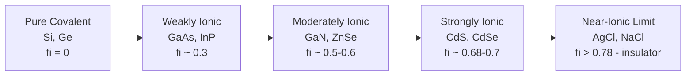

## Covalent and Ionic Bonding in Semiconductors

### Overview

Semiconductor materials derive their electronic, optical, and mechanical properties primarily from the nature of chemical bonding between constituent atoms. The two dominant bonding types in semiconductor crystals are **covalent bonding** (electron sharing) and **ionic bonding** (electron transfer), with most practical semiconductors exhibiting some degree of bonding hybridization — often termed iono-covalent or polar-covalent bonding.

### Covalent Bonding Fundamentals

**Mechanism**

Covalent bonding arises when atoms share valence electrons to achieve a stable octet configuration. In elemental semiconductors like silicon (Si) and germanium (Ge), each atom has four valence electrons ($3s^2 3p^2$ for Si) and forms four covalent bonds with neighboring atoms via $sp^3$ hybridization.

**Key Points**

- Each atom forms four bonds directed toward the corners of a regular tetrahedron
- Bond angle: $109.5°$
- Results in the diamond cubic crystal structure
- Bonds are strongly directional, unlike metallic or ionic bonds
- Shared electron pairs occupy bonding orbitals with high electron density localized between nuclei

**Energy Considerations**

The covalent bond energy in silicon is approximately 222 kJ/mol per Si–Si bond (rough magnitude; exact values vary by measurement method) [Unverified — bond dissociation energies vary meaningfully across literature sources depending on measurement technique]. This directional, strong bonding gives rise to:

- High melting points (Si: 1414°C, Ge: 938.3°C)
- High hardness and brittleness (fracture along cleavage planes rather than plastic deformation at room temperature)
- Relatively low thermal expansion coefficients

**Diamond Cubic Structure (svg_diagram)**



```
<svg xmlns="http://www.w3.org/2000/svg" viewBox="0 0 400 400" width="400" height="400">
  <title>Diamond Cubic Tetrahedral Bonding (svg_diagram)</title>
  <rect width="400" height="400" fill="#ffffff" />
  
  <circle cx="200" cy="200" r="14" fill="#2b6cb0" />
  
  <circle cx="200" cy="80" r="10" fill="#e53e3e" />
  <circle cx="320" cy="260" r="10" fill="#e53e3e" />
  <circle cx="80" cy="260" r="10" fill="#e53e3e" />
  <circle cx="200" cy="320" r="10" fill="#e53e3e" opacity="0.6" />
  
  <line x1="200" y1="200" x2="200" y2="80" stroke="#4a5568" stroke-width="3" />
  <line x1="200" y1="200" x2="320" y2="260" stroke="#4a5568" stroke-width="3" />
  <line x1="200" y1="200" x2="80" y2="260" stroke="#4a5568" stroke-width="3" />
  <line x1="200" y1="200" x2="200" y2="320" stroke="#4a5568" stroke-width="3" stroke-dasharray="4,4" />
  <text x="200" y="60" font-size="14" text-anchor="middle" fill="#2d3748">Si (top)</text>
  <text x="340" y="270" font-size="14" text-anchor="start" fill="#2d3748">Si</text>
  <text x="60" y="270" font-size="14" text-anchor="end" fill="#2d3748">Si</text>
  <text x="200" y="345" font-size="14" text-anchor="middle" fill="#2d3748">Si (behind)</text>
  <text x="205" y="195" font-size="13" text-anchor="start" fill="#2b6cb0">Central Si atom</text>
  <text x="200" y="20" font-size="16" text-anchor="middle" fill="#1a202c" font-weight="bold">sp3 Tetrahedral Bonding</text>
</svg>
```

### Ionic Bonding Fundamentals

**Mechanism**

Ionic bonding occurs when there is significant electronegativity difference between two atoms, causing near-complete electron transfer from the electropositive atom to the electronegative atom, forming a cation and anion held together by Coulombic (electrostatic) attraction.

**Key Points**

- No true "pure ionic" semiconductor exists at the extreme end (unlike NaCl, which is ionic but not semiconducting); semiconducting ionic-leaning compounds retain partial covalent character
- Electrostatic force follows Coulomb's law:

$$F = \frac{1}{4\pi\varepsilon_0}\frac{q_1 q_2}{r^2}$$

- Ionic bonds are non-directional (isotropic), unlike covalent bonds
- Typically result in higher ionicity → wider bandgaps, for a given row of the periodic table

### Bonding Continuum: Covalent-to-Ionic Character

Most compound semiconductors fall along a continuum rather than being purely one type or the other.

**III-V Semiconductors (e.g., GaAs, InP, GaN)**

- Formed from Group III (electropositive) and Group V (electronegative) elements
- Predominantly covalent with partial ionic character
- Bonding is often described using **Phillips ionicity** ($f_i$), a semi-empirical parameter derived from dielectric theory
- GaAs: $f_i \approx 0.31$ (moderately covalent)

**II-VI Semiconductors (e.g., CdS, ZnSe, CdTe)**

- Formed from Group II and Group VI elements
- Greater electronegativity difference than III-V compounds → higher ionicity
- ZnSe: $f_i \approx 0.63$
- CdS: $f_i \approx 0.685$
- Increased ionicity correlates with wider bandgaps and sometimes wurtzite (hexagonal) rather than zinc-blende (cubic) crystal structures

**I-VII and Highly Ionic Compounds**

- Approach true ionic bonding (e.g., AgCl)
- Generally poor semiconductors or insulators due to very wide bandgaps

**Phillips Ionicity Scale Comparison**

| Compound | Group | Ionicity $f_i$ | Bandgap (eV, 300K) | Crystal Structure |
| --- | --- | --- | --- | --- |
| Si | IV-IV | 0.00 | 1.12 (indirect) | Diamond cubic |
| Ge | IV-IV | 0.00 | 0.66 (indirect) | Diamond cubic |
| GaAs | III-V | 0.31 | 1.42 (direct) | Zinc blende |
| GaN | III-V | 0.50 | 3.4 (direct) | Wurtzite |
| ZnSe | II-VI | 0.63 | 2.7 (direct) | Zinc blende |
| CdS | II-VI | 0.685 | 2.42 (direct) | Wurtzite |
| NaCl (reference, insulator) | I-VII | 0.94 | ~8.5 | Rock salt |

[Inference: exact ionicity and bandgap values can differ slightly across textbooks depending on the calculation model (Phillips-Van Vechten vs. Pauling electronegativity method); the table represents commonly cited reference values.]

### Why Ionicity Matters for Device Physics

**Bandgap Widening**

As ionicity increases, the bonding-antibonding energy splitting increases, which generally widens the bandgap:

$$E_g \propto \sqrt{E_h^2 + C^2}$$

where $E_h$ is the homopolar (covalent) energy gap and $C$ is the ionic energy contribution (Phillips-Van Vechten dielectric model).

**Effective Mass and Mobility**

- Higher covalency (Si, Ge) → higher carrier mobility due to lower effective mass and reduced polar (ionic) scattering
- Higher ionicity (II-VI compounds) → stronger polar optical phonon scattering, generally reducing electron mobility at room temperature

**Structural Consequence: Zinc Blende vs. Wurtzite**

- Lower ionicity compounds (GaAs, ZnSe) tend to crystallize in zinc blende structure (cubic, tetrahedral coordination retained from diamond cubic)
- Higher ionicity compounds (GaN, CdS) tend to favor wurtzite (hexagonal close-packed variant)
- This is captured empirically by the **ionicity criterion**: compounds with $f_i > 0.785$ (Phillips critical value) crystallize in rock salt structure rather than tetrahedral coordination

### Bonding and Defect/Dopant Behavior

**Example**

In covalent Si, substituting a Group V atom (P, As) introduces an extra electron weakly bound in a hydrogenic orbit (shallow donor), because the substituent still forms four covalent-like bonds with one electron left over. In more ionic II-VI compounds, self-compensation effects are more prevalent — native point defects (vacancies, interstitials) form more readily to counteract intentional doping, since the ionic lattice can more easily accommodate charged defects electrostatically. This is a major reason why p-type doping of wide-bandgap II-VI materials like ZnSe historically proved difficult.

### Electronegativity Frameworks Used to Quantify Bonding

**Pauling Electronegativity Difference**

$$\Delta\chi = |\chi_A - \chi_B|$$

Larger $\Delta\chi$ correlates with greater ionic character, though this is a simplified heuristic compared to Phillips-Van Vechten theory.

**Phillips-Van Vechten Dielectric Theory**

Decomposes the average energy gap $E_g$ measured via the dielectric constant into homopolar (covalent) and heteropolar (ionic) components:

$$f_i = \frac{C^2}{E_h^2 + C^2}$$

This is the standard modern framework taught in semiconductor materials courses for quantifying bonding character beyond simple electronegativity tables.

### Mermaid Diagram: Bonding Character Spectrum



### Conclusion

Bonding character in semiconductors exists on a continuum from purely covalent (Group IV elemental semiconductors) to increasingly ionic (III-V, then II-VI compounds), quantified rigorously via Phillips ionicity rather than simple electronegativity differences. This bonding character directly governs bandgap magnitude, preferred crystal structure (zinc blende vs. wurtzite vs. rock salt), carrier mobility, phonon scattering behavior, and doping/defect chemistry — making it a foundational concept connecting atomic-scale chemistry to macroscopic semiconductor device performance.

**Next Topics**

- Crystal structures: diamond cubic, zinc blende, and wurtzite lattices
- Miller indices and crystallographic planes in semiconductor crystals
- Lattice constants and epitaxial lattice matching
- Bandgap engineering via alloy composition (e.g., AlGaAs, InGaN)
- Native point defects and self-compensation in compound semiconductors
- Electronegativity-based bandgap prediction models